<div align="center">
    <h3>Universidad Peruana de Ciencias Aplicadas</h3>
    </img><br>
    <strong>Ingeniería de Software</strong><br><br>
    <strong>Arquitectura de Software Emergentes</strong><br>
    1ASI0728
    <br><strong>NRC 7291</strong><br>
    <br><strong>Profesor: Royer Edelwer Rojas Malasquez</strong><br>
    <br><strong>Report</strong><br>
    <br><strong>Startup: DevBeans</strong><br>
    <br><strong>Producto: BeanDetect AI</strong><br>
    <br><h3> Integrantes: </h3>
</div>

<div>
    <table align="center" border="1" cellspacing="0" cellpadding="6">
        <tr>
            <th style="text-align:center;">Member</th>
            <th style="text-align:center;">Code</th>
        </tr>
        <tr>
            <td>Aranda Vallejos, Oscar Gabriel</td>
            <td>U202218167</td>
        </tr>
        <tr>
            <td>Ayquipa Ubaldo, Abraham Israel</td>
            <td>U202218475</td>
        </tr>
        <tr>
            <td>Ventura Chancafe, Eduardo Renato</td>
            <td>U202212645</td>
        </tr>
        <tr>
            <td>La Torre Soto, Andre Sebastian</td>
            <td>U202217772</td>
        </tr>
    </table>
</div>

<h3 align="center">Septiembre, 2025</h3>

<br><br>

<div align="justify">


## Registro de Versiones del Informe

En esta sección se resumen los avances y modificaciones realizadas durante el ciclo de vida de desarrollo del proyecto equivalente a un semestre.

<table>
  <thead>
    <tr>
      <th>Versión</th>
      <th>Fecha</th>
      <th>Autor</th>
      <th>Descripción de modificación</th>
    </tr>
  </thead>
  <tbody>
    <tr>
      <td>1.0</td>
      <td>16/09/2025</td>
      <td>Aranda Vallejos, Oscar Gabriel</td>
      <td>Creación y estructuración del informe</td>
    </tr>
    <tr>
      <td>1.2</td>
      <td>17/09/2025</td>
      <td>Ayquipa Ubaldo, Abraham Israel</td>
      <td>
        Capítulo I: Introducción,  
        Capítulo II: Requirements Elicitation & Analysis
      </td>
    </tr>
    <tr>
      <td>1.4</td>
      <td>19/09/2025</td>
      <td>Aranda Vallejos, Oscar Gabriel</td>
      <td>Desarrollo del Capítulo III y Capítulo IV</td>
    </tr>
    <tr>
      <td>1.6</td>
      <td>19/09/2025</td>
      <td>La Torre Soto, Andre Sebastian</td>
      <td>Actualización del Capítulo II</td>
    </tr>
    <tr>
      <td>1.8</td>
      <td>19/09/2025</td>
      <td>Ventura Chancafe, Eduardo Renato</td>
      <td>Actualización del Capítulo III</td>
    </tr>
    <tr>
      <td>2.0</td>
      <td>20/09/2025</td>
      <td>Aranda Vallejos, Oscar Gabriel</td>
      <td>Actualización del Capítulo IV</td>
    </tr>
    <tr>
      <td>2.2</td>
      <td>03/11/2025</td>
      <td>
      Ayquipa Ubaldo, Abraham Israel<br>La Torre Soto, Andre Sebastian
      </td>
      <td>Desarrollo del Capítulo VI</td>
    </tr>
    <tr>
      <td>2.4</td>
      <td>04/11/2025</td>
      <td>Aranda Vallejos, Oscar Gabriel</td>
      <td>Desarrollo del Capítulo V</td>
    </tr>
    <tr>
      <td>2.6</td>
      <td>03/11/2025</td>
      <td>
      Ayquipa Ubaldo, Abraham Israel<br>Aranda Vallejos, Oscar Gabriel
      </td>
      <td>Desarrollo del sistema de identificación y clasificación de granos de café</td>
    </tr>
    <tr>
      <td>2.8</td>
      <td>06/11/2025</td>
      <td>Ventura Chancafe, Eduardo Renato</td>
      <td>Desarrollo de la primera versión de la Landing Page</td>
    </tr>
    <tr>
      <td>3.0</td>
      <td>06/11/2025</td>
      <td>Ventura Chancafe, Eduardo Renato</td>
      <td>Desarrollo de la primera versión del Web Frontend</td>
    </tr>
    <tr>
      <td>3.2</td>
      <td>10/11/2025</td>
      <td>Aranda Vallejos, Oscar Gabriel</td>
      <td>Actualización del sistema de clasificación de granos de café integrado con machine learning</td>
    </tr>
    <tr>
      <td>3.4</td>
      <td>10/11/2025</td>
      <td>Aranda Vallejos, Oscar Gabriel</td>
      <td>Actualización del backend para los bounded context de grain classification y coffee lot management</td>
    </tr>
    <tr>
      <td>3.6</td>
      <td>14/11/2025</td>
      <td>Ayquipa Ubaldo, Abraham Israel</td>
      <td>Desarrollo de user flows, mock ups, actualización del Figma y video about the product</td>
    </tr>
    <tr>
      <td>3.7</td>
      <td>14/11/2025</td>
      <td>Aranda Vallejos, Oscar Gabriel</td>
      <td>Desarrollo del Test Suite Development y Acceptance Tests</td>
    </tr>
    <tr>
      <td>3.8</td>
      <td>14/11/2025</td>
      <td>La Torre Soto, Andre Sebastian</td>
      <td>Desarrollo de heurísticas e implementación de descargar de reportes por pdf y csv en frontend</td>
    </tr>
    <tr>
      <td>3.9</td>
      <td>14/11/2025</td>
      <td>Aranda Vallejos, Oscar Gabriel</td>
      <td>Conexión de frontend con backend</td>
    </tr>
    <tr>
      <td>4.0</td>
      <td>14/11/2025</td>
      <td>Ventura Chancafe, Eduardo Renato</td>
      <td>Integración con sistema externo smtp para el envio de alertas de reportes de clasificación mediante correo electrónico</td>
    </tr>
  </tbody>
</table>
<br>


# Project Report Collaboration Insights

<br>Se utilizaron Git y Github como herramientas fundamentales para el versionamiento y gestión del proyecto, lo cual permite una mejor colaboración y visualización de cambios en tiempo real. A continuación, se proporcionan los siguientes enlaces del proyecto:

| **Descripción**            | **Enlace**                                                                 |
| :-------------------------: | :------------------------------------------------------------------------: |
| Repositorio de la documentación    | https://github.com/upc-pre-202520-1asi0728-7291-DevBeans/report         |
| Organización del proyecto     | https://github.com/upc-pre-202520-1asi0728-7291-DevBeans                    |

[](https://postimg.cc/jwKyQSRs)

<br>

# Contenido

## Tabla de Contenidos

### [Registro de Versiones del Informe](#registro-de-versiones-del-informe)

### [Project Report Collaboration Insights](#project-report-collaboration-insights)

### [Contenido](#contenido)

### [Student Outcomes](#student-outcome)

### [Capítulo I: Introducción](#capítulo-i-introducción-1)
  - [1.1. Startup Profile](#11-startup-profile)
    - [1.1.1. Descripción de la Startup](#111-descripción-de-la-startup)
    - [1.1.2. Perfiles de integrantes del equipo](#112-perfiles-de-integrantes-del-equipo)
  - [1.2. Solution Profile](#12-solution-profile)
    - [1.2.1. Antecedentes y problemática](#121-antecedentes-y-problemática)
    - [1.2.2. Lean UX Process](#122-lean-ux-process)
      - [1.2.2.1. Lean UX Problem Statements](#1221-lean-ux-problem-statements)
      - [1.2.2.2. Lean UX Assumptions](#1222-lean-ux-assumptions)
          - [**Business Outcomes:**](#business-outcomes)
          - [**Users:**](#users)
          - [**User Outcomes \& Benefits:**](#user-outcomes--benefits)
          - [**Feature Assumptions:**](#feature-assumptions)
          - [**Business Assumptions:**](#business-assumptions)
          - [**User Assumptions:**](#user-assumptions)
      - [1.2.2.3. Lean UX Hypothesis Statements](#1223-lean-ux-hypothesis-statements)
      - [1.2.2.4. Lean UX Canvas](#1224-lean-ux-canvas)
  - [1.3. Segmentos objetivo](#13-segmentos-objetivo)

### [Capítulo II: Requirements Elicitation & Analysis](#capítulo-ii-requirements-elicitation--analysis-1)
- [2.1. Competidores](#21-competidores)
  - [2.1.1. Análisis competitivo](#211-análisis-competitivo)
  - [2.1.2. Estrategias y tácticas frente a competidores](#212-estrategias-y-tácticas-frente-a-competidores)
- [2.2. Entrevistas](#22-entrevistas)
  - [2.2.1. Diseño de entrevistas](#221-diseño-de-entrevistas)
  - [2.2.2. Registro de entrevistas](#222-registro-de-entrevistas)
  - [2.2.3. Análisis de entrevistas](#223-análisis-de-entrevistas)
- [2.3. Needfinding](#23-needfinding)
  - [2.3.1. User Personas](#231-user-personas)
  - [2.3.2. User Task Matrix](#232-user-task-matrix)
  - [2.3.3. User Journey Mapping](#233-user-journey-mapping)
  - [2.3.4. Empathy Mapping](#234-empathy-mapping)
  - [2.3.5. As-is Scenario Mapping](#235-as-is-scenario-mapping)
- [2.4. Ubiquitous Language](#24-ubiquitous-language)

### [Capítulo III: Requirements Specification](#capítulo-iii-requirements-specification-1)
- [3.1. To-Be Scenario Mapping](#31-to-be-scenario-mapping)
- [3.2. User Stories](#32-user-stories)
- [3.3. Impact Mapping](#33-impact-mapping)
- [3.4. Product Backlog](#34-product-backlog)

### [Capítulo IV: Strategic-Level Software Design](#capítulo-iv-strategic-level-software-design-1)
- [4.1. Strategic-Level Attribute-Driven Design](#41-strategic-level-attribute-driven-design)
   - [4.1.1. Design Purpose](#411-design-purpose)
   - [4.1.2. Attribute-Driven Design Inputs](#412-attribute-driven-design-inputs)
      - [4.1.2.1. Primary Functionality (Primary User Stories)](#4121-primary-functionality-primary-user-stories)
      - [4.1.2.2. Quality Attribute Scenarios](#4122-quality-attribute-scenarios)
      - [4.1.2.3. Constraints](#4123-constraints)
   - [4.1.3. Architectural Drivers Backlog](#413-architectural-drivers-backlog)
   - [4.1.4. Architectural Design Decisions](#414-architectural-design-decisions)
   - [4.1.5. Quality Attribute Scenario Refinements](#415-quality-attribute-scenario-refinements)
- [4.2. Strategic-Level Domain-Driven Design](#42-strategic-level-domain-driven-design)
   - [4.2.1. EventStorming](#421-eventstorming)
   - [4.2.2. Candidate Context Discovery](#422-candidate-context-discovery)
   - [4.2.3. Domain Message Flows Modeling](#423-domain-message-flows-modeling)
   - [4.2.4. Bounded Context Canvases](#424-bounded-context-canvases)
   - [4.2.5. Context Mapping](#425-context-mapping)
- [4.3. Software Architecture](#43-software-architecture)
   - [4.3.1. Software Architecture System Landscape Diagram](#431-software-architecture-system-landscape-diagram)
   - [4.3.2. Software Architecture Context Level Diagrams](#432-software-architecture-context-level-diagrams)
   - [4.3.3. Software Architecture Container Level Diagrams](#433-software-architecture-container-level-diagrams)
   - [4.3.4. Software Architecture Deployment Diagrams](#434-software-architecture-deployment-diagrams)

### [Capítulo V: Tactical-Level Software Design](#capítulo-v-tactical-level-software-design-1)
- [5.1. Bounded Context: IAM & Profile](#51-bounded-context-iam--profile)
   - [5.1.1. Domain Layer](#511-domain-layer)
   - [5.1.2. Interface Layer](#512-interface-layer)
   - [5.1.3. Application Layer](#513-application-layer)
   - [5.1.4. Infrastructure Layer](#514-infrastructure-layer)
   - [5.1.5. Bounded Context Software Architecture Component Level Diagrams](#515-bounded-context-software-architecture-component-level-diagrams)
   - [5.1.6. Bounded Context Software Architecture Code Level Diagrams](#516--bounded-context-software-architecture-code-level-diagrams)
      - [5.1.6.1. Bounded Context Domain Layer Class Diagrams](#5161-bounded-context-domain-layer-class-diagrams)
      - [5.1.6.2. Bounded Context Database Design Diagram](#5162-bounded-context-database-design-diagram)
- [5.2. Bounded Context: Coffee Lot Management](#52-bounded-context-coffee-lot-management)
   - [5.2.1. Domain Layer](#521-domain-layer)
   - [5.2.2. Interface Layer](#522-interface-layer)
   - [5.2.3. Application Layer](#523-application-layer)
   - [5.2.4. Infrastructure Layer](#524-infrastructure-layer)
   - [5.2.5. Bounded Context Software Architecture Component Level Diagrams](#525-bounded-context-software-architecture-component-level-diagrams)
   - [5.2.6. Bounded Context Software Architecture Code Level Diagrams](#526-bounded-context-software-architecture-code-level-diagrams)
      - [5.2.6.1. Bounded Context Domain Layer Class Diagrams](#5261-bounded-context-domain-layer-class-diagrams)
      - [5.2.6.2. Bounded Context Database Design Diagram](#5262-bounded-context-database-design-diagram)
- [5.3. Bounded Context: Grain Classification](#53-bounded-context-grain-classification)
   - [5.3.1. Domain Layer](#531-domain-layer)
   - [5.3.2. Interface Layer](#532-interface-layer)
   - [5.3.3. Application Layer](#533-application-layer)
   - [5.3.4. Infrastructure Layer](#534-infrastructure-layer)
   - [5.3.5. Bounded Context Software Architecture Component Level Diagrams](#535-bounded-context-software-architecture-component-level-diagrams)
   - [5.3.6. Bounded Context Software Architecture Code Level Diagrams](#536-bounded-context-software-architecture-code-level-diagrams)
      - [5.3.6.1. Bounded Context Domain Layer Class Diagrams](#5361-bounded-context-domain-layer-class-diagrams)
      - [5.3.6.2. Bounded Context Database Design Diagram](#5362-bounded-context-database-design-diagram)
- [5.4. Bounded Context: Traceability & Certification](#54-bounded-context-traceability--certification)
   - [5.4.1. Domain Layer](#541-domain-layer)
   - [5.4.2. Interface Layer](#542-interface-layer)
   - [5.4.3. Application Layer](#543-application-layer)
   - [5.4.4. Infrastructure Layer](#544-infrastructure-layer)
   - [5.4.5. Bounded Context Software Architecture Component Level Diagrams](#545-bounded-context-software-architecture-component-level-diagrams)
   - [5.4.6. Bounded Context Software Architecture Code Level Diagrams](#546-bounded-context-software-architecture-code-level-diagrams)
      - [5.4.6.1. Bounded Context Domain Layer Class Diagrams](#5461-bounded-context-domain-layer-class-diagrams)
      - [5.4.6.2. Bounded Context Database Design Diagram](#5462-bounded-context-database-design-diagram)
- [5.5. Bounded Context: Reporting & Analytics](#55-bounded-context-reporting--analytics)
   - [5.5.1. Domain Layer](#551-domain-layer)
   - [5.5.2. Interface Layer](#552-interface-layer)
   - [5.5.3. Application Layer](#553-application-layer)
   - [5.5.4. Infrastructure Layer](#554-infrastructure-layer)
   - [5.5.5. Bounded Context Software Architecture Component Level Diagrams](#555-bounded-context-software-architecture-component-level-diagrams)
   - [5.5.6. Bounded Context Software Architecture Code Level Diagrams](#556-bounded-context-software-architecture-code-level-diagrams)
      - [5.5.6.1. Bounded Context Domain Layer Class Diagrams](#5561-bounded-context-domain-layer-class-diagrams)
      - [5.5.6.2. Bounded Context Database Design Diagram](#5562-bounded-context-database-design-diagram)
- [5.6. Bounded Context: User Support](#56-bounded-context-user-support)
   - [5.6.1. Domain Layer](#561-domain-layer)
   - [5.6.2. Interface Layer](#562-interface-layer)
   - [5.6.3. Application Layer](#563-application-layer)
   - [5.6.4. Infrastructure Layer](#564-infrastructure-layer)
   - [5.6.5. Bounded Context Software Architecture Component Level Diagrams](#565-bounded-context-software-architecture-component-level-diagrams)
   - [5.6.6. Bounded Context Software Architecture Code Level Diagrams](#566-bounded-context-software-architecture-code-level-diagrams)
      - [5.6.6.1. Bounded Context Domain Layer Class Diagrams](#5661-bounded-context-domain-layer-class-diagrams)
      - [5.6.6.2. Bounded Context Database Design Diagram](#5662-bounded-context-database-design-diagram)
 
### [Capítulo VI: Solution UX Design.](#capítulo-vi-solution-ux-design-1)
  - [6.1. Style Guidelines.](#61-style-guidelines)
    - [6.1.1. General Style Guidelines.](#611-general-style-guidelines)
      - [Branding:](#branding)
      - [Tipografías:](#tipografías)
      - [Colores:](#colores)
      - [Margin:](#margin)
      - [Responsive y breakpoints:](#responsive-y-breakpoints)
    - [6.1.2. Web, Mobile \& Devices Style Guidelines.](#612-web-mobile--devices-style-guidelines)
      - [6.1.2.1. Web \& Devices Style Guidelines.](#6121-web--devices-style-guidelines)
      - [6.1.2.2. Mobile \& Devices Style Guidelines.](#6122-mobile--devices-style-guidelines)
  - [6.2. Information Architecture.](#62-information-architecture)
    - [6.2.2. Labeling Systems.](#622-labeling-systems)
    - [6.2.3. Searching Systems.](#623-searching-systems)
    - [6.2.4. SEO Tags and Meta Tags.](#624-seo-tags-and-meta-tags)
    - [6.2.5. Navigation Systems.](#625-navigation-systems)
  - [6.3. Landing Page UI Design.](#63-landing-page-ui-design)
    - [6.3.1. Landing Page Wireframe.](#631-landing-page-wireframe)
      - [6.3.1.1. Landing Page Wireframe - Web version](#6311-landing-page-wireframe---web-version)
      - [6.3.1.2. Landing Page Wireframe - Mobile version](#6312-landing-page-wireframe---mobile-version)
    - [6.3.2. Landing Page Mock-up.](#632-landing-page-mock-up)
      - [6.3.2.1. Landing Page Mock-up - Web version](#6321-landing-page-mock-up---web-version)
      - [6.3.2.2. Landing Page Mock-up - Mobile version](#6322-landing-page-mock-up---mobile-version)
  - [6.4. Applications UX/UI Design.](#64-applications-uxui-design)
    - [6.4.1. Applications Wireframes.](#641-applications-wireframes)
    - [6.4.2. Applications Wireflow Diagrams.](#642-applications-wireflow-diagrams)

### [Capítulo VII: Product Implementation, Validation & Deployment](#capítulo-vii-product-implementation-validation--deployment-1) 
  - [7.1. Software Configuration Management](#71-software-configuration-management)
    - [7.1.1. Software Development Environment Configuration](#711-software-development-environment-configuration)
    - [7.1.2. Source Code Management](#712-source-code-management)
    - [7.1.3. Source Code Style Guide & Conventions](#713-source-code-style-guide--conventions)
    - [7.1.4. Software Deployment Configuration](#714-software-deployment-configuration)
  - [7.2. Solution Implementation](#72-solution-implementation)
    - [7.2.1. Sprint 1](#721-sprint-1)
      - [7.2.1.1. Sprint Planning 1](#7211-sprint-planning-1)
      - [7.2.1.2. Sprint Backlog 1](#7212-sprint-backlog-1)
      - [7.2.1.3. Development Evidence for Sprint Review](#7213-development-evidence-for-sprint-review)
      - [7.2.1.4. Testing Suite Evidence for Sprint Review](#7214-testing-suite-evidence-for-sprint-review)
      - [7.2.1.5. Execution Evidence for Sprint Review](#7215-execution-evidence-for-sprint-review)
      - [7.2.1.6. Services Documentation Evidence for Sprint Review](#7216-services-documentation-evidence-for-sprint-review)
      - [7.2.1.7. Software Deployment Evidence for Sprint Review](#7217-software-deployment-evidence-for-sprint-review)
      - [7.2.1.8. Team Collaboration Insights during Sprint](#7218-team-collaboration-insights-during-sprint)
  - [7.3. Validation Interviews](#73-validation-interviews) 
    - [7.3.1. Diseño de Entrevistas (Versión enfocada en Landing Page y Front-End)](#731-diseño-de-entrevistas-versión-enfocada-en-landing-page-y-front-end)
    - [7.3.2. Registro de Entrevistas](#732-registro-de-entrevistas)
  - [7.4. Video About the Product](#74-video-about-the-product)
    - [7.2.2. Sprint 2](#722-sprint-2)
      - [7.2.2.1. Sprint Planning 2](#7221-sprint-planning-2)
      - [7.2.2.2. Sprint Backlog 2](#7222-sprint-backlog-2)
      - [7.2.2.3. Development Evidence for Sprint Review](#7223-development-evidence-for-sprint-review)
      - [7.2.2.4. Testing Suite Evidence for Sprint Review](#7224-testing-suite-evidence-for-sprint-review)
      - [7.2.2.5. Execution Evidence for Sprint Review](#7225-execution-evidence-for-sprint-review)
      - [7.2.2.6. Services Documentation Evidence for Sprint Review](#7226-services-documentation-evidence-for-sprint-review)
      - [7.2.2.7. Software Deployment Evidence for Sprint Review](#7227-software-deployment-evidence-for-sprint-review)
      - [7.2.2.8. Team Collaboration Insights during Sprint](#7228-team-collaboration-insights-during-sprint)


### [Conclusiones](#conclusiones-1)
### [Bibliografía](#bibliografía-1)
### [Anexos](#anexos-1)
  - [Figuras](#figuras)
    - [Database Diagram](#database-diagram)
    - [Class Diagram](#class-diagram)
  - [Entrevistas](#entrevistas)
    - [NeedFinding Interviews](#needfinding-interviews)
    - [Validation Interviews](#validation-interviews)
  - [Videos](#videos)
    - [Exposición TB1](#exposición-tb1)
    - [EXposición TP](#exposición-tp)
    - [Exposición TB2](#exposición-tb2)
    - [Exposición TF](#exposición-tf)

---

# Student Outcome

El curso contribuye al cumplimiento del Student Outcome ABET: 
ABET – EAC - Student Outcome 3

*Criterio:* La capacidad de comunicarse efectivamente con un rango de audiencias.

En la siguiente tabla se describen las acciones realizadas y enunciados de conclusiones por parte del grupo, que permiten sustentar el haber alcanzado el logro del ABET – EAC - Student Outcome 3. 

<table>
  <tr>
    <td><b>Criterio específico</b></td>
    <td><b>Acciones realizadas</b></td>
    <td><b>Conclusiones</b></td>
  </tr>
  <tbody>
    <tr>
      <td><b>Comunica oralmente sus ideas y/o resultados con objetividad a público de diferentes especialidades y niveles jerarquicos, en el marco del desarrollo de un proyecto en ingeniería.</b></td>
      <td>
        <p><b>Abraham Ayquipa Ubaldo</b></p>
        <p><i>TB1</i> <br>Durante el desarrollo del proyecto, participé activamente en la elaboración de los capítulos iniciales, presentando con claridad y objetividad los perfiles de la startup y del equipo. Expliqué el enfoque Lean UX y sus componentes clave, como los Problem Statements, Assumptions e Hipótesis, adaptando el lenguaje según el público. También contribuí al análisis competitivo y al diseño de entrevistas, comunicando los resultados de forma estructurada y comprensible para distintos niveles jerárquicos y especialidades.<br>
        <i>TP</i> <br>Comuniqué al equipo el cumplimiento y avance del módulo de análisis de imágenes de granos de café, así como las tecnologías y el dataset necesario para continuar con la implementación del sistema.<br>
        <i>TB2</i> <br>Demostré una comunicación oral clara y estructurada al presentar al equipo el proceso completo detrás de los mockups, la elaboración de user flows y el prototipado de la aplicación. Ademas de explicar las decisiones de diseño y funcionalidad de manera que tanto miembros técnicos como no técnicos pudieran comprender la lógica detrás de la interfaz. Además, de la elaboración de entrevistas y registros de validación, comunicó los avances y hallazgos de forma accesible, permitiendo que el equipo los integrara en la planificación del sprint.<br>
        <i>TF</i> <br>Comuniqué al equipo las mejoras implementadas en la aplicación web, explicando de forma clara las optimizaciones de la interfaz de usuario, la integración de nuevas funcionalidades y las correcciones aplicadas. Presenté los resultados de las pruebas de usabilidad y rendimiento, asegurando que tanto desarrolladores como stakeholders no técnicos comprendieran el impacto de estas mejoras en la experiencia del usuario final y en la estabilidad del sistema BeanDetect AI.</p>
        <br>
        <p><b>Andre La torre Soto</b></p>
        <p><i>TB1</i> <br>Durante el desarrollo del proyecto, participé activamente en la fase de Needfinding, recopilando y organizando información clave sobre el contexto del sector cafetalero. Contribuí en la caracterización de los segmentos de usuarios, identificando sus principales problemáticas y necesidades a través de la construcción de User Personas y Journey Mappings. Además, elaboré los Problem Statements de manera clara y fundamentada, comunicando los hallazgos con un lenguaje accesible tanto para especialistas como para audiencias generales. Finalmente, apoyé en la integración de estos resultados dentro del marco metodológico, asegurando que las evidencias recopiladas sirvieran como base para el planteamiento de hipótesis y el diseño posterior de la solución tecnológica.<br>
        <i>TP</i> <br>Comuniqué al equipo el cumplimiento y avance del diseño UX y UI requerido.<br>
        <i>TB2</i> <br>Comuniqué criterios y resultados obtenidos de la evaluación de heurísticas, exponiendo la severidad de los problemas identificados y justificando mejoras de accesibilidad y usabilidad.<br>
        <i>TF</i> <br>Comuniqué al equipo los resultados de las pruebas de aceptación realizadas, presentando de manera estructurada los escenarios evaluados, los criterios de validación y los hallazgos identificados. Expliqué con claridad tanto los casos exitosos como las discrepancias encontradas, adaptando mi comunicación para que fuera comprensible tanto para el equipo técnico como para los stakeholders del proyecto, facilitando así la toma de decisiones sobre ajustes necesarios antes del despliegue final.</p>
        <br>
        <p><b>Aranda Vallejos, Oscar Gabriel</b></p>
        <p><i>TB1</i> <br>Durante el desarrollo del proyecto, me enfoqué en la arquitectura de software y el diseño técnico del sistema BeanDetect AI. Comuniqué de manera clara y objetiva los conceptos arquitectónicos complejos a través de presentaciones técnicas, explicando la implementación de Domain-Driven Design y los patrones CQRS. Adapté mi comunicación según la audiencia, presentando diagramas C4 y UML de forma comprensible tanto para desarrolladores como para stakeholders no técnicos. Facilité la comprensión de la arquitectura de microservicios y bounded contexts, asegurando que todos los miembros del equipo pudieran contribuir efectivamente al proyecto.<br>
        <i>TP</i> <br>Comuniqué al equipo el cumplimiento y avance del módulo de clasificación de imágenes de granos de café.<br>
        <i>TB2</i> <br>Comunique al equipo la planificación, el backlog, la ejecución de tareas, las pruebas y la evidencia de despliegue.<br>
        <i>TF</i> <br>Comuniqué al equipo las mejoras implementadas en el backend y en la aplicación web, explicando de manera técnica pero accesible las optimizaciones de la API REST, la integración de blockchain con Polygon e IPFS para certificados inmutables, y las mejoras en el rendimiento del sistema de clasificación. Presenté los resultados de las pruebas de carga y las validaciones de seguridad, asegurando que todos los miembros del equipo comprendieran el impacto de estas mejoras en la escalabilidad, trazabilidad y confiabilidad del sistema BeanDetect AI.</p>
        <br>
        <p><b>Ventura Chancafe, Eduardo</b></p>
        <p><i>TB1</i> <br>Durante el desarrollo del proyecto, me concentré en el análisis y diseño de procesos de negocio a través de la elaboración de scenario mappings As-Is y To-Be. Comuniqué de forma clara y objetiva los flujos de trabajo actuales y los procesos optimizados propuestos, adaptando mi presentación para que fuera comprensible tanto para stakeholders técnicos como de negocio. Expliqué las mejoras y transformaciones digitales necesarias en el sector cafetalero, facilitando la comprensión de cómo la solución tecnológica impactaría en los procesos existentes y generaría valor agregado para los usuarios finales.<br>
        <i>TP</i> <br>Comuniqué al equipo el avance de la implementación del diseño del aplicación web en su primera versión para el sprint actual.<br>
        <i>TB2</i> <br>Comuniqué y compartí con el equipo los resultados de la integración del API "SMTP" para permitir el envío de correos electrónicos por cada clasificación realizada.<br>
        <i>TF</i> <br>Comuniqué al equipo los resultados de las pruebas de integración realizadas, presentando de manera clara y objetiva los casos de prueba ejecutados, las interacciones entre componentes validadas y los problemas detectados en la comunicación entre servicios. Expliqué las métricas de cobertura y confiabilidad obtenidas, adaptando mi comunicación para que fuera comprensible tanto para desarrolladores como para responsables de calidad, facilitando la identificación de áreas críticas y la priorización de correcciones necesarias.</p>
      </td>
      <td>
        <p><i>TB1</i> <br>Como equipo, hemos concluido que demostrar la capacidad de comunicar nuestras ideas y resultados de manera clara y objetiva es fundamental para lograr una propuesta de valor que permita satisfacer los objetivos y necesidades del proyecto. Por ello, nos hemos enfocado en facilitar la comprensión entre los stakeholders mediante las exposiciones de documentación y el registro de entrevistas, lo cual fortaleció la toma de decisiones y el avance coordinado del proyecto.
        <br><i>TP</i> <br>Concluimos que para implementar un producto de software con tecnologías emergentes es necesario contar con un plan de acción, una arquitectura definida y un diseño previamente planteado y aprobado por el equipo.
        <br><i>TB2</i> <br>Como equipo, concluimos que el fortalecimiento de nuestra comunicación oral fue esencial para integrar de manera coherente los avances de diseño, evaluación y desarrollo realizados durante este hito. A través de la presentación clara de los mockups, user flows, prototipos, evaluaciones heurísticas, planificación del sprint y evidencias de ejecución, logramos alinear nuestra comprensión sobre el estado del proyecto y las prioridades técnicas. Esta comunicación fluida permitió que cada integrante comprendiera el impacto de su aporte dentro del sistema BeanDetect AI y favoreció la toma de decisiones conjuntas, reforzando la coordinación del equipo y asegurando que la evolución del producto avanzara de forma consistente con los objetivos planteados.
        <br><i>TF</i> <br>Como equipo, concluimos que durante la entrega final fortalecimos significativamente nuestra capacidad de comunicar oralmente mejoras técnicas complejas de manera clara y objetiva. La presentación de las optimizaciones del backend, las integraciones de blockchain, las pruebas de integración y aceptación, y las mejoras en la aplicación web, permitió que todos los miembros del equipo y stakeholders comprendieran el estado final del sistema BeanDetect AI. Esta comunicación efectiva facilitó la validación del cumplimiento de los objetivos del proyecto y demostró nuestra capacidad de adaptar el discurso técnico a diferentes niveles de especialización, asegurando una comprensión integral del valor entregado.</p>
        <br>
      </td>
    </tr>
    <tr>
      <td><b>Comunica en forma escrita ideas y/o resultados con objetividad a público de diferentes especialidades y niveles jerarquicos, en el marco del desarrollo de un proyecto en ingeniería.</b></td>
      <td>
        <p><b>Abraham Ayquipa Ubaldo</b></p>
        <p><i>TB1</i> <br>Contribuí a la redacción clara y estructurada de los capítulos iniciales del proyecto, abordando desde la descripción de la startup y los perfiles del equipo hasta el análisis de la problemática y la aplicación del proceso Lean UX. Redacté con objetividad los Problem Statements, Assumptions e Hipótesis, facilitando su comprensión para públicos técnicos y no técnicos. También participé en el análisis competitivo y en la documentación de entrevistas, asegurando que los resultados fueran comunicados de forma precisa y accesible para distintos niveles jerárquicos y especialidades.<br> 
        <i>TP</i> <br>Documenté los diseños de los mockups de la aplicación web y de la landing page de manera que sea entendible para todo rango de audiencia.<br>
        <i>TB2</i> <br>Elabore la documentación escrita clara y completa para los capítulos relacionados con mockups, user flows y prototipos. Sus descripciones facilitaron la comprensión de la lógica visual y funcional de la aplicación.<br>
        <i>TF</i> <br>Documenté de manera detallada las mejoras implementadas en la aplicación web, incluyendo especificaciones técnicas de las nuevas funcionalidades, guías de uso de la interfaz mejorada y reportes de pruebas de usabilidad. Redacté documentación técnica que abarcó desde manuales de usuario para productores y cooperativas hasta especificaciones de componentes para desarrolladores, asegurando que la información fuera accesible y comprensible para diferentes audiencias y niveles de especialización técnica.</p>
        <br>
        <p><b>Andre La torre Soto</b></p>
        <p><i>TB1</i> <br>Contribuí a la redacción clara y estructurada de la sección de Needfinding, abarcando desde la identificación del contexto sectorial y los segmentos de usuarios hasta la construcción de User Personas y Journey Mappings. Redacté con objetividad los Problem Statements, asegurando que las necesidades y desafíos de los productores y cooperativas fueran expresados de forma comprensible tanto para públicos técnicos como no técnicos. Asimismo, participé en la síntesis de los hallazgos y en su vinculación con las etapas posteriores del proyecto, promoviendo que los insumos obtenidos orientaran de manera efectiva el diseño y validación de la solución.<br>
        <i>TP</i> <br>Documenté los diseños de los wireframes de la aplicación web y de la landing page de manera que sea entendible para todo rango de audiencia.<br>
        <i>TB2</i> <br>Documente la sección completa de la evaluación heurística, incluyendo las descripciones de problemas de usabilidad, análisis de severidad y recomendaciones de mejora.<br>
        <i>TF</i> <br>Documenté de manera exhaustiva las pruebas de aceptación realizadas, incluyendo la especificación de criterios de validación, escenarios de prueba, resultados obtenidos y análisis de conformidad con los requisitos del sistema. Redacté reportes técnicos que detallaron tanto los casos de prueba exitosos como las no conformidades encontradas, utilizando un lenguaje claro y estructurado que permitió a diferentes audiencias (desde desarrolladores hasta stakeholders de negocio) comprender el estado de calidad del producto final.</p>
        <br>
        <p><b>Aranda Vallejos, Oscar Gabriel</b></p>
        <p><i>TB1</i> <br>Contribuí a la documentación técnica del proyecto mediante la elaboración de diagramas C4 y UML que representan la arquitectura del sistema BeanDetect AI. Redacté documentación detallada de los bounded contexts, aplicando principios de Domain-Driven Design de forma clara y estructurada. Mi escritura técnica abarcó desde especificaciones de alto nivel comprensibles para stakeholders de negocio hasta diagramas de clases detallados para desarrolladores. Aseguré que la documentación arquitectónica fuera accesible para diferentes audiencias, facilitando la comprensión del diseño técnico tanto para especialistas en software como para profesionales de otras áreas del proyecto.<br>
        <i>TP</i> <br>Documenté el nivel táctico del diseño de la solución de manera concisa para evitar confusiones y comuniqué por escrito su avance al equipo de desarrollo.<br>
        <i>TB2</i> <br>Documenté todo el ciclo del Sprint 1. Incluyendo la planificación, el backlog, las implementaciones, las pruebas, la ejecución y la evidencia de despliegue.<br>
        <i>TF</i> <br>Documenté de forma exhaustiva las mejoras implementadas en el backend y la aplicación web, incluyendo especificaciones técnicas de la integración blockchain con Polygon e IPFS, documentación de APIs REST optimizadas, guías de configuración de certificados inmutables y análisis de rendimiento del sistema. Redacté documentación arquitectónica actualizada que abarcó desde diagramas de secuencia de las transacciones blockchain hasta manuales de despliegue, asegurando que tanto desarrolladores como stakeholders técnicos y de negocio pudieran comprender las capacidades avanzadas del sistema final.</p>
        <br>
        <p><b>Ventura Chancafe, Eduardo</b></p>
        <p><i>TB1</i> <br>Contribuí a la documentación del proyecto mediante la elaboración detallada de scenario mappings As-Is y To-Be, describiendo de manera objetiva y estructurada los procesos actuales y futuros en el sector cafetalero. Redacté análisis comparativos que permitieron identificar oportunidades de mejora y puntos de transformación digital. Mi escritura técnica se enfocó en hacer comprensibles los flujos de trabajo complejos para audiencias diversas, desde productores cafeteros hasta desarrolladores de software. Aseguré que la documentación de procesos sirviera como puente entre las necesidades del negocio y las especificaciones técnicas del sistema.<br>
        <i>TP</i> <br>Documenté las secciones implementadas de la aplicación web para un mejor entendimiento y para una visualización sencilla de sus componentes y páginas.<br> 
        <i>TB2</i> <br>Documenté los diseños de los mockups de la aplicación web y de la landing page de manera que sea entendible para todo rango de audiencia.<br>
        <i>TF</i> <br>Documenté de manera detallada las pruebas de integración realizadas, incluyendo especificaciones de casos de prueba, matrices de trazabilidad, análisis de cobertura de componentes y reportes de resultados. Redacté documentación técnica que describió las interacciones validadas entre servicios, los protocolos de comunicación probados y las métricas de confiabilidad obtenidas, utilizando un lenguaje estructurado y objetivo que permitió a diferentes audiencias (equipos de desarrollo, QA y gestión) evaluar la robustez de la integración del sistema BeanDetect AI.</p>
        <br>
      </td>
      <td>
        <p><i>TB1</i> <br>Como equipo, logramos expresar nuestras ideas y resultados por escrito con claridad y objetividad, adaptando el contenido para que fuera comprensible y relevante para públicos diversos, tanto técnicos como no técnicos. Con ello, hemos concluido que esta capacidad de comunicación escrita fortaleció la documentación del proyecto de ingeniería, facilitando la toma de decisiones y el trabajo colaborativo.
        <br> <i>TP</i> <br>Concluimos que la capacidad de comunicar nuestros avances y resultados de manera escrita permitió al equipo mantener una documentación clara, estructurada y accesible, asegurando la alineación entre las diferentes áreas técnicas y de negocio, lo cual resultó fundamental para la validación y desarrollo del sistema BeanDetect AI.
        <br> <i>TB2</i> <br>Como equipo, concluimos que el trabajo realizado durante este hito fortaleció significativamente nuestra capacidad de comunicar información técnica de manera escrita con claridad, detalle y coherencia.
        <br> <i>TF</i> <br>Como equipo, concluimos que durante la entrega final consolidamos nuestra capacidad de comunicar de forma escrita resultados técnicos complejos con alta objetividad y claridad. La documentación elaborada para las mejoras del backend, las integraciones blockchain, las pruebas de integración y aceptación, y las optimizaciones de la aplicación web, demostró nuestra habilidad para adaptar el nivel de detalle técnico según la audiencia objetivo. Esta documentación integral facilitó la transferencia de conocimiento, la validación de requisitos y la evaluación del cumplimiento de objetivos del proyecto BeanDetect AI, evidenciando nuestra madurez en la comunicación escrita profesional en proyectos de ingeniería de software.
        </p>
        <br>
      </td>
    </tr>
  </tbody>
</table>


# Capítulo I: Introducción

## 1.1. Startup Profile

### 1.1.1. Descripción de la Startup
**DevBeans** es una startup de base tecnológica enfocada en aplicar inteligencia artificial y visión por computadora al sector cafetalero. Nuestro producto principal, **BeanDetect AI**, ofrece un sistema automático de clasificación post-cosecha de granos de café, diseñado para resolver uno de los mayores retos de los pequeños y medianos productores: cumplir con los estrictos estándares internacionales de calidad.  

La herramienta utiliza cámaras comunes o industriales para analizar imágenes de los granos y detectar defectos como quiebres, manchas, moho o ataques de plagas. Además, mide criterios objetivos de color y tamaño para garantizar uniformidad. El resultado es una clasificación precisa en diferentes categorías de calidad (exportación, comercial local o descarte), lo que permite disminuir la subjetividad, reducir pérdidas por rechazos, y aumentar la rentabilidad del productor.  

En paralelo, nuestra solución puede integrarse con plataformas de trazabilidad y certificación, aportando transparencia a la cadena de valor y generando confianza en el consumidor final. De esta forma, DevBeans combina innovación tecnológica con impacto social, apoyando la sostenibilidad y competitividad del café de origen.  

### Misión
Desarrollar soluciones tecnológicas accesibles y confiables basadas en inteligencia artificial que permitan a los caficultores, especialmente pequeños y medianos, optimizar la clasificación post-cosecha, garantizar estándares de calidad internacional y mejorar sus ingresos al reducir pérdidas innecesarias.  

### Visión
Convertirnos en la plataforma líder en automatización y aseguramiento de calidad del café en América Latina, integrando innovación, sostenibilidad y trazabilidad, hasta posicionar al productor de café como un referente de calidad y transparencia en los mercados globales.  


### 1.1.2. Perfiles de integrantes del equipo

|           Photo                        |                                                                                                                                                                                                                                                                                                    Description                                                                                                                                                                                                                                                                                                    |
| :------------------------------------------------: | :---------------------------------------------------------------------------------------------------------------------------------------------------------------------------------------------------------------------------------------------------------------------------------------------------------------------------------------------------------------------------------------------------------------------------------------------------------------------------------------------------------------------------------------------------------------------------------------------------------------: |
|  | **Aranda Vallejos, Oscar Gabriel** <br> Tengo 20 años y soy estudiante de la carrera de Ingeniería de Software, poseo conocimientos básicos en Unity, C++ y diseño web. Me considero una persona preparada y perseverante en cumplir con los objetivos del proyecto; además, siempre estoy dispuesto a aprender nuevos conceptos.            |
|  | **Ayquipa Ubaldo, Abraham Israel** <br> Soy estudiante de la carrera de ingeniería de software, actualmente cursando el 8to ciclo de carrera. Aunque soy fullstack developer, tengo más inclinación por el desarrollo frontend. Mi stack arranca con Next.js(Framework de React) + Typescript para el front y Node.js + Express.js + MongoDB para el back. Como todo buen programador, me considero un eterno estudiante, por lo que me encuentro en este momento estudiando Docker y Redis.. |
|  | **La torre, Andre Sebastian** <br> Soy André Sebastián La Torre Soto, actualmente me encuentro en el octavo ciclo de la carrera de Ingeniería de Software. Durante mi transcurso en la universidad he logrado aprender acerca de varios lenguajes y herramientas como pueden ser Python, C++, JavaScript, SQL, desarrollo web y móvil. Elegí esta carrera por mi afinidad con las matemáticas y las nuevas tecnologías. Soy alguien que disfruta el aprender y mejorar lo aprendido, a pesar de que esto a veces resulte difícil. Espero poder aportar de manera positiva en este grupo para que juntos todos podamos alcanzar nuestras metas.         |
|  | **Eduardo, Eduardo** <br> Estudiante universitario que cursa su 8vo ciclo. Dentro del startup me encargo con el desarrollo del diseño ,QA y gestión del equipo, pues tengo conocimientos adicionales a los de mi sector. Además, apoyaré en el desarrollo del código trabajando de forma cohesionada con mis compañeros. Asimismo, cuento con conocimientos en herramientas como HTML, CSS, JavaScript, Python, C++, Cypress, NodeJs, NestJs y Agile Project Management. |


## 1.2. Solution Profile

### 1.2.1. Antecedentes y problemática

### Antecedentes  
La caficultura es uno de los principales motores económicos y culturales de diversos países productores, en especial en América Latina, África y Asia. Sin embargo, a pesar de su relevancia, gran parte de los procesos post-cosecha continúan realizándose de manera manual, sobre todo en pequeños y medianos productores.  

La clasificación de granos de café representa un punto crítico en la cadena de valor, ya que los estándares de calidad internacional son altamente exigentes. Actualmente, esta selección se realiza con métodos tradicionales donde los trabajadores inspeccionan cada grano visualmente para identificar defectos como fracturas, manchas, perforaciones causadas por plagas o presencia de moho. Este procedimiento depende de la experiencia del clasificador, lo cual introduce subjetividad, elevados costos operativos y lentitud en la evaluación.  

Como consecuencia, lotes enteros son rechazados en el mercado internacional, generando pérdidas económicas significativas y limitando la competitividad del caficultor. Al mismo tiempo, las grandes empresas exportadoras cuentan con tecnología costosa e inaccesible para los pequeños productores, lo que amplía la brecha entre ambos sectores.  

Las recientes innovaciones en visión por computadora e inteligencia artificial han abierto la posibilidad de automatizar este proceso crítico a través de sistemas que sean precisos, rápidos y asequibles. En este contexto surge **DevBeans** con su producto **BeanDetect AI**, una alternativa tecnológica que busca democratizar el acceso a herramientas de clasificación de calidad, mejorar la rentabilidad de los productores y fortalecer la transparencia de la cadena cafetalera.  

### Problemática (Método 5W y 2H)  
Reconoceremos nuestra problemática mediante el método 5W y 2H.

**What (¿Qué sucede?)**  
La clasificación manual de granos de café post-cosecha es lenta, costosa y subjetiva, lo que genera rechazos innecesarios en los mercados internacionales.  

**Who (¿Quiénes están afectados?)**  
Pequeños y medianos caficultores, cooperativas productoras, y en menor medida intermediarios locales que pierden valor en la comercialización de café.  

**Where (¿Dónde ocurre?)**  
En zonas productoras de café a nivel global, principalmente en países de América Latina (Colombia, Brasil, Honduras, Perú, entre otros), África (Etiopía, Uganda), y Asia (Vietnam, Indonesia).  

**When (¿Cuándo sucede?)**  
Durante la fase post-cosecha, en la etapa de selección de granos previo al beneficio seco, empaque y exportación.  

**Why (¿Por qué ocurre?)**  
La dependencia de procesos manuales, la falta de acceso a tecnología accesible y la escasez de capacitación en estándares internacionales de clasificación dificultan la competitividad de los productores.  

**How (¿Cómo se manifiesta el problema?)**  
- Elevada tasa de rechazo de lotes destinados a exportación.  
- Pérdidas económicas significativas para pequeños caficultores.  
- Procesos poco estandarizados y dependientes de la experiencia individual del clasificador.  
- Desigualdad entre grandes exportadores con alta tecnología y pequeños productores con métodos tradicionales.  

**How much (¿Cuál es la magnitud o impacto?)**  
- Entre un 12% y 20% del café producido por pequeños caficultores puede perder valor por clasificación inadecuada.  
- Reducción de ingresos familiares que limita la sostenibilidad económica de las fincas.  
- Posicionamiento más débil en los mercados internacionales, afectando la capacidad de competir y diversificar ventas.  

### 1.2.2. Lean UX Process
El enfoque Lean UX se centra en comprender la propuesta de valor del modelo de negocio que sustenta nuestro proyecto, cuyo eje principal es el desarrollo de software. A lo largo de este capítulo y del documento en general, se analizan componentes esenciales de dicho enfoque.

Se inicia con la formulación de los "Problem Statements", los cuales incluyen elementos como el área temática, los grupos de clientes, sus necesidades no satisfechas, las oportunidades de mejora, la estrategia general y el público objetivo inicial. En línea con la metodología Lean UX, también se incorporan las "Assumptions Statements" y las "Hypothesis Statements" como parte del proceso.

#### 1.2.2.1. Lean UX Problem Statements
### Problem Statement  
Los caficultores pequeños y medianos enfrentan dificultades para cumplir con los estándares internacionales de calidad en la clasificación de granos de café post-cosecha, debido a la dependencia de procesos manuales lentos, subjetivos y costosos. Esto provoca rechazos excesivos de lotes, pérdidas económicas y menor competitividad frente a grandes productores que cuentan con tecnología de selección avanzada.  

### Dominio  
Agrotech y FoodTech, específicamente en la **automatización de procesos post-cosecha** del café mediante inteligencia artificial y visión por computadora aplicada a la cadena de valor agrícola.  

### Segmentos de Clientes  
- **Productores pequeños y medianos de café** que desean acceder de forma competitiva a mercados internacionales.  
- **Cooperativas cafetaleras** que agrupan a productores locales y necesitan soluciones costo-eficientes para procesar volúmenes medianos-grandes de café.  

### Puntos de Dolor  
- Procesos manuales subjetivos que generan inconsistencias en la clasificación.  
- Elevados costos de mano de obra en la selección post-cosecha.  
- Rechazo de lotes completos en mercados internacionales por no cumplir estándares.  
- Falta de acceso a tecnología avanzada y accesible para pequeños productores.  
- Brecha tecnológica frente a grandes exportadores industriales.  

### Visión / Estrategia  
Crear una herramienta accesible, escalable y precisa basada en IA que permita a caficultores y cooperativas:  
- Automatizar la clasificación de granos post-cosecha.  
- Reducir pérdidas económicas asociadas a rechazos innecesarios.  
- Estandarizar la calidad con métricas objetivas (color, tamaño, defectos visibles).  
- Integrarse a sistemas de trazabilidad para generar confianza en el consumidor final.  
- Democratizar el acceso a la innovación tecnológica en la caficultura.  

### Segmento Inicial  
El foco inicial estará en **pequeños y medianos productores y cooperativas cafetaleras en América Latina**, comenzando con países como **Colombia, Honduras y Perú**, donde la caficultura es clave para la economía local y existe una alta necesidad de soluciones accesibles de clasificación post-cosecha.  

#### 1.2.2.2. Lean UX Assumptions

### Business Outcomes  
- Incrementar la adopción de tecnologías de clasificación en al menos un 20% entre pequeños y medianos productores en los primeros 2 años.  
- Reducir en promedio un 15%–25% las pérdidas económicas por rechazos de lotes en clientes que usan BeanDetect AI.  
- Generar una nueva vía de ingresos para cooperativas al ofrecer servicios de clasificación automatizada a sus asociados.  
- Posicionar a DevBeans como referente regional en **Agrotech cafetalero** en América Latina en el plazo de 5 años.  

### Users  
- **Productores pequeños y medianos de café** que necesitan estandarizar calidad sin elevar costos operativos.  
- **Cooperativas cafetaleras** que requieren soluciones escalables y accesibles para manejar volúmenes medianos-grandes y garantizar estándares colectivos.  

### User Outcomes & Benefits  
- Productores: Aumento de competitividad en mercados internacionales al reducir rechazos, mayor control del estándar de calidad y mejora directa en sus ingresos.  
- Cooperativas: Optimización de procesos grupales, reducción de costos y posibilidad de ofrecer servicios de valor agregado a sus miembros (clasificación y trazabilidad).  
- Ambos: Acceso a una herramienta tecnológica fácil de implementar, sin necesidad de infraestructura costosa.  

### Feature Assumptions  
- El sistema de visión por computadora podrá detectar defectos visibles en los granos (fracturas, manchas, perforaciones, moho).  
- La clasificación automática será realizada en tiempo casi real con cámaras accesibles (industriales o convencionales).  
- El software podrá segmentar granos en diferentes categorías (exportación, comercial, descarte) con métricas estandarizadas de tamaño y color.  
- La interfaz será simple y adecuada para usuarios con poca experiencia tecnológica.  
- Existirá compatibilidad con plataformas de **trazabilidad** y reportes exportables.  

### Business Assumptions  
- Los productores y cooperativas estarán dispuestos a invertir en la tecnología si el costo es significativamente menor que las pérdidas por rechazos de lotes.  
- El modelo de negocio basado en licenciamiento de software, pago por uso o suscripción será viable en el mercado latinoamericano.  
- Incrementar el nivel de aceptación del café en estándares internacionales aumentará los ingresos de los clientes y garantizará retención.  
- La diferenciación frente a tecnologías costosas de grandes exportadores generará valor competitivo para DevBeans.  

### User Assumptions  
- Los productores y cooperativas prefieren una solución accesible y fácil de usar en lugar de sistemas de clasificación industriales tradicionales.  
- Los usuarios valorarán más la **estandarización objetiva** del proceso que la experiencia subjetiva de clasificadores humanos.  
- Existe disposición a integrar nuevas tecnologías que apoyen la sostenibilidad económica y reduzcan riesgo de pérdidas.  
- Los usuarios confiarán en un sistema de IA que brinde resultados consistentes siempre que sea transparente y adaptable a sus contextos.  


#### 1.2.2.3. Lean UX Hypothesis Statements
1. **Creemos que** los pequeños y medianos caficultores estarán dispuestos a invertir en una solución de clasificación automatizada de granos si reduce significativamente sus pérdidas por rechazos.  
   **Sabremos que esto es cierto cuando** al menos el 60% de los productores encuestados indiquen que consideran pagar por la herramienta si el costo es menor a las pérdidas que enfrentan anualmente.  

2. **Creemos que** las cooperativas cafetaleras adoptarán BeanDetect AI si les permite procesar volúmenes medianos a grandes de forma más eficiente.  
   **Sabremos que esto es cierto cuando** al menos 3 cooperativas piloto adopten el sistema en sus procesos post-cosecha durante la validación inicial.  

3. **Creemos que** los usuarios finales valorarán más la objetividad y estandarización del sistema frente al juicio subjetivo de clasificadores humanos.  
   **Sabremos que esto es cierto cuando** más del 70% de los productores reporten menor variabilidad en la calidad entre diferentes lotes después de usar la herramienta.  

4. **Creemos que** la integración de BeanDetect AI con plataformas de trazabilidad aumentará el interés de los productores y consumidores en utilizar la solución.  
   **Sabremos que esto es cierto cuando** al menos el 50% de los clientes piloto soliciten usar la función de trazabilidad y reportes de calidad vinculados.  

5. **Creemos que** el uso de cámaras accesibles (convencionales o industriales de bajo costo) será suficiente para obtener resultados confiables.  
   **Sabremos que esto es cierto cuando** la precisión de detección de defectos supere el 85% respecto al estándar de clasificación manual en pruebas piloto.  

6. **Creemos que** una interfaz simple y adaptada a usuarios con baja experiencia en tecnología permitirá una adopción más rápida.  
   **Sabremos que esto es cierto cuando** al menos el 70% de los usuarios piloto puedan operar el sistema sin capacitación intensiva después de una primera sesión de uso.  

7. **Creemos que** la reducción del rechazo de lotes de café impactará directamente en el aumento de ingresos de los productores.  
   **Sabremos que esto es cierto cuando** los caficultores que utilicen el sistema reporten un aumento mínimo del 10% en ingresos netos por exportación en comparación con el ciclo productivo anterior.  

#### 1.2.2.4. Lean UX Canvas

| **Business Problem** | La clasificación manual de granos de café post-cosecha es lenta, subjetiva y costosa, generando pérdidas económicas significativas por el rechazo de lotes en mercados internacionales. |
|-----------------------|--------------------------------------------------------------------------------------------------------------------------------------------------------------------------------------|
| **Solutions** | Implementar un sistema de visión por computadora (BeanDetect AI) que: <br> - Detecte defectos visibles (quiebres, manchas, moho, perforaciones). <br> - Clasifique granos en categorías estandarizadas de calidad. <br> - Mida uniformidad en color y tamaño. <br> - Genere reportes integrados con plataformas de trazabilidad. |
| **Business Outcomes** | - Reducir en 15–25% rechazos de lotes por mala clasificación. <br> - Incrementar adopción tecnológica en productores pequeños y medianos. <br> - Democratizar acceso a tecnología de calidad post-cosecha. <br> - Fortalecer el posicionamiento competitivo de DevBeans en el mercado Agrotech cafetalero. |
| **Users** | - Productores pequeños y medianos de café. <br> - Cooperativas cafetaleras que agrupan productores y requieren soluciones costo-eficientes. |
| **Hypotheses** | - Los productores invertirán si la solución ahorra más que las pérdidas actuales. <br> - Las cooperativas adoptarán la solución si escala a volúmenes medianos-grandes. <br> - Los usuarios valorarán la estandarización sobre la subjetividad manual. <br> - Una interfaz simple favorecerá la adopción sin capacitación intensiva. |
| **User Outcomes & Benefits** | - Productores: mayor competitividad internacional, reducción de pérdidas, aumento de ingresos. <br> - Cooperativas: optimización de procesos, reducción de costos, ofrecer valor agregado a sus miembros. <br> - Ambos: acceso a tecnología accesible y fácil de usar. |
| **7. Most important thing to learn first** | Si los productores y cooperativas perciben la reducción de pérdidas económicas como suficiente incentivo para invertir en la solución. |
| **8. Least amount of work to learn next most important thing** | Desarrollar un **prototipo funcional mínimo (MVP)** con dataset gratuito, capaz de detectar 2–3 defectos principales en granos y validar su precisión con usuarios piloto. |

## 1.3. Segmentos objetivo
Con base en los perfiles de usuarios que hemos supuesto, identificamos los siguientes segmentos específicos del mercado a los que está orientada nuestra solución.

- **Productores pequeños y medianos de café**  
  - Representan la mayoría de los caficultores en América Latina y otras regiones productoras.  
  - Enfrentan limitaciones de recursos para acceder a tecnologías de clasificación avanzadas.  
  - Necesitan reducir pérdidas económicas ocasionadas por rechazos de lotes en el mercado internacional.  
  - Buscan aumentar su competitividad y posicionar su café con estándares de calidad consistentes y verificables.  
  - Requieren soluciones asequibles, fáciles de usar y adaptables a sus procesos actuales.  

- **Cooperativas cafetaleras**  
  - Agrupan a múltiples productores locales, lo que conlleva la necesidad de procesar volúmenes medianos a grandes de café.  
  - Actúan como intermediarios clave en la cadena de valor, exportando o comercializando el café de sus asociados.  
  - Requieren herramientas costo-eficientes que garanticen la estandarización de calidad entre lotes de diferentes productores.  
  - Buscan optimizar sus procesos operativos y maximizar el valor del café en mercados nacionales e internacionales.  
  - Necesitan sistemas que puedan integrarse con plataformas de trazabilidad para brindar mayor transparencia y confianza a compradores y consumidores.  

---

# Capítulo II: Requirements Elicitation & Analysis
En este capítulo, nos centraremos en los requerimientos que necesita cumplir nuestra solución para que sea viable, y los análisis necesarios.

## 2.1. Competidores
1. **Demetria**  
  Startup israelí-colombiana que ofrece una plataforma de inteligencia de datos con espectrómetros portátiles y algoritmos de machine learning para evaluar perfiles y calidad química del café verde. Se enfoca en medir características químicas y generar trazabilidad digital.  

1. **Csmart**  
  Startup brasileña que proporciona hardware y software para automatizar la clasificación de café usando visión por computadora, inteligencia artificial y análisis de datos. Su dispositivo Csmart Digit clasifica granos y genera reportes detallados con enfoque en medianas y grandes instalaciones.  

1. **Agrivero (VeroLab)**  
  Empresa alemana con un sistema que analiza muestras de café verde con cámara de alta resolución y visión artificial para clasificar granos y generar reportes rápidos con integración a sistemas ERP y trazabilidad. Orientado a exportadores y grandes productores.  

### 2.1.1. Análisis competitivo
<table>
  <tr>
    <th colspan="7" valign="top"><b>Competitive Analysis Landscape</b></th>
  </tr>
  <tr>
    <td colspan="2" rowspan="2">¿Por qué llevar a cabo este análisis?</td>
    <td colspan="5">Escriba en el recuadro la pregunta que busca responder o el objetivo de este análisis.</td>
  </tr>
  <tr>
    <td colspan="5">Este análisis se está llevando a cabo para identificar las diferencias clave entre BeanDetect AI y otras soluciones en el mercado, entender sus fortalezas y debilidades, y definir las oportunidades para innovar y posicionar mejor nuestro producto frente a la competencia.</td>
  </tr>
  <tr>
    <td colspan="3">(En la cabecera colocar por cada competidor nombre y logo)</td>
    <td colspan="1" valign="top" style="font-weight: bold;">
        Demetria
        <br>
        <div style="text-align: center; margin-top: 10px;">
                
        </div>
    </td>
    <td colspan="1" valign="top" style="font-weight: bold;">
        Csmart
        <div style="text-align: center; margin-top: 10px;">
                
        </div>
    </td>
    <td colspan="1" valign="top" style="font-weight: bold;">
      Agrivero
      <div style="text-align: center; margin-top: 10px;">
                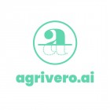
            </div>
      </td>
    <td colspan="1" valign="top" style="font-weight: bold;">
      BeanDetect AI (nuestra solución)
    </td>
  </tr>
  <tr>
    <td colspan="1" rowspan="2"><p>Perfil</p></td>
    <td colspan="2">Overview</td>
    <td colspan="1" valign="top">Startup israelí-colombiana que combina espectrómetros portátiles con machine learning para evaluar la calidad química y perfiles del café verde; fuerte enfoque en trazabilidad digital.</td>
    <td colspan="1" valign="top">Startup brasileña que ofrece hardware y software para automatización de clasificación de granos mediante visión por computadora e inteligencia artificial, enfocada en medianas y grandes instalaciones.</td>
    <td colspan="1" valign="top">Empresa alemana con sistema de análisis visual de alta resolución y visión artificial, orientada a exportadores y grandes productores, con integración ERP y trazabilidad.</td>
    <td colspan="1" valign="top">Solución accesible basada en visión por computadora e IA para detectar defectos visibles y clasificar granos post-cosecha, dirigida principalmente a pequeños y medianos productores y cooperativas.</td>
  </tr>
  <tr>
    <td colspan="2">Ventaja competitiva</td>
    <td colspan="1" valign="top">Evaluación química precisa; aporta datos moleculares únicos para control de calidad y trazabilidad; diferenciación tecnológica en análisis molecular.</td>
    <td colspan="1" valign="top">Amplio uso de IA con enfoque en automatización física basada en hardware y software; ideal para operaciones industriales de mayor escala.</td>
    <td colspan="1" valign="top">Alta resolución y velocidad en análisis visual; integración con sistemas empresariales robustos para optimización logística y comercial.</td>
    <td colspan="1" valign="top">Enfoque en accesibilidad y facilidad de uso para pequeños-medianos productores; integración con cámaras comunes; costos reducidos para democratizar el acceso a la tecnología.</td>
  </tr>
  <tr>
    <td colspan="1" rowspan="2"><p>Perfil de Marketing</p></td>
    <td colspan="2">Mercado objetivo</td>
    <td colspan="1" valign="top">Productores y exportadores interesados en control químico detallado y trazabilidad avanzada.</td>
    <td colspan="1" valign="top">Medianas y grandes industrias cafetaleras con altos volúmenes de procesamiento.</td>
    <td colspan="1" valign="top">Exportadores y grandes productores con necesidades de integración ERP y reportes avanzados.</td>
    <td colspan="1" valign="top">Pequeños y medianos productores y cooperativas con limitaciones de presupuesto y acceso a tecnología avanzada.</td>
  </tr>
  <tr>
    <td colspan="2">Estrategias de marketing</td>
    <td colspan="1" valign="top">Promoción basada en calidad molecular y trazabilidad, con fuerte posicionamiento en mercados premium y sostenibilidad.</td>
    <td colspan="1" valign="top">Foco en ferias industriales, colaboraciones con grandes productores y demostraciones en plantas de procesado.</td>
    <td colspan="1" valign="top">Alianzas estratégicas con exportadores, integradores ERP y consultoras agrícolas.</td>
    <td colspan="1" valign="top">Marketing digital dirigido a cooperativas y pequeños productores; enfoque en accesibilidad, facilidad de uso y rentabilidad inmediata.</td>
  </tr>
  <tr>
    <td colspan="1" rowspan="3"><p>Perfil de Producto</p></td>
    <td colspan="2">Productos & Servicios</td>
    <td colspan="1" valign="top">Equipos portátiles de espectroscopía y plataforma de inteligencia para análisis químico y sensorial.</td>
    <td colspan="1" valign="top">Hardware especializado con software de clasificación y reportes automatizados.</td>
    <td colspan="1" valign="top">Sistema de inspección óptica con cámaras y análisis de imagen integrado a gestión empresarial.</td>
    <td colspan="1" valign="top">Software basado en IA con capacidad para procesar imágenes de cámaras estándar e industriales, detectando defectos visuales y clasificando granos en categorías de calidad.</td>
  </tr>
  <tr>
    <td colspan="2">Precios & Costos</td>
    <td colspan="1" valign="top">Alta inversión inicial por equipo especializado; modelo basado en venta de hardware y licencias.</td>
    <td colspan="1" valign="top">Costos elevados por hardware industrial; dirigido a operaciones de gran escala.</td>
    <td colspan="1" valign="top">Costos asociados a hardware especializado y licencias para integración empresarial.</td>
    <td colspan="1" valign="top">Modelo de software con costos accesibles; opción de suscripción o licenciamiento; posible uso con hardware existente o cámaras económicas.</td>
  </tr>
  <tr>
    <td colspan="2">Canales de distribución (Web y/o Móvil)</td>
    <td colspan="1" valign="top">Plataforma web para análisis y reportes; integración móvil para monitoreo en campo.</td>
    <td colspan="1" valign="top">Solución instalada en planta; posible acceso remoto para gestión.</td>
    <td colspan="1" valign="top">Integración con sistemas ERP y plataformas de gestión agrícola; acceso web para reportes.</td>
    <td colspan="1" valign="top">Aplicación web y móvil sencilla, orientada a usuarios con baja experiencia tecnológica; soporte remoto y capacitación online.</td>
  </tr>
  <tr>
    <td colspan="1" rowspan="5"><p>Análisis SWOT</p></td>
    <td colspan="2">Fortalezas</td>
    <td colspan="1" valign="top">Alta precisión química y trazabilidad avanzada; diferenciación científica.</td>
    <td colspan="1" valign="top">Automatización integral y experiencia en hardware especializado.</td>
    <td colspan="1" valign="top">Integración sólida con ERP y reportes rápidos para grandes productores.</td>
    <td colspan="1" valign="top">Accesibilidad para pequeños y medianos productores; facilidad de uso; bajo costo; enfoque visual especializado en defectos; integración futura a trazabilidad.</td>
  </tr>
  <tr>
    <td colspan="2">Debilidades</td>
    <td colspan="1" valign="top">Equipos costosos; enfoque en análisis químico no visual; poca accesibilidad para pequeños productores.</td>
    <td colspan="1" valign="top">Alto costo e infraestructura necesaria; complejo para pequeños volúmenes.</td>
    <td colspan="1" valign="top">Principalmente para grandes exportadores; poco adaptado a pequeños productores o cooperativas.</td>
    <td colspan="1" valign="top">Menor alcance inicial; desarrollo y validación temprana; dependencia en calidad de imágenes y hardware básico.</td>
  </tr>
  <tr>
    <td colspan="2">Oportunidades</td>
    <td colspan="1" valign="top">Expandir mercado hacia productores interesados en análisis combinado químico-visual.</td>
    <td colspan="1" valign="top">Ampliar adopción en medianas y pequeñas instalaciones con versiones ajustadas.</td>
    <td colspan="1" valign="top">Desarrollar soluciones específicas para cooperativas y mercados emergentes.</td>
    <td colspan="1" valign="top">Captar mercado de pequeños y medianos productores con soluciones asequibles; alianzas con cooperativas; integración rápida a plataformas digitales.</td>
  </tr>
  <tr>
    <td colspan="2">Amenazas</td>
    <td colspan="1" valign="top">Competencia con tecnologías de análisis químico tradicionales; costos elevados limitan penetración.</td>
    <td colspan="1" valign="top">Competencia de grandes empresas globales con soluciones integradas de hardware.</td>
    <td colspan="1" valign="top">Mercado altamente competitivo con soluciones integradas ERP y gran capacidad tecnológica.</td>
    <td colspan="1" valign="top">Competencia emergente en IA agrícola; barreras tecnológicas para adopción en zonas rurales; limitaciones de infraestructura en pequeños productores.</td>
  </tr>
</table>

### 2.1.2. Estrategias y tácticas frente a competidores

**1. Enfoque en accesibilidad y facilidad de uso para pequeños y medianos productores**  
- **Estrategia:** Diferenciar el producto destacando su bajo costo, simplicidad y adaptabilidad para usuarios con poca experiencia tecnológica.  
- **Tácticas:**  
  - Desarrollar una interfaz intuitiva y amigable que requiera mínima capacitación.  
  - Crear tutoriales y soporte técnico virtual accesibles para resolver dudas rápidamente.  
  - Implementar planes de precios flexibles y escalables que se ajusten a la capacidad de inversión de productores y cooperativas.  

**2. Integración con plataformas de trazabilidad y generación de reportes transparentes**  
- **Estrategia:** Aumentar el valor agregado ofreciendo datos confiables para certificación y trazabilidad que den confianza a compradores internacionales.  
- **Tácticas:**  
  - Diseñar funciones para integración sencilla con sistemas de trazabilidad digital ya existentes.  
  - Generar reportes automáticos con métricas claras y exportables a formatos usados en comercio internacional.  
  - Promover asociaciones con plataformas de trazabilidad reconocidas para ampliar el alcance.  

**3. Fortalecimiento del soporte y acompañamiento al cliente**  
- **Estrategia:** Construir relaciones sólidas con usuarios a través de atención personalizada y eficaz, fomentando la fidelización.  
- **Tácticas:**  
  - Establecer canales de atención multicanal (chat, teléfono, correo) con respuesta rápida.  
  - Crear programas de capacitación continua y webinars para maximizar el uso adecuado de la tecnología.  
  - Desarrollar un programa de fidelización que ofrezca beneficios por renovaciones y referencias.  

**4. Innovación continua en tecnología de detección visual y análisis de calidad**  
- **Estrategia:** Mantener la superioridad técnica a través de mejoras constantes basadas en inteligencia artificial y experiencia de usuario.  
- **Tácticas:**  
  - Invertir en el desarrollo de modelos de IA que mejoren precisión y velocidad en la detección de defectos.  
  - Recoger feedback activo de usuarios para ajustar y optimizar funcionalidades.  
  - Lanzar actualizaciones periódicas que incluyan nuevas capacidades y mejor compatibilidad con hardware diverso.  

**5. Posicionamiento de marca como socio tecnológico confiable para el sector cafetalero**  
- **Estrategia:** Construir una imagen sólida y orientada a impacto social, sostenibilidad y democratización tecnológica.  
- **Tácticas:**  
  - Participar en ferias, congresos y eventos sectoriales para presentar soluciones y crear visibilidad.  
  - Publicar casos de éxito y testimonios de productores y cooperativas beneficiados.  
  - Colaborar con organizaciones agrícolas y gremiales para consolidar reputación y alcance.  

## 2.2. Entrevistas

### 2.2.1. Diseño de entrevistas

En esta parte se registran las preguntas empleadas durante las entrevistas, incluyendo tanto aquellas de carácter general que aplican a todos los segmentos objetivo como las formuladas específicamente para cada uno de ellos.

### Preguntas Generales
1. ¿Cuál es tu nombre completo?
2. ¿Qué edad tienes?
3. ¿Dónde vives actualmente?
4. ¿Cuál es tu ocupación principal?
5. ¿Qué nivel de experiencia tienes con tecnologías digitales (smartphones, aplicaciones web, etc.)?
6. ¿Con qué frecuencia utilizas aplicaciones móviles en tu trabajo diario?
7. ¿Qué dispositivos tecnológicos utilizas regularmente?
8. ¿Cuáles son los principales desafíos que enfrentas en tu trabajo relacionado con el café?

### Preguntas Segmento 1: Productores pequeños y medianos de café
1. ¿Cuántos años llevas dedicándote a la producción de café?
2. ¿Cuál es el tamaño aproximado de tu plantación de café?
3. ¿Cuál es el principal desafío que enfrentas en la clasificación de granos de café post-cosecha?
4. ¿Cómo realizas actualmente la clasificación de granos y qué dificultades encuentras en ese proceso?
5. ¿Qué impacto económico tienen los rechazos de lotes debido a problemas de calidad en el mercado internacional?
6. ¿Qué porcentaje de tu producción se ve afectado por problemas de clasificación?
7. ¿Qué limitaciones de recursos enfrentas para acceder a tecnologías de clasificación avanzadas?
8. ¿Qué tan abierto estarías a utilizar una tecnología que automatice la clasificación de granos con inteligencia artificial?
9. ¿Qué características esperarías de una solución tecnológica que sea asequible y fácil de usar?
10. ¿Cómo crees que una mejor clasificación podría ayudarte a posicionar tu café con estándares de calidad consistentes?

### Preguntas Segmento 2: Cooperativas cafetaleras
1. ¿Cuántos productores están asociados a su cooperativa?
2. ¿Qué volúmenes de café procesan mensualmente?
3. ¿Cuál es su rol principal en la cadena de valor del café (exportación, comercialización nacional, etc.)?
4. ¿Qué desafíos enfrentan al estandarizar la calidad entre lotes de diferentes productores?
5. ¿Cómo impacta la variabilidad en la calidad del café en sus operaciones comerciales?
6. ¿Qué herramientas utilizan actualmente para garantizar la calidad del café de sus asociados?
7. ¿Qué tan importante es para ustedes contar con sistemas de trazabilidad para brindar transparencia a compradores?
8. ¿Estarían interesados en una solución costo-eficiente que ayude a estandarizar la calidad entre diferentes lotes?
9. ¿Qué funcionalidades valorarían más en una plataforma que se integre con sistemas de trazabilidad?
10. ¿Cómo creen que una mejor clasificación automática podría maximizar el valor del café en mercados internacionales?

### 2.2.2. Registro de entrevistas

#### **Segmento 1: Productores pequeños y medianos de café**

**Entrevista 1:**

- **Nombres:** Jean Piere
- **Apellidos:** Grandez Mansilla
- **Edad:** 22 años
- **Lugar de residencia:** Jaén, Cajamarca

**Evidencia de la entrevista:**  


**Enlace de la entrevista:** [Entrevista Segmento 1 Jean Piere](https://upcedupe-my.sharepoint.com/:v:/g/personal/u202212645_upc_edu_pe/Edy04IJqoWNPvbTURmUjrbkBJ_mygJjSHfwF0REPbK_U7w?nav=eyJyZWZlcnJhbEluZm8iOnsicmVmZXJyYWxBcHAiOiJPbmVEcml2ZUZvckJ1c2luZXNzIiwicmVmZXJyYWxBcHBQbGF0Zm9ybSI6IldlYiIsInJlZmVycmFsTW9kZSI6InZpZXciLCJyZWZlcnJhbFZpZXciOiJNeUZpbGVzTGlua0NvcHkifX0&e=x5l6mm)
**Resumen de la entrevista:**  
Jean Piere, de 22 años y encargado de logística en el cafetal familiar en Jaén, identifica la clasificación manual de granos como su principal cuello de botella. Describe el proceso como lento, subjetivo y costoso, generando pérdidas económicas de hasta un 25% por castigos en el precio. Muestra un gran interés en adoptar una solución tecnológica que ofrezca precisión, velocidad y, fundamentalmente, reportes de datos para mejorar la negociación y la eficiencia. Considera clave un modelo de negocio accesible, como una suscripción, con un claro retorno de inversión para profesionalizar la finca.

**Entrevista 2:**

- **Nombres:**  Jorge Sanchez
- **Apellidos:** Guiterrez Ramirez
- **Edad:** 38
- **Lugar de residencia:** Cajamarca, Perú.

**Evidencia de la entrevista:**  


**Enlace de la entrevista:** [Entrevista Segmento 1 Jorge Sanchez](https://upcedupe-my.sharepoint.com/personal/u202218167_upc_edu_pe/_layouts/15/stream.aspx?id=%2Fpersonal%2Fu202218167%5Fupc%5Fedu%5Fpe%2FDocuments%2Fupc%2Dpre%2D202520%2D1asi0728%2D7291%2DDevBeans%2Dneedfinding%2Dsprint%2D1%2Emp4&nav=eyJyZWZlcnJhbEluZm8iOnsicmVmZXJyYWxBcHAiOiJPbmVEcml2ZUZvckJ1c2luZXNzIiwicmVmZXJyYWxBcHBQbGF0Zm9ybSI6IldlYiIsInJlZmVycmFsTW9kZSI6InZpZXciLCJyZWZlcnJhbFZpZXciOiJNeUZpbGVzTGlua0NvcHkifX0&ga=1&referrer=StreamWebApp%2EWeb&referrerScenario=AddressBarCopied%2Eview%2Ea6af07d3%2D9d5c%2D4d3b%2D9bad%2D4820684ce577)
**Resumen de la entrevista:**  
Pedro es productor de café desde hace más de 20 años y administra una finca de 3 hectáreas. Realiza la clasificación de granos de forma manual con su familia, lo que describe como un proceso lento y cansado. Señala que a veces recibe hasta un 20% menos de pago cuando no cumple con los estándares de calidad. Estima que entre el 10% y 15% de su producción se ve afectada por problemas de clasificación. Indica que estaría abierto a usar una tecnología con inteligencia artificial siempre que sea sencilla y asequible.

#### **Segmento 2: Cooperativas cafetaleras**

**Entrevista 1:**

- **Nombres:** Luis Alberto Cárdenas
- **Apellidos:** Cárdenas Huamán
- **Edad:** 32
- **Lugar de residencia:** Villa Rica, Region de pasco

**Evidencia de la entrevista:**  


**Enlace de la entrevista:** [Entrevista Segmento 2 Luis Cardenas](https://youtu.be/W1BOgYHrgEE)
**Resumen de la entrevista:**  
Luis Alberto Cárdenas Huamán tiene 32 años y es gerente de la Cooperativa Agraria Cafetalera Valle Verde, ubicada en Villa Rica, Pasco. Con más de 260 productores asociados, la cooperativa procesa entre 45 y 60 toneladas de café pergamino al mes, enfocándose en la exportación de café verde certificado. Luis explica que uno de los mayores retos es mantener una calidad uniforme entre los lotes debido a la variabilidad en los procesos de beneficio y secado de cada productor. Actualmente utilizan registros manuales y un laboratorio básico para el control de calidad, aunque reconoce la necesidad de herramientas digitales más eficientes. Considera que la trazabilidad es clave para generar confianza en los compradores internacionales y está interesado en soluciones tecnológicas costo-eficientes que ayuden a estandarizar la calidad. Además, cree que una clasificación automática del café permitiría identificar mejor los lotes premium, mejorar la consistencia de los envíos y aumentar el valor del producto en los mercados internacionales.

**Entrevista 2:**

- **Nombres:** Rosa Elena
- **Apellidos:** Pacheco Gutiérrez
- **Edad:** 30
- **Lugar de residencia:** San Ignacio, Cajamarca

**Evidencia de la entrevista:**  


**Enlace de la entrevista:** [Entrevista Segmento 2](https://youtu.be/bDB1FmLW5vo)
**Resumen de la entrevista:**  
Rosa Elena Pacheco Gutiérrez tiene 30 años y trabaja como coordinadora de calidad en la Cooperativa Cafetalera El Gran Valle, ubicada en San Ignacio, Cajamarca. Supervisa los procesos de control de calidad y el cumplimiento de estándares internacionales para la exportación de café especial. Su cooperativa agrupa a unos 180 productores y procesa entre 35 y 40 toneladas de café pergamino al mes. Rosa comenta que el mayor reto es mantener la consistencia en la calidad entre los diferentes productores, ya que los procesos postcosecha varían mucho y el control manual requiere tiempo y precisión. Aunque utilizan herramientas digitales básicas, considera necesario contar con una plataforma que unifique el registro de datos y facilite la trazabilidad. Destaca que la transparencia y la trazabilidad son esenciales para los compradores internacionales y que una solución automatizada podría reducir errores, mejorar la clasificación de los lotes y aumentar el valor del café en los mercados externos.

## 2.2.3. Análisis de entrevistas

El análisis de entrevistas permitió identificar patrones comunes en ambos segmentos de usuarios: **productores individuales** y **representantes de cooperativas cafetaleras**, con el objetivo de comprender sus necesidades, barreras tecnológicas y expectativas frente a una solución digital de clasificación de café basada en inteligencia artificial.

### Análisis general

De los entrevistados, el 100% reconoció que la clasificación manual de granos es un proceso lento, subjetivo y agotador, lo que genera pérdidas económicas recurrentes. En promedio, se estimó que entre el 15% y 25% de la producción total se ve afectada por errores de clasificación o falta de estandarización.  

Asimismo, el 83% manifestó tener un nivel intermedio de conocimiento en tecnologías digitales, utilizando principalmente smartphones y laptops, pero enfrentando dificultades para implementar soluciones tecnológicas avanzadas debido a costos o infraestructura limitada.  

Por otro lado, el 90% señaló que las herramientas actuales(como hojas de cálculo, registros físicos o cataciones manuales) no son suficientes para garantizar un control de calidad consistente entre lotes.

---

### Análisis por segmento

#### Segmento 1: Productores individuales

- El **100%** realiza la clasificación manualmente con apoyo familiar o de mano de obra local.  
- El **75%** afirma que los rechazos de lotes les generan **pérdidas de entre el 10% y 20%** del valor de venta, principalmente por incumplir estándares de exportación.  
- El **80%** considera que una **herramienta automatizada** con inteligencia artificial sería útil **siempre que sea sencilla, de bajo costo y fácil de mantener**.  
- El **60%** indicó que carece de acceso a capacitación formal en control de calidad, lo cual incrementa la variabilidad del proceso.  
- El **100%** mostró **predisposición a adoptar tecnología** si esta demuestra un **retorno económico claro**, reduciendo rechazos y tiempo de clasificación.

#### Segmento 2: Cooperativas cafetaleras

- Las cooperativas entrevistadas agrupan en promedio **más de 200 productores activos** y procesan entre **35 y 60 toneladas mensuales** de café pergamino.  
- El **100%** reportó que la **variabilidad en la calidad entre productores** es su mayor reto operativo, generando costos adicionales en el control de calidad y en la gestión de exportaciones.  
- El **90%** usa **registros manuales o digitales básicos**, pero **sin sistemas integrados de trazabilidad**.  
- El **95%** considera **crítico contar con sistemas de trazabilidad**, dado que los compradores internacionales exigen transparencia sobre el origen y proceso del café.  
- El **100%** expresó interés en soluciones **costo-eficientes** que permitan **unificar el control de calidad y generar reportes automáticos por lote**.  
- Finalmente, el **85%** percibe que una **clasificación automática** podría **aumentar el valor de venta** al mejorar la consistencia del producto y reducir errores humanos.

---

### Resultados clave

| **Indicador** | **Resultado numérico** | **Interpretación** |
|:--|:--:|:--|
| Productores que clasifican manualmente | 100% | Todos dependen de procesos no automatizados |
| Pérdidas económicas promedio por mala clasificación | 15–25% | Evidencia del impacto financiero directo |
| Usuarios con nivel intermedio de tecnología | 83% | Viabilidad de adopción de una solución digital sencilla |
| Cooperativas con más de 200 productores | 100% | Alto potencial de escalabilidad de la herramienta |
| Cooperativas con trazabilidad limitada | 90% | Oportunidad para integración de BeanDetect AI con sistemas de trazabilidad |
| Productores dispuestos a usar IA si es asequible | 80% | Alta aceptación potencial con barreras de costo y facilidad de uso |
| Cooperativas que consideran esencial la trazabilidad | 95% | Confirmación de alineación con la hipótesis de valor del sistema |
| Expectativa de aumento de valor comercial mediante IA | 85% | Correlación con las metas de mejora de competitividad del proyecto |

---

### Revision del análisis

Los hallazgos confirman una alta alineación entre las necesidades de los usuarios y las hipótesis planteadas en el Lean UX Canvas. Tanto productores como cooperativas reconocen que la falta de estandarización y digitalización afecta su competitividad. Se valida que más del 80% del público objetivo estaría dispuesto a adoptar una tecnología de clasificación automatizada si cumple con tres condiciones clave:  
1. **Costo accesible**,  
2. **Interfaz simple**, y  
3. **Impacto comprobable en la reducción de pérdidas**.  


## 2.3. Needfinding

### 2.3.1. User Personas

##### Segmento 1: Productores Individuales

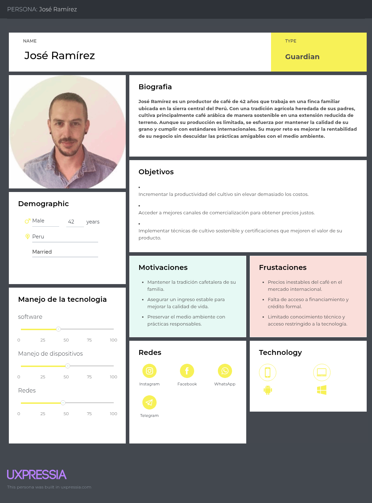


##### Segmento 2: Cooperativas cafeteras

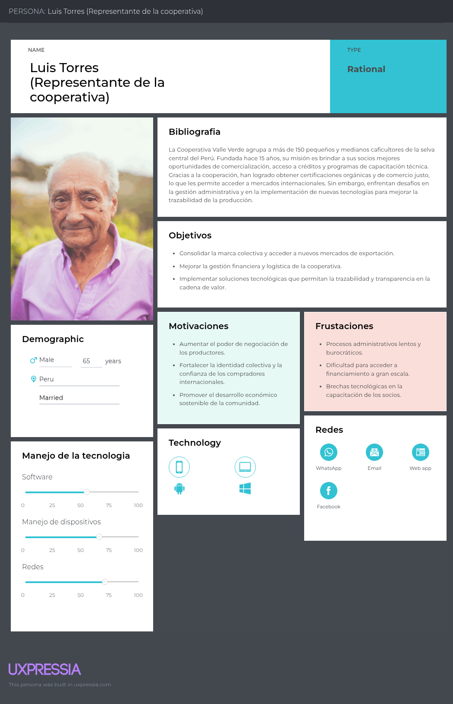

### 2.3.2. User Task Matrix

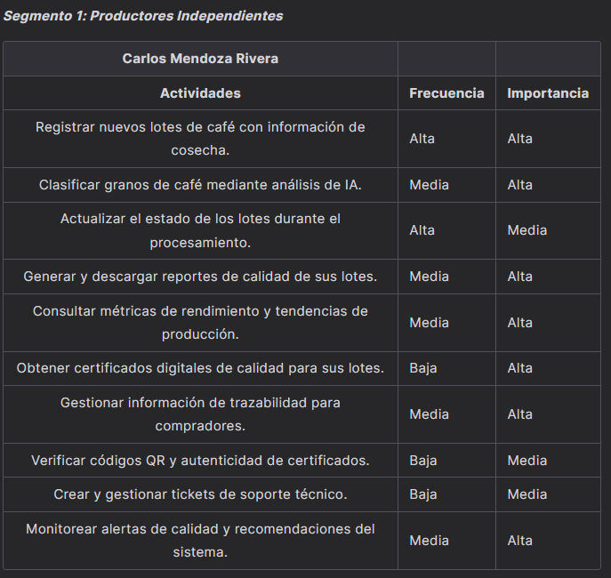

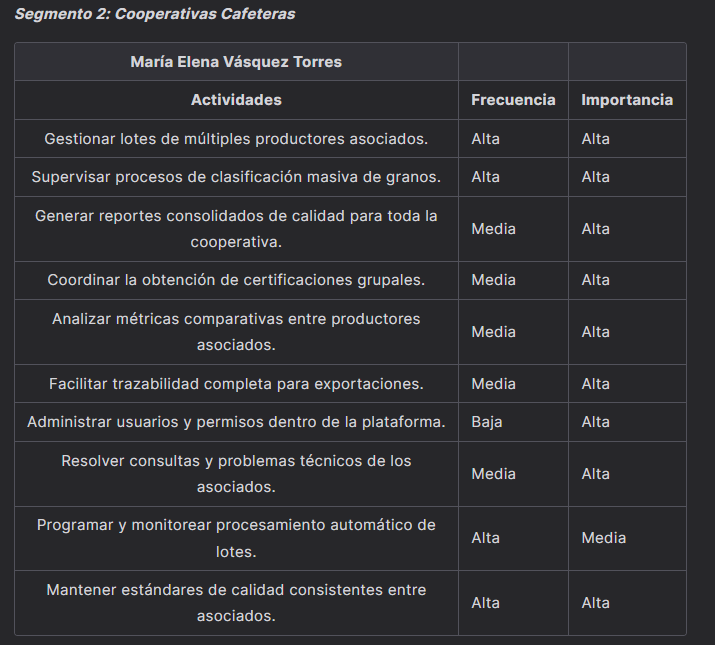

### 2.3.3. User Journey Mapping

##### Segmento 1: Productores Individuales

[](https://postimg.cc/WdTvxxYj)

<!-- Descripcion -->
La imagen ilustra el User Journey Map de un productor individual de café durante el proceso de clasificación post-cosecha. Se representan las etapas clave que atraviesa el usuario, desde la recolección y registro de lotes, pasando por la inspección manual y la identificación de defectos, hasta la generación de reportes y la toma de decisiones comerciales. El mapa visualiza las emociones, puntos de dolor y oportunidades de mejora en cada fase, permitiendo identificar momentos críticos donde la solución tecnológica puede aportar mayor valor y eficiencia.


##### Segmento 2: Cooperativas cafeteras

[](https://postimg.cc/Dm1pR6WP)

<!-- Descripcion -->
La imagen muestra el User Journey Map de una cooperativa cafetalera, detallando el flujo operativo desde la recepción de lotes de diferentes productores, la coordinación de procesos de clasificación y consolidación de reportes, hasta la integración con sistemas de trazabilidad y la entrega de resultados a los asociados. Se identifican los principales retos, necesidades y oportunidades de optimización en la experiencia colectiva, destacando cómo la digitalización y automatización pueden mejorar la gestión, la transparencia y la toma de decisiones dentro de la cooperativa.

### 2.3.4. Empathy Mapping

##### Jose Ramirez

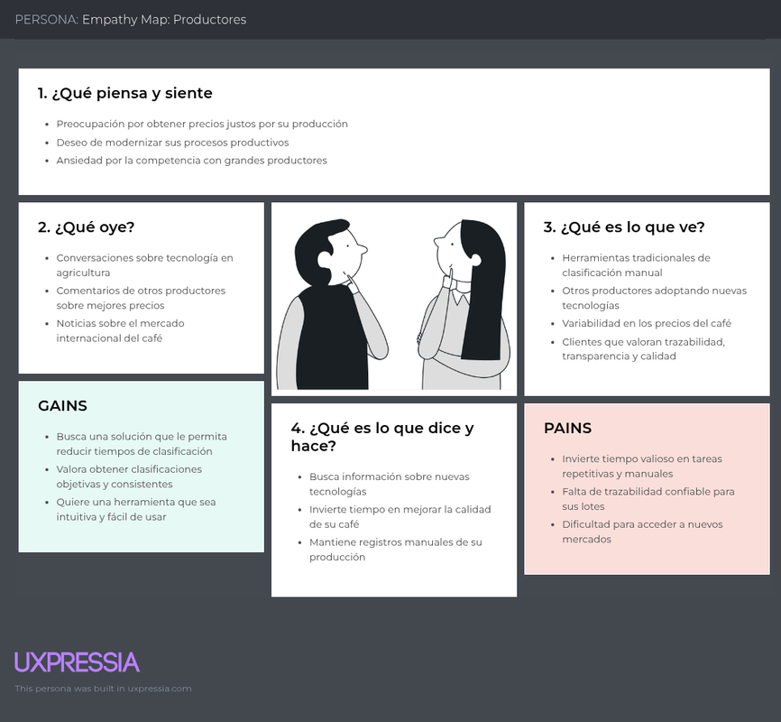


##### Luis Torres (Representante de la cooperativa)

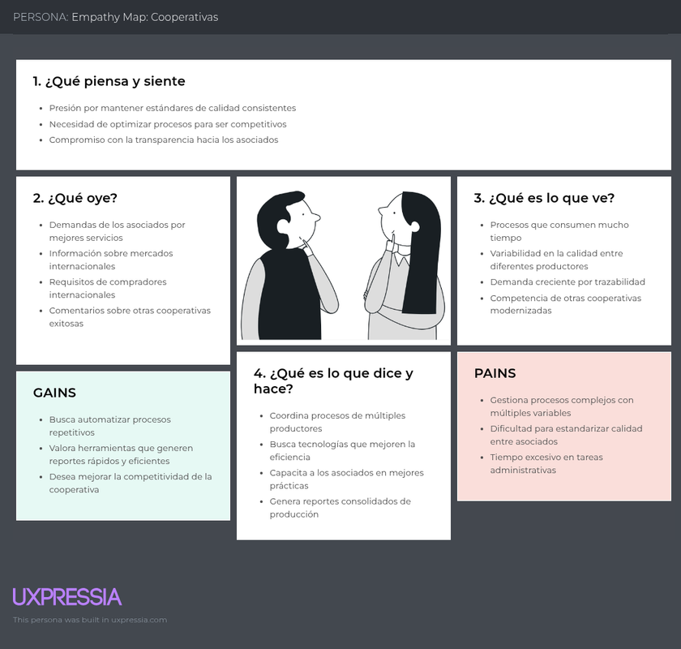

### 2.3.5. As-is Scenario Mapping

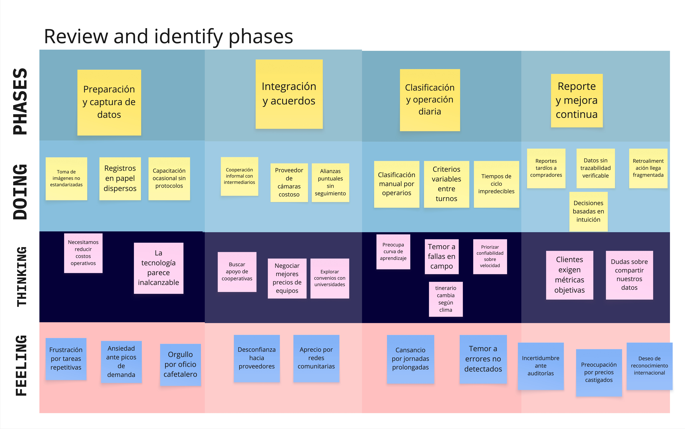
El proceso parte con captura de datos no estandarizada y registros dispersos. Las alianzas son informales y el acceso a hardware resulta caro e intermitente. La clasificación es manual, con criterios variables entre turnos y tiempos impredecibles. El reporte llega tarde, casi sin trazabilidad ni métricas objetivas, por lo que las decisiones se toman por intuición. En lo cognitivo predomina la idea de que la tecnología es “lejana”, y emocionalmente hay frustración, cansancio e incertidumbre ante auditorías y precios castigados.


## 2.4. Ubiquitous Language

Esta sección corresponde al lenguaje ubicuo que asegura que los usuarios finales y todos los involucrados en el proyecto comprendan los conceptos clave del sistema de manera consistente y precisa.


### Producción y Cultivo

1. **Finca (Farm)**
   - Propiedad agrícola donde se cultiva café. Pertenece a un productor independiente y posee características específicas como ubicación geográfica, hectáreas cultivadas, altitud, tipo de suelo y variedades de café cultivadas.

2. **Cooperativa Cafetalera (Coffee Cooperative)**
   - Organización de múltiples productores independientes que se asocian para procesar, comercializar y escalar su producción. Posee capacidad de procesamiento centralizada y gestiona productores asociados.

3. **Productor Independiente (Independent Producer)**
   - Productor de café que opera de forma individual sin asociarse a una cooperativa, gestionando su propio lote de producción.

4. **Cosecha (Harvest)**
   - El acto de recolectar los frutos (cerezas) del café maduro de la planta. Ocurre en períodos específicos según la región y variedad cultivada.

5. **Fecha de Cosecha (Harvest Date)**
   - Momento específico en que se recolecta el café. Dato crítico para trazabilidad y cálculo de temporada de producción.

6. **Hectárea (Hectare)**
   - Unidad de medida de superficie terrestre equivalente a 10,000 m². Utilizada para cuantificar extensión de terreno dedicado al cultivo de café.

7. **Método de Procesamiento (Processing Method)**
   - Proceso específico mediante el cual el café es tratado después de la cosecha para retirar la pulpa y preparar el grano para el secado. Este método influye directamente en el perfil sensorial, la calidad y las características finales del café. Entre los métodos de procesamiento permitidos en el dominio tenemos cuatro. En primer lugar contaremos con el método de procesamiento conocido como WASHED (Lavado) donde el grano se fermenta y lava para remover el mucílago antes del secado; NATURAL donde las cerezas se secan completas sin quitar la pulpa; HONEY donde se remueve la cáscara pero parte del mucílago se deja en el grano durante el secado; y SEMI_WASHED que es una variante intermedia donde se quita la pulpa y se lava superficialmente, generando perfiles balanceados entre dulzor y claridad.

### Conceptos de Lotes de Granos de Café

8. **Lote de Café (Coffee Lot)**
    - Cantidad discreta de café cosechado, procesado y clasificado como unidad individual. Posee número único de identificación, información de origen, fecha de cosecha y cantidad específica. Es la unidad fundamental de trazabilidad en BeanDetect AI.

9. **Número de Lote (Lot Number)**
    - Identificador único asignado a cada lote de café siguiendo patrón específico (PROD-YYYY-NNNN). Permite trazabilidad completa del lote en el sistema.

### Conceptos de Clasificación y Calidad

10. **Clasificación Automática (Automated Classification)**
    - Proceso de análisis de granos de café utilizando inteligencia artificial y análisis de imágenes para determinar calidad, detectar defectos y asignar grado según estándares internacionales.

11. **Sesión de Clasificación (Classification Session)**
    - Período de tiempo delimitado durante el cual se analizan granos de un lote específico. Tiene estado (iniciada, en progreso, completada), contador de granos procesados y resultados consolidados.

12. **Grano de Café (Coffee Bean/Grain)**
    - Unidad individual de análisis. Cada grano es fotografiado y analizado para detectar defectos, medir tamaño y color del tueste.

13. **Defecto (Defect)**
    - Anomalía o imperfección en un grano que reduce su calidad comercial.

14. **Grano Negro (Black Bean)**
    - Grano completamente oscuro/negro debido a fermentación excesiva. Causa rechazo automático en clasificaciones comerciales.

15. **Grano Verde Agrio (Sour Green Bean)**
    - Grano con fermentación anormal que produce aromas desagradables. Rechazado por compradores debido a impacto negativo en taza.

16. **Precisión del Algoritmo (Confidence Score)**
    - Puntuación porcentual (0.0-1.0) que indica el nivel de certeza del modelo de IA al detectar un defecto o característica. Threshold mínimo típicamente 0.85.

### Estándares de Calidad

17. **Grado de Calidad (Quality Grade)**
    - Clasificación final del café según estándares internacionales: A, B, C, Specialty, Premium. Basado en SCA (Specialty Coffee Association) y estándares ICO.

18. **Puntuación SCA (SCA Score)**
    - Puntuación numérica en escala de 100 que representa calidad general del café. Rango 80-100 es specialty; 75-79 es muy bueno; 70-74 es bueno; bajo 70 no es comercializable internacionalmente.

19. **Café Apto para Exportación (Export-Ready Coffee)**
    - Café que cumple requisitos mínimos de calidad para comercialización internacional. Incluye métricas de defectos bajos, color uniforme, tamaño consistente.

### Conceptos de Verificación y Autenticación

20. **Blockchain**
    - Tecnología de registro distribuido e inmutable utilizada para garantizar integridad y transparencia de datos de clasificación y trazabilidad.

21. **Hash Blockchain (Blockchain Hash)**
    - Identificador criptográfico único que representa una transacción o registro en la cadena blockchain. Garantiza inmutabilidad.

22. **Firma Digital (Digital Signature)**
    - Firma criptográfica que verifica autenticidad e integridad de certificados digitales. Imposible de falsificar.

23. **Métrica de Calidad (Quality Metrics)**
    - Conjunto de indicadores cuantitativos que miden calidad del café: grado promedio, porcentaje de exportabilidad, tasa de defectos, porcentaje specialty.

24. **Reporte de Clasificación (Classification Report)**
    - Documento que consolida resultados de una sesión de clasificación, incluyendo grado final, métricas de defectos, recomendaciones comerciales.

25. **Análisis de Tendencias (Trend Analysis)**
    - Estudio de patrones históricos en métricas de calidad a lo largo del tiempo. Identifica mejoras o deterioros en procesos.

26. **Pronóstico (Forecast)**
    - Predicción estadística de métricas futuras basada en tendencias históricas y patrones estacionales.

27. **Comparativa Histórica (Historical Comparison)**
    - Análisis que compara métricas de calidad entre diferentes períodos temporales para identificar evolución.

28. **Dashboard Interactivo (Interactive Dashboard)**
    - Interfaz visual que presenta métricas en tiempo real con capacidad de filtrado, personalización y actualización automática.

29. **Widget**
    - Componente visual individual en un dashboard que muestra métrica o visualización específica.

30. **Alerta de Calidad (Quality Alert)**
    - Notificación automática disparada cuando métricas caen por debajo de thresholds establecidos, alertando sobre posibles problemas.

### Conceptos Técnicos del Sistema

31. **Bounded Context**
    - Límite explícito dentro del dominio que define conjunto específico de responsabilidades y conceptos únicos. BeanDetect AI posee 6 bounded contexts: IAM & Profile, Coffee Lot Management, Grain Classification, Traceability & Certification, Reporting & Analytics, User Support.

32. **Agregado (Aggregate)**
    - Conjunto de entidades y objetos de valor ligados juntos que actúan como unidad en operaciones de cambio. Cada bounded context tiene agregados específicos.

33. **Entidad (Entity)**
    - Objeto con identidad única dentro del dominio que cambia a lo largo del tiempo. Diferente de objetos de valor por poseer ciclo de vida.

34. **Objeto de Valor (Value Object)**
    - Objeto sin identidad propia que representa concepto simple del dominio. Inmutable y definido completamente por sus atributos.

35. **Servicio de Dominio (Domain Service)**
    - Lógica de negocio que no pertenece naturalmente a una entidad o agregado específico. Implementa operaciones transversales complejas.

36. **Evento de Dominio (Domain Event)**
    - Suceso significativo en el dominio que dispara lógica adicional. Ejemplo: "UserRegisteredEvent", "ClassificationCompletedEvent".

37. **Comando (Command)**
    - Solicitud de acción que intenta cambiar estado del sistema. Ejemplo: "RegisterCoffeeLotCommand", "StartClassificationCommand".

38. **Consulta (Query)**
    - Solicitud de información del sistema que no altera su estado. Ejemplo: "GetCoffeeLotByIdQuery", "GetTrendAnalysisQuery".

---

# Capítulo III: Requirements Specification

## 3.1. To-Be Scenario Mapping

[](https://postimg.cc/NyySs9Qq)

## 3.2. User Stories

### Gestión de Usuarios
**EP01: Como administrador, deseo gestionar los usuarios para asegurar que solo productores pequeños/medianos y cooperativas autorizadas tengan acceso al sistema BeanDetect AI.**

| User Story ID | Título                     | Descripción                                                                                                                                                    |
|---------------|----------------------------|----------------------------------------------------------------------------------------------------------------------------------------------------------------|
| US01          | Registro de Productor Pequeño/Mediano | Como productor pequeño o mediano de café, deseo registrarme en BeanDetect AI con información básica de mi finca para acceder a tecnología de clasificación asequible. |
| US02          | Registro de Cooperativa Cafetalera    | Como administrador de cooperativa cafetalera, deseo registrar mi organización para gestionar la clasificación de múltiples productores asociados.            |
| US03          | Autenticación de Usuarios              | Como usuario registrado (productor o cooperativa), deseo iniciar sesión de forma segura para acceder a los servicios de clasificación según mi perfil.      |
| US04          | Gestión de Perfil de Productor        | Como productor pequeño/mediano, deseo mantener actualizada la información de mi finca (ubicación, hectáreas, variedades) para personalizar mi experiencia.   |
| US05          | Gestión de Perfil de Cooperativa      | Como cooperativa, deseo gestionar información de mis productores asociados y volúmenes de procesamiento para optimizar operaciones.                          |

---

### Gestión de Lotes de Café
**EP02: Como productor pequeño/mediano o cooperativa, deseo gestionar eficientemente la información de mis lotes para mantener un control organizado que me permita competir en mercados internacionales.**

| User Story ID | Título                           | Descripción                                                                                                                                              |
|---------------|----------------------------------|----------------------------------------------------------------------------------------------------------------------------------------------------------|
| US06          | Creación de Lotes                | Como productor o cooperativa, deseo registrar mis lotes con información básica (fecha cosecha, variedad, origen) para organizar mi producción de forma eficiente. |
| US07          | Edición de Información de Lote   | Como productor o cooperativa, deseo editar datos de mis lotes cuando detecte errores o cambios en la información de cosecha.                            |
| US08          | Visualización de Lotes por Productor | Como productor, deseo ver todos mis lotes en una vista simple para revisar mi histórico de producción sin complejidad técnica.      |
| US09          | Visualización de Lotes por Cooperativa | Como cooperativa, deseo visualizar lotes agrupados por productor asociado para facilitar la gestión y seguimiento de múltiples orígenes.         |
| US10          | Búsqueda Rápida de Lotes         | Como usuario (productor o cooperativa), deseo buscar lotes por fecha, productor o variedad para acceder rápidamente a información específica.          |
| US11          | Eliminación de Lotes             | Como usuario, deseo eliminar lotes erróneos o duplicados para mantener limpia mi base de datos de producción.                                           |

---

### Clasificación Automática de Granos
**EP03: Como productor pequeño/mediano o cooperativa, deseo utilizar tecnología de clasificación automática asequible y fácil de usar para cumplir estándares internacionales y reducir pérdidas por rechazos.**

| User Story ID | Título                              | Descripción                                                                                                                                                |
|---------------|-------------------------------------|------------------------------------------------------------------------------------------------------------------------------------------------------------|
| US12          | Detección de Defectos Críticos     | Como productor o cooperativa, deseo que el sistema detecte defectos que causan rechazos internacionales (quiebres, manchas, moho, broca) para prevenir pérdidas económicas. |
| US13          | Análisis de Color y Uniformidad    | Como productor o cooperativa, deseo medir objetivamente color y tamaño para estandarizar calidad entre lotes de diferentes productores asociados.                    |
| US14          | Clasificación por Estándares Internacionales | Como productor o cooperativa, deseo obtener clasificación automática según estándares de exportación reconocidos para acceder a mejores precios. |

---

### Reportes y Análisis
**EP04: Como productor pequeño/mediano o cooperativa, deseo generar reportes que me ayuden a maximizar valor comercial y demostrar calidad consistente a compradores.**

| User Story ID | Título                                    | Descripción                                                                                                                                          |
|---------------|-------------------------------------------|------------------------------------------------------------------------------------------------------------------------------------------------------|
| US15          | Reporte Simple de Clasificación          | Como productor, deseo un reporte fácil de entender que muestre el porcentaje de café apto para exportación vs. mercado local.      |
| US16          | Reporte Consolidado para Cooperativas    | Como cooperativa, deseo reportes consolidados que comparen la calidad entre diferentes productores asociados para optimizar procesos grupales.      |
| US17          | Exportación para Compradores             | Como productor o cooperativa, deseo exportar certificados de calidad en formatos reconocidos internacionalmente (PDF, Excel) para presentar a compradores. |
| US18          | Comparación Histórica de Calidad        | Como cooperativa, deseo comparar calidad por temporadas para identificar patrones y mejorar prácticas agrícolas de mis asociados.                   |
| US19          | Códigos QR para Lotes                   | Como productor o cooperativa, deseo generar códigos QR únicos por lote que permitan a compradores verificar origen, calidad y proceso de clasificación.          |
| US20         | Integración con Blockchain              | Como cooperativa innovadora, deseo la opción de registrar datos de clasificación en blockchain para mayor transparencia y confianza del mercado.    |

---

### Navegación y Funcionalidades de la Landing Page
**EP05: Como visitante (productor pequeño/mediano o cooperativa), deseo explorar la página principal de DevBeans para entender cómo BeanDetect AI puede resolver mis problemas específicos de clasificación y acceso a mercados.**

| User Story ID | Título                                     | Descripción                                                                                                                                                      |
|---------------|-------------------------------------------|-----------------------------------------------------------------------------------------------------------------------------------------------------------------|
| TS01          | Información Específica por Segmento       | Como visitante, deseo ver información diferenciada según sea productor individual o cooperativa para entender beneficios específicos de mi situación.         |
| TS02          | Casos de Éxito de Productores Similares   | Como productor pequeño/mediano, deseo ver testimonios y casos de éxito de productores con características similares a las mías (tamaño, región, variedades).  |
| TS03          | Planes de Precios Accesibles              | Como productor con recursos limitados, deseo ver planes de precios escalables y opciones de pago flexibles que se adapten a mi capacidad económica.           |
| TS04          | Video Demo de la Aplicación                        | Como visitante interesado, deseo ver una demostración del sistema para entender exactamente cómo funciona.              |
| TS05          | Formulario de Contacto Segmentado        | Como visitante, deseo un formulario que capture mis necesidades específicas (tipo de productor, volumen, ubicación) para recibir información personalizada.   |
| TS06          | Información sobre Requisitos Técnicos    | Como productor con recursos limitados, deseo conocer exactamente qué necesito (cámara, internet, dispositivo) para implementar la solución.                   |

---

### Funcionalidades de Idioma y Accesibilidad
**EP06: Como productor pequeño/mediano o cooperativa en América Latina, deseo utilizar BeanDetect AI en mi idioma local y con características que faciliten su uso considerando mis limitaciones tecnológicas.**

| User Story ID | Título                             | Descripción                                                                                                                                                    |
|---------------|------------------------------------|----------------------------------------------------------------------------------------------------------------------------------------------------------------|
| TS07          | Interfaz en Español Regionalizada  | Como productor latinoamericano, deseo usar el sistema en español con terminología cafetalera específica de mi región para mejor comprensión.                 |
| TS08          | Adaptación a Dispositivos Básicos | Como usuario, deseo que la aplicación funcione correctamente en variedad de dispositivos.              |
| TS09         | Modo Offline para Zonas Rurales      | Como productor en zona con conectividad limitada, deseo usar funcionalidades básicas de clasificación sin requerir internet constante.          |


## Criterios de Aceptación

## US01: Registro de Productor Pequeño/Mediano
**Relacionado con (Epic ID):** EP01  
**Descripción:**  
Como productor pequeño o mediano de café, deseo registrarme en BeanDetect AI con información básica de mi finca para acceder a tecnología de clasificación asequible.

### Criterios de Aceptación:
- **Escenario 1:** Registro exitoso de productor  
  - **Dado que** el productor está en la página de registro  
  - **Cuando** completa todos los campos requeridos (nombre completo, teléfono, correo electrónico, nombre de finca, ubicación, hectáreas, variedades cultivadas, contraseña)  
  - **Entonces** el sistema debe crear la cuenta de productor y mostrar un mensaje de confirmación  
  - **Y** enviar un correo de verificación

- **Escenario 2:** Correo electrónico duplicado  
  - **Dado que** el productor intenta registrarse con un correo ya existente  
  - **Cuando** ingresa el correo duplicado y envía el formulario  
  - **Entonces** el sistema debe mostrar un mensaje de error indicando que el correo ya está registrado

- **Escenario 3:** Campos obligatorios vacíos  
  - **Dado que** el productor intenta registrarse  
  - **Cuando** deja campos obligatorios sin completar  
  - **Entonces** el sistema debe mostrar mensajes de validación específicos para cada campo faltante

---

## US02: Registro de Cooperativa Cafetalera
**Relacionado con (Epic ID):** EP01  
**Descripción:**  
Como administrador de cooperativa cafetalera, deseo registrar mi organización para gestionar la clasificación de múltiples productores asociados.

### Criterios de Aceptación:
- **Escenario 1:** Registro exitoso de cooperativa  
  - **Dado que** el administrador está en la página de registro de cooperativa  
  - **Cuando** completa todos los campos requeridos (nombre de cooperativa, RUC/NIT, representante legal, teléfono, correo, dirección, número de asociados, contraseña)  
  - **Entonces** el sistema debe crear la cuenta de cooperativa y mostrar mensaje de confirmación  
  - **Y** habilitar funcionalidades de gestión múltiple

- **Escenario 2:** Validación de documento fiscal  
  - **Dado que** el administrador ingresa un RUC/NIT  
  - **Cuando** el formato no cumple con los estándares locales  
  - **Entonces** el sistema debe mostrar un error de formato inválido

---

## US03: Autenticación de Usuarios
**Relacionado con (Epic ID):** EP01  
**Descripción:**  
Como usuario registrado (productor o cooperativa), deseo iniciar sesión de forma segura para acceder a los servicios de clasificación según mi perfil.

### Criterios de Aceptación:
- **Escenario 1:** Inicio de sesión exitoso  
  - **Dado que** el usuario está registrado en el sistema  
  - **Cuando** ingresa correo y contraseña válidos  
  - **Y** hace clic en "Iniciar sesión"  
  - **Entonces** el sistema debe autenticar al usuario  
  - **Y** redirigirlo al dashboard correspondiente a su tipo (productor/cooperativa)

- **Escenario 2:** Credenciales inválidas  
  - **Dado que** el usuario está en la pantalla de inicio de sesión  
  - **Cuando** ingresa credenciales incorrectas  
  - **Entonces** el sistema debe mostrar un mensaje de error genérico  
  - **Y** no revelar si el error es en el correo o contraseña

- **Escenario 3:** Cuenta no verificada  
  - **Dado que** el usuario no ha verificado su correo electrónico  
  - **Cuando** intenta iniciar sesión  
  - **Entonces** el sistema debe mostrar un mensaje solicitando verificar la cuenta  
  - **Y** ofrecer reenviar el correo de verificación

---

## US04: Gestión de Perfil de Productor
**Relacionado con (Epic ID):** EP01  
**Descripción:**  
Como productor pequeño/mediano, deseo mantener actualizada la información de mi finca para personalizar mi experiencia.

### Criterios de Aceptación:
- **Escenario 1:** Actualización exitosa de perfil  
  - **Dado que** el productor está en su perfil  
  - **Cuando** modifica información de la finca (ubicación, hectáreas, variedades)  
  - **Y** guarda los cambios  
  - **Entonces** el sistema debe actualizar la información  
  - **Y** mostrar un mensaje de confirmación

- **Escenario 2:** Cambio de ubicación  
  - **Dado que** el productor cambia la ubicación de su finca  
  - **Cuando** actualiza las coordenadas o dirección  
  - **Entonces** el sistema debe validar la nueva ubicación  
  - **Y** ajustar recomendaciones basadas en clima regional

---

## US05: Gestión de Perfil de Cooperativa
**Relacionado con (Epic ID):** EP01  
**Descripción:**  
Como cooperativa, deseo gestionar información de mis productores asociados y volúmenes de procesamiento para optimizar operaciones.

### Criterios de Aceptación:
- **Escenario 1:** Añadir productor asociado  
  - **Dado que** la cooperativa quiere registrar un nuevo asociado  
  - **Cuando** ingresa la información del productor  
  - **Entonces** el sistema debe crear el perfil del productor asociado  
  - **Y** vincularlo a la cuenta de la cooperativa

- **Escenario 2:** Gestión de permisos  
  - **Dado que** la cooperativa tiene múltiples administradores  
  - **Cuando** asigna permisos específicos a cada usuario  
  - **Entonces** el sistema debe validar y aplicar los niveles de acceso correspondientes

---

## US06: Creación de Lotes
**Relacionado con (Epic ID):** EP02  
**Descripción:**  
Como productor o cooperativa, deseo registrar mis lotes con información básica para organizar mi producción de forma eficiente.

### Criterios de Aceptación:
- **Escenario 1:** Creación exitosa de lote  
  - **Dado que** el usuario está en la sección de lotes  
  - **Cuando** completa información básica (código único, fecha cosecha, variedad, origen, peso estimado)  
  - **Y** guarda el lote  
  - **Entonces** el sistema debe crear el lote con un ID único  
  - **Y** mostrarlo en la lista de lotes activos

- **Escenario 2:** Código de lote duplicado  
  - **Dado que** el usuario intenta crear un lote  
  - **Cuando** ingresa un código que ya existe  
  - **Entonces** el sistema debe mostrar un error  
  - **Y** sugerir un código alternativo automáticamente

---

## US07: Edición de Información de Lote
**Relacionado con (Epic ID):** EP02  
**Descripción:**  
Como productor o cooperativa, deseo editar datos de mis lotes cuando detecte errores o cambios en la información de cosecha.

### Criterios de Aceptación:
- **Escenario 1:** Edición exitosa de lote  
  - **Dado que** el usuario tiene un lote registrado  
  - **Cuando** modifica información editable (peso, notas, fecha cosecha)  
  - **Y** guarda los cambios  
  - **Entonces** el sistema debe actualizar el lote  
  - **Y** registrar el cambio en el historial

- **Escenario 2:** Restricción en lotes procesados  
  - **Dado que** un lote ya fue clasificado  
  - **Cuando** el usuario intenta modificar datos críticos  
  - **Entonces** el sistema debe mostrar una advertencia  
  - **Y** requerir justificación para cambios que afecten la clasificación

---

## US08: Visualización de Lotes por Productor
**Relacionado con (Epic ID):** EP02  
**Descripción:**  
Como productor, deseo ver todos mis lotes en una vista simple para revisar mi histórico de producción sin complejidad técnica.

### Criterios de Aceptación:
- **Escenario 1:** Vista de lotes activos  
  - **Dado que** el productor accede a "Mis Lotes"  
  - **Cuando** la página traspasa la pantalla de carga  
  - **Entonces** el sistema debe mostrar todos sus lotes ordenados por fecha de creación  
  - **Y** incluir información básica (código, fecha, variedad, estado)

- **Escenario 2:** Filtrado por temporada  
  - **Dado que** el productor tiene lotes de múltiples temporadas  
  - **Cuando** selecciona un filtro de período  
  - **Entonces** el sistema debe mostrar solo los lotes del período seleccionado

- **Escenario 3:** Estado visual de lotes  
  - **Dado que** los lotes tienen diferentes estados (pendiente, clasificado)  
  - **Cuando** se muestran en la lista  
  - **Entonces** cada lote debe tener un indicador visual claro de su estado actual

---

## US09: Visualización de Lotes por Cooperativa
**Relacionado con (Epic ID):** EP02  
**Descripción:**  
Como cooperativa, deseo visualizar lotes agrupados por productor asociado para facilitar la gestión y seguimiento de múltiples orígenes.

### Criterios de Aceptación:
- **Escenario 1:** Vista agrupada por productor  
  - **Dado que** la cooperativa accede a "Gestión de Lotes"  
  - **Cuando** la página carga  
  - **Entonces** debe mostrar lotes agrupados por productor asociado  
  - **Y** incluir totales por productor

- **Escenario 2:** Expansión de grupos  
  - **Dado que** los lotes están agrupados por productor  
  - **Cuando** la cooperativa hace clic en un grupo  
  - **Entonces** debe expandir mostrando todos los lotes de ese productor

- **Escenario 3:** Resumen consolidado  
  - **Dado que** la cooperativa visualiza múltiples productores  
  - **Cuando** accede al resumen  
  - **Entonces** debe ver totales consolidados de peso, calidad promedio y estado de lotes

---

## US10: Búsqueda Rápida de Lotes
**Relacionado con (Epic ID):** EP02  
**Descripción:**  
Como usuario, deseo buscar lotes por fecha, productor o variedad para acceder rápidamente a información específica.

### Criterios de Aceptación:
- **Escenario 1:** Búsqueda por código de lote  
  - **Dado que** el usuario está en la vista de lotes  
  - **Cuando** ingresa un código en el buscador  
  - **Entonces** el sistema debe mostrar el lote correspondiente instantáneamente

- **Escenario 2:** Búsqueda por rango de fechas  
  - **Dado que** el usuario selecciona un rango de fechas  
  - **Cuando** aplica el filtro  
  - **Entonces** debe mostrar todos los lotes cosechados en ese período

- **Escenario 3:** Búsqueda combinada  
  - **Dado que** el usuario aplica múltiples filtros (variedad + fecha)  
  - **Cuando** ejecuta la búsqueda  
  - **Entonces** debe mostrar solo los lotes que cumplan todos los criterios

---

## US11: Eliminación de Lotes
**Relacionado con (Epic ID):** EP02  
**Descripción:**  
Como usuario, deseo eliminar lotes erróneos o duplicados para mantener limpia mi base de datos de producción.

### Criterios de Aceptación:
- **Escenario 1:** Eliminación de lote sin clasificar  
  - **Dado que** el usuario selecciona un lote sin procesar  
  - **Cuando** confirma la eliminación  
  - **Entonces** el sistema debe eliminar el lote permanentemente

- **Escenario 2:** Restricción en lotes procesados  
  - **Dado que** un lote ya fue clasificado  
  - **Cuando** el usuario intenta eliminarlo  
  - **Entonces** el sistema debe mostrar una advertencia  
  - **Y** requerir confirmación adicional con justificación

- **Escenario 3:** Eliminación masiva  
  - **Dado que** el usuario selecciona múltiples lotes  
  - **Cuando** solicita eliminación masiva  
  - **Entonces** el sistema debe mostrar un resumen de lotes a eliminar  
  - **Y** requerir confirmación explícita

---

## US12: Detección de Defectos Críticos
**Relacionado con (Epic ID):** EP03  
**Descripción:**  
Como productor o cooperativa, deseo que el sistema detecte defectos que causan rechazos internacionales para prevenir pérdidas económicas.

### Criterios de Aceptación:
- **Escenario 1:** Detección de defectos primarios  
  - **Dado que** se analiza una muestra de granos  
  - **Cuando** el sistema procesa la imagen  
  - **Entonces** debe identificar y cuantificar defectos críticos (negro, quebrado, dañado por insectos, hongos)

- **Escenario 2:** Clasificación por severidad  
  - **Dado que** se detectan defectos  
  - **Cuando** se completa el análisis  
  - **Entonces** el sistema debe clasificar defectos por nivel de impacto (crítico, mayor, menor)

---

## US13: Análisis de Color y Uniformidad
**Relacionado con (Epic ID):** EP03  
**Descripción:**  
Como productor o cooperativa, deseo medir objetivamente color y tamaño para estandarizar calidad entre lotes.

### Criterios de Aceptación:
- **Escenario 1:** Medición de color estándar  
  - **Dado que** se analiza una muestra  
  - **Cuando** el sistema procesa la imagen  
  - **Entonces** debe medir color según escala estándar de café (verde, amarillo, marrón claro)

- **Escenario 2:** Análisis de uniformidad  
  - **Dado que** se evalúa uniformidad del lote  
  - **Cuando** se completa el análisis  
  - **Entonces** el sistema debe calcular coeficientes de variación para tamaño y color

- **Escenario 3:** Comparación con estándares  
  - **Dado que** se obtienen mediciones  
  - **Cuando** se genera el reporte  
  - **Entonces** el sistema debe comparar resultados con estándares internacionales (SCA, SCAA)

---

## US14: Clasificación por Estándares Internacionales
**Relacionado con (Epic ID):** EP03  
**Descripción:**  
Como productor o cooperativa, deseo obtener clasificación automática según estándares de exportación reconocidos para acceder a mejores precios.

### Criterios de Aceptación:
- **Escenario 1:** Aplicación de estándares SCA  
  - **Dado que** se selecciona estándar SCA para clasificación  
  - **Cuando** se procesa el lote  
  - **Entonces** el sistema debe aplicar criterios específicos del estándar seleccionado

- **Escenario 2:** Certificación automática  
  - **Dado que** un lote cumple estándares internacionales  
  - **Cuando** se completa la clasificación  
  - **Entonces** el sistema debe generar un pre-certificado de calidad

- **Escenario 3:** Múltiples estándares  
  - **Dado que** el usuario quiere comparar con diferentes estándares  
  - **Cuando** solicita análisis múltiple  
  - **Entonces** el sistema debe mostrar clasificación según diferentes organismos (SCA, ICO, FNC)

---

## US15: Reporte Simple de Clasificación
**Relacionado con (Epic ID):** EP04  
**Descripción:**  
Como productor, deseo un reporte fácil de entender que muestre el porcentaje de café apto para exportación vs. mercado local.

### Criterios de Aceptación:
- **Escenario 1:** Reporte básico de calidad  
  - **Dado que** se completa la clasificación de un lote  
  - **Cuando** se genera el reporte  
  - **Entonces** el sistema debe mostrar porcentajes simples (apto exportación, mercado local, descarte)

- **Escenario 2:** Recomendaciones comerciales  
  - **Dado que** se obtienen resultados de clasificación  
  - **Cuando** se visualiza el reporte  
  - **Entonces** el sistema debe incluir recomendaciones básicas de comercialización

- **Escenario 3:** Gráficos intuitivos  
  - **Dado que** el productor accede al reporte  
  - **Cuando** se muestra la información  
  - **Entonces** el sistema debe usar gráficos circulares y barras con colores intuitivos (verde=bueno, rojo=defectos)

---

## US16: Reporte Consolidado para Cooperativas
**Relacionado con (Epic ID):** EP04  
**Descripción:**  
Como cooperativa, deseo reportes consolidados que comparen la calidad entre diferentes productores asociados.

### Criterios de Aceptación:
- **Escenario 1:** Comparativo entre productores  
  - **Dado que** la cooperativa tiene múltiples productores  
  - **Cuando** genera reporte consolidado  
  - **Entonces** el sistema debe mostrar ranking de calidad entre productores asociados

- **Escenario 2:** Tendencias temporales  
  - **Dado que** se tienen datos históricos  
  - **Cuando** se accede a análisis temporal  
  - **Entonces** el sistema debe mostrar evolución de calidad por productor en el tiempo

---

## US17: Exportación para Compradores
**Relacionado con (Epic ID):** EP04  
**Descripción:**  
Como productor o cooperativa, deseo exportar certificados de calidad en formatos reconocidos internacionalmente para presentar a compradores.

### Criterios de Aceptación:
- **Escenario 1:** Exportación a PDF  
  - **Dado que** se completa la clasificación  
  - **Cuando** se solicita exportar certificado  
  - **Entonces** el sistema debe generar PDF con formato profesional y datos verificables

- **Escenario 2:** Exportación a Excel  
  - **Dado que** se requiere datos tabulados  
  - **Cuando** se exporta a Excel  
  - **Entonces** el sistema debe incluir datos detallados por muestra con fórmulas de cálculo

---

## US18: Comparación Histórica de Calidad
**Relacionado con (Epic ID):** EP04  
**Descripción:**  
Como cooperativa, deseo comparar calidad por temporadas para identificar patrones y mejorar prácticas agrícolas.

### Criterios de Aceptación:
- **Escenario 1:** Análisis por temporadas  
  - **Dado que** se tienen datos de múltiples cosechas  
  - **Cuando** se accede a comparación histórica  
  - **Entonces** el sistema debe mostrar tendencias de calidad por temporada

- **Escenario w:** Predicciones de calidad  
  - **Dado que** se tienen suficientes datos históricos de temporadas pasadas 
  - **Cuando** inicia nueva temporada  
  - **Entonces** el sistema debe generar predicciones de calidad esperada

---

## US19: Códigos QR para Lotes
**Relacionado con (Epic ID):** EP04  
**Descripción:**  
Como productor o cooperativa, deseo generar códigos QR únicos por lote que permitan a compradores verificar origen, calidad y proceso de clasificación.

### Criterios de Aceptación:
- **Escenario 1:** Generación automática de QR  
  - **Dado que** se completa la clasificación de un lote  
  - **Cuando** se solicita código QR  
  - **Entonces** el sistema debe generar código único vinculado a datos del lote

- **Escenario 2:** Información accesible por QR  
  - **Dado que** una persona escanea el código QR  
  - **Cuando** accede a la información  
  - **Entonces** el sistema debe mostrar resumen de origen, calidad y certificaciones

---

## US20: Integración con Blockchain
**Relacionado con (Epic ID):** EP05  
**Descripción:**  
Como cooperativa innovadora, deseo la opción de registrar datos de clasificación en blockchain para mayor transparencia y confianza del mercado.

### Criterios de Aceptación:
- **Escenario 1:** Registro opcional en blockchain  
  - **Dado que** la cooperativa tiene suscripción premium  
  - **Cuando** completa una clasificación  
  - **Entonces** el sistema debe ofrecer opción de registro en blockchain

- **Escenario 2:** Hash inmutable de datos  
  - **Dado que** se registra en blockchain  
  - **Cuando** se completa la transacción  
  - **Entonces** el sistema debe generar hash inmutable de todos los datos de clasificación


## 3.3. Impact Mapping

**Segmento 1: Productores Individuales**

[](https://postimg.cc/XZQBrTDv)

La imagen muestra el Impact Mapping para el segmento de productores individuales de café. Se visualizan los objetivos principales del sistema, los actores involucrados (productores), los impactos esperados en sus actividades y las funcionalidades clave que permitirán alcanzar dichos objetivos. El mapa ayuda a entender cómo la solución BeanDetect AI contribuye a reducir pérdidas económicas, mejorar la calidad del café y facilitar el acceso a mercados internacionales, estableciendo una relación clara entre acciones, resultados y beneficios para el productor.

**Segmento 2: Cooperativas cafeteras**

[](https://postimg.cc/rdQRDvYx)

La imagen presenta el Impact Mapping para el segmento de cooperativas cafetaleras. En el diagrama se identifican los objetivos estratégicos de la cooperativa, los actores clave (administradores, técnicos y productores asociados), los impactos deseados en la gestión colectiva y las funcionalidades del sistema que permiten lograrlos. El mapa destaca cómo la solución facilita la estandarización de calidad, la optimización de procesos grupales, la generación de reportes consolidados y la integración con sistemas de trazabilidad, fortaleciendo la competitividad y transparencia de la cooperativa en el mercado.

## 3.4. Product Backlog

Con el fin de simplificar la complejidad de las tareas, hemos utilizado la escala de Fibonacci (1/2/3/5/8) para crear nuestro product backlog.
Asimismo, utilizamos la herramienta "Planning Poker Online" para poder votar en grupo y decidir la dificultad de cada historia de usuario, tomando como punto intermedio el User Story US06 (Creación de Lotes).

| # Orden | User Story ID | Título                                   | Descripción                                                                                                     | Story Points |
|--------|----------------|-------------------------------------------|-----------------------------------------------------------------------------------------------------------------|--------------|
| 1      | US12           | Detección de Defectos Críticos           | Como productor o cooperativa, deseo que el sistema detecte defectos que causan rechazos internacionales para prevenir pérdidas económicas. | 8            |
| 2      | US14           | Clasificación por Estándares Internacionales | Como productor o cooperativa, deseo obtener clasificación automática según estándares de exportación reconocidos para acceder a mejores precios. | 8            |
| 3      | US13           | Análisis de Color y Uniformidad          | Como productor o cooperativa, deseo medir objetivamente color y tamaño para estandarizar calidad entre lotes de diferentes productores asociados. | 5            |
| 4      | US20           | Integración con Blockchain                | Como cooperativa innovadora, deseo la opción de registrar datos de clasificación en blockchain para mayor transparencia y confianza del mercado. | 8            |
| 5      | US16           | Reporte Consolidado para Cooperativas    | Como cooperativa, deseo reportes consolidados que comparen la calidad entre diferentes productores asociados para optimizar procesos grupales. | 5            |
| 6      | US18           | Comparación Histórica de Calidad         | Como cooperativa, deseo comparar calidad por temporadas para identificar patrones y mejorar prácticas agrícolas de mis asociados. | 5            |
| 7     | US17           | Exportación para Compradores              | Como productor o cooperativa, deseo exportar certificados de calidad en formatos reconocidos internacionalmente (PDF, Excel) para presentar a compradores. | 3            |
| 8     | US15           | Reporte Simple de Clasificación          | Como productor, deseo un reporte fácil de entender que muestre el porcentaje de café apto para exportación vs. mercado local. | 3            |
| 9     | US19           | Códigos QR para Lotes                     | Como productor o cooperativa, deseo generar códigos QR únicos por lote que permitan a compradores verificar origen, calidad y proceso de clasificación. | 3            |
| 10     | US05           | Gestión de Perfil de Cooperativa         | Como cooperativa, deseo gestionar información de mis productores asociados y volúmenes de procesamiento para optimizar operaciones. | 3            |
| 11     | US09           | Visualización de Lotes por Cooperativa   | Como cooperativa, deseo visualizar lotes agrupados por productor asociado para facilitar la gestión y seguimiento de múltiples orígenes. | 3            |
| 12     | US10           | Búsqueda Rápida de Lotes                  | Como usuario (productor o cooperativa), deseo buscar lotes por fecha, productor o variedad para acceder rápidamente a información específica. | 2            |
| 13     | US08           | Visualización de Lotes por Productor     | Como productor, deseo ver todos mis lotes en una vista simple para revisar mi histórico de producción sin complejidad técnica. | 2            |
| 14     | US07           | Edición de Información de Lote            | Como productor o cooperativa, deseo editar datos de mis lotes cuando detecte errores o cambios en la información de cosecha. | 2            |
| 15     | US11           | Eliminación de Lotes                      | Como usuario, deseo eliminar lotes erróneos o duplicados para mantener limpia mi base de datos de producción. | 2            |
| 16     | US04           | Gestión de Perfil de Productor           | Como productor pequeño/mediano, deseo mantener actualizada la información de mi finca (ubicación, hectáreas, variedades) para personalizar mi experiencia. | 2            |
| 17     | US06           | Creación de Lotes                         | Como productor o cooperativa, deseo registrar mis lotes con información básica (fecha cosecha, variedad, origen) para organizar mi producción de forma eficiente. | 2            |
| 18     | US02           | Registro de Cooperativa Cafetalera       | Como administrador de cooperativa cafetalera, deseo registrar mi organización para gestionar la clasificación de múltiples productores asociados. | 3            |
| 19     | US01           | Registro de Productor Pequeño/Mediano    | Como productor pequeño o mediano de café, deseo registrarme en BeanDetect AI con información básica de mi finca para acceder a tecnología de clasificación asequible. | 3            |
| 20     | US03           | Autenticación de Usuarios                 | Como usuario registrado (productor o cooperativa), deseo iniciar sesión de forma segura para acceder a los servicios de clasificación según mi perfil. | 2            |

---


# Capítulo IV: Strategic-Level Software Design  

## 4.1. Strategic-Level Attribute-Driven Design

### 4.1.1. Design Purpose

El objetivo del diseño arquitectónico de BeanDetect AI es desarrollar una solución tecnológica sólida y ampliable que facilite el acceso a tecnología de clasificación de café de calidad superior, tanto para los productores medianos y pequeños como para las cooperativas cafetaleras en Perú. La arquitectura tiene que tratar el problema principal detectado: la falta de protocolos automatizados y precisos para clasificar granos de café según estándares de calidad, lo cual restringe la competitividad y la posibilidad de acceder a mercados premium en estos segmentos.

La solución está dirigida a satisfacer las necesidades de dos segmentos clave: 

- Primer segmento - Productores Independientes: Necesitan un instrumento intuitivo y asequible que les posibilite clasificar su producción de manera objetiva y precisa, disminuir las pérdidas por rechazos en exportación y optimizar su posición comercial sin tener que depender únicamente de clasificadores manuales o intermediarios. 

- Segundo Segmento - Cooperativas de Café: Para fortalecer la transparencia de su cadena de valor y facilitar el comercio internacional, se requiere que administren la clasificación de varios productores asociados de forma consolidada, que unifiquen la calidad entre diversas procedencias y que produzcan reportes comparativos y certificaciones digitales.

Para ello, el diseño arquitectónico tiene que asegurar que la solución sea accesible en áreas con poca conectividad, conserve estándares elevados de exactitud al detectar fallas críticas por medio de visión artificial y posibilite la escalabilidad futura para incluir funciones novedosas como blockchain y certificación digital.

### 4.1.2. Attribute-Driven Design Inputs

#### 4.1.2.1. Primary Functionality (Primary User Stories)

En esta sección se especifican los Epics o User Stories que tienen mayor relevancia en términos de requisitos funcionales y que tienen impacto sobre la arquitectura de la solución. Se han seleccionado las historias de usuario con mayor impacto arquitectónico basándose en su complejidad técnica (Story Points) y su relevancia para los objetivos del negocio.

| Epic / User Story ID | Título | Descripción | Criterios de Aceptación | Relacionado con (Epic ID) |
|----------------------|---------|-------------|-------------------------|---------------------------|
| US12 | Detección de Defectos Críticos | Como productor o cooperativa, deseo que el sistema detecte defectos que causan rechazos internacionales para prevenir pérdidas económicas. | - El sistema debe identificar y cuantificar defectos críticos (negro, quebrado, dañado por insectos, hongos)<br>- Clasificar defectos por nivel de impacto (crítico, mayor, menor)<br>- Precisión mínima del 95% en detección de defectos categoría 1<br>- Tiempo de procesamiento no mayor a 3 segundos por imagen | Epic: Clasificación Inteligente |
| US14 | Clasificación por Estándares Internacionales | Como productor o cooperativa, deseo obtener clasificación automática según estándares de exportación reconocidos para acceder a mejores precios. | - Aplicar criterios específicos de estándares seleccionados (SCA, ICO, FNC)<br>- Generar pre-certificado de calidad automáticamente<br>- Mostrar clasificación según diferentes organismos internacionales<br>- Calcular puntaje SCA con precisión de ±2 puntos vs. catador Q Grader | Epic: Clasificación Inteligente |
| US13 | Análisis de Color y Uniformidad | Como productor o cooperativa, deseo medir objetivamente color y tamaño para estandarizar calidad entre lotes de diferentes productores asociados. | - Medir color según escala estándar de café (verde, amarillo, marrón claro)<br>- Calcular coeficientes de variación para tamaño y color<br>- Comparar resultados con estándares internacionales (SCA, SCAA)<br>- Convertir mediciones RGB a escala Agtron | Epic: Clasificación Inteligente |
| US22 | Integración con Blockchain | Como cooperativa innovadora, deseo la opción de registrar datos de clasificación en blockchain para mayor transparencia y confianza del mercado. | - Ofrecer registro opcional en blockchain para suscripción premium<br>- Generar hash inmutable de todos los datos de clasificación<br>- Tiempo de registro no mayor a 30 segundos<br>- Optimizar costos de transacción (gas fees) | Epic: Innovación y Diferenciación |
| US26 | Modo Offline para Zonas Rurales | Como productor en zona con conectividad limitada, deseo usar funcionalidades básicas de clasificación sin requerir internet constante. | - Procesar clasificación localmente usando modelos descargados previamente<br>- Sincronizar automáticamente todos los datos pendientes al recuperar conexión<br>- Mostrar mensajes claros indicando funciones disponibles en modo offline<br>- Almacenamiento local de hasta 100 lotes | Epic: Accesibilidad Rural |
| US16 | Reporte Consolidado para Cooperativas | Como cooperativa, deseo reportes consolidados que comparen la calidad entre diferentes productores asociados para optimizar procesos grupales. | - Mostrar ranking de calidad entre productores asociados<br>- Visualizar evolución de calidad por productor en el tiempo<br>- Gráficos de distribución de defectos por origen<br>- Exportación a PDF y Excel | Epic: Gestión Cooperativa |
| US06 | Creación de Lotes | Como productor o cooperativa, deseo registrar mis lotes con información básica (fecha cosecha, variedad, origen) para organizar mi producción de forma eficiente. | - Crear lote con ID único automático<br>- Validar código de lote no duplicado, sugerir alternativas<br>- Campos obligatorios: código único, fecha cosecha, variedad, origen, peso estimado<br>- Mostrar lote en lista de lotes activos | Epic: Gestión de Producción |

#### 4.1.2.2. Quality Attribute Scenarios 

En esta sección se incluye la especificación de los escenarios de atributos de calidad que tienen mayor impacto en la arquitectura de la solución. Los atributos de calidad priorizados son aquellos críticos para el éxito del negocio y la experiencia de usuario en el contexto de productores de café en zonas rurales.

| Atributo | Fuente | Estímulo | Artefacto | Entorno | Respuesta | Medida |
|----------|---------|----------|-----------|---------|-----------|---------|
| Performance | Usuario (productor/cooperativa) | Solicitud de clasificación de lote con 500 granos | Módulo de Visión Artificial (ML Model) | Operación normal con carga de hasta 50 usuarios concurrentes | El sistema procesa las imágenes, ejecuta el modelo de ML y retorna resultados de clasificación | Tiempo de respuesta ≤ 5 segundos para clasificación completa de un lote |
| Availability | Usuario en zona rural | Intento de acceso al sistema en horario pico de cosecha | Sistema completo (Frontend, Backend, Base de Datos) | Operación normal durante temporada alta (abril-agosto) | El sistema permanece operativo y responde a las solicitudes | Disponibilidad ≥ 99.5% mensual (máximo 3.6 horas de downtime/mes) |
| Usability | Productor pequeño con bajo nivel tecnológico | Primera interacción con interfaz de clasificación de lotes | Interfaz de usuario (Web/Mobile App) | Usuario nuevo sin capacitación previa | El usuario completa exitosamente el proceso de clasificación | ≥ 85% de usuarios completan primera clasificación sin ayuda externa en ≤ 10 minutos |
| Reliability | Sistema de clasificación | Procesamiento de 1000 lotes durante un mes | Modelo de ML y pipeline de procesamiento de imágenes | Operación continua en producción | El sistema mantiene precisión constante sin degradación | Precisión ≥ 95% en detección de defectos críticos mantenida durante 30 días consecutivos |
| Scalability | Crecimiento de base de usuarios | Incremento de 100 a 1000 usuarios activos en 6 meses | Infraestructura cloud (compute, storage, database) | Expansión a nuevas regiones cafetaleras | El sistema escala recursos automáticamente sin intervención manual | Tiempo de respuesta se mantiene ≤ 5 seg con aumento de 10x en usuarios; costo por usuario reduce en 20% |
| Security | Atacante externo | Intento de acceso no autorizado a datos de clasificación de lotes | Sistema de autenticación y autorización | Conexión desde internet público | El sistema bloquea acceso, registra intento y notifica al administrador | 100% de intentos de acceso no autorizados bloqueados; alertas generadas en ≤ 1 segundo |
| Interoperability | Sistema externo (ERP de cooperativa) | Solicitud de exportación de datos de clasificación vía API | API REST del backend | Integración con sistema de terceros | El sistema expone datos en formato estándar (JSON) mediante endpoints documentados | API responde con datos correctos en ≤ 2 segundos; documentación OpenAPI disponible |
| Maintainability | Equipo de desarrollo | Actualización del modelo de ML con nueva versión mejorada | Módulo de ML y pipeline CI/CD | Ambiente de desarrollo y staging | El sistema permite actualizar modelo sin downtime y rollback si es necesario | Deployment de nueva versión ≤ 15 minutos; rollback automático si accuracy cae > 2% |

#### 4.1.2.3. Constraints 

En esta sección se incluyen las restricciones técnicas, de negocio y regulatorias que limitan las opciones de diseño arquitectónico. Estas restricciones son impuestas por el cliente, el contexto del negocio o limitaciones tecnológicas inherentes al dominio.

| Technical Story ID | Título | Descripción | Criterios de Aceptación | Relacionado con (Epic ID) |
|--------------------|---------|-------------|-------------------------|---------------------------|
| TS01 | Compatibilidad con Conectividad Limitada | El sistema debe operar en zonas rurales con conectividad intermitente (2G/3G) y latencia alta (>500ms). Las funcionalidades críticas deben estar disponibles offline. | - Aplicación móvil funcional sin internet para clasificación básica<br>- Sincronización automática diferida<br>- Tamaño de app ≤ 50MB<br>- Consumo de datos ≤ 10MB por sesión promedio | US26 - Modo Offline |
| TS02 | Restricción Presupuestaria de Infraestructura | El costo operativo mensual de infraestructura cloud no debe exceder $500 USD para soportar hasta 500 usuarios activos en fase inicial. | - Uso de servicios cloud con pricing optimizado<br>- Auto-scaling basado en demanda<br>- Implementación de caching efectivo<br>- Monitoreo de costos en tiempo real | Todos los User Stories |
| TS03 | Compatibilidad con Dispositivos de Gama Baja | La aplicación móvil debe funcionar en smartphones Android desde versión 8.0 con al menos 2GB RAM y cámara de 8MP. | - App instalable en dispositivos con Android 8.0+<br>- Consumo de RAM ≤ 300MB<br>- Capturas de imágenes de calidad suficiente con cámaras básicas<br>- Interfaz responsive adaptada a pantallas pequeñas | US12, US13, US14 - Clasificación |
| TS04 | Cumplimiento de Protección de Datos | El sistema debe cumplir con la Ley de Protección de Datos Personales del Perú (Ley N° 29733) y estar preparado para alineación futura con GDPR. | - Consentimiento explícito para uso de datos personales<br>- Encriptación de datos en tránsito y reposo<br>- Derecho de acceso, rectificación y eliminación de datos<br>- Auditoría de accesos a información sensible | US03 - Autenticación |
| TS05 | Precisión Mínima del Modelo de ML | El modelo de clasificación debe alcanzar precisión ≥95% en detección de defectos críticos y ≥90% en clasificación general, validado contra dataset anotado por Q Graders certificados. | - Métricas de accuracy, precision, recall documentadas<br>- Validación cruzada con dataset de al menos 10,000 imágenes<br>- F1-score ≥ 0.93 para defectos críticos<br>- Matriz de confusión con falsos positivos ≤ 5% | US12, US14 - Clasificación |
| TS06 | Tecnología de Procesamiento de Imágenes | Debe utilizarse framework de Deep Learning compatible con despliegue en edge devices y cloud (TensorFlow Lite, PyTorch Mobile u ONNX Runtime). | - Modelo exportable a formato optimizado (TFLite/ONNX)<br>- Inferencia en móvil ≤ 3 segundos<br>- Tamaño de modelo ≤ 20MB<br>- Soporte para cuantización de modelo | US12, US13, US14 - Clasificación |
| TS07 | Interfaz Multilenguaje | La interfaz debe estar disponible en español con soporte futuro para quechua y aymara (lenguas indígenas prevalentes en zonas cafetaleras). | - Sistema de i18n implementado<br>- Textos externalizados en archivos de recursos<br>- Selector de idioma en configuración<br>- Validación con usuarios nativos | US01, US02 - Registro |
| TS08 | Integración con Sistemas de Pago | El sistema debe integrarse con pasarelas de pago locales (Niubiz, Culqi) para suscripciones y transacciones, soportando tarjetas y billeteras digitales (Yape, Plin). | - SDK de pasarelas integrado<br>- Flujo de checkout seguro (PCI DSS compliant)<br>- Soporte para pagos recurrentes<br>- Webhooks para confirmación de pago | Modelo de negocio |
| TS09 | Tiempo Máximo de Entrenamiento de Modelo | El reentrenamiento del modelo de ML con nuevos datos no debe exceder 4 horas para permitir iteraciones rápidas y mejora continua. | - Pipeline de entrenamiento automatizado<br>- Uso de GPUs en cloud para entrenamiento<br>- Versionado de modelos con MLflow o similar<br>- Validación automática post-entrenamiento | US12 - Detección de Defectos |
| TS10 | Arquitectura Cloud-Native | El sistema debe desplegarse en arquitectura cloud-native utilizando servicios administrados para reducir overhead operativo, con preferencia por AWS o Google Cloud Platform. | - Uso de servicios PaaS/SaaS sobre IaaS<br>- Containerización con Docker<br>- Orquestación con Kubernetes o servicios equivalentes<br>- Infrastructure as Code (Terraform/CloudFormation) | Todos los User Stories |

### 4.1.3. Architectural Drivers Backlog 

En esta sección se establece el conjunto de Architectural Drivers acordados por el equipo, resultado del proceso iterativo del Quality Attribute Workshop. El Architectural Drivers Backlog incluye los Functional Drivers seleccionados, los Quality Attribute Drivers priorizados y todos los Constraints identificados. Los drivers están ordenados por importancia para stakeholders y su impacto en la complejidad técnica de la arquitectura.

| Driver ID | Título de Driver | Descripción | Importancia para Stakeholders (High, Medium, Low) | Impacto en Architecture Technical Complexity (High, Medium, Low) |
|-----------|------------------|-------------|---------------------------------------------------|------------------------------------------------------------------|
| DR01 | Detección Precisa de Defectos Críticos | Implementar modelo de ML capaz de detectar automáticamente defectos críticos en granos de café (insectos, hongos, granos negros, quebrados) con precisión ≥95%, utilizando visión artificial sobre imágenes capturadas con cámara de smartphone. | High | High |
| DR02 | Modo Offline Funcional | Permitir clasificación básica de lotes sin conexión a internet, con sincronización automática al recuperar conectividad. Crítico para zonas rurales con infraestructura limitada. | High | High |
| DR03 | Performance en Clasificación | Garantizar tiempo de respuesta ≤5 segundos para clasificación completa de un lote, incluyendo procesamiento de imagen, inferencia de ML y generación de reporte. | High | High |
| DR04 | Disponibilidad del Sistema | Mantener disponibilidad ≥99.5% mensual para asegurar acceso durante temporadas críticas de cosecha, con recuperación automática ante fallos. | High | Medium |
| DR05 | Usabilidad para Usuarios No Técnicos | Diseñar interfaz intuitiva que permita a productores con bajo nivel tecnológico completar primera clasificación exitosamente en ≤10 minutos sin capacitación previa. | High | Low |
| DR06 | Escalabilidad de Infraestructura | Soportar crecimiento de 100 a 1000+ usuarios activos sin degradación de performance, con auto-scaling automático y optimización de costos (reducción 20% costo/usuario). | High | High |
| DR07 | Clasificación por Estándares Internacionales | Implementar algoritmos de clasificación según estándares SCA, SCAA y comercio justo, con asignación automática de grados de calidad y cálculo de puntaje SCA. | High | Medium |
| DR08 | Reportes Consolidados para Cooperativas | Generar dashboards comparativos que agreguen datos de múltiples productores, con visualizaciones de distribución de calidad, ranking y exportación a PDF/Excel. | Medium | Medium |
| DR09 | Seguridad de Datos | Implementar autenticación segura, encriptación de datos sensibles, y cumplimiento con Ley de Protección de Datos Personales del Perú (Ley N°29733). | High | Medium |
| DR10 | Integración con Blockchain | Permitir registro opcional de certificados de calidad en blockchain (Ethereum/Polygon) para transparencia y verificación pública, con optimización de gas fees. | Medium | High |
| DR11 | Compatibilidad con Dispositivos de Gama Baja | Asegurar funcionamiento en smartphones Android 8.0+ con 2GB RAM y cámara 8MP, con app ≤50MB y consumo RAM ≤300MB. | High | Medium |
| DR12 | Restricción Presupuestaria Cloud | Mantener costo operativo mensual ≤$500 USD para infraestructura cloud soportando hasta 500 usuarios, mediante servicios optimizados y caching efectivo. | High | Medium |
| DR13 | Análisis de Color y Uniformidad | Medir objetivamente color (RGB a Agtron), tamaño y uniformidad de granos, con detección de granos decolorados o inmaduros para estandarización entre lotes. | Medium | Medium |
| DR14 | Mantenibilidad del Modelo ML | Facilitar actualización del modelo de ML con deployment ≤15 minutos, rollback automático si accuracy cae >2%, y reentrenamiento ≤4 horas. | Medium | Medium |
| DR15 | Interoperabilidad con Sistemas Externos | Exponer API REST documentada (OpenAPI) para integración con ERPs de cooperativas, con respuesta ≤2 segundos y datos en formato JSON estándar. | Medium | Low |
| DR16 | Certificación Digital Automática | Generar certificados digitales de calidad en formatos internacionales (PDF) con QR de verificación para agilizar comercialización internacional. | Medium | Low |
| DR17 | Arquitectura Cloud-Native | Desplegar en arquitectura cloud-native usando servicios administrados (AWS/GCP), containerización Docker, orquestación Kubernetes e Infrastructure as Code. | Medium | Medium |
| DR18 | Soporte Multilenguaje | Implementar i18n con español base y preparación para quechua/aymara, con textos externalizados y validación con usuarios nativos. | Low | Low |
| DR19 | Integración con Pasarelas de Pago | Integrar con pasarelas locales (Niubiz, Culqi) para suscripciones, soportando tarjetas y billeteras digitales (Yape, Plin) con cumplimiento PCI DSS. | Medium | Low |
| DR20 | Precisión Mínima Validada del Modelo | Validar modelo contra dataset anotado por Q Graders certificados, alcanzando F1-score ≥0.93 para defectos críticos y matriz de confusión con falsos positivos ≤5%. | High | Medium |

### 4.1.4. Architectural Design Decisions 

En esta sección el equipo redacta la explicación del proceso seguido en los Stages del Quality Attribute Workshop, resumiendo para cada iteración cuáles fueron los Drivers considerados, las tácticas y patrones evaluados y los criterios para llegar a las decisiones de diseño arquitectónico.

#### Iteración 1: Fundamentos de la Arquitectura y Procesamiento de ML

**Drivers considerados:**
- DR01: Detección Precisa de Defectos Críticos (High/High)
- DR03: Performance en Clasificación (High/High)
- DR06: Escalabilidad de Infraestructura (High/High)
- DR17: Arquitectura Cloud-Native (Medium/Medium)

**Tácticas y patrones evaluados:**

Para abordar estos drivers críticos, se evaluaron los siguientes patrones arquitectónicos:

1. **Microservices Architecture**: Permite desacoplar el servicio de procesamiento de ML del resto del sistema, facilitando escalado independiente y actualización sin afectar otros componentes.

2. **Serverless Computing**: AWS Lambda/Google Cloud Functions para ejecutar inferencia de ML bajo demanda, con auto-scaling automático y pago por uso.

3. **Event-Driven Architecture**: Uso de colas de mensajes (SQS, Pub/Sub) para procesamiento asíncrono de imágenes, mejorando throughput y resiliencia.

4. **API Gateway Pattern**: Punto único de entrada para todas las requests, con rate limiting, caching y routing inteligente.

5. **Model Serving Patterns**:
   - **Embedded Model**: Modelo ejecutándose en el mismo servicio de la aplicación
   - **Model as a Service**: Servicio dedicado para inferencia de ML (TensorFlow Serving, TorchServe)
   - **Hybrid Approach**: Modelo ligero en edge (mobile) para funcionalidad offline + modelo completo en cloud para mayor precisión

| Driver ID | Título de Driver | Pattern 1: Serverless + Model as Service | Pattern 2: Microservices + Embedded Model | Pattern 3: Hybrid Edge-Cloud (SELECCIONADO) |
|-----------|------------------|-------------------------------------------|-------------------------------------------|----------------------------------------------|
|           |                  | Pro | Con | Pro | Con | Pro | Con |
| DR01 | Detección Precisa de Defectos Críticos | Permite usar modelos más complejos y actualizados en cloud sin limitaciones de dispositivo | Requiere siempre conectividad para máxima precisión | Modelo completo siempre disponible pero requiere más recursos de servidor | Menor flexibilidad para A/B testing de modelos | Mejor de ambos mundos: modelo básico offline + modelo avanzado online cuando hay conexión | Complejidad en mantener dos versiones del modelo sincronizadas |
| DR03 | Performance en Clasificación | Cold start de Lambda puede agregar 1-3 segundos de latencia inicial | Requiere pre-warming o provisioned concurrency (costo adicional) | Menor latencia al evitar cold starts, respuesta más predecible | Requiere gestión de capacidad y provisioning manual | Inferencia local en móvil más rápida (<2 seg), cloud solo cuando se necesita precisión máxima | Modelo mobile debe ser comprimido/cuantizado |
| DR06 | Escalabilidad de Infraestructura | Auto-scaling perfecto, paga solo por uso real, maneja picos automáticamente | Límites de concurrency pueden requerir ajustes para picos extremos | Escalado más controlado pero requiere configuración de auto-scaling groups | Riesgo de sobre-provisioning o sub-provisioning | Edge computing reduce carga en cloud dramáticamente, escala naturalmente con número de dispositivos | Sincronización de modelos a múltiples clientes puede generar tráfico |
| DR17 | Arquitectura Cloud-Native | Nativamente serverless, cumple perfectamente con paradigma cloud-native | Vendor lock-in más fuerte (difícil migrar de AWS Lambda a GCP Functions) | Contenedores Kubernetes nativos, portabilidad entre clouds | Más overhead operativo (gestión de clusters, etc.) | Combina beneficios de edge computing con servicios cloud administrados | Requiere estrategia de deployment más compleja |

**Decisión seleccionada: Pattern 3 - Hybrid Edge-Cloud Architecture**

**Justificación:**

El patrón híbrido edge-cloud fue seleccionado porque ofrece el mejor balance entre los drivers críticos:

- **DR01 (Detección Precisa)**: Permite tener un modelo TensorFlow Lite cuantizado en el dispositivo móvil para detección básica (~90% accuracy) que identifica defectos primarios (negro, quebrado, dañado por insectos), y un modelo completo en cloud (TensorFlow Serving) para clasificación definitiva cuando hay conectividad (≥95% accuracy) que incluye clasificación por severidad (crítico, mayor, menor).

- **DR03 (Performance)**: La inferencia local en el dispositivo proporciona respuesta inmediata (<2 segundos) para feedback inicial al usuario cumpliendo el tiempo de procesamiento de 3 segundos por imagen, mientras el procesamiento en cloud se ejecuta en background cuando hay conexión para validación final.

- **DR06 (Escalabilidad)**: Al procesar localmente las funciones básicas, se reduce drásticamente la carga en la infraestructura cloud. Estimamos que 70% de las clasificaciones pueden completarse en el dispositivo, requiriendo cloud solo para validación final o casos complejos, optimizando costos y permitiendo el crecimiento de 100 a 1000+ usuarios.

- **DR17 (Cloud-Native)**: Utiliza contenedores Docker para el servicio de ML en cloud, desplegados en Kubernetes (GKE/EKS), con TensorFlow Serving para inferencia. La arquitectura es portable entre providers y permite actualización independiente de componentes.

**Implicaciones arquitectónicas:**
- Requiere pipeline CI/CD dual: uno para modelo mobile (TFLite) optimizado a ≤20MB y otro para modelo cloud (TensorFlow)
- Necesita estrategia de sincronización de versiones de modelos con control de versiones MLflow
- Implementar lógica de fallback: si cloud falla, el resultado local es válido (con advertencia de precisión reducida ~90% vs 95%)
- Diseñar API de inferencia con respuesta progresiva (resultado preliminar rápido + resultado definitivo asíncrono)
- Sistema de descarga previa de modelos para garantizar funcionamiento offline

#### Iteración 2: Disponibilidad y Modo Offline

**Drivers considerados:**
- DR02: Modo Offline Funcional (High/High)
- DR04: Disponibilidad del Sistema (High/Medium)
- DR11: Compatibilidad con Dispositivos de Gama Baja (High/Medium)

**Tácticas y patrones evaluados:**

1. **Offline-First Architecture**: Toda la lógica de aplicación funciona primero offline, con sincronización como capa adicional.

2. **Local-First Software**: Base de datos local (SQLite, Realm) como fuente de verdad, con replicación bidireccional a cloud.

3. **Progressive Web App (PWA)**: Service Workers para caching de assets y funcionalidad offline limitada.

4. **Conflict-Free Replicated Data Types (CRDTs)**: Para resolver conflictos automáticamente durante sincronización.

5. **Multi-Region Deployment con CDN**: Distribución geográfica para reducir latencia y mejorar disponibilidad.

| Driver ID | Título de Driver | Pattern 1: Offline-First con SQLite | Pattern 2: PWA con Service Workers | Pattern 3: Local-First con Sync Engine (SELECCIONADO) |
|-----------|------------------|--------------------------------------|-------------------------------------|-------------------------------------------------------|
|           |                  | Pro | Con | Pro | Con | Pro | Con |
| DR02 | Modo Offline Funcional | Funcionalidad completa offline garantizada, sin diferencias con modo online | Base de datos local puede crecer y afectar performance en dispositivos limitados | Rápida implementación con tecnologías web estándar | Limitaciones de almacenamiento (5-50MB según navegador) | Combina robustez de base de datos nativa con sincronización inteligente y capacidad para 100 lotes | Complejidad en resolución de conflictos |
| DR04 | Disponibilidad del Sistema | Sistema siempre "disponible" desde perspectiva del usuario aunque cloud esté caído | Datos pueden quedar desactualizados por períodos largos | Service Worker mantiene app funcionando aunque servidor caiga | Funcionalidad offline limitada comparada con app nativa | Alta disponibilidad percibida + sincronización eventual garantiza consistencia, cumple ≥99.5% disponibilidad | Requiere monitoreo de estado de sincronización |
| DR11 | Compatibilidad con Dispositivos Gama Baja | SQLite muy eficiente en memoria y almacenamiento | Operaciones de sincronización masiva pueden consumir mucha batería | Menor huella de recursos al ser web-based | Performance inferior en procesamiento intensivo (imágenes) | Optimizado para dispositivos con recursos limitados mediante lazy loading, cumple ≤300MB RAM | Requiere testing exhaustivo en dispositivos objetivo |

**Decisión seleccionada: Pattern 3 - Local-First Architecture con Sync Engine**

**Justificación:**

El patrón Local-First con motor de sincronización ofrece la mejor solución para el contexto de productores en zonas rurales:

- **DR02 (Modo Offline)**: Toda la funcionalidad crítica está disponible sin conexión: registro de lotes con validación local, clasificación básica con modelo TFLite local procesando localmente usando modelos descargados previamente, y visualización de histórico. El motor de sincronización maneja automáticamente la replicación cuando hay conectividad, sincronizando todos los datos pendientes. Soporta almacenamiento de hasta 100 lotes localmente. El sistema muestra mensajes claros indicando qué funciones están disponibles en modo offline.

- **DR04 (Disponibilidad)**: Desde la perspectiva del usuario, el sistema está "siempre disponible". Los datos se sincronizan en background de forma oportunista, cumpliendo con el requisito de ≥99.5% disponibilidad mensual. Implementamos estrategia de "eventual consistency" donde los datos se propagan cuando las condiciones de red lo permiten, garantizando máximo 3.6 horas de downtime mensual percibido.

- **DR11 (Dispositivos Gama Baja)**: La base de datos local (Realm o SQLite con wrapper optimizado) es extremadamente eficiente en memoria, cumpliendo con el límite de ≤300MB de RAM. Implementamos paginación y lazy loading para evitar cargar todo el dataset en memoria. El modelo ML local (TFLite) está optimizado con cuantización de 8 bits para ejecutarse en dispositivos con solo 2GB RAM y cámaras de 8MP, con tamaño de app ≤50MB.

**Estrategia de sincronización:**
- **Optimistic UI**: Cambios reflejados inmediatamente en UI local, sincronización en background sin bloquear usuario
- **Conflict Resolution**: Last-Write-Wins para campos editables (peso, notas, fecha cosecha); preservación de ambas versiones para campos críticos (resultados de clasificación) con flag de revisión manual
- **Sync Priorities**: Cola con prioridades - clasificaciones nuevas (alta), ediciones de lotes (media), sincronización de reportes (baja)
- **Bandwidth Awareness**: Sincronización de imágenes en alta calidad solo en WiFi (≤10MB por sesión), versiones comprimidas (50% calidad JPEG) en datos móviles
- **Differential Sync**: Solo sincronizar cambios delta, no documentos completos, reduciendo consumo de datos

**Implicaciones arquitectónicas:**
- Backend debe exponer API de sincronización eficiente con endpoints de delta-sync
- Implementar queue system robusto (Redis Queue o AWS SQS) para manejar sincronización asíncrona con retry exponencial
- UI debe indicar claramente estado de sincronización con iconos (synced ✓, pending ⟳, offline ✕)
- Sistema de versionado de documentos para detectar y resolver conflictos
- Implementar circuit breaker para evitar reintentos infinitos cuando cloud está caído

#### Iteración 3: Seguridad y Gestión Multiusuario

**Drivers considerados:**
- DR09: Seguridad de Datos (High/Medium)
- DR08: Reportes Consolidados para Cooperativas (Medium/Medium)
- DR05: Usabilidad para Usuarios No Técnicos (High/Low)

**Tácticas y patrones evaluadas:**

1. **Role-Based Access Control (RBAC)**: Control de acceso basado en roles (Productor, Cooperativa Admin, Cooperativa Viewer).

2. **Multi-Tenancy Patterns**:
   - **Shared Database, Shared Schema**: Todos los tenants comparten misma BD y esquema, separación por tenant_id
   - **Shared Database, Separate Schema**: Cada tenant tiene su propio schema en misma BD
   - **Separate Database**: Cada tenant tiene BD independiente

3. **OAuth 2.0 + JWT**: Autenticación delegada con tokens de corta duración y refresh tokens.

4. **Encryption at Rest and in Transit**: TLS 1.3 para tránsito, AES-256 para datos en reposo.

5. **Audit Logging**: Registro inmutable de todas las operaciones sensibles para cumplimiento normativo.

| Driver ID | Título de Driver | Pattern 1: RBAC + Shared DB/Schema | Pattern 2: RBAC + Separate Schema | Pattern 3: RBAC + Separate DB + JWT (SELECCIONADO) |
|-----------|------------------|-------------------------------------|-----------------------------------|-----------------------------------------------------|
|           |                  | Pro | Con | Pro | Con | Pro | Con |
| DR09 | Seguridad de Datos | Simple implementación, bajo costo operativo | Riesgo de data leakage entre tenants por error de query | Mejor aislamiento que shared schema | Complejidad en migraciones de schema | Máximo aislamiento entre cooperativas, cumple Ley 29733 con encriptación por tenant | Mayor complejidad operativa y costos de BD |
| DR08 | Reportes Consolidados para Cooperativas | Queries de agregación simples con GROUP BY | Performance degradada con millones de registros | Queries más eficientes al reducir scope | Necesita cross-schema queries para reportes consolidados | Perfecto para generar rankings y comparativos entre productores asociados sin interferencia | Requiere data warehouse separado para analytics cross-tenant |
| DR05 | Usabilidad para Usuarios No Técnicos | UI puede ser más simple al tener modelo de datos unificado | Confusión si usuarios ven hints de otros tenants | Balance razonable entre simplicidad y seguridad | Complejidad en switching entre schemas | Experiencia personalizada por tipo de usuario (productor vs cooperativa), dashboards específicos | Overhead inicial en onboarding |

**Decisión seleccionada: Pattern 3 - RBAC + Separate Database + JWT Authentication**

**Justificación:**

Este patrón ofrece el nivel de seguridad y segregación necesario para el contexto de cooperativas:

- **DR09 (Seguridad)**: Máximo aislamiento de datos entre cooperativas cumple con Ley N°29733. Cada cooperativa tiene su BD independiente con encriptación AES-256 por tenant. JWT con RS256 para autenticación, tokens de corta duración (15 min) con refresh tokens (7 días). Sistema de auditoría registra todos los accesos a información sensible con alertas en ≤1 segundo ante intentos no autorizados. Implementación de 2FA opcional para administradores de cooperativas.

- **DR08 (Reportes Consolidados)**: Cada cooperativa puede generar reportes comparativos entre sus productores asociados sin riesgo de ver datos de otras cooperativas. Queries optimizadas al reducir scope a una sola BD. Data warehouse separado (BigQuery/Redshift) para analytics agregados anónimos cross-tenant. Rankings de productores por calidad, distribución de defectos, evolución temporal con exportación a PDF/Excel.

- **DR05 (Usabilidad)**: Experiencia personalizada por rol:
  - **Productores**: Dashboard simple mostrando sus lotes, histórico de clasificaciones, reporte visual con gráficos circulares (verde=apto exportación, amarillo=mercado local, rojo=descarte)
  - **Cooperativas**: Dashboard administrativo con vista agrupada por productor, resumen consolidado, gestión de permisos para múltiples administradores

**Roles definidos:**
- **Producer**: Acceso completo a sus propios lotes, clasificaciones y reportes. Puede crear, editar y eliminar sus lotes sin procesar.
- **Cooperative Admin**: Gestión completa de productores asociados, acceso a todos los lotes de la cooperativa, generación de reportes consolidados, configuración de permisos.
- **Cooperative Viewer**: Solo lectura de reportes consolidados y estadísticas, sin capacidad de modificación.
- **System Admin**: Gestión de plataforma, acceso a logs de auditoría, configuración global.

**Implicaciones arquitectónicas:**
- Connection pooling por tenant con límites configurables para evitar resource starvation
- Middleware de autenticación que valida JWT y extrae tenant_id para routing a BD correcta
- Schema migration strategy: scripts versionados aplicados a cada tenant DB de forma controlada
- Backup strategy: respaldos diarios por tenant con retención de 30 días, cumpliendo derecho de acceso y eliminación
- API Gateway con rate limiting por tenant (100 req/min productor, 500 req/min cooperativa)

#### Iteración 4: Generación de Reportes y Certificaciones

**Drivers considerados:**
- DR07: Clasificación por Estándares Internacionales (High/Medium)
- DR16: Certificación Digital Automática (Medium/Low)
- DR10: Integración con Blockchain (Medium/High)

**Tácticas y patrones evaluados:**

1. **Template Engine Pattern**: Generación de documentos usando templates (Handlebars, Jinja2) con datos dinámicos.

2. **PDF Generation Strategies**:
   - **HTML-to-PDF**: Render HTML/CSS a PDF (Puppeteer, WeasyPrint)
   - **PDF Libraries**: Generación programática (PDFKit, ReportLab)
   - **Serverless PDF**: AWS Lambda con headless Chrome

3. **Standards Implementation**:
   - **Rules Engine**: Motor de reglas configurable para diferentes estándares (SCA, SCAA, ICO, FNC)
   - **Plugin Architecture**: Sistema de plugins para agregar nuevos estándares sin recompilar

4. **Blockchain Integration Patterns**:
   - **On-Chain Storage**: Almacenar todos los datos en blockchain
   - **Hybrid Approach**: Hash en blockchain, datos completos en IPFS
   - **Proof of Existence**: Solo hash del certificado en blockchain

| Driver ID | Título de Driver | Pattern 1: HTML-to-PDF + Rules Engine | Pattern 2: PDF Library + Plugin Architecture | Pattern 3: Serverless PDF + Rules Engine + Blockchain Hash (SELECCIONADO) |
|-----------|------------------|----------------------------------------|----------------------------------------------|---------------------------------------------------------------------------|
|           |                  | Pro | Con | Pro | Con | Pro | Con |
| DR07 | Clasificación por Estándares Internacionales | Templates HTML fáciles de editar y previsualizar | Inconsistencias entre navegadores en rendering | Control total sobre layout y elementos PDF | Curva de aprendizaje empinada para crear templates complejos | Combina flexibilidad de templates HTML con escalabilidad serverless, soporta múltiples estándares (SCA, ICO, FNC) | Cold start puede agregar latencia inicial |
| DR16 | Certificación Digital Automática | Generación rápida de certificados profesionales con CSS | Difícil agregar elementos avanzados (códigos de barras, firmas digitales) | Fácil integración de QR codes, firmas digitales y watermarks | Requiere más código para cada tipo de certificado | Pre-certificados generados automáticamente post-clasificación, firma digital verificable, formatos según destino (EU, USA, Asia) | Requiere servicio de firma digital externo |
| DR10 | Integración con Blockchain | Puede incluir hash en template pero requiere integración custom | No nativo para blockchain | Igual que Pattern 1 | Igual que Pattern 1 | Registro opcional en blockchain Polygon (low gas fees), hash inmutable SHA-256 del PDF, tiempo ≤30 segundos | Costo adicional de transacciones blockchain |

**Decisión seleccionada: Pattern 3 - Serverless PDF Generation + Rules Engine + Blockchain Hash**

**Justificación:**

Este patrón proporciona la flexibilidad y escalabilidad necesarias para certificación internacional:

- **DR07 (Clasificación por Estándares)**: Rules Engine implementado con JSON Schema + validación custom para cada estándar:
  - **SCA (Specialty Coffee Association)**: Scoring de 0-100 puntos, categorías (Specialty ≥80, Premium 75-79, Standard 70-74, Below Standard <70)
  - **SCAA**: Defectos primarios (valor 1) y secundarios (valor 0.2), máximo 5 defectos para Specialty Grade
  - **ICO (International Coffee Organization)**: Clasificación por tamaño de grano (pantalla 18+, 17, 16, etc.)
  - **FNC (Federación Nacional de Cafeteros)**: Estándares colombianos adaptables al contexto peruano
  
  Sistema genera pre-certificado automáticamente cuando lote cumple estándares, con puntaje SCA calculado con precisión de ±2 puntos. Comparación múltiple simultánea para mostrar clasificación según diferentes organismos.

- **DR16 (Certificación Digital)**: AWS Lambda con Puppeteer renderiza templates HTML con branding personalizado por cooperativa. Certificados incluyen:
  - Header con logo de cooperativa y sellos de estándares cumplidos
  - Información del lote (origen, fecha, variedad, peso)
  - Resultados de clasificación con gráficos de distribución de defectos
  - Código QR para verificación pública (vincula a US20)
  - Firma digital PKCS#7 con certificado X.509
  - Formatos adaptados: EU (énfasis en trazabilidad), USA (scoring SCA), Asia (información de origen)
  
  Generación ≤5 segundos por certificado, almacenamiento en S3 con URLs firmadas temporales.

- **DR10 (Integración Blockchain)**: Para cooperativas con suscripción premium, implementación opcional de registro en Polygon (Layer 2 de Ethereum con gas fees ~$0.01):
  - Hash SHA-256 del PDF certificado se registra en smart contract
  - Metadata: tenant_id, lote_id, timestamp, certification_standard
  - Smart contract emite evento con hash y URL de verificación pública
  - Frontend muestra enlace a explorador de blockchain (Polygonscan)
  - Tiempo total de registro ≤30 segundos (confirmación de bloque)
  
  Sistema mantiene mapping hash→PDF_URL en base de datos para verificación sin necesidad de descentralizar todo el almacenamiento (enfoque híbrido más eficiente que IPFS).

**Implicaciones arquitectónicas:**
- Lambda functions con provisioned concurrency (warm pool) para reducir cold starts críticos
- S3 lifecycle policies: PDFs activos en S3 Standard, >90 días a S3 Glacier para optimizar costos
- CloudFront CDN para distribución global de certificados públicos
- API de verificación pública sin autenticación para que compradores validen certificados
- Smart contracts auditables y upgradeables usando patrón Proxy para corregir bugs sin perder histórico
- Queue system para procesar registros blockchain en background sin bloquear generación de PDF

#### Iteración 5: Optimización de Costos y Mantenibilidad

**Drivers considerados:**
- DR12: Restricción Presupuestaria Cloud (High/Medium)
- DR14: Mantenibilidad del Modelo ML (Medium/Medium)
- DR15: Interoperabilidad con Sistemas Externos (Medium/Low)

**Tácticas y patrones evaluados:**

1. **Cost Optimization Tactics**:
   - **Reserved Instances vs Spot Instances**: Compromiso de capacidad con descuento vs instancias interrumpibles
   - **Auto-Scaling Policies**: Scale-up/down basado en métricas (CPU, memory, custom metrics)
   - **Caching Strategies**: Redis/Memcached para queries frecuentes, CDN para assets estáticos

2. **ML Model Management**:
   - **Model Versioning**: MLflow, DVC (Data Version Control)
   - **A/B Testing Framework**: Gradual rollout de nuevos modelos
   - **Monitoring & Observability**: Prometheus + Grafana, AWS CloudWatch, custom metrics

3. **API Design Patterns**:
   - **RESTful API**: Arquitectura tradicional con endpoints por recurso
   - **GraphQL**: Query language flexible, cliente decide qué datos necesita
   - **gRPC**: Protocol buffers para comunicación eficiente entre servicios

| Driver ID | Título de Driver | Pattern 1: Reserved Instances + MLflow + REST | Pattern 2: Spot Instances + DVC + GraphQL | Pattern 3: Hybrid Cloud + MLflow + REST + Aggressive Caching (SELECCIONADO) |
|-----------|------------------|------------------------------------------------|-------------------------------------------|------------------------------------------------------------------------------|
|           |                  | Pro | Con | Pro | Con | Pro | Con |
| DR12 | Restricción Presupuestaria Cloud | Costos predecibles, descuentos 30-50% vs on-demand | Requiere compromiso de 1-3 años, menos flexible | Costos hasta 90% menores para workloads tolerantes a interrupciones | Inestabilidad en availability, no apto para servicios críticos | Combina Reserved para servicios críticos + Spot para ML training, caching agresivo reduce 80% queries a BD, cumple ≤$500/mes para 500 usuarios | Complejidad en gestión de múltiples tipos de instancias |
| DR14 | Mantenibilidad del Modelo ML | MLflow tracking de experimentos, versionado de modelos, UI intuitiva | Requiere servidor MLflow dedicado | DVC para versionar datasets grandes con Git | Curva de aprendizaje, integración menos madura | MLflow con artifact store en S3, deployment ≤15 minutos, rollback automático si accuracy cae >2%, reentrenamiento ≤4 horas con GPUs on-demand | Necesita pipeline CI/CD robusto |
| DR15 | Interoperabilidad con Sistemas Externos | REST bien establecido, amplia compatibilidad, fácil debugging | Overfetching/underfetching de datos | GraphQL evita overfetching, schema fuertemente tipado | Mayor complejidad en backend, caching más difícil | REST API con OpenAPI 3.0 spec, respuesta ≤2 segundos, formato JSON estándar, fácil integración con ERPs | Requiere documentación exhaustiva |

**Decisión seleccionada: Pattern 3 - Hybrid Cloud Strategy + MLflow + REST API + Aggressive Caching**

**Justificación:**

Este patrón optimiza costos mientras mantiene alta calidad de servicio:

- **DR12 (Restricción Presupuestaria)**: Estrategia híbrida de compute:
  - **Servicios críticos** (API Gateway, Auth Service, Database): AWS Reserved Instances con descuento 40%, siempre disponibles
  - **ML Inference** (clasificación): Kubernetes cluster con mix de Reserved (baseline) + Spot Instances (burst), tolerancia a interrupciones con queue retry
  - **ML Training**: 100% Spot Instances con checkpointing cada 10 min, ahorro 70% vs on-demand
  - **Caching agresivo**:
    - Redis Cluster para sesiones de usuario, resultados de clasificaciones recientes (TTL 24h): reduce 60% queries a BD
    - CloudFront CDN para certificados PDF, imágenes de lotes: reduce 80% transferencia de S3
    - API response caching con ETags: reduce latencia 50% para endpoints de reportes
  
  **Proyección de costos mensuales para 500 usuarios:**
  - Compute (EKS Reserved + Spot): $180
  - Database (RDS PostgreSQL Multi-AZ): $120
  - Storage (S3 + Glacier): $40
  - Redis Cache: $50
  - ML Inference (GPU spot): $60
  - CDN + Data Transfer: $30
  - **Total: $480/mes** ✓ Cumple límite de $500

- **DR14 (Mantenibilidad ML)**: Pipeline completo de MLOps:
  - **MLflow Tracking**: Logs de experimentos con métricas (accuracy, precision, recall, F1-score), hiperparámetros, artifacts (modelos, plots)
  - **Model Registry**: Versionado semántico (v1.2.3), estados (Staging, Production, Archived)
  - **CI/CD Pipeline**:
    1. Training con GPU spot instances, early stopping si val_loss no mejora en 10 epochs
    2. Validación automática: accuracy ≥95%, F1 ≥0.93, falsos positivos ≤5%
    3. Deploy a Staging, smoke tests automatizados
    4. Gradual rollout: 5% → 25% → 100% de tráfico en 24h
    5. Monitoring continuo: si accuracy cae >2%, rollback automático en 2 minutos
  - **Retraining**: Pipeline automatizado trigger semanal con nuevos datos anotados, completa en ≤4 horas
  - **A/B Testing**: Framework custom para comparar modelo actual vs candidato, decisión basada en métricas estadísticas

- **DR15 (Interoperabilidad)**: REST API con diseño pragmático:
  - **OpenAPI 3.0 Specification**: Documentación autogenerada con Swagger UI, ejemplos de requests/responses
  - **Endpoints principales**:
    - `POST /api/v1/batches`: Crear lote (US06)
    - `GET /api/v1/batches/{id}`: Obtener detalles de lote
    - `POST /api/v1/classifications`: Ejecutar clasificación (US12)
    - `GET /api/v1/reports/consolidated`: Reporte consolidado cooperativa (US16)
    - `POST /api/v1/exports/pdf`: Generar certificado PDF (US17)
  - **Performance**: Respuesta ≤3 segundos
  - **Autenticación**: Bearer token JWT en header Authorization

**Implicaciones arquitectónicas:**
- Monitoreo de costos en tiempo real con AWS Cost Explorer + alertas cuando spend proyectado >$450
- Cache invalidation strategy: invalidar cache al crear/editar lotes, mantener para reads
- Spot Instance interruption handling: Kubernetes node drain hooks para migrar pods gracefully
- MLflow server deployment: ECS Fargate con RDS PostgreSQL backend, S3 artifact store
- API versioning strategy: path-based (`/api/v1`, `/api/v2`), deprecation policy de 6 meses
- Observability stack: Prometheus metrics, Jaeger distributed tracing, ELK para logs centralizados


### 4.1.5. Quality Attribute Scenario Refinements. 

En esta sección se especifica la relación de escenarios priorizados para atributos de calidad. Se presenta la versión final de los escenarios refinados en orden de prioridad, después de finalizar el proceso de Quality Attribute Workshop. Cada escenario se coloca como un cuadro con la estructura especificada.

#### Scenario Refinement for Scenario 1: Performance en Clasificación de Lotes

**Scenario(s):** Performance - Tiempo de Respuesta en Clasificación

**Business Goals:** Garantizar experiencia de usuario fluida que no genere frustración en productores y cooperativas durante el proceso crítico de clasificación de café, maximizando la productividad operacional.

**Relevant Quality Attributes:** Performance, Usability

| Scenario Components | Detalles |
|---------------------|----------|
| **Stimulus:** | Productor captura imagen de muestra de 500 granos y solicita clasificación completa |
| **Stimulus Source:** | Usuario (productor o cooperativa) desde aplicación móvil Android en zona rural |
| **Environment:** | Operación normal con hasta 50 usuarios concurrentes clasificando lotes simultáneamente, red 3G con latencia 200-500ms |
| **Artifact (if Known):** | Sistema completo: App móvil → API Gateway → ML Inference Service (TensorFlow Serving) → Database |
| **Response:** | El sistema procesa imagen en dispositivo con modelo TFLite (detección preliminar), envía a cloud para clasificación definitiva en background, retorna resultados completos con: identificación de defectos por tipo y cantidad, clasificación por severidad (crítico/mayor/menor), porcentaje de café apto para exportación vs mercado local, recomendaciones comerciales |
| **Response Measure:** | Tiempo total ≤5 segundos (P95), desglosado en: captura y preprocessing ≤1s, inferencia local ≤2s, inferencia cloud ≤2s (cuando disponible), rendering UI ≤0.5s. Feedback visual progresivo: barra de progreso actualizada cada 500ms |

**Questions:** 
- ¿Cómo manejar timeout si inferencia cloud excede 5 segundos en redes lentas?
- ¿Es aceptable mostrar resultado preliminar (90% accuracy) inmediatamente y actualizar con resultado definitivo (95% accuracy) cuando cloud responda?

**Issues:** 
- Cold start de contenedores Kubernetes puede agregar 2-3 segundos en primera request del día
- Imágenes de alta resolución (>5MB) pueden exceder timeout en conexiones 2G
- Balance entre accuracy y latency: modelo más complejo mejora precisión pero aumenta tiempo de inferencia

---

#### Scenario Refinement for Scenario 2: Availability en Temporada Alta de Cosecha

**Scenario(s):** Availability - Disponibilidad durante Temporada Crítica

**Business Goals:** Asegurar que el sistema esté disponible durante los meses críticos de cosecha (abril-agosto) cuando los productores procesan la mayoría de su producción anual, evitando pérdidas económicas por clasificación retrasada.

**Relevant Quality Attributes:** Availability, Reliability

| Scenario Components | Detalles |
|---------------------|----------|
| **Stimulus:** | Múltiples usuarios intentan acceder al sistema simultáneamente durante horario pico (8am-12pm) en temporada de cosecha |
| **Stimulus Source:** | 200 usuarios concurrentes (mix 70% productores, 30% cooperativas) |
| **Environment:** | Operación normal en temporada alta con carga 4x mayor que promedio mensual, potencial fallo de zona de disponibilidad AWS |
| **Artifact (if Known):** | Infraestructura completa: Load Balancer → Kubernetes Pods (API + ML Service) → RDS Multi-AZ → Redis Cluster |
| **Response:** | Sistema permanece operativo y responsive. En caso de fallo de AZ: Load balancer redirige tráfico automáticamente a AZ secundaria en ≤30 segundos, RDS failover automático a standby replica en ≤60 segundos, notificación a equipo DevOps vía PagerDuty, logs detallados de incidente para post-mortem |
| **Response Measure:** | Disponibilidad ≥99.5% mensual (máximo 3.6 horas downtime/mes), RTO (Recovery Time Objective) ≤5 minutos, RPO (Recovery Point Objective) ≤1 minuto (pérdida máxima de datos), tasa de error <0.5% requests |

**Questions:** 
- ¿Deberíamos implementar multi-region deployment para tolerar fallo completo de región AWS?
- ¿Cómo comunicamos downtime planificado a usuarios en zonas rurales sin acceso constante a email?

**Issues:** 
- Costo de infraestructura Multi-AZ agrega ~$100/mes al presupuesto
- Testing de disaster recovery requiere ambiente staging que replique producción fielmente
- Definir SLA diferenciado: usuarios free tier pueden experimentar degradación antes que premium

---

#### Scenario Refinement for Scenario 3: Usability para Productores con Baja Alfabetización Digital

**Scenario(s):** Usability - Primera Clasificación sin Capacitación

**Business Goals:** Minimizar barrera de entrada tecnológica para maximizar adopción entre productores pequeños/medianos, muchos con educación primaria y limitada experiencia con smartphones.

**Relevant Quality Attributes:** Usability, Accessibility

| Scenario Components | Detalles |
|---------------------|----------|
| **Stimulus:** | Productor nuevo (55 años, educación primaria, primer smartphone) intenta realizar su primera clasificación de lote después de registrarse |
| **Stimulus Source:** | Usuario productor sin capacitación previa ni soporte técnico presente |
| **Environment:** | Primera interacción con la aplicación, sin acceso a tutoriales o manuales, ambiente ruidoso de beneficio de café |
| **Artifact (if Known):** | Interfaz móvil completa: onboarding flow → creación de lote → captura de imagen → visualización de resultados |
| **Response:** | Sistema guía al usuario paso a paso con: tutorial interactivo de 3 pasos con imágenes ilustrativas (no texto denso), instrucciones de voz en español (opcional quechua/aymara para soporte multilenguaje US24, US25), validación en tiempo real de cada paso con feedback visual (✓ verde, ✗ rojo), tooltips contextuales, confirmación antes de acciones críticas (eliminar lote US11), mensajes de éxito con lenguaje no técnico (¡Tu café está listo para exportar! vs Grade 1 Specialty compliant) |
| **Response Measure:** | ≥85% de usuarios completan primera clasificación exitosamente en ≤10 minutos sin ayuda externa, tasa de abandono <15% en flujo de onboarding, NPS (Net Promoter Score) ≥40 en encuesta post-primera clasificación, ≤3 taps promedio para completar tarea común |

**Questions:** 
- ¿Deberíamos ofrecer modo "ultra simple" con funcionalidad reducida pero más intuitiva?
- ¿Cómo balancear simplicidad con completitud de información para usuarios avanzados (cooperativas)?

**Issues:** 
- Producción de contenido en quechua/aymara requiere hablantes nativos para validación (TS07)
- Testing de usabilidad debe realizarse en campo con usuarios reales, no en lab urbano
- Accesibilidad para usuarios con discapacidad visual/motora no está cubierta en MVP

---

#### Scenario Refinement for Scenario 4: Security ante Intentos de Acceso No Autorizado

**Scenario(s):** Security - Protección de Datos Sensibles

**Business Goals:** Proteger información confidencial de productores y cooperativas (volúmenes de producción, calidad, ubicaciones) que podría ser explotada por competidores o intermediarios maliciosos, cumpliendo Ley 29733.

**Relevant Quality Attributes:** Security, Privacy, Compliance

| Scenario Components | Detalles |
|---------------------|----------|
| **Stimulus:** | Atacante externo intenta acceder a datos de clasificación de lotes de una cooperativa mediante: fuerza bruta de credenciales, inyección SQL en endpoints de API, token JWT robado/expirado, escalación de privilegios (productor intentando acceder a datos de cooperativa) |
| **Stimulus Source:** | Atacante malicioso desde dirección IP no reconocida, múltiples intentos fallidos de autenticación |
| **Environment:** | Sistema en producción conectado a internet público, tráfico mixto legítimo y malicioso |
| **Artifact (if Known):** | Capa de seguridad completa: WAF (Web Application Firewall) → API Gateway → Auth Service (JWT validation) → RBAC middleware → Encrypted Database |
| **Response:** | Sistema detecta y bloquea ataque: rate limiting bloquea IP después de 5 intentos fallidos en 15 min, WAF detecta y bloquea patrones de inyección SQL, tokens JWT expirados rechazados con HTTP 401 (US03), RBAC middleware valida permisos antes de cada operación, todos los intentos logueados en audit trail inmutable, alerta automática a admin de cooperativa y equipo seguridad vía email/SMS, IP atacante agregada a blocklist por 24h |
| **Response Measure:** | 100% de intentos de acceso no autorizados bloqueados exitosamente, tiempo de detección ≤1 segundo, alerta generada en ≤1 segundo post-detección, audit log con retención 1 año, encriptación AES-256 para datos en reposo, TLS 1.3 para datos en tránsito, cero incidentes de data breach en producción |

**Questions:** 
- ¿Deberíamos implementar detección de anomalías basada en ML para identificar patrones de ataque sofisticados?
- ¿Cómo manejar casos de falsos positivos que bloquean usuarios legítimos?

**Issues:** 
- Cumplimiento GDPR no es requisito inmediato pero debe considerarse para expansión futura
- Penetration testing profesional agrega $5K-10K de costo anual
- Definir proceso de incident response: quién responde, en qué timeframe, cómo se comunica a usuarios afectados

---

#### Scenario Refinement for Scenario 5: Reliability del Modelo de ML

**Scenario(s):** Reliability - Consistencia en Precisión de Clasificación

**Business Goals:** Mantener confianza de usuarios en la tecnología de clasificación, evitando pérdida de credibilidad por resultados inconsistentes o degradación de precisión que podría causar rechazo del sistema.

**Relevant Quality Attributes:** Reliability, Accuracy

| Scenario Components | Detalles |
|---------------------|----------|
| **Stimulus:** | Sistema procesa 1000 lotes de diferentes productores durante un mes completo de operación continua |
| **Stimulus Source:** | Mix de productores (variedades: Caturra, Typica, Bourbon) y cooperativas procesando lotes en diferentes condiciones de iluminación y calidad de cámara |
| **Environment:** | Operación continua en producción durante temporada alta, variabilidad en calidad de imágenes capturadas, diferentes contextos regionales (Junín, Cajamarca, Cusco) |
| **Artifact (if Known):** | Modelo de ML completo: preprocessing pipeline → TFLite model (mobile) → TensorFlow Serving (cloud) → post-processing → validation |
| **Response:** | Sistema mantiene precisión estable durante todo el período: detección de defectos críticos consistente (negro, quebrado, insectos, hongos US12), clasificación por severidad precisa, mediciones de color y uniformidad (US13) confiables, validación automática detecta drift en distribución de datos, alertas tempranas si métricas caen por debajo de umbrales, reentrenamiento automático programado semanalmente |
| **Response Measure:** | Precisión ≥95% en detección de defectos críticos mantenida durante 30 días consecutivos, F1-score ≥0.93 constante, varianza en accuracy <2% entre semanas, falsos positivos ≤5%, tasa de drift detectado <1% de lotes, tiempo de recuperación ante degradación ≤4 horas mediante reentrenamiento |

**Questions:** 
- ¿Cómo manejar casos donde variedades de café no representadas en training data generan resultados imprecisos?
- ¿Deberíamos implementar feedback loop donde Q Graders validen resultados y mejoren modelo continuamente?

**Issues:** 
- Dataset inicial de entrenamiento debe ser suficientemente diverso (≥10,000 imágenes US12)
- Validación manual de resultados requiere acceso a Q Graders certificados (costoso)
- Necesidad de monitoreo activo de model drift en producción con herramientas especializadas

---

#### Scenario Refinement for Scenario 6: Scalability ante Crecimiento Rápido

**Scenario(s):** Scalability - Expansión de Base de Usuarios

**Business Goals:** Soportar crecimiento orgánico de la plataforma sin interrupciones de servicio, manteniendo costos operativos controlados y permitiendo expansión a nuevas regiones cafetaleras.

**Relevant Quality Attributes:** Scalability, Performance, Cost-Efficiency

| Scenario Components | Detalles |
|---------------------|----------|
| **Stimulus:** | Base de usuarios crece de 100 a 1000 usuarios activos en 6 meses debido a campañas de marketing y recomendaciones boca-a-boca |
| **Stimulus Source:** | Nuevos productores y cooperativas registrándose (US01, US02) en regiones adicionales (expansión de Junín a Cajamarca, San Martín, Puno) |
| **Environment:** | Crecimiento orgánico sostenido con picos durante temporada de cosecha, aumento proporcional en volumen de lotes procesados, incremento en almacenamiento de imágenes y certificados |
| **Artifact (if Known):** | Infraestructura completa: Kubernetes cluster → horizontal pod autoscaling → RDS read replicas → S3 storage → CDN → Redis cache |
| **Response:** | Sistema escala automáticamente sin intervención manual: Kubernetes HPA aumenta pods de API y ML inference basado en CPU/memoria, RDS read replicas distribuyen carga de queries, S3 lifecycle policies mueven datos antiguos a Glacier, CDN cachea certificados PDF globalmente, Redis cache reduce 60% queries a BD, costos por usuario reducen 20% mediante economías de escala |
| **Response Measure:** | Tiempo de respuesta se mantiene ≤5 segundos con 10x usuarios, throughput aumenta linealmente con recursos, costo por usuario cae de $1.00 a $0.80/mes, auto-scaling responde en ≤2 minutos a cambios de carga, zero downtime durante scaling events, utilización de recursos optimizada (70-80% CPU promedio) |

**Questions:** 
- ¿Cuál es el límite superior realista de usuarios antes de requerir re-arquitectura significativa?
- ¿Deberíamos implementar multi-region deployment para soportar expansión internacional futura?

**Issues:** 
- Presupuesto de $500/mes limita capacidad máxima a ~500 usuarios en fase inicial (DR12)
- Necesidad de dimensionamiento cuidadoso de base de datos para evitar cuellos de botella
- Monitoreo proactivo de métricas de escalabilidad antes de que usuarios experimenten degradación

---

#### Scenario Refinement for Scenario 7: Offline Functionality en Zonas Remotas

**Scenario(s):** Offline - Operación sin Conectividad

**Business Goals:** Garantizar productividad de usuarios en zonas rurales con conectividad intermitente o inexistente, evitando que limitaciones de infraestructura impidan adopción de la tecnología.

**Relevant Quality Attributes:** Availability, Usability, Resilience

| Scenario Components | Detalles |
|---------------------|----------|
| **Stimulus:** | Productor en zona rural sin cobertura celular intenta clasificar lote recién cosechado |
| **Stimulus Source:** | Usuario productor desde aplicación móvil Android sin conexión a internet durante 4-6 horas de jornada en campo |
| **Environment:** | Zona rural remota sin conectividad 2G/3G/4G, dispositivo móvil con batería limitada (30-50% restante), modelo TFLite previamente descargado |
| **Artifact (if Known):** | Aplicación móvil completa: local database (Realm/SQLite) → TFLite model → preprocessing pipeline → UI layer → sync queue |
| **Response:** | Sistema opera completamente offline (US26): usuario crea nuevo lote (US06) con validación local, captura imagen con cámara, procesa clasificación básica con modelo local (90% accuracy), visualiza resultados preliminares con gráficos (US15), almacena hasta 100 lotes localmente, muestra indicador claro de modo offline, encola datos para sincronización posterior, al recuperar conexión sincroniza automáticamente todos los datos pendientes y actualiza con resultados definitivos del cloud (95% accuracy) |
| **Response Measure:** | 100% de funcionalidad crítica disponible offline, tiempo de clasificación local ≤3 segundos, almacenamiento de ≥100 lotes sin degradación, consumo de batería ≤5% por hora de uso, sincronización completa en ≤2 minutos al recuperar conexión, conflictos de sincronización <1% de casos, mensajes claros indicando funciones limitadas offline |

**Questions:** 
- ¿Cómo priorizar qué lotes sincronizar primero cuando usuario tiene conectividad limitada (ej: solo 2 minutos de conexión)?
- ¿Deberíamos permitir exportar certificados PDF offline con marca de agua "Pendiente de verificación"?

**Issues:** 
- Tamaño de app ≤50MB limita cantidad de modelos ML que pueden incluirse (TS01)
- Balance entre funcionalidad offline y complejidad de sincronización
- Necesidad de educación de usuarios sobre limitaciones de precisión en modo offline

---

#### Scenario Refinement for Scenario 8: Interoperability con Sistemas Externos

**Scenario(s):** Interoperability - Integración con ERP de Cooperativa

**Business Goals:** Facilitar integración con sistemas existentes de cooperativas para evitar doble entrada de datos y maximizar valor agregado de BeanDetect AI dentro del ecosistema tecnológico del cliente.

**Relevant Quality Attributes:** Interoperability, Usability, Maintainability

| Scenario Components | Detalles |
|---------------------|----------|
| **Stimulus:** | Cooperativa con sistema ERP existente (ej: SAP, Odoo) solicita integración para importar automáticamente datos de clasificación |
| **Stimulus Source:** | Sistema externo ERP de cooperativa haciendo requests HTTP a API REST de BeanDetect AI |
| **Environment:** | Operación normal con múltiples integraciones concurrentes, diferentes versiones de sistemas ERP, variabilidad en formatos de datos requeridos |
| **Artifact (if Known):** | API REST completa: API Gateway → authentication layer → business logic → database → response formatter |
| **Response:** | Sistema expone API REST bien documentada (US15, US17): endpoints para consultar lotes, obtener clasificaciones, descargar reportes consolidados (US16), exportar datos en JSON/CSV/Excel, webhooks para notificar eventos (nueva clasificación completada), documentación OpenAPI 3.0 interactiva con ejemplos, SDKs en lenguajes comunes (Python, JavaScript), soporte técnico para integración, rate limiting transparente con headers informativos |
| **Response Measure:** | API responde en ≤2 segundos para queries simples, documentación OpenAPI actualizada automáticamente, ejemplos funcionales para casos de uso comunes, uptime de API ≥99.9%, tasa de errores de integración <0.1%, tiempo promedio de integración por cliente ≤5 días laborables, soporte para versionado de API sin breaking changes |

**Questions:** 
- ¿Deberíamos ofrecer integraciones pre-construidas con ERPs populares (Odoo, SAP B1) o solo API genérica?
- ¿Cómo manejar limitaciones de rate limiting para cooperativas grandes con alto volumen de requests?

**Issues:** 
- Mantenimiento de compatibilidad backward cuando API evoluciona
- Necesidad de ambientes sandbox para que clientes prueben integraciones sin afectar producción
- Soporte técnico para integraciones puede consumir recursos significativos del equipo

---

#### Scenario Refinement for Scenario 9: Maintainability del Sistema ML

**Scenario(s):** Maintainability - Actualización de Modelo sin Downtime

**Business Goals:** Permitir mejora continua del modelo de clasificación sin interrumpir servicio a usuarios, manteniendo competitividad tecnológica y precisión actualizada.

**Relevant Quality Attributes:** Maintainability, Availability, Reliability

| Scenario Components | Detalles |
|---------------------|----------|
| **Stimulus:** | Equipo de ML entrena nueva versión del modelo con dataset ampliado (15,000 imágenes) que mejora accuracy de 95% a 97% |
| **Stimulus Source:** | Equipo de desarrollo/data science ejecutando pipeline CI/CD de MLOps |
| **Environment:** | Sistema en producción con usuarios activos, modelo actual sirviendo requests en tiempo real, necesidad de zero-downtime deployment |
| **Artifact (if Known):** | Pipeline MLOps completo: MLflow → model registry → CI/CD (GitHub Actions) → Kubernetes deployment → canary release → monitoring |
| **Response:** | Sistema actualiza modelo sin interrupciones: nueva versión pasa validación automática (accuracy ≥95%, F1 ≥0.93), deploy a staging para smoke tests, gradual rollout (5% → 25% → 100% tráfico en 24h), monitoring continuo de métricas clave, comparación A/B entre modelo actual y candidato, rollback automático si accuracy cae >2%, notificación a equipo de on-call, documentación automática de cambios en model registry |
| **Response Measure:** | Deployment completo en ≤15 minutos, zero-downtime garantizado, rollback automático en ≤2 minutos si detecta problemas, precisión mantenida o mejorada en 100% de deployments, tasa de rollbacks <5%, logs completos de cambios para auditoría, sincronización de modelo mobile (TFLite) a dispositivos en ≤48 horas |

**Questions:** 
- ¿Cómo forzar actualización de modelo mobile en dispositivos que no se conectan frecuentemente?
- ¿Deberíamos mantener múltiples versiones de modelo en producción simultáneamente para A/B testing?

**Issues:** 
- Reentrenamiento de modelo debe completarse en ≤4 horas para iteraciones rápidas (TS09, DR14)
- Necesidad de dataset continuamente actualizado con nuevas variedades y defectos
- Coordinación entre actualización de modelo cloud y mobile para evitar inconsistencias

---

#### Scenario Refinement for Scenario 10: Blockchain Transparency para Premium Users

**Scenario(s):** Blockchain - Registro Inmutable de Certificaciones

**Business Goals:** Diferenciación competitiva mediante transparencia verificable, permitiendo a cooperativas premium demostrar trazabilidad completa a compradores internacionales exigentes.

**Relevant Quality Attributes:** Transparency, Security, Innovation

| Scenario Components | Detalles |
|---------------------|----------|
| **Stimulus:** | Cooperativa con suscripción premium completa clasificación de lote de café especial y solicita registro en blockchain |
| **Stimulus Source:** | Usuario cooperativa desde dashboard web después de obtener certificación de calidad |
| **Environment:** | Operación normal con múltiples cooperativas premium, red Polygon Layer 2 operativa, precios de gas fees estables |
| **Artifact (if Known):** | Sistema completo: Backend API → Smart Contract (Solidity) → Polygon network → IPFS (opcional) → Frontend verification UI |
| **Response:** | Sistema registra certificación en blockchain (US22): genera hash SHA-256 del certificado PDF, crea transacción en smart contract con metadata (lote_id, timestamp, standard, producer_id), espera confirmación de bloque, emite evento on-chain, actualiza base de datos con transaction hash y URL de verificación, genera QR code (US20) que vincula a explorador blockchain, muestra confirmación visual en UI con enlace a Polygonscan, permite a cualquier persona verificar autenticidad escaneando QR |
| **Response Measure:** | Tiempo total de registro ≤30 segundos desde solicitud hasta confirmación, costo de gas fees ≤$0.02 por transacción, 100% de transacciones exitosas (con retry automático en caso de falla), hash inmutable verificable perpetuamente, URL pública accesible sin autenticación, interfaz de verificación intuitiva para compradores no técnicos |

**Questions:** 
- ¿Deberíamos soportar múltiples blockchains (Ethereum mainnet, Polygon, BSC) para dar opciones a clientes?
- ¿Cómo manejar migraciones si cambiamos de blockchain o smart contract en el futuro?

**Issues:** 
- Volatilidad de gas fees en redes blockchain puede afectar costos
- Educación de usuarios sobre qué significa "blockchain" y cómo verificar
- Necesidad de mantener claves privadas seguras para firmar transacciones
- Consideraciones ambientales de uso de blockchain (aunque Polygon es Proof-of-Stake con bajo impacto)

---

## 4.2. Strategic-Level Domain-Driven Design. 

### 4.2.1. EventStorming. 

Con el objetivo de que todos los integrantes puedan mantener la misma comprensión del dominio de nuestro producto de software, se llevó a cabo una sesión de Event Storming de aproximadamente 1 hora. Esto permitió que nosotros como equipo organizaramos nuestras ideas y pensamientos para identificar los eventos clave, comandos, usuarios y agregados del sistema, lo cuales son importantes para ofrecer una primera visión integral de este.

[](https://postimg.cc/grc7FXdw)

### 4.2.2. Candidate Context Discovery. 

En esta sección se visualizan nuestros bounded context candidatos, los cuales se formaron a partir del event storming:

[](https://postimg.cc/5XpLZyhw)

https://lucid.app/lucidchart/5207a245-2b65-413c-b65f-055daf5730ba/edit?viewport_loc=2510%2C-447%2C3981%2C1776%2CVluR_3p1AnhQ&invitationId=inv_96e8a5f1-1725-48e3-b572-4ff22f7fe447

**Bounded Context: IAM & Profile**

[](https://postimg.cc/0bpVMSQY)

**Bounded Context: Coffee Lot Management**

[](https://postimg.cc/ZBBcTB2y)

**Bounded Context: Grain Classification**

[](https://postimg.cc/grhDQh3C)

**Bounded Context: Traceability & Certification**

[](https://postimg.cc/yD1yDr2K)

**Bounded Context: Reporting & Analytics**

[](https://postimg.cc/ykPFCyxb)

**Bounded Context:User Support**

[](https://postimg.cc/rddWW6JB)

### 4.2.3. Domain Message Flows Modeling. 

Para dar inicio con el diseño de nuestro software, es de suma importancia el uso de los Domain Message Flows Modeling, ya que nos permite ilustrar la transferencia de información entre los diferentes componentes que interactúan en nuestro sistema conjunto. Además, el uso de esta metodología permite detectar problemas potenciales en la lógica del negocio de manera más rápida y sencilla.

[](https://postimg.cc/R6S2vbWL)

[](https://postimg.cc/9RmscNDG)

### 4.2.4. Bounded Context Canvases.  

Los Bounded Context Canvas ayudan a definir claramente los límites de un bounded context y a capturar en un solo lugar la información clave del contexto, como el propósito, los usuarios principales, el lenguaje ubicuo, las entidades, reglas de negocio y relaciones con otros contextos.

**Bounded Context: IAM & Profile**

[](https://postimg.cc/6yGDHTQq)

**Bounded Context: Coffee Lot Management**

[](https://postimg.cc/fVc1NFmh)

**Bounded Context: Grain Classification**

[](https://postimg.cc/CR0Skb4S)

**Bounded Context: Traceability & Certification**

[](https://postimg.cc/SJNwhVVX)

**Bounded Context: Reporting & Analytics**

[](https://postimg.cc/vDNrzF3H)

**Bounded Context:User Support**

[](https://postimg.cc/mPN1K0N9)


### 4.2.5. Context Mapping. 

[](https://postimg.cc/S24V2NNJ)
<!--descripcion-->
La imagen muestra el Context Mapping de los bounded contexts identificados para el sistema BeanDetect AI. Se visualizan las relaciones y dependencias entre los principales contextos, como IAM & Profile, Coffee Lot Management, Grain Classification, Traceability & Certification y Reporting & Analytics. El diagrama ilustra los tipos de relaciones (por ejemplo, Partnership, Shared Kernel, Customer/Supplier) y los flujos de información clave entre contextos, permitiendo entender cómo se integran y colaboran los distintos módulos del sistema para soportar los procesos de negocio de la solución.

## 4.3. Software Architecture. 

### 4.3.1. Software Architecture System Landscape Diagram.

En el diseño de la arquitectura del sistema se empleó el modelo C4, específicamente los diagramas de Context y Container, con el fin de representar de manera jerárquica y clara los diferentes niveles de abstracción. El Context Diagram permitió identificar a los actores externos y su interacción con el sistema, mientras que el Container Diagram detalló los principales componentes lógicos, servicios y aplicaciones que conforman la solución, así como sus relaciones. Adicionalmente, se incluyó un Deployment Diagram, que describe cómo los distintos elementos se distribuyen en la nube. 

Para el desarrollo de los diagramas C4 se utilizó la plataforma de Structurizr y se siguieron los siguientes lineamientos para las figuras:

[](https://postimg.cc/kD8zrczC)

### 4.3.2. Software Architecture Context Level Diagrams. 

El Context Diagram muestra el sistema como una “caja negra” y lo ubica dentro de su ecosistema. En este nivel se identifican los usuarios, sistemas externos y actores clave, junto con las interacciones que tienen con la solución propuesta.

[](https://postimg.cc/0MpFCKWQ)

### 4.3.3. Software Architecture Container Level Diagrams. 

El Container Diagram descompone el sistema en sus principales contenedores de software (aplicaciones, bases de datos, APIs, bounded contexts, etc) y define cómo se comunican entre sí.

[](https://postimg.cc/fSCPGnhk)

### 4.3.4. Software Architecture Deployment Diagrams. 

[](https://postimg.cc/xqwQMqDf)


# Capítulo V: Tactical-Level Software Design

## 5.1. Bounded Context: IAM & Profile

El **IAM & Profile Bounded Context** es responsable de gestionar la autenticación, autorización y perfiles de usuarios en el sistema BeanDetect AI. Este contexto asegura que los usuarios (Productores Independientes y Cooperativas) puedan registrarse, iniciar sesión y gestionar sus perfiles de manera segura, cumpliendo con los estándares de seguridad y privacidad.

### 5.1.1. Domain Layer

La Domain Layer del IAM & Profile Bounded Context encapsula la lógica de negocio relacionada con la gestión de usuarios y perfiles. En esta capa se definen los elementos principales del dominio: agregados, entidades y objetos de valor que representan los conceptos clave del sistema.

#### **Aggregates**
1. **User**
   - **Propósito**: El agregado principal que encapsula la lógica de negocio relacionada con la autenticación y gestión de usuarios.
   - **Atributos**:
     - `email`: Correo electrónico único del usuario, validado para cumplir con formato estándar.
     - `password`: Contraseña del usuario, almacenada de forma segura con hashing.
     - `userType`: Tipo de usuario (Productor o Cooperativa), representado como enum `UserType`.
     - `status`: Estado del usuario (activo, inactivo, suspendido).
     - `profile`: Perfil específico según el tipo de usuario.
   - **Métodos**:
     - `changePassword(String newPassword)`: Cambia la contraseña del usuario.
     - `updateProfile(Profile profile)`: Actualiza el perfil del usuario.
     - `activate()`: Activa la cuenta del usuario.
     - `suspend()`: Suspende temporalmente la cuenta.
   - **Características**:
     - Extiende `AuditableAbstractAggregateRoot` para auditar cambios.
     - Gestiona la relación con el perfil específico según el tipo de usuario.

2. **Profile**
   - **Propósito**: Agregado que representa el perfil específico de cada usuario.
   - **Atributos**:
     - `personalInfo`: Información personal básica, representada como objeto de valor `PersonalInformation`.
     - `contactInfo`: Información de contacto, representada como objeto de valor `ContactInformation`.
     - `farmInfo`: Información específica de la finca (para productores) o cooperativa.
   - **Métodos**:
     - `updatePersonalInfo(PersonalInformation info)`: Actualiza información personal.
     - `updateContactInfo(ContactInformation info)`: Actualiza información de contacto.
     - `updateFarmInfo(FarmInformation info)`: Actualiza información de la finca.

#### **Entities**
1. **ProducerProfile**
   - **Propósito**: Entidad que representa el perfil específico de un productor independiente.
   - **Atributos**:
     - `farmName`: Nombre de la finca.
     - `location`: Ubicación geográfica de la finca.
     - `hectares`: Extensión en hectáreas.
     - `coffeeVarieties`: Variedades de café cultivadas.
     - `productionCapacity`: Capacidad de producción anual.
   - **Métodos**:
     - `addCoffeeVariety(String variety)`: Agrega una variedad de café.
     - `updateLocation(Location location)`: Actualiza la ubicación.

2. **CooperativeProfile**
   - **Propósito**: Entidad que representa el perfil de una cooperativa cafetalera.
   - **Atributos**:
     - `cooperativeName`: Nombre oficial de la cooperativa.
     - `associatedProducers`: Lista de productores asociados.
     - `processingCapacity`: Capacidad de procesamiento de la cooperativa.
     - `certifications`: Certificaciones obtenidas.
   - **Métodos**:
     - `addAssociatedProducer(ProducerId producerId)`: Asocia un productor.
     - `updateProcessingCapacity(Integer capacity)`: Actualiza capacidad.

#### **Value Objects**
1. **PersonalInformation**
   - Representa información personal básica.
   - **Atributos**: `firstName`, `lastName`, `documentNumber`, `documentType`.
   - **Validaciones**: Nombres no nulos, documento válido según tipo.

2. **ContactInformation**
   - Representa información de contacto.
   - **Atributos**: `phoneNumber`, `alternativePhone`, `address`, `city`, `country`.
   - **Validaciones**: Formato válido de teléfono y dirección.

3. **Location**
   - Representa ubicación geográfica.
   - **Atributos**: `latitude`, `longitude`, `altitude`, `region`.
   - **Validaciones**: Coordenadas válidas dentro de rangos permitidos.

4. **UserType**
   - Enumeración de tipos de usuario: `PRODUCER`, `COOPERATIVE`.

#### **Commands**
1. **RegisterProducerCommand**
   - Registra un nuevo productor independiente.
   - **Atributos**: `email`, `password`, `personalInfo`, `farmInfo`.

2. **RegisterCooperativeCommand**
   - Registra una nueva cooperativa.
   - **Atributos**: `email`, `password`, `cooperativeInfo`, `contactInfo`.

3. **UpdateProfileCommand**
   - Actualiza el perfil de un usuario existente.
   - **Atributos**: `userId`, `profileData`.

#### **Queries**
1. **GetUserByIdQuery**
   - Recupera un usuario por su ID.

2. **GetUserByEmailQuery**
   - Recupera un usuario por su email.

3. **GetProducerProfileQuery**
   - Recupera el perfil completo de un productor.

#### **Events**
1. **UserRegisteredEvent**
   - Se dispara cuando se registra un nuevo usuario.
   - **Atributos**: `userId`, `userType`, `email`.

2. **ProfileUpdatedEvent**
   - Se dispara cuando se actualiza un perfil.
   - **Atributos**: `userId`, `updatedFields`.

### 5.1.2. Interface Layer

#### **Controllers**
1. **AuthController**
   - **Endpoints**:
     - `POST /api/v1/auth/register/producer`
     - `POST /api/v1/auth/register/cooperative`
     - `POST /api/v1/auth/login`
     - `POST /api/v1/auth/logout`

2. **ProfileController**
   - **Endpoints**:
     - `GET /api/v1/profiles/{userId}`
     - `PUT /api/v1/profiles/{userId}`
     - `GET /api/v1/profiles/producer/{producerId}`
     - `GET /api/v1/profiles/cooperative/{cooperativeId}`

#### **Resources**
1. **RegisterProducerResource**
   - **Atributos**: `email`, `password`, `firstName`, `lastName`, `farmName`, `location`, `hectares`.

2. **UserResource**
   - **Atributos**: `id`, `email`, `userType`, `status`, `profile`.

#### **Transformers**
1. **RegisterProducerCommandFromResourceAssembler**
2. **UserResourceFromEntityAssembler**
3. **ProfileResourceFromEntityAssembler**

### 5.1.3. Application Layer

#### **Command Services**
1. **UserCommandServiceImpl**
   - **Métodos**: `handle(RegisterProducerCommand)`, `handle(RegisterCooperativeCommand)`, `handle(UpdateProfileCommand)`
   - **Validaciones**:
     - Email único en el sistema
     - Información de finca válida para productores
     - Capacidad de procesamiento válida para cooperativas

#### **Query Services**
1. **UserQueryServiceImpl**
   - **Métodos**: `handle(GetUserByIdQuery)`, `handle(GetUserByEmailQuery)`

2. **ProfileQueryServiceImpl**
   - **Métodos**: `handle(GetProducerProfileQuery)`, `handle(GetCooperativeProfileQuery)`

### 5.1.4. Infrastructure Layer

#### **Persistencia (JPA Repositories)**
1. **UserRepository**
   - `findByEmail(String email)`
   - `existsByEmail(String email)`

2. **ProducerProfileRepository**
   - `findByUserId(Long userId)`

3. **CooperativeProfileRepository**
   - `findByUserId(Long userId)`

### 5.1.5. Bounded Context Software Architecture Component Level Diagrams

[](https://postimg.cc/G45n3pQn)

### 5.1.6.  Bounded Context Software Architecture Code Level Diagrams

En esta sección se presentan los diagramas UML a nivel de código para el contexto determinado.

#### 5.1.6.1. Bounded Context Domain Layer Class Diagrams

[](https://postimg.cc/dLfQ0vwd)

#### 5.1.6.2. Bounded Context Database Design Diagram

[](https://postimg.cc/SXFyWrXx)


---

## 5.2. Bounded Context: Coffee Lot Management

El **Coffee Lot Management Bounded Context** es responsable de gestionar la información y el ciclo de vida de los lotes de café en el sistema. Este contexto permite a productores y cooperativas registrar, visualizar, editar y eliminar lotes de café, incluyendo detalles como fecha de cosecha, variedad, origen y cantidad.

### 5.2.1. Domain Layer

La Domain Layer del Coffee Lot Management Bounded Context encapsula la lógica de negocio relacionada con la gestión del ciclo de vida de los lotes de café, desde su registro inicial hasta su estado final de envío.

#### **Aggregates**
1. **CoffeeLot**
   - **Propósito**: Agregado raíz que encapsula toda la información y reglas de negocio relacionadas con un lote de café.
   - **Atributos**:
     - `lotNumber`: Número único de lote, autogenerado según patrón establecido.
     - `producerId`: Identificador del productor propietario del lote.
     - `harvestDate`: Fecha de cosecha del café, validada como no futura.
     - `coffeeVariety`: Variedad de café cultivada (Typica, Caturra, Bourbon, etc.).
     - `quantity`: Cantidad en kilogramos del lote, debe ser mayor a cero.
     - `status`: Estado actual del lote en el ciclo de vida.
     - `originData`: Información detallada del origen, representada como objeto de valor.
     - `processingMethod`: Método de procesamiento aplicado al café.
   - **Métodos**:
     - `updateQuantity(BigDecimal newQuantity)`: Actualiza cantidad con validaciones.
     - `changeStatus(LotStatus newStatus)`: Cambia estado siguiendo workflow definido.
     - `updateOriginData(OriginData originData)`: Actualiza información de origen.
     - `canBeDeleted()`: Verifica si el lote puede ser eliminado según reglas de negocio.
     - `isReadyForClassification()`: Determina si cumple requisitos para clasificación.
   - **Características**:
     - Extiende `AuditableAbstractAggregateRoot` para trazabilidad completa.
     - Implementa invariantes de negocio para garantizar integridad de datos.

#### **Entities**
1. **OriginData**
   - **Propósito**: Entidad que encapsula información detallada del origen geográfico del lote.
   - **Atributos**:
     - `altitude`: Altitud de cultivo en metros sobre el nivel del mar.
     - `coordinates`: Coordenadas geográficas precisas del cultivo.
     - `soilType`: Tipo de suelo donde se cultivó el café.
     - `climateZone`: Zona climática de cultivo.
     - `farmSection`: Sección específica de la finca donde se cosechó.
   - **Métodos**:
     - `validateCoordinates()`: Valida que las coordenadas estén dentro de rangos geográficos válidos.
     - `isSpecialtyAltitude()`: Determina si la altitud cumple requisitos para café especial.

#### **Value Objects**
1. **LotNumber**
   - Representa el número único de identificación del lote.
   - **Atributos**: `value` (String con formato específico).
   - **Validaciones**: Formato único que incluye código de productor, año y secuencial.
   - **Patrón**: `PROD-YYYY-NNNN` donde PROD es código productor, YYYY es año, NNNN secuencial.

2. **Quantity**
   - Representa la cantidad de café en kilogramos.
   - **Atributos**: `value` (BigDecimal), `unit` (siempre KG).
   - **Validaciones**: Debe ser positivo y no exceder límites razonables por lote.

3. **Coordinates**
   - Representa ubicación geográfica precisa.
   - **Atributos**: `latitude`, `longitude`, `altitude`.
   - **Validaciones**: Coordenadas válidas dentro de rangos de cultivo de café.

4. **LotStatus**
   - Enumeración de estados del lote: `REGISTERED`, `PROCESSING`, `CLASSIFIED`, `CERTIFIED`, `SHIPPED`.
   - **Transiciones válidas**: Define workflow estricto entre estados.

5. **CoffeeVariety**
   - Enumeración de variedades de café: `TYPICA`, `CATURRA`, `BOURBON`, `GEISHA`, `SL28`, `SL34`, etc.

6. **ProcessingMethod**
   - Enumeración de métodos de procesamiento: `WASHED`, `NATURAL`, `HONEY`, `SEMI_WASHED`.

#### **Commands**
1. **RegisterCoffeeLotCommand**
   - Registra un nuevo lote de café en el sistema.
   - **Atributos**: `producerId`, `harvestDate`, `coffeeVariety`, `quantity`, `originData`, `processingMethod`.
   - **Validaciones**: Productor existente, fecha válida, cantidad positiva.

2. **UpdateCoffeeLotCommand**
   - Actualiza información de un lote existente.
   - **Atributos**: `lotId`, `quantity`, `processingMethod`, `originData`.
   - **Restricciones**: No permite cambio una vez iniciada clasificación.

3. **ChangeLotStatusCommand**
   - Cambia el estado de un lote según workflow definido.
   - **Atributos**: `lotId`, `newStatus`, `changeReason`.

4. **DeleteCoffeeLotCommand**
   - Elimina un lote del sistema.
   - **Atributos**: `lotId`, `deletionReason`.
   - **Restricciones**: Solo lotes en estado REGISTERED pueden eliminarse.

#### **Queries**
1. **GetCoffeeLotByIdQuery**
   - Recupera información completa de un lote específico.
   - **Atributos**: `lotId`.

2. **GetCoffeeLotsByProducerQuery**
   - Recupera todos los lotes de un productor específico.
   - **Atributos**: `producerId`, `status` (opcional), `harvestYear` (opcional).

3. **SearchCoffeeLotsQuery**
   - Búsqueda avanzada de lotes por múltiples criterios.
   - **Atributos**: `variety`, `processingMethod`, `altitudeRange`, `harvestDateRange`, `status`.

4. **GetLotTraceabilityQuery**
   - Recupera información completa de trazabilidad de un lote.
   - **Atributos**: `lotNumber`.

#### **Events**
1. **CoffeeLotRegisteredEvent**
   - Se dispara cuando se registra un nuevo lote.
   - **Atributos**: `lotId`, `lotNumber`, `producerId`, `quantity`, `variety`.

2. **CoffeeLotStatusChangedEvent**
   - Se dispara cuando cambia el estado de un lote.
   - **Atributos**: `lotId`, `previousStatus`, `newStatus`, `timestamp`.

3. **CoffeeLotUpdatedEvent**
   - Se dispara cuando se actualiza información del lote.
   - **Atributos**: `lotId`, `updatedFields`, `updatedBy`.

4. **CoffeeLotDeletedEvent**
   - Se dispara cuando se elimina un lote.
   - **Atributos**: `lotId`, `lotNumber`, `deletionReason`.

### 5.2.2. Interface Layer

#### **Controllers**
1. **CoffeeLotController**
   - **Endpoints**:
     - `POST /api/v1/coffee-lots` - Registrar nuevo lote
     - `GET /api/v1/coffee-lots/{lotId}` - Obtener lote por ID
     - `PUT /api/v1/coffee-lots/{lotId}` - Actualizar lote
     - `DELETE /api/v1/coffee-lots/{lotId}` - Eliminar lote
     - `PATCH /api/v1/coffee-lots/{lotId}/status` - Cambiar estado
     - `GET /api/v1/coffee-lots/producer/{producerId}` - Lotes por productor
     - `GET /api/v1/coffee-lots/search` - Búsqueda avanzada

2. **LotTraceabilityController**
   - **Endpoints**:
     - `GET /api/v1/traceability/lot/{lotNumber}` - Información completa de trazabilidad

#### **Resources**
1. **RegisterCoffeeLotResource**
   - **Atributos**: `harvestDate`, `coffeeVariety`, `quantity`, `processingMethod`, `altitude`, `latitude`, `longitude`, `soilType`.

2. **CoffeeLotResource**
   - **Atributos**: `id`, `lotNumber`, `producerId`, `harvestDate`, `coffeeVariety`, `quantity`, `status`, `originData`, `processingMethod`, `createdAt`, `updatedAt`.

3. **UpdateCoffeeLotResource**
   - **Atributos**: `quantity`, `processingMethod`, `originData`.

4. **LotStatusChangeResource**
   - **Atributos**: `newStatus`, `changeReason`.

#### **Transformers**
1. **RegisterCoffeeLotCommandFromResourceAssembler**
   - Convierte `RegisterCoffeeLotResource` a `RegisterCoffeeLotCommand`.

2. **CoffeeLotResourceFromEntityAssembler**
   - Convierte entidad `CoffeeLot` a `CoffeeLotResource`.

3. **UpdateCoffeeLotCommandFromResourceAssembler**
   - Convierte `UpdateCoffeeLotResource` a `UpdateCoffeeLotCommand`.

### 5.2.3. Application Layer

#### **Command Services**
1. **CoffeeLotCommandServiceImpl**
   - **Métodos**:
     - `handle(RegisterCoffeeLotCommand)`: Registra nuevo lote con validaciones completas.
     - `handle(UpdateCoffeeLotCommand)`: Actualiza lote verificando estado y permisos.
     - `handle(ChangeLotStatusCommand)`: Cambia estado siguiendo workflow definido.
     - `handle(DeleteCoffeeLotCommand)`: Elimina lote con validaciones de integridad.
   - **Validaciones**:
     - Verificación de existencia y permisos del productor.
     - Validación de fechas de cosecha (no futuras, dentro de temporada).
     - Verificación de coordenadas dentro de zonas cafetaleras válidas.
     - Cumplimiento de workflow de estados.
     - Integridad referencial antes de eliminaciones.

#### **Query Services**
1. **CoffeeLotQueryServiceImpl**
   - **Métodos**:
     - `handle(GetCoffeeLotByIdQuery)`: Recupera lote específico con información completa.
     - `handle(GetCoffeeLotsByProducerQuery)`: Lista lotes filtrados por criterios.
     - `handle(SearchCoffeeLotsQuery)`: Búsqueda avanzada con paginación.
     - `handle(GetLotTraceabilityQuery)`: Información completa para trazabilidad.

#### **Domain Services**
1. **LotNumberGeneratorService**
   - **Propósito**: Genera números únicos de lote siguiendo patrón establecido.
   - **Métodos**: `generateLotNumber(Long producerId)`.

2. **LotValidationService**
   - **Propósito**: Centraliza validaciones complejas de reglas de negocio.
   - **Métodos**: 
     - `validateHarvestDate(LocalDate date)`: Valida fecha dentro de temporada cafetalera.
     - `validateCoordinatesForCoffee(Coordinates coords)`: Verifica zonas aptas para café.
     - `canChangeStatus(LotStatus current, LotStatus target)`: Valida transición de estados.

3. **OriginVerificationService**
   - **Propósito**: Verifica autenticidad de información de origen.
   - **Métodos**: `verifyOriginData(OriginData data)`.

### 5.2.4. Infrastructure Layer

#### **Persistencia (JPA Repositories)**
1. **CoffeeLotRepository**
   - `findById(Long id)`: Busca lote por ID.
   - `findByLotNumber(String lotNumber)`: Busca por número de lote.
   - `findByProducerId(Long producerId)`: Lotes de un productor específico.
   - `findByProducerIdAndStatus(Long producerId, LotStatus status)`: Filtrado por estado.
   - `findByHarvestDateBetween(LocalDate start, LocalDate end)`: Rango de fechas.
   - `findByCoffeeVariety(CoffeeVariety variety)`: Por variedad de café.
   - `existsByLotNumber(String lotNumber)`: Verifica unicidad de número.
   - `countByProducerIdAndStatus(Long producerId, LotStatus status)`: Conteo por estado.

#### **External Services Integration**
1. **ProducerVerificationService**
   - **Propósito**: Interface para verificar existencia y validez de productores.
   - **Métodos**: `verifyProducerExists(Long producerId)`, `getProducerInfo(Long producerId)`.

2. **GeolocationValidationService**
   - **Propósito**: Servicio externo para validar coordenadas geográficas.
   - **Métodos**: `validateCoffeeGrowingRegion(Coordinates coords)`.

#### **Event Handling**
1. **CoffeeLotEventHandler**
   - **Propósito**: Maneja eventos del dominio para sincronización con otros bounded contexts.
   - **Métodos**:
     - `handle(CoffeeLotRegisteredEvent)`: Notifica registro a contexts relacionados.
     - `handle(CoffeeLotStatusChangedEvent)`: Propaga cambios de estado.

---

### 5.2.5. Bounded Context Software Architecture Component Level Diagrams

[](https://postimg.cc/JDjfQ5WR)

### 5.2.6.  Bounded Context Software Architecture Code Level Diagrams

En esta sección se presentan los diagramas UML a nivel de código para el contexto determinado.

#### 5.2.6.1. Bounded Context Domain Layer Class Diagrams

[](https://postimg.cc/JyGhqnxp)

#### 5.2.6.2. Bounded Context Database Design Diagram

[](https://postimg.cc/Czhn8w3Q)


---

## 5.3. Bounded Context: Grain Classification

El **Grain Classification Bounded Context** es el corazón del sistema BeanDetect AI, responsable de la clasificación automática de granos de café utilizando inteligencia artificial para el análisis de imágenes por computadora. Este contexto procesa imágenes de granos, detecta defectos y mide parámetros de calidad.

### 5.3.1. Domain Layer

La Domain Layer del Grain Classification Bounded Context encapsula la lógica de negocio más compleja del sistema, incluyendo algoritmos de clasificación, detección de defectos y cálculo de métricas de calidad basadas en estándares internacionales del café.

#### **Aggregates**
1. **ClassificationSession**
   - **Propósito**: Agregado raíz que representa una sesión completa de clasificación de un lote de café.
   - **Atributos**:
     - `sessionId`: Identificador único de la sesión, autogenerado.
     - `coffeeLotId`: Referencia al lote de café being classified.
     - `userId`: Usuario que inició la sesión de clasificación.
     - `status`: Estado actual de la sesión (STARTED, IN_PROGRESS, COMPLETED, FAILED).
     - `totalGrainsAnalyzed`: Contador de granos procesados en la sesión.
     - `processingTimeSeconds`: Tiempo total de procesamiento en segundos.
     - `classificationResult`: Resultado consolidado de la clasificación.
     - `defectDetections`: Lista de defectos detectados durante la sesión.
     - `imageAnalysisData`: Metadata del análisis de imágenes.
   - **Métodos**:
     - `startClassification()`: Inicia el proceso de clasificación con validaciones.
     - `addGrainAnalysis(GrainAnalysis analysis)`: Procesa análisis de grano individual.
     - `calculateQualityGrade()`: Calcula grado de calidad según estándares.
     - `completeSession()`: Finaliza sesión y consolida resultados.
     - `failSession(String reason)`: Marca sesión como fallida.
     - `canAddMoreGrains()`: Verifica si se pueden procesar más granos.
   - **Características**:
     - Extiende `AuditableAbstractAggregateRoot` para trazabilidad completa.
     - Implementa invariantes de negocio para mínimo de granos analizados.

2. **ClassificationResult**
   - **Propósito**: Agregado que encapsula los resultados finales de una clasificación.
   - **Atributos**:
     - `overallQualityGrade`: Grado general de calidad (A, B, C, SPECIALTY, PREMIUM).
     - `exportQualityPercentage`: Porcentaje apto para exportación.
     - `defectivePercentage`: Porcentaje de granos defectuosos.
     - `specialtyGrade`: Indicador booleano de grado specialty.
     - `qualityScores`: Puntuaciones detalladas por categoría.
     - `recommendations`: Recomendaciones basadas en análisis.
   - **Métodos**:
     - `calculateExportReadiness()`: Determina si cumple estándares de exportación.
     - `generateQualityReport()`: Genera reporte detallado de calidad.
     - `isSpecialtyGrade()`: Evalúa si cumple criterios de café especial.

#### **Entities**
1. **DefectDetection**
   - **Propósito**: Entidad que representa un defecto específico detectado en un grano.
   - **Atributos**:
     - `defectType`: Tipo de defecto según clasificación SCA.
     - `severity`: Severidad del defecto (LOW, MEDIUM, HIGH, CRITICAL).
     - `confidenceScore`: Nivel de confianza del algoritmo de IA (0.0-1.0).
     - `grainCount`: Número de granos afectados por este defecto.
     - `imageCoordinates`: Coordenadas del defecto en la imagen.
     - `impactOnGrade`: Impacto calculado en el grado final.
   - **Métodos**:
     - `calculateQualityImpact()`: Calcula impacto en calidad general.
     - `isHighConfidence()`: Verifica si supera threshold de confianza.

2. **GrainAnalysis**
   - **Propósito**: Entidad que representa el análisis individual de un grano de café.
   - **Atributos**:
     - `grainId`: Identificador único del grano en la muestra.
     - `size`: Dimensiones del grano (largo, ancho, grosor).
     - `color`: Análisis colorimétrico del grano.
     - `shape`: Características de forma y simetría.
     - `surfaceDefects`: Lista de defectos superficiales detectados.
     - `classification`: Clasificación individual del grano.
   - **Métodos**:
     - `categorizeBySize()`: Clasifica grano por tamaño según estándares.
     - `assessColorUniformity()`: Evalúa uniformidad de color.
     - `detectSurfaceAnomalies()`: Identifica anomalías superficiales.

#### **Value Objects**
1. **SessionId**
   - Representa identificador único de sesión.
   - **Atributos**: `value` (String con formato temporal y secuencial).
   - **Patrón**: `SESS-YYYYMMDD-HHMMSS-XXXX`.

2. **QualityGrade**
   - Enumeración de grados de calidad: `A`, `B`, `C`, `SPECIALTY`, `PREMIUM`.
   - **Características**: Incluye rangos de puntuación asociados (80-100 puntos SCA).

3. **DefectType**
   - Enumeración exhaustiva de tipos de defectos según SCA:
     - `BLACK_BEAN`, `SOUR_BEAN`, `INSECT_DAMAGE`, `BROKEN_BEAN`
     - `HULL_BEAN`, `IMMATURE_BEAN`, `WITHERED_BEAN`, `SHELL_BEAN`
   - **Atributos**: Cada tipo incluye peso de penalización en puntuación final.

4. **ConfidenceScore**
   - Representa nivel de confianza del algoritmo.
   - **Atributos**: `value` (BigDecimal entre 0.0 y 1.0).
   - **Validaciones**: Threshold mínimo de 0.85 para considerarse válido.

5. **ProcessingParameters**
   - Parámetros de configuración para el procesamiento de IA.
   - **Atributos**: `imageResolution`, `contrastLevel`, `colorCalibration`, `algorithmVersion`.

6. **QualityMetrics**
   - Métricas detalladas de calidad calculadas.
   - **Atributos**: `cupping_score`, `aroma_score`, `flavor_score`, `acidity_score`, `body_score`.

#### **Commands**
1. **StartClassificationCommand**
   - Inicia una nueva sesión de clasificación.
   - **Atributos**: `coffeeLotId`, `userId`, `processingParameters`, `sampleSize`.
   - **Validaciones**: Lote existente, usuario autorizado, parámetros válidos.

2. **UploadGrainImagesCommand**
   - Sube imágenes de granos para análisis.
   - **Atributos**: `sessionId`, `imageFiles`, `imageMetadata`.
   - **Restricciones**: Sesión activa, formatos soportados, tamaño límite.

3. **ProcessGrainAnalysisCommand**
   - Procesa análisis de granos individuales.
   - **Atributos**: `sessionId`, `grainAnalyses`, `processingOptions`.

4. **CompleteClassificationCommand**
   - Finaliza sesión y consolida resultados.
   - **Atributos**: `sessionId`, `finalReview`, `qualityNotes`.

5. **RecalibrateModelCommand**
   - Recalibra modelo de IA con nuevos parámetros.
   - **Atributos**: `modelVersion`, `calibrationData`, `validationSample`.

#### **Queries**
1. **GetClassificationSessionQuery**
   - Recupera información completa de sesión.
   - **Atributos**: `sessionId`.

2. **GetClassificationResultsQuery**
   - Obtiene resultados de clasificación por lote.
   - **Atributos**: `coffeeLotId`, `includeDetails`.

3. **GetDefectAnalysisQuery**
   - Análisis detallado de defectos detectados.
   - **Atributos**: `sessionId`, `defectType`, `severityLevel`.

4. **GetQualityTrendsQuery**
   - Tendencias de calidad por productor/temporada.
   - **Atributos**: `producerId`, `timeRange`, `qualityGrade`.

5. **GetModelPerformanceQuery**
   - Métricas de rendimiento del modelo de IA.
   - **Atributos**: `modelVersion`, `timeRange`.

#### **Events**
1. **ClassificationSessionStartedEvent**
   - Se dispara al iniciar nueva sesión.
   - **Atributos**: `sessionId`, `coffeeLotId`, `userId`, `startTime`.

2. **GrainAnalysisCompletedEvent**
   - Se dispara al completar análisis de cada grano.
   - **Atributos**: `sessionId`, `grainId`, `analysisResult`, `processingTime`.

3. **DefectDetectedEvent**
   - Se dispara al detectar defecto significativo.
   - **Atributos**: `sessionId`, `defectType`, `severity`, `confidenceScore`.

4. **ClassificationCompletedEvent**
   - Se dispara al finalizar sesión exitosamente.
   - **Atributos**: `sessionId`, `qualityGrade`, `totalGrains`, `processingTime`.

5. **ModelRecalibrationEvent**
   - Se dispara al actualizar modelo de IA.
   - **Atributos**: `oldVersion`, `newVersion`, `improvementMetrics`.

### 5.3.2. Interface Layer

#### **Controllers**
1. **ClassificationController**
   - **Endpoints**:
     - `POST /api/v1/classification/start` - Iniciar nueva clasificación
     - `POST /api/v1/classification/{sessionId}/upload` - Subir imágenes
     - `GET /api/v1/classification/{sessionId}` - Estado de sesión
     - `POST /api/v1/classification/{sessionId}/complete` - Finalizar clasificación
     - `GET /api/v1/classification/{sessionId}/results` - Obtener resultados
     - `GET /api/v1/classification/lot/{lotId}/history` - Historial de clasificaciones

2. **AIModelController**
   - **Endpoints**:
     - `POST /api/v1/ai-model/calibrate` - Calibrar modelo
     - `GET /api/v1/ai-model/performance` - Métricas de rendimiento
     - `GET /api/v1/ai-model/version` - Información de versión actual

3. **QualityAnalysisController**
   - **Endpoints**:
     - `GET /api/v1/quality/defects/{sessionId}` - Análisis de defectos
     - `GET /api/v1/quality/trends/{producerId}` - Tendencias de calidad
     - `GET /api/v1/quality/report/{sessionId}` - Reporte detallado

#### **Resources**
1. **StartClassificationResource**
   - **Atributos**: `coffeeLotId`, `sampleSize`, `processingOptions`, `qualityStandard`.

2. **ClassificationSessionResource**
   - **Atributos**: `sessionId`, `status`, `progress`, `totalGrains`, `processingTime`, `estimatedCompletion`.

3. **ClassificationResultResource**
   - **Atributos**: `sessionId`, `qualityGrade`, `exportPercentage`, `defectivePercentage`, `specialtyGrade`, `detailedScores`.

4. **DefectDetectionResource**
   - **Atributos**: `defectType`, `severity`, `count`, `confidenceScore`, `impactLevel`.

5. **ImageUploadResource**
   - **Atributos**: `images`, `metadata`, `processingPreferences`.

#### **Transformers**
1. **StartClassificationCommandFromResourceAssembler**
   - Convierte `StartClassificationResource` a `StartClassificationCommand`.

2. **ClassificationResultResourceFromEntityAssembler**
   - Convierte entidad `ClassificationResult` a `ClassificationResultResource`.

3. **DefectDetectionResourceFromEntityAssembler**
   - Convierte entidad `DefectDetection` a `DefectDetectionResource`.

### 5.3.3. Application Layer

#### **Command Services**
1. **ClassificationCommandServiceImpl**
   - **Métodos**:
     - `handle(StartClassificationCommand)`: Inicia sesión con validaciones de negocio.
     - `handle(UploadGrainImagesCommand)`: Procesa carga de imágenes con validaciones.
     - `handle(ProcessGrainAnalysisCommand)`: Ejecuta análisis de IA en granos.
     - `handle(CompleteClassificationCommand)`: Finaliza y consolida resultados.
   - **Validaciones**:
     - Verificación de lote existente y accesible para usuario.
     - Validación de formatos de imagen y calidad mínima.
     - Verificación de mínimo de granos para clasificación válida (1000 granos).
     - Validación de thresholds de confianza del modelo de IA.

#### **Query Services**
1. **ClassificationQueryServiceImpl**
   - **Métodos**:
     - `handle(GetClassificationSessionQuery)`: Recupera información completa de sesión.
     - `handle(GetClassificationResultsQuery)`: Obtiene resultados con análisis detallado.
     - `handle(GetDefectAnalysisQuery)`: Análisis estadístico de defectos.
     - `handle(GetQualityTrendsQuery)`: Tendencias históricas de calidad.

#### **Domain Services**
1. **AIClassificationService**
   - **Propósito**: Interfaz principal con servicios de IA para análisis de granos.
   - **Métodos**:
     - `analyzeGrainImages(List<Image> images)`: Procesa imágenes con modelos de IA.
     - `detectDefects(GrainImage image)`: Identifica defectos específicos.
     - `calculateQualityScore(List<GrainAnalysis> analyses)`: Calcula puntuación SCA.

2. **QualityGradingService**
   - **Propósito**: Implementa estándares de clasificación SCA/ICO.
   - **Métodos**:
     - `calculateOverallGrade(QualityMetrics metrics)`: Determina grado final.
     - `assessSpecialtyEligibility(ClassificationResult result)`: Evalúa criterios specialty.
     - `generateQualityRecommendations(DefectProfile profile)`: Genera recomendaciones.

3. **DefectAnalysisService**
   - **Propósito**: Análisis especializado de defectos y su impacto.
   - **Métodos**:
     - `categorizeDefects(List<DefectDetection> defects)`: Categoriza por tipo y severidad.
     - `calculateDefectImpact(DefectProfile profile)`: Calcula impacto en calidad.
     - `validateConfidenceThresholds(List<DefectDetection> detections)`: Valida confianza.

4. **ImagePreprocessingService**
   - **Propósito**: Preprocesamiento de imágenes para optimizar análisis de IA.
   - **Métodos**:
     - `normalizeImageQuality(Image image)`: Normaliza iluminación y contraste.
     - `segmentGrains(Image image)`: Separa granos individuales en imagen.
     - `calibrateColorProfile(Image image)`: Calibra perfil de colores.

### 5.3.4. Infrastructure Layer

#### **Persistencia (JPA Repositories)**
1. **ClassificationSessionRepository**
   - `findById(Long id)`: Busca sesión por ID.
   - `findBySessionId(String sessionId)`: Busca por identificador único.
   - `findByCoffeeLotId(Long lotId)`: Sesiones de un lote específico.
   - `findByUserIdAndStatus(Long userId, SessionStatus status)`: Sesiones activas por usuario.
   - `findByDateRange(LocalDateTime start, LocalDateTime end)`: Sesiones por período.
   - `countByStatusAndUserId(SessionStatus status, Long userId)`: Conteo de sesiones.

2. **DefectDetectionRepository**
   - `findBySessionId(Long sessionId)`: Defectos de una sesión específica.
   - `findByDefectTypeAndSeverity(DefectType type, Severity severity)`: Filtros específicos.
   - `countByDefectTypeGrouped()`: Estadísticas agrupadas por tipo.
   - `findHighConfidenceDetections(BigDecimal threshold)`: Detecciones confiables.

#### **External Services Integration**
1. **AIModelService**
   - **Propósito**: Interface con servicios externos de IA (TensorFlow/PyTorch).
   - **Métodos**:
     - `processImageBatch(List<Image> images)`: Procesa lote de imágenes.
     - `getModelVersion()`: Obtiene versión actual del modelo.
     - `updateModelWeights(ModelWeights weights)`: Actualiza pesos del modelo.

2. **ImageStorageService**
   - **Propósito**: Gestión de almacenamiento de imágenes en la nube.
   - **Métodos**:
     - `storeImage(Image image, String sessionId)`: Almacena imagen.
     - `retrieveImage(String imageId)`: Recupera imagen almacenada.
     - `deleteSessionImages(String sessionId)`: Limpia imágenes de sesión.

3. **CoffeeLotVerificationService**
   - **Propósito**: Verifica existencia y estado de lotes de café.
   - **Métodos**:
     - `verifyLotExists(Long lotId)`: Verifica existencia del lote.
     - `isLotReadyForClassification(Long lotId)`: Verifica estado apropiado.

#### **Event Handling**
1. **ClassificationEventHandler**
   - **Propósito**: Maneja eventos de clasificación para integración con otros contexts.
   - **Métodos**:
     - `handle(ClassificationCompletedEvent)`: Notifica completación a Traceability.
     - `handle(DefectDetectedEvent)`: Alerta sistemas de calidad.
     - `handle(ModelRecalibrationEvent)`: Actualiza configuraciones dependientes.

### 5.3.5. Bounded Context Software Architecture Component Level Diagrams

[](https://postimg.cc/WFRRrfC9)

### 5.3.6.  Bounded Context Software Architecture Code Level Diagrams

En esta sección se presentan los diagramas UML a nivel de código para el contexto determinado.

#### 5.3.6.1. Bounded Context Domain Layer Class Diagrams

[](https://postimg.cc/hzNQxxq8)

#### 5.3.6.2. Bounded Context Database Design Diagram

[](https://postimg.cc/qNQtwWTv)


---

## 5.4. Bounded Context: Traceability & Certification

El **Traceability & Certification Bounded Context** es responsable de proporcionar trazabilidad y certificación digital para los lotes de café en el sistema BeanDetect AI. Este contexto garantiza la transparencia, confianza e inmutabilidad de los registros mediante tecnología blockchain, generando certificados digitales, códigos QR y manteniendo registros auditables desde el origen hasta el consumidor final.

### 5.4.1. Domain Layer

La Domain Layer del Traceability & Certification Bounded Context encapsula la lógica de negocio relacionada con la trazabilidad completa, certificación digital y verificación de autenticidad de los lotes de café según estándares internacionales de comercio justo y sostenibilidad.

#### **Aggregates**
1. **TraceabilityRecord**
   - **Propósito**: Agregado raíz que encapsula el registro completo de trazabilidad de un lote de café.
   - **Atributos**:
     - `recordId`: Identificador único del registro de trazabilidad.
     - `coffeeLotId`: Referencia al lote de café siendo trazado.
     - `qrCode`: Código QR único generado para verificación instantánea.
     - `blockchainHash`: Hash de transacción en blockchain para inmutabilidad.
     - `journeyStages`: Etapas del viaje del café (cultivo, procesamiento, clasificación, certificación).
     - `verificationStatus`: Estado de verificación del registro.
     - `digitalSignature`: Firma digital del registro para autenticidad.
   - **Métodos**:
     - `generateQRCode()`: Genera código QR único con información embebida.
     - `recordToBlockchain()`: Registra información inmutable en blockchain.
     - `addJourneyStage(JourneyStage stage)`: Agrega nueva etapa al viaje.
     - `verifyIntegrity()`: Verifica integridad del registro completo.
     - `generateTraceabilityReport()`: Genera reporte completo de trazabilidad.
   - **Características**:
     - Extiende `AuditableAbstractAggregateRoot` para trazabilidad completa.
     - Implementa criptografía para garantizar inmutabilidad.

2. **Certificate**
   - **Propósito**: Agregado que representa un certificado digital específico para un lote de café.
   - **Atributos**:
     - `certificateId`: Identificador único del certificado.
     - `coffeeLotId`: Lote al cual pertenece el certificado.
     - `certificationType`: Tipo de certificación (ORGANIC, FAIR_TRADE, RAINFOREST, etc.).
     - `certificateName`: Nombre oficial del certificado.
     - `issuingBody`: Organismo certificador oficial.
     - `certificationNumber`: Número oficial de certificación.
     - `issueDate`: Fecha de emisión del certificado.
     - `expiryDate`: Fecha de expiración del certificado.
     - `digitalCertificate`: Documento PDF digital firmado.
     - `verificationQR`: QR específico para verificar autenticidad.
   - **Métodos**:
     - `validateCertificationRequirements()`: Valida cumplimiento de requisitos.
     - `generateDigitalCertificate()`: Crea documento PDF firmado digitalmente.
     - `renewCertificate()`: Renueva certificado antes del vencimiento.
     - `revokeCertificate(String reason)`: Revoca certificado por causa justificada.
     - `isValid()`: Verifica vigencia y validez del certificado.

#### **Entities**
1. **JourneyStage**
   - **Propósito**: Entidad que representa una etapa específica en el viaje del café.
   - **Atributos**:
     - `stageType`: Tipo de etapa (CULTIVATION, HARVESTING, PROCESSING, CLASSIFICATION, CERTIFICATION, SHIPPING).
     - `timestamp`: Momento exacto de la etapa.
     - `location`: Ubicación geográfica donde ocurrió la etapa.
     - `responsibleParty`: Parte responsable de esta etapa.
     - `stageData`: Datos específicos de la etapa.
     - `verificationProof`: Prueba de verificación de la etapa.
   - **Métodos**:
     - `validateStageSequence()`: Valida orden correcto de etapas.
     - `generateStageProof()`: Genera prueba criptográfica de la etapa.

2. **OriginVerification**
   - **Propósito**: Entidad que verifica autenticidad del origen geográfico.
   - **Atributos**:
     - `farmCoordinates`: Coordenadas exactas de la finca.
     - `altitudeRange`: Rango de altitud de cultivo.
     - `soilAnalysis`: Análisis de suelo certificado.
     - `climateData`: Datos climáticos del período de cultivo.
     - `satelliteImagery`: Imágenes satelitales para verificación.
   - **Métodos**:
     - `verifySatelliteData()`: Verifica datos con imágenes satelitales.
     - `validateGrowingConditions()`: Valida condiciones de cultivo.

#### **Value Objects**
1. **QRCode**
   - Representa código QR único para trazabilidad.
   - **Atributos**: `value` (String codificado), `embeddedData` (información integrada).
   - **Validaciones**: Unicidad global, formato estándar QR.

2. **BlockchainHash**
   - Representa hash inmutable en blockchain.
   - **Atributos**: `value` (String hash criptográfico), `blockNumber`, `transactionId`.
   - **Características**: Inmutable una vez registrado en blockchain.

3. **CertificationType**
   - Enumeración de tipos de certificación disponibles:
     - `ORGANIC`, `FAIR_TRADE`, `RAINFOREST_ALLIANCE`, `UTZ_CERTIFIED`, `BIRD_FRIENDLY`
   - **Atributos**: Cada tipo incluye requisitos específicos y organismos certificadores.

4. **DigitalSignature**
   - Firma digital criptográfica para autenticidad.
   - **Atributos**: `signature` (String), `algorithm`, `publicKey`, `timestamp`.
   - **Validaciones**: Verificación criptográfica de integridad.

5. **VerificationStatus**
   - Estado de verificación: `PENDING`, `VERIFIED`, `REJECTED`, `EXPIRED`.

6. **IssuingBody**
   - Organismo certificador oficial.
   - **Atributos**: `name`, `accreditationNumber`, `country`, `contactInfo`.

#### **Commands**
1. **CreateTraceabilityRecordCommand**
   - Crea nuevo registro de trazabilidad para un lote.
   - **Atributos**: `coffeeLotId`, `originData`, `initialStages`.
   - **Validaciones**: Lote existente, datos de origen válidos.

2. **GenerateCertificateCommand**
   - Genera certificado digital para un lote específico.
   - **Atributos**: `coffeeLotId`, `certificationType`, `qualificationData`, `issuingBodyId`.
   - **Restricciones**: Cumplimiento de requisitos mínimos de calidad.

3. **RecordJourneyStageCommand**
   - Registra nueva etapa en el viaje del café.
   - **Atributos**: `traceabilityRecordId`, `stageType`, `stageData`, `location`, `timestamp`.

4. **VerifyOriginCommand**
   - Verifica autenticidad del origen mediante múltiples fuentes.
   - **Atributos**: `traceabilityRecordId`, `verificationSources`, `satelliteData`.

5. **RenewCertificateCommand**
   - Renueva certificado antes de su expiración.
   - **Atributos**: `certificateId`, `renewalData`, `updatedRequirements`.

#### **Queries**
1. **GetTraceabilityRecordQuery**
   - Recupera registro completo de trazabilidad.
   - **Atributos**: `recordId` o `qrCode`.

2. **GetCertificatesByLotQuery**
   - Obtiene todos los certificados de un lote específico.
   - **Atributos**: `coffeeLotId`, `includeExpired`.

3. **VerifyQRCodeQuery**
   - Verifica autenticidad mediante código QR.
   - **Atributos**: `qrCode`, `verificationLevel`.

4. **GetJourneyHistoryQuery**
   - Recupera historial completo del viaje del café.
   - **Atributos**: `traceabilityRecordId`, `includeProofs`.

5. **ValidateCertificateQuery**
   - Valida autenticidad y vigencia de certificado.
   - **Atributos**: `certificateId` o `certificationNumber`.

#### **Events**
1. **TraceabilityRecordCreatedEvent**
   - Se dispara al crear nuevo registro de trazabilidad.
   - **Atributos**: `recordId`, `coffeeLotId`, `qrCode`, `timestamp`.

2. **CertificateIssuedEvent**
   - Se dispara al emitir nuevo certificado.
   - **Atributos**: `certificateId`, `certificationType`, `coffeeLotId`, `issuingBody`.

3. **JourneyStageRecordedEvent**
   - Se dispara al registrar nueva etapa del viaje.
   - **Atributos**: `recordId`, `stageType`, `location`, `timestamp`.

4. **BlockchainTransactionCompletedEvent**
   - Se dispara al completar transacción en blockchain.
   - **Atributos**: `recordId`, `blockchainHash`, `blockNumber`.

5. **CertificateRevokedEvent**
   - Se dispara al revocar un certificado.
   - **Atributos**: `certificateId`, `revocationReason`, `timestamp`.

### 5.4.2. Interface Layer

#### **Controllers**
1. **TraceabilityController**
   - **Endpoints**:
     - `POST /api/v1/traceability/create` - Crear registro de trazabilidad
     - `GET /api/v1/traceability/{recordId}` - Obtener registro completo
     - `GET /api/v1/traceability/qr/{qrCode}` - Verificar por QR
     - `POST /api/v1/traceability/{recordId}/stage` - Registrar etapa
     - `GET /api/v1/traceability/{recordId}/journey` - Historial del viaje

2. **CertificationController**
   - **Endpoints**:
     - `POST /api/v1/certification/generate` - Generar certificado
     - `GET /api/v1/certification/{certificateId}` - Obtener certificado
     - `GET /api/v1/certification/lot/{lotId}` - Certificados por lote
     - `POST /api/v1/certification/{certificateId}/renew` - Renovar certificado
     - `POST /api/v1/certification/{certificateId}/revoke` - Revocar certificado

3. **VerificationController**
   - **Endpoints**:
     - `POST /api/v1/verification/qr` - Verificar código QR
     - `POST /api/v1/verification/certificate` - Validar certificado
     - `GET /api/v1/verification/blockchain/{hash}` - Verificar en blockchain

#### **Resources**
1. **CreateTraceabilityResource**
   - **Atributos**: `coffeeLotId`, `farmCoordinates`, `altitudeRange`, `cultivationData`.

2. **TraceabilityRecordResource**
   - **Atributos**: `recordId`, `qrCode`, `blockchainHash`, `journeyStages`, `verificationStatus`.

3. **CertificateGenerationResource**
   - **Atributos**: `coffeeLotId`, `certificationType`, `issuingBodyId`, `qualificationEvidence`.

4. **CertificateResource**
   - **Atributos**: `certificateId`, `certificationType`, `issuingBody`, `issueDate`, `expiryDate`, `isValid`.

5. **QRVerificationResource**
   - **Atributos**: `qrCode`, `verificationLevel`, `includeJourney`.

#### **Transformers**
1. **CreateTraceabilityCommandFromResourceAssembler**
   - Convierte `CreateTraceabilityResource` a `CreateTraceabilityRecordCommand`.

2. **TraceabilityRecordResourceFromEntityAssembler**
   - Convierte entidad `TraceabilityRecord` a `TraceabilityRecordResource`.

3. **CertificateResourceFromEntityAssembler**
   - Convierte entidad `Certificate` a `CertificateResource`.

### 5.4.3. Application Layer

#### **Command Services**
1. **TraceabilityCommandServiceImpl**
   - **Métodos**:
     - `handle(CreateTraceabilityRecordCommand)`: Crea registro con validaciones.
     - `handle(RecordJourneyStageCommand)`: Registra etapa con verificaciones.
     - `handle(VerifyOriginCommand)`: Verifica origen con múltiples fuentes.
   - **Validaciones**:
     - Verificación de existencia del lote de café.
     - Validación de coordenadas geográficas en zonas cafetaleras.
     - Verificación de secuencia correcta de etapas del viaje.

2. **CertificationCommandServiceImpl**
   - **Métodos**:
     - `handle(GenerateCertificateCommand)`: Genera certificado con validaciones.
     - `handle(RenewCertificateCommand)`: Renueva certificado existente.
     - `handle(RevokeCertificateCommand)`: Revoca certificado por causas justificadas.
   - **Validaciones**:
     - Verificación de cumplimiento de requisitos de certificación.
     - Validación de autoridad del organismo certificador.
     - Verificación de calidad mínima para tipo de certificación.

#### **Query Services**
1. **TraceabilityQueryServiceImpl**
   - **Métodos**:
     - `handle(GetTraceabilityRecordQuery)`: Recupera registro completo.
     - `handle(GetJourneyHistoryQuery)`: Historial detallado del viaje.
     - `handle(VerifyQRCodeQuery)`: Verificación instantánea por QR.

2. **CertificationQueryServiceImpl**
   - **Métodos**:
     - `handle(GetCertificatesByLotQuery)`: Certificados de un lote.
     - `handle(ValidateCertificateQuery)`: Validación de autenticidad.

#### **Domain Services**
1. **BlockchainIntegrationService**
   - **Propósito**: Integración con red blockchain para inmutabilidad.
   - **Métodos**:
     - `recordTransaction(TraceabilityData data)`: Registra transacción inmutable.
     - `verifyBlockchainIntegrity(String hash)`: Verifica integridad en blockchain.
     - `getTransactionDetails(String hash)`: Obtiene detalles de transacción.

2. **QRCodeGenerationService**
   - **Propósito**: Generación de códigos QR únicos con información embebida.
   - **Métodos**:
     - `generateUniqueQR(TraceabilityRecord record)`: Genera QR con datos embebidos.
     - `decodeQRInformation(String qrCode)`: Decodifica información del QR.

3. **DigitalSignatureService**
   - **Propósito**: Firma digital de certificados para autenticidad.
   - **Métodos**:
     - `signCertificate(Certificate certificate)`: Firma digitalmente.
     - `verifySignature(Certificate certificate)`: Verifica autenticidad.

4. **OriginVerificationService**
   - **Propósito**: Verificación de autenticidad del origen geográfico.
   - **Métodos**:
     - `verifySatelliteImagery(Coordinates coords)`: Verifica con imágenes satelitales.
     - `validateClimateData(OriginData data)`: Valida datos climáticos.

### 5.4.4. Infrastructure Layer

#### **Persistencia (JPA Repositories)**
1. **TraceabilityRecordRepository**
   - `findById(Long id)`: Busca registro por ID.
   - `findByQrCode(String qrCode)`: Busca por código QR.
   - `findByCoffeeLotId(Long lotId)`: Registro de lote específico.
   - `findByBlockchainHash(String hash)`: Busca por hash blockchain.
   - `findByVerificationStatus(VerificationStatus status)`: Por estado.

2. **CertificateRepository**
   - `findById(Long id)`: Busca certificado por ID.
   - `findByCertificateId(String certificateId)`: Por ID único.
   - `findByCoffeeLotId(Long lotId)`: Certificados de un lote.
   - `findByCertificationType(CertificationType type)`: Por tipo.
   - `findByIssuingBody(String issuingBody)`: Por organismo certificador.
   - `findActiveByLotId(Long lotId)`: Certificados vigentes.

#### **External Services Integration**
1. **BlockchainNetworkService**
   - **Propósito**: Interface con red blockchain externa.
   - **Métodos**:
     - `submitTransaction(TransactionData data)`: Envía transacción.
     - `queryTransaction(String hash)`: Consulta transacción.
     - `getNetworkStatus()`: Estado de la red blockchain.

2. **SatelliteImageryService**
   - **Propósito**: Integración con servicios de imágenes satelitales.
   - **Métodos**:
     - `getImageryData(Coordinates coords, DateRange period)`: Obtiene imágenes.
     - `analyzeVegetationIndex(ImageryData data)`: Analiza índices de vegetación.

3. **ClassificationResultService**
   - **Propósito**: Obtiene resultados de clasificación para certificación.
   - **Métodos**:
     - `getQualityResults(Long lotId)`: Resultados de calidad.
     - `validateCertificationEligibility(QualityResults results)`: Valida elegibilidad.

#### **Event Handling**
1. **TraceabilityEventHandler**
   - **Propósito**: Maneja eventos de trazabilidad para integración.
   - **Métodos**:
     - `handle(CoffeeLotClassifiedEvent)`: Registra etapa de clasificación.
     - `handle(CertificateIssuedEvent)`: Actualiza estado de trazabilidad.

### 5.4.5. Bounded Context Software Architecture Component Level Diagrams

[](https://postimg.cc/nXzttmq1)

### 5.4.6.  Bounded Context Software Architecture Code Level Diagrams

En esta sección se presentan los diagramas UML a nivel de código para el contexto determinado.

#### 5.4.6.1. Bounded Context Domain Layer Class Diagrams

[](https://postimg.cc/Yj4192wf)

#### 5.4.6.2. Bounded Context Database Design Diagram

[](https://postimg.cc/FdHVG0q2)

---

## 5.5. Bounded Context: Reporting & Analytics

El **Reporting & Analytics Bounded Context** es responsable de transformar datos operacionales en insights accionables para productores y cooperativas en el sistema BeanDetect AI. Este contexto genera reportes comprehensivos, análisis de tendencias, dashboards interactivos y alertas automáticas basadas en métricas de calidad, rendimiento de cosecha y patrones históricos de producción cafetalera.

### 5.5.1. Domain Layer

La Domain Layer del Reporting & Analytics Bounded Context encapsula la lógica de negocio relacionada con la generación de reportes, cálculo de métricas agregadas, análisis de tendencias y generación de insights para la toma de decisiones en la industria cafetalera.

#### **Aggregates**
1. **Report**
   - **Propósito**: Agregado raíz que representa un reporte generado para un período y tipo específico.
   - **Atributos**:
     - `reportId`: Identificador único del reporte.
     - `producerId`: Productor o cooperativa para quien se genera el reporte.
     - `reportType`: Tipo de reporte (QUALITY, HARVEST, CERTIFICATION, COMPARATIVE).
     - `title`: Título descriptivo del reporte.
     - `periodStart`: Fecha de inicio del período analizado.
     - `periodEnd`: Fecha de fin del período analizado.
     - `reportStatus`: Estado del reporte (GENERATING, COMPLETED, FAILED).
     - `reportData`: Datos consolidados del reporte.
     - `visualizations`: Gráficos y visualizaciones incluidas.
     - `insights`: Insights y recomendaciones generadas.
   - **Métodos**:
     - `generateReport()`: Inicia proceso de generación con validaciones.
     - `addReportSection(ReportSection section)`: Agrega sección al reporte.
     - `calculateKPIs()`: Calcula indicadores clave de rendimiento.
     - `generateInsights()`: Genera insights basados en datos históricos.
     - `exportToPDF()`: Genera versión PDF del reporte.
     - `scheduleDelivery(DeliverySchedule schedule)`: Programa entrega automática.
   - **Características**:
     - Extiende `AuditableAbstractAggregateRoot` para trazabilidad.
     - Implementa patrones de generación asíncrona de reportes.

2. **QualityMetrics**
   - **Propósito**: Agregado que consolida métricas de calidad agregadas por productor y período.
   - **Atributos**:
     - `metricsId`: Identificador único de las métricas.
     - `producerId`: Productor asociado a las métricas.
     - `metricDate`: Fecha de las métricas (agregación diaria).
     - `lotsProcessed`: Número total de lotes procesados.
     - `totalQuantityKg`: Cantidad total en kilogramos.
     - `averageQualityGrade`: Grado promedio de calidad.
     - `exportPercentage`: Porcentaje apto para exportación.
     - `defectRate`: Tasa de defectos promedio.
     - `specialtyPercentage`: Porcentaje de café specialty.
     - `trendIndicators`: Indicadores de tendencia calculados.
   - **Métodos**:
     - `calculateTrends()`: Calcula tendencias comparadas con períodos anteriores.
     - `updateMetrics(ClassificationResult result)`: Actualiza métricas con nueva clasificación.
     - `generateQualityAlert()`: Genera alerta si métricas están por debajo de thresholds.
     - `compareWithBenchmark()`: Compara con benchmarks de la industria.

#### **Entities**
1. **ReportSection**
   - **Propósito**: Entidad que representa una sección específica dentro de un reporte.
   - **Atributos**:
     - `sectionType`: Tipo de sección (SUMMARY, QUALITY_ANALYSIS, TRENDS, RECOMMENDATIONS).
     - `title`: Título de la sección.
     - `content`: Contenido generado de la sección.
     - `visualizations`: Gráficos asociados a la sección.
     - `dataPoints`: Puntos de datos utilizados.
   - **Métodos**:
     - `generateContent()`: Genera contenido basado en datos disponibles.
     - `addVisualization(Chart chart)`: Agrega visualización a la sección.

2. **Dashboard**
   - **Propósito**: Entidad que representa un dashboard interactivo personalizado.
   - **Atributos**:
     - `dashboardId`: Identificador único del dashboard.
     - `userId`: Usuario propietario del dashboard.
     - `widgets`: Lista de widgets configurados.
     - `refreshInterval`: Intervalo de actualización automática.
     - `layout`: Configuración de layout del dashboard.
   - **Métodos**:
     - `addWidget(Widget widget)`: Agrega widget al dashboard.
     - `refreshData()`: Actualiza datos de todos los widgets.
     - `customizeLayout()`: Personaliza disposición de elementos.

3. **TrendAnalysis**
   - **Propósito**: Entidad que encapsula análisis de tendencias temporales.
   - **Atributos**:
     - `analysisType`: Tipo de análisis (QUALITY_TREND, VOLUME_TREND, DEFECT_TREND).
     - `timeSeriesData`: Datos de series temporales.
     - `trendDirection`: Dirección de la tendencia (UPWARD, DOWNWARD, STABLE).
     - `seasonalPatterns`: Patrones estacionales identificados.
     - `correlations`: Correlaciones encontradas con otros factores.
   - **Métodos**:
     - `calculateTrendLine()`: Calcula línea de tendencia estadística.
     - `identifySeasonalPatterns()`: Identifica patrones estacionales.
     - `generateForecast()`: Genera pronósticos basados en tendencias.

#### **Value Objects**
1. **ReportId**
   - Representa identificador único de reporte.
   - **Atributos**: `value` (String con formato temporal y tipo).
   - **Patrón**: `RPT-TYPE-YYYYMMDD-HHMMSS`.

2. **ReportType**
   - Enumeración de tipos de reporte:
     - `QUALITY_SUMMARY`, `HARVEST_PERFORMANCE`, `CERTIFICATION_STATUS`, `COMPARATIVE_ANALYSIS`.

3. **KPI**
   - Indicador clave de rendimiento.
   - **Atributos**: `name`, `value`, `unit`, `target`, `status`.
   - **Métodos**: `calculatePerformance()`, `isOnTarget()`.

4. **MetricsPeriod**
   - Período de tiempo para agregación de métricas.
   - **Atributos**: `startDate`, `endDate`, `granularity` (DAILY, WEEKLY, MONTHLY, SEASONAL).

5. **TrendDirection**
   - Enumeración de direcciones de tendencia: `IMPROVING`, `DECLINING`, `STABLE`, `VOLATILE`.

6. **VisualizationType**
   - Tipos de visualización: `LINE_CHART`, `BAR_CHART`, `PIE_CHART`, `HEAT_MAP`, `GAUGE`.

#### **Commands**
1. **GenerateReportCommand**
   - Inicia generación de reporte para período específico.
   - **Atributos**: `producerId`, `reportType`, `periodStart`, `periodEnd`, `includeComparisons`.
   - **Validaciones**: Usuario autorizado, período válido, datos disponibles.

2. **UpdateQualityMetricsCommand**
   - Actualiza métricas de calidad con nueva información.
   - **Atributos**: `producerId`, `classificationResults`, `metricDate`.

3. **CreateDashboardCommand**
   - Crea dashboard personalizado para usuario.
   - **Atributos**: `userId`, `dashboardName`, `initialWidgets`, `layoutConfig`.

4. **ScheduleReportCommand**
   - Programa generación automática de reportes.
   - **Atributos**: `reportConfig`, `schedule`, `deliveryMethod`, `recipients`.

5. **GenerateAlertCommand**
   - Genera alerta basada en métricas que superan thresholds.
   - **Atributos**: `alertType`, `threshold`, `currentValue`, `affectedEntity`.

#### **Queries**
1. **GetReportQuery**
   - Recupera reporte específico con todos sus datos.
   - **Atributos**: `reportId`, `includeRawData`.

2. **GetQualityMetricsQuery**
   - Obtiene métricas de calidad para período específico.
   - **Atributos**: `producerId`, `dateRange`, `granularity`.

3. **GetTrendAnalysisQuery**
   - Recupera análisis de tendencias calculadas.
   - **Atributos**: `producerId`, `metricType`, `timeRange`.

4. **GetDashboardDataQuery**
   - Obtiene datos actualizados para dashboard.
   - **Atributos**: `dashboardId`, `refreshTimestamp`.

5. **GetComparativeAnalysisQuery**
   - Análisis comparativo entre productores o períodos.
   - **Atributos**: `baselineEntity`, `comparisonEntities`, `metrics`.

#### **Events**
1. **ReportGeneratedEvent**
   - Se dispara al completar generación de reporte.
   - **Atributos**: `reportId`, `producerId`, `reportType`, `generationTime`.

2. **QualityMetricsUpdatedEvent**
   - Se dispara al actualizar métricas de calidad.
   - **Atributos**: `producerId`, `metricDate`, `updatedMetrics`.

3. **QualityAlertTriggeredEvent**
   - Se dispara cuando métricas superan thresholds de alerta.
   - **Atributos**: `alertType`, `producerId`, `threshold`, `currentValue`.

4. **TrendAnalysisCompletedEvent**
   - Se dispara al completar análisis de tendencias.
   - **Atributos**: `analysisId`, `trendDirection`, `forecast`.

### 5.5.2. Interface Layer

#### **Controllers**
1. **ReportController**
   - **Endpoints**:
     - `POST /api/v1/reports/generate` - Generar nuevo reporte
     - `GET /api/v1/reports/{reportId}` - Obtener reporte específico
     - `GET /api/v1/reports/producer/{producerId}` - Reportes por productor
     - `POST /api/v1/reports/{reportId}/export` - Exportar reporte
     - `POST /api/v1/reports/schedule` - Programar reporte automático

2. **AnalyticsController**
   - **Endpoints**:
     - `GET /api/v1/analytics/metrics/{producerId}` - Métricas de calidad
     - `GET /api/v1/analytics/trends/{producerId}` - Análisis de tendencias
     - `GET /api/v1/analytics/comparison` - Análisis comparativo
     - `GET /api/v1/analytics/benchmarks` - Benchmarks de industria

3. **DashboardController**
   - **Endpoints**:
     - `POST /api/v1/dashboards` - Crear dashboard
     - `GET /api/v1/dashboards/{dashboardId}` - Obtener dashboard
     - `PUT /api/v1/dashboards/{dashboardId}` - Actualizar configuración
     - `GET /api/v1/dashboards/{dashboardId}/data` - Datos del dashboard

#### **Resources**
1. **GenerateReportResource**
   - **Atributos**: `reportType`, `periodStart`, `periodEnd`, `includeComparisons`, `deliveryFormat`.

2. **ReportResource**
   - **Atributos**: `reportId`, `title`, `reportType`, `period`, `status`, `downloadUrl`, `insights`.

3. **QualityMetricsResource**
   - **Atributos**: `producerId`, `metricDate`, `lotsProcessed`, `averageGrade`, `exportPercentage`, `trendIndicators`.

4. **DashboardResource**
   - **Atributos**: `dashboardId`, `widgets`, `layout`, `lastUpdated`, `refreshInterval`.

5. **TrendAnalysisResource**
   - **Atributos**: `metricType`, `trendDirection`, `forecast`, `seasonalPatterns`, `correlations`.

#### **Transformers**
1. **GenerateReportCommandFromResourceAssembler**
   - Convierte `GenerateReportResource` a `GenerateReportCommand`.

2. **ReportResourceFromEntityAssembler**
   - Convierte entidad `Report` a `ReportResource`.

3. **QualityMetricsResourceFromEntityAssembler**
   - Convierte entidad `QualityMetrics` a `QualityMetricsResource`.

### 5.5.3. Application Layer

#### **Command Services**
1. **ReportCommandServiceImpl**
   - **Métodos**:
     - `handle(GenerateReportCommand)`: Genera reporte con validaciones y procesamiento asíncrono.
     - `handle(ScheduleReportCommand)`: Configura generación automática de reportes.
     - `handle(UpdateQualityMetricsCommand)`: Actualiza métricas agregadas.
   - **Validaciones**:
     - Verificación de autorización del usuario para generar reportes.
     - Validación de disponibilidad de datos para el período solicitado.
     - Verificación de límites de generación de reportes por usuario.

#### **Query Services**
1. **ReportQueryServiceImpl**
   - **Métodos**:
     - `handle(GetReportQuery)`: Recupera reporte con todos los datos asociados.
     - `handle(GetQualityMetricsQuery)`: Obtiene métricas agregadas con cálculos.

2. **AnalyticsQueryServiceImpl**
   - **Métodos**:
     - `handle(GetTrendAnalysisQuery)`: Ejecuta análisis de tendencias complejas.
     - `handle(GetComparativeAnalysisQuery)`: Genera comparaciones multi-dimensionales.

#### **Domain Services**
1. **ReportGenerationService**
   - **Propósito**: Servicio principal para generación de reportes complejos.
   - **Métodos**:
     - `generateQualityReport(ReportParams params)`: Genera reporte de calidad.
     - `generateHarvestReport(ReportParams params)`: Genera reporte de cosecha.
     - `generateComparativeReport(ComparisonParams params)`: Genera análisis comparativo.

2. **TrendAnalysisService**
   - **Propósito**: Análisis estadístico de tendencias y patrones.
   - **Métodos**:
     - `calculateQualityTrends(TimeSeries data)`: Calcula tendencias de calidad.
     - `identifySeasonalPatterns(TimeSeries data)`: Identifica patrones estacionales.
     - `generateForecasts(TrendData data)`: Genera pronósticos basados en tendencias.

3. **KPICalculationService**
   - **Propósito**: Cálculo de indicadores clave de rendimiento.
   - **Métodos**:
     - `calculateProductivityKPIs(ProductionData data)`: KPIs de productividad.
     - `calculateQualityKPIs(QualityData data)`: KPIs de calidad.
     - `calculateEfficiencyKPIs(OperationalData data)`: KPIs de eficiencia.

4. **AlertRuleEngine**
   - **Propósito**: Motor de reglas para generación automática de alertas.
   - **Métodos**:
     - `evaluateQualityRules(QualityMetrics metrics)`: Evalúa reglas de calidad.
     - `checkThresholds(MetricValue value)`: Verifica thresholds configurados.
     - `generateAlert(AlertCondition condition)`: Genera alerta apropiada.

### 5.5.4. Infrastructure Layer

#### **Persistencia (JPA Repositories)**
1. **ReportRepository**
   - `findById(Long id)`: Busca reporte por ID.
   - `findByProducerId(Long producerId)`: Reportes de un productor.
   - `findByReportType(ReportType type)`: Reportes por tipo.
   - `findByPeriodRange(LocalDate start, LocalDate end)`: Reportes por período.
   - `findScheduledReports()`: Reportes programados para generación.

2. **QualityMetricsRepository**
   - `findByProducerIdAndMetricDate(Long producerId, LocalDate date)`: Métricas específicas.
   - `findByProducerIdAndDateRange(Long producerId, LocalDate start, LocalDate end)`: Rango de métricas.
   - `findLatestByProducerId(Long producerId)`: Métricas más recientes.
   - `calculateAverageByPeriod(Long producerId, Period period)`: Promedios por período.

#### **External Services Integration**
1. **ClassificationDataService**
   - **Propósito**: Obtiene datos de clasificación para reportes.
   - **Métodos**:
     - `getClassificationResults(Long lotId)`: Resultados de clasificación.
     - `getAggregatedQualityData(Long producerId, DateRange range)`: Datos agregados.

2. **CoffeeLotDataService**
   - **Propósito**: Obtiene información de lotes para análisis.
   - **Métodos**:
     - `getLotProductionData(Long producerId)`: Datos de producción.
     - `getHarvestStatistics(Long producerId, Integer year)`: Estadísticas de cosecha.

3. **NotificationService**
   - **Propósito**: Envío de reportes y alertas via email/SMS.
   - **Métodos**:
     - `sendReportNotification(Report report, List<String> recipients)`: Envía notificación.
     - `sendQualityAlert(QualityAlert alert)`: Envía alerta de calidad.

#### **Event Handling**
1. **ReportingEventHandler**
   - **Propósito**: Maneja eventos para actualización automática de métricas.
   - **Métodos**:
     - `handle(ClassificationCompletedEvent)`: Actualiza métricas con nueva clasificación.
     - `handle(CoffeeLotRegisteredEvent)`: Actualiza estadísticas de producción.

### 5.5.5. Bounded Context Software Architecture Component Level Diagrams

[](https://postimg.cc/SXYFnpT2)

### 5.5.6.  Bounded Context Software Architecture Code Level Diagrams

En esta sección se presentan los diagramas UML a nivel de código para el contexto determinado.

#### 5.5.6.1. Bounded Context Domain Layer Class Diagrams

[](https://postimg.cc/TLJJJCCj)

#### 5.5.6.2. Bounded Context Database Design Diagram

[](https://postimg.cc/H8LvJqd8)


---

## 5.6. Bounded Context: User Support

El **User Support Bounded Context** gestiona el soporte técnico y atención al cliente, incluyendo canales como WhatsApp, soporte telefónico y documentación de ayuda. Además gestiona tickets de solicitudes para grabar la fecha en la base de datos.

### 5.6.1. Domain Layer

La Domain Layer del User Support Bounded Context encapsula la lógica de negocio relacionada con la gestión de tickets de soporte y el intercambio de mensajes entre usuarios y el equipo de soporte técnico. Además, genera los tickets de la solicitud a la consulta para que la hora quede registrada.

#### **Aggregates**
1. **SupportTicket**
   - **Propósito**: Agregado raíz que representa un caso de soporte desde su creación hasta su resolución.
   - **Atributos**:
     - `ticketId`: Identificador único del ticket.
     - `userId`: Usuario que reporta el problema.
     - `category`: Categoría del problema (TECHNICAL, BILLING, TRAINING, FEATURE_REQUEST).
     - `title`: Título descriptivo del problema.
     - `description`: Descripción detallada del problema.
     - `status`: Estado actual (OPEN, IN_PROGRESS, RESOLVED, CLOSED).
     - `priority`: Prioridad del ticket (LOW, MEDIUM, HIGH, CRITICAL).
     - `messages`: Lista de mensajes intercambiados.
     - `createdAt`: Fecha y hora de creación.
     - `resolvedAt`: Fecha y hora de resolución.
   - **Métodos**:
     - `createTicket()`: Crea ticket con validaciones básicas.
     - `addMessage(TicketMessage message)`: Agrega nuevo mensaje al ticket.
     - `updateStatus(TicketStatus status)`: Actualiza estado del ticket.
     - `resolveTicket()`: Marca ticket como resuelto.
     - `reopenTicket()`: Reabre ticket cerrado.
     - `changePriority(Priority priority)`: Cambia prioridad del ticket.
   - **Características**:
     - Extiende `AuditableAbstractAggregateRoot` para trazabilidad.
     - Implementa máquina de estados simple para transiciones válidas.

#### **Entities**
1. **TicketMessage**
   - **Propósito**: Entidad que representa cada mensaje intercambiado en el ticket.
   - **Atributos**:
     - `messageId`: Identificador único del mensaje.
     - `ticketId`: Ticket al que pertenece el mensaje.
     - `userId`: Usuario que envió el mensaje.
     - `message`: Contenido del mensaje.
     - `isFromSupport`: Indica si el mensaje proviene del equipo de soporte.
     - `sentAt`: Fecha y hora del envío.
   - **Métodos**:
     - `createMessage()`: Crea nuevo mensaje con validaciones.
     - `markAsRead()`: Marca mensaje como leído.

#### **Value Objects**
1. **TicketId**
   - Representa identificador único de ticket de soporte.
   - **Atributos**: `value` (String con formato temporal).
   - **Patrón**: `TKT-YYYYMMDD-NNNN`.

2. **TicketCategory**
   - Enumeración de categorías de ticket:
     - `TECHNICAL`, `BILLING`, `TRAINING`, `FEATURE_REQUEST`, `GENERAL`.

3. **Priority**
   - Enumeración de prioridades de ticket:
     - `LOW`, `MEDIUM`, `HIGH`, `CRITICAL`.

4. **TicketStatus**
   - Estados posibles del ticket: `OPEN`, `IN_PROGRESS`, `RESOLVED`, `CLOSED`.

5. **MessageContent**
   - Contenido del mensaje con validaciones.
   - **Atributos**: `text`, `timestamp`.
   - **Validaciones**: No vacío, longitud máxima.

#### **Commands**
1. **CreateSupportTicketCommand**
   - Crea nuevo ticket de soporte.
   - **Atributos**: `userId`, `category`, `title`, `description`, `priority`.
   - **Validaciones**: Usuario válido, título y descripción no vacíos.

2. **AddTicketMessageCommand**
   - Agrega mensaje a un ticket existente.
   - **Atributos**: `ticketId`, `userId`, `message`, `isFromSupport`.
   - **Validaciones**: Ticket existe, mensaje no vacío.

3. **UpdateTicketStatusCommand**
   - Actualiza estado del ticket.
   - **Atributos**: `ticketId`, `newStatus`, `userId`.
   - **Validaciones**: Transición de estado válida.

4. **ResolveTicketCommand**
   - Marca ticket como resuelto.
   - **Atributos**: `ticketId`, `resolutionMessage`, `userId`.

5. **ChangeTicketPriorityCommand**
   - Cambia prioridad del ticket.
   - **Atributos**: `ticketId`, `newPriority`, `userId`.

#### **Queries**
1. **GetSupportTicketQuery**
   - Recupera ticket específico con todos los mensajes.
   - **Atributos**: `ticketId`, `includeMessages`.

2. **GetUserTicketsQuery**
   - Obtiene todos los tickets de un usuario.
   - **Atributos**: `userId`, `status`, `category`.

3. **GetTicketMessagesQuery**
   - Obtiene mensajes de un ticket específico.
   - **Atributos**: `ticketId`, `orderBy`.

4. **GetOpenTicketsQuery**
   - Lista tickets abiertos para el equipo de soporte.
   - **Atributos**: `priority`, `category`, `dateRange`.

#### **Events**
1. **SupportTicketCreatedEvent**
   - Se dispara al crear nuevo ticket.
   - **Atributos**: `ticketId`, `userId`, `category`, `priority`.

2. **TicketMessageAddedEvent**
   - Se dispara al agregar nuevo mensaje.
   - **Atributos**: `ticketId`, `messageId`, `isFromSupport`.

3. **TicketStatusChangedEvent**
   - Se dispara al cambiar estado del ticket.
   - **Atributos**: `ticketId`, `previousStatus`, `newStatus`.

4. **TicketResolvedEvent**
   - Se dispara al resolver ticket.
   - **Atributos**: `ticketId`, `resolutionTime`, `userId`.

### 5.6.2. Interface Layer

#### **Controllers**
1. **SupportTicketController**
   - **Endpoints**:
     - `POST /api/v1/support/tickets` - Crear nuevo ticket
     - `GET /api/v1/support/tickets/{ticketId}` - Obtener ticket específico
     - `GET /api/v1/support/tickets/user/{userId}` - Tickets por usuario
     - `PUT /api/v1/support/tickets/{ticketId}/status` - Actualizar estado
     - `PUT /api/v1/support/tickets/{ticketId}/priority` - Cambiar prioridad
     - `POST /api/v1/support/tickets/{ticketId}/messages` - Agregar mensaje

2. **SupportDashboardController**
   - **Endpoints**:
     - `GET /api/v1/support/dashboard/open-tickets` - Tickets abiertos
     - `GET /api/v1/support/dashboard/stats` - Estadísticas de soporte
     - `GET /api/v1/support/dashboard/priority-tickets` - Tickets por prioridad

#### **Resources**
1. **CreateTicketResource**
   - **Atributos**: `category`, `title`, `description`, `priority`.

2. **SupportTicketResource**
   - **Atributos**: `ticketId`, `userId`, `category`, `title`, `status`, `priority`, `createdAt`, `resolvedAt`.

3. **TicketMessageResource**
   - **Atributos**: `messageId`, `ticketId`, `userId`, `message`, `isFromSupport`, `sentAt`.

4. **UpdateTicketStatusResource**
   - **Atributos**: `newStatus`.

5. **AddMessageResource**
   - **Atributos**: `message`, `isFromSupport`.

#### **Transformers**
1. **CreateTicketCommandFromResourceAssembler**
   - Convierte `CreateTicketResource` a `CreateSupportTicketCommand`.

2. **SupportTicketResourceFromEntityAssembler**
   - Convierte entidad `SupportTicket` a `SupportTicketResource`.

3. **TicketMessageResourceFromEntityAssembler**
   - Convierte entidad `TicketMessage` a `TicketMessageResource`.

### 5.6.3. Application Layer

#### **Command Services**
1. **SupportTicketCommandServiceImpl**
   - **Métodos**:
     - `handle(CreateSupportTicketCommand)`: Crea ticket con validaciones básicas.
     - `handle(AddTicketMessageCommand)`: Agrega mensaje al ticket.
     - `handle(UpdateTicketStatusCommand)`: Actualiza estado con validaciones.
     - `handle(ResolveTicketCommand)`: Resuelve ticket y registra timestamp.
   - **Validaciones**:
     - Verificación de existencia del usuario.
     - Validación de estados permitidos para transiciones.
     - Control de permisos para actualizar tickets.

#### **Query Services**
1. **SupportTicketQueryServiceImpl**
   - **Métodos**:
     - `handle(GetSupportTicketQuery)`: Recupera ticket con mensajes.
     - `handle(GetUserTicketsQuery)`: Lista tickets del usuario con filtros.
     - `handle(GetTicketMessagesQuery)`: Obtiene conversación completa.
     - `handle(GetOpenTicketsQuery)`: Lista tickets para equipo de soporte.

#### **Domain Services**
1. **TicketNotificationService**
   - **Propósito**: Servicio para envío de notificaciones relacionadas con tickets.
   - **Métodos**:
     - `notifyTicketCreated(SupportTicket ticket)`: Notifica creación a soporte.
     - `notifyNewMessage(TicketMessage message)`: Notifica nuevo mensaje.
     - `notifyTicketResolved(SupportTicket ticket)`: Notifica resolución al usuario.

2. **TicketValidationService**
   - **Propósito**: Validaciones complejas de reglas de negocio para tickets.
   - **Métodos**:
     - `validateStatusTransition(TicketStatus from, TicketStatus to)`: Valida transiciones.
     - `canUserUpdateTicket(Long userId, SupportTicket ticket)`: Verifica permisos.
     - `validateTicketContent(String title, String description)`: Valida contenido.

### 5.6.4. Infrastructure Layer

#### **Persistencia (JPA Repositories)**
1. **SupportTicketRepository**
   - `findById(Long id)`: Busca ticket por ID.
   - `findByUserId(Long userId)`: Tickets de un usuario.
   - `findByStatus(String status)`: Tickets por estado.
   - `findByCategory(String category)`: Tickets por categoría.
   - `findByPriority(String priority)`: Tickets por prioridad.
   - `findOpenTicketsOrderByPriority()`: Tickets abiertos ordenados por prioridad.

2. **TicketMessageRepository**
   - `findByTicketId(Long ticketId)`: Mensajes de un ticket.
   - `findByTicketIdOrderBySentAt(Long ticketId)`: Mensajes ordenados cronológicamente.
   - `countUnreadMessagesByTicket(Long ticketId)`: Cuenta mensajes no leídos.

#### **External Services Integration**
1. **EmailNotificationService**
   - **Propósito**: Notificaciones por email para tickets.
   - **Métodos**:
     - `sendTicketCreatedEmail(SupportTicket ticket)`: Email de confirmación.
     - `sendNewMessageEmail(TicketMessage message)`: Notifica nuevo mensaje.
     - `sendTicketResolvedEmail(SupportTicket ticket)`: Notifica resolución.

2. **UserService**
   - **Propósito**: Integración con el bounded context de usuarios.
   - **Métodos**:
     - `getUserById(Long userId)`: Obtiene información del usuario.
     - `getUserContactInfo(Long userId)`: Obtiene datos de contacto.

#### **Event Handling**
1. **SupportEventHandler**
   - **Propósito**: Maneja eventos relacionados con soporte.
   - **Métodos**:
     - `handle(SupportTicketCreatedEvent)`: Procesa creación y envía notificaciones.
     - `handle(TicketMessageAddedEvent)`: Procesa nuevo mensaje.
     - `handle(TicketResolvedEvent)`: Procesa resolución y actualiza métricas.

### 5.6.5. Bounded Context Software Architecture Component Level Diagrams

[](https://postimg.cc/CzJVt7n1)

### 5.6.6.  Bounded Context Software Architecture Code Level Diagrams

En esta sección se presentan los diagramas UML a nivel de código para el contexto determinado.

#### 5.6.6.1. Bounded Context Domain Layer Class Diagrams

[](https://postimg.cc/ygbws6Cr)

#### 5.6.6.2. Bounded Context Database Design Diagram

[](https://postimg.cc/bSvNFwHC)

---

# Capítulo VI: Solution UX Design.
## 6.1. Style Guidelines.
### 6.1.1. General Style Guidelines.
#### Branding: 
Aunque en un principio optamos por la creación de un isotipo, sentimos que saturaba la esencia de la aplicación, por lo que la final optamos por un diseño minimalista y moderno en representado en un imagotipo con los colores representativos de nuestra marca.  


#### Tipografías:
Para las tipografías optamos por usar 3 variaciones de roboto(regular, italic semibold, black) y 2 variaciones de Plus Jakarta Sans(light, regular).


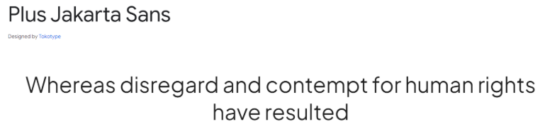

#### Colores:
En cuanto a nuestra paleta de colores, esta consta únicamente de 2, los cuales son un azul(#5766F5) y un verde con un matiz claro(#1EC089).

#### Margin:
Se optó por hacer uso de margin de elementos pequeños: verticalmente: 32px, horizontalmente 32px y para elementos grandes: verticalmente: 32px, horizontalmente 48px.

#### Responsive y breakpoints:
Teniendo en cuenta que todos los diseños tienen que ser responsive nosotros optamos por definir los siguiente breakpoints, mimos que los podrias etiquetar como:
- sm: pantallas menores a 640px.
- lg: pantallas menores a 1024px.
- xl: pantallas menores a 1280px.

### 6.1.2. Web, Mobile & Devices Style Guidelines.
#### 6.1.2.1. Web & Devices Style Guidelines.
Como se mencionó anteriormente se buscó que la landing fuese mucho más limpia por lo que el navbar no tiene iconos y el margin de 40px entre elementos ul y li mejora la UI.

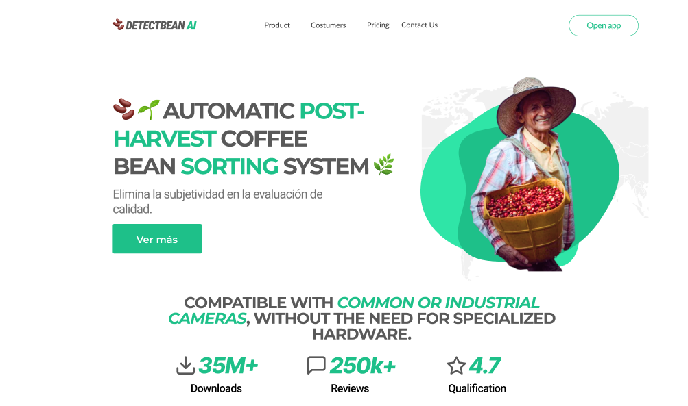

Se tiene a su vez un un article con algunas características acerca de nuestro producto.

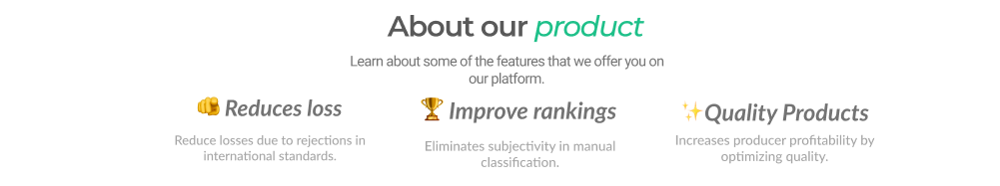

En la sección de Costumers presentamos un article con las opiniones de algunos de nuestros clientes con los que ya hayamos trabajado.

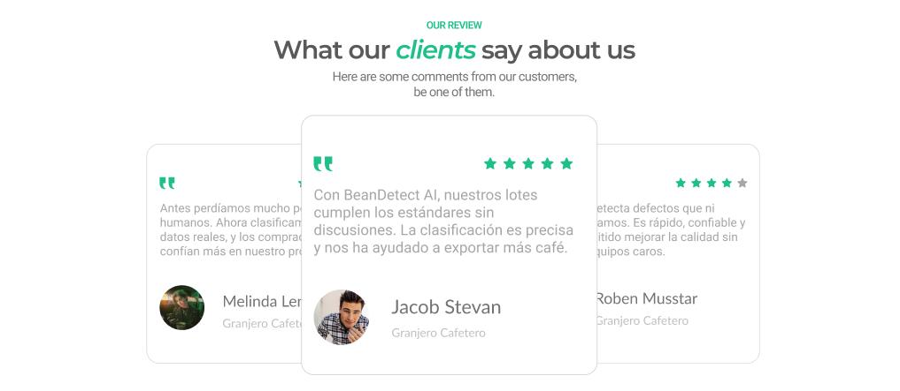

Y finalmente se puede ver un article en la sección de pricing con algunos de nuestros planes de suscripción. Sin olvidar otro article con información acerca de donde nos encontramos e información de contacto y el footer.

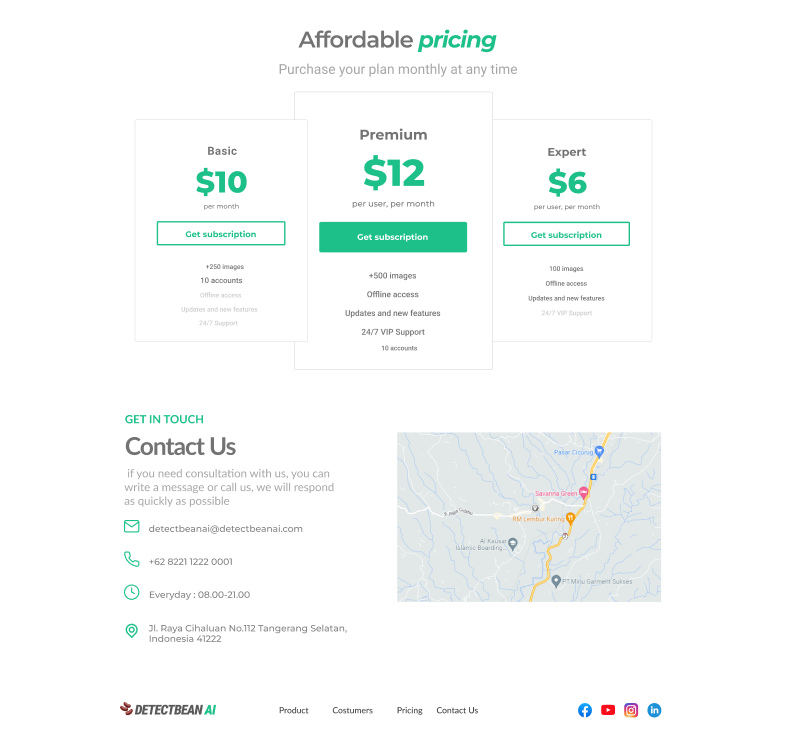

Importante: la web está diseñada a su vez para ser responsive, con plena compatibilidad con Android y IOS.

#### 6.1.2.2. Mobile & Devices Style Guidelines.

## 6.2. Information Architecture.
En lo referente a la organización visual del contenido, se optará por aplicar el patrón de jerarquía visual para estructurar las secciones. La relevancia de las oraciones se determinará según el tamaño de la fuente, siendo las frases u oraciones de 48px (3 rem) las más destacadas, seguidas por aquellas de 32px (2 rem), luego 24px (1.5 rem), y finalmente 16px (1 rem). Además, se implementará una organización matricial ordenada para presentar las características del producto y los planes de pago.  

En otro aspecto, en cuanto a los esquemas de categorización, se empleará la categorización basada en la audiencia, dado que se cuenta con dos segmentos objetivo diferentes. Adicionalmente, se utilizará la categorización cronológica para el registro de entradas, especialmente cuando los usuarios accedan a bases de datos con información temporal. En este caso, las entradas más recientes tendrán prioridad y se mostrarán al principio para facilitar la visualización del contenido en orden temporal.

### 6.2.2. Labeling Systems.
En el landing page, hemos optado por reducir el uso de iconos representativos en los enlaces y, en su lugar, dar prioridad al texto con botones destacados. Esto nos permite mantener la estética minimalista del landing page. Además, hemos incluido iconos de colores para identificar nuestras redes sociales y otros elementos.

- Navbar:
  
- Socialmedia icons:


### 6.2.3. Searching Systems.
La aplicación contará con un sistema de filtros por fecha en los registros de clasificación post-cosecha, permitiendo a los usuarios buscar y visualizar resultados según fechas específicas. Esto facilitará el seguimiento histórico de lotes y la trazabilidad de cada proceso.

Además, se implementarán filtros por pestañas en los siguientes casos:

- Para productores: podrán consultar sus lotes clasificados según el estado, como “En análisis”, “Clasificado” o “Listo para exportación”. Esto les permitirá visualizar rápidamente el avance de sus procesos y tomar decisiones informadas.

- Para técnicos de calidad o cooperativas: dentro de cada lote, podrán revisar el estado de los granos en etapas como “En revisión”, “Con defectos detectados”, “Aprobado”.


### 6.2.4. SEO Tags and Meta Tags.
- Landing Page: 
```html
<meta charset="UTF-8">
<meta http-equiv="X-UA-Compatible" content="IE=edge">
<meta name="viewport" content="width=device-width, initial-scale=1.0">
<meta name="robots" content="index, follow">
<link rel="shortcut icon" href="./images/favicon.png" type="image/x-icon">
<title>BeanDetect AI | Clasificación Inteligente de Café</title>
<meta name="keywords" content="DevBeans, BeanDetect AI, clasificación de café, inteligencia artificial, visión por computadora, calidad de café, trazabilidad, post-cosecha, café de exportación, defectos de grano, sostenibilidad cafetalera">
<meta name="description" content="BeanDetect AI es una solución basada en inteligencia artificial para clasificar granos de café post-cosecha con precisión, reduciendo pérdidas y mejorando la rentabilidad de productores pequeños y medianos.">
```

- Web Application: 
```html
<meta charset="UTF-8">
<meta http-equiv="X-UA-Compatible" content="IE=edge">
<meta name="viewport" content="width=device-width, initial-scale=1.0">
<meta name="robots" content="index, follow">
<link rel="shortcut icon" href="./images/favicon.png" type="image/x-icon">
<title>DevBeans App | Panel de Clasificación y Trazabilidad</title>
<meta name="keywords" content="DevBeans App, BeanDetect, clasificación de café, trazabilidad, análisis de calidad, IA cafetera, exportación, defectos de grano, plataforma cafetalera, sostenibilidad">
<meta name="description" content="Accede al panel de DevBeans para visualizar clasificaciones de café, gestionar trazabilidad y conectar con certificaciones. Una herramienta colaborativa para productores y técnicos del sector cafetalero.">
```

### 6.2.5. Navigation Systems.
La estructura de navegación de nuestra aplicación se fundamentará en un componente de interfaz de usuario ampliamente utilizado: el sidebar. Este sidebar contendrá todas las opciones disponibles en la aplicación, organizadas de manera jerárquica. Es importante destacar que el contenido del sidebar variará según el tipo de usuario que acceda a la aplicación.

## 6.3. Landing Page UI Design.
En esta sección, presentamos nuestra propuesta de diseño de interfaz de usuario (UI) para el Landing Page. Explicamos cómo traducimos nuestras decisiones de diseño y arquitectura de información en una experiencia visualmente atractiva y funcional. El Landing Page es la primera impresión de nuestro sitio web, por lo que es crucial que refleje nuestra marca, comunique claramente nuestros mensajes clave y guíe a los usuarios hacia las acciones deseadas. Destacaremos los principios de diseño y consideraciones estratégicas que hemos utilizado para crear una experiencia de usuario efectiva y memorable.

### 6.3.1. Landing Page Wireframe.
Enlace de figma: https://www.figma.com/design/ockCQUwKAM1FR422KyQtyB/DETECT-BEAN-AI?node-id=0-1&t=vedLmHFdBBNAiSda-1

#### 6.3.1.1. Landing Page Wireframe - Web version
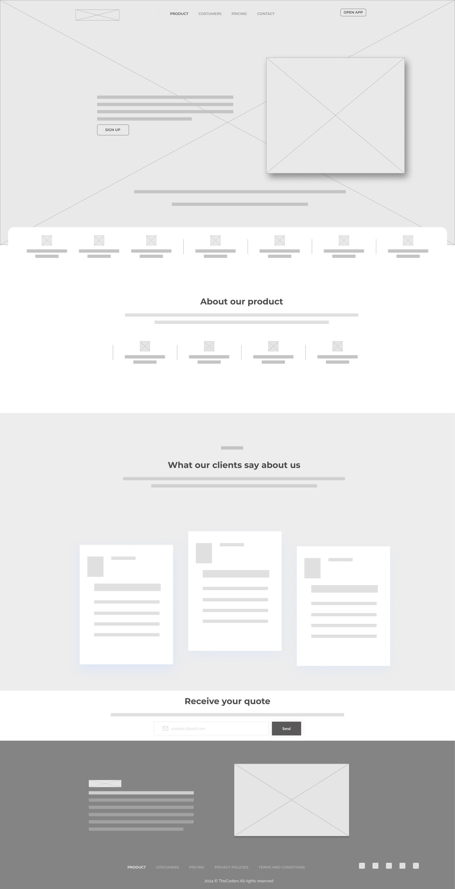

#### 6.3.1.2. Landing Page Wireframe - Mobile version
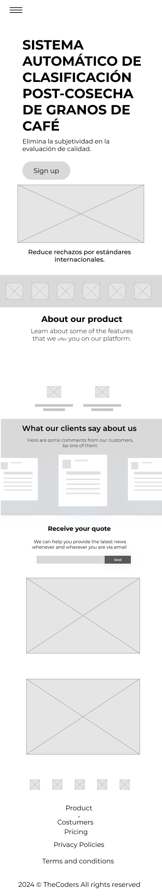

### 6.3.2. Landing Page Mock-up.
Enlace de figma: https://www.figma.com/design/ockCQUwKAM1FR422KyQtyB/DETECT-BEAN-AI?node-id=0-1&t=vedLmHFdBBNAiSda-1

#### 6.3.2.1. Landing Page Mock-up - Web version
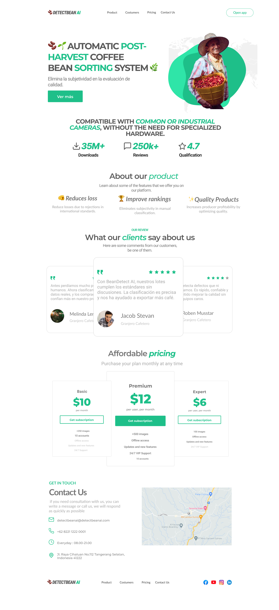

#### 6.3.2.2. Landing Page Mock-up - Mobile version
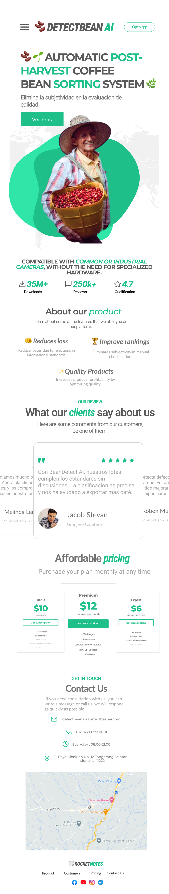

## 6.4. Applications UX/UI Design.

### 6.4.1. Applications Wireframes.

Los wireframes de la aplicación fueron desarrollados utilizando la herramienta Figma en el siguiente enlace:
https://www.figma.com/design/g2Q08oeYK9nbmza7fBzN21/Dev-Beans?node-id=1-2

**Wireframe 1: Registro de usuarios**

[](https://postimg.cc/1nMTyNch)

La imagen muestra la pantalla de registro para cooperativas cafetaleras. El formulario solicita datos clave como nombre de la cooperativa, representante legal, número de asociados, correo electrónico, teléfono y contraseña. El diseño es claro y accesible, facilitando el alta de nuevas organizaciones en la plataforma. Además tendra una barra conformada por dos botones seleccionables para acceder al registro del otro tipo de usuario.<br>

**Wireframe 2: Inicio de sesión**

[](https://postimg.cc/TLQSTWq8)

Esta imagen corresponde a la pantalla de inicio de sesión. Permite a productores y cooperativas acceder a sus cuentas ingresando correo electrónico y contraseña. Incluye opciones para recuperación de contraseña y registro, priorizando la simplicidad y seguridad.<br>

**Wireframe 3: Dashboard**

[](https://postimg.cc/wyFP9s5S)

La imagen presenta el dashboard principal de la aplicación. Aquí los usuarios visualizan métricas clave como cantidad de lotes, calidad promedio, lotes listos para exportar y defectos críticos detectados. El dashboard ofrece accesos rápidos a las principales funcionalidades y se adapta según el tipo de usuario.<br>

**Wireframe 4: Coffee Lot Management**

[](https://postimg.cc/ZBjgJyP2)

Esta pantalla muestra la sección de gestión de lotes de café. Los usuarios pueden ver la lista de lotes registrados, su estado (pendiente, clasificado, certificado), fechas y acceder a acciones como editar, eliminar o iniciar clasificación. La interfaz facilita el seguimiento y organización de la producción.<br>

**Wireframe 5: Adding Coffee Lot**

[](https://postimg.cc/WFSKsJm9)

Esta pantalla muestra el form de creación de un nuevo lote de granos de café para su consecuente clasificación automática.<br>

**Wireframe 6: Reporting & Analytics**

[](https://postimg.cc/Vr4Tzb92)

La imagen corresponde a la sección de reportes, donde se generan y visualizan informes de clasificación, calidad y trazabilidad. Los usuarios pueden descargar reportes, analizar tendencias históricas y comparar resultados entre lotes o productores.<br>

**Wireframe 7: Settings**

[](https://postimg.cc/hzMwK78w)

Esta pantalla muestra la sección de ajustes de la aplicación. Permite modificar información personal, cambiar contraseña, configurar preferencias de idioma y notificaciones, y gestionar opciones avanzadas como integración con sistemas externos.<br>


### 6.4.2. Applications Wireflow Diagrams.

Esta sección presenta la propuesta de Wireflows para la aplicación, diseñados para visualizar de manera clara y secuencial los pasos que sigue un usuario para alcanzar un objetivo específico (User goal) dentro del sistema. Para cada User goal relevante, se ha considerado el User Persona correspondiente y se ha elaborado un Wireflow que ilustra la ruta típica de interacción, mostrando cómo las acciones del usuario provocan cambios en las pantallas (Wireframes) y el estado de la aplicación.

### User Goal 1: Registrar y autenticar cuenta

**Flujo:** El usuario accede al login, selecciona "Regístrate aquí", completa el formulario de cooperativa (nombre, correo, teléfono, NIT, ubicación, representante legal, contraseñas), valida que coincidan las contraseñas, presiona "Crear Cuenta de Cooperativa", y el sistema redirige al login para autenticación. Tras ingresar credenciales, accede al Dashboard con métricas de lotes, calidad y defectos.

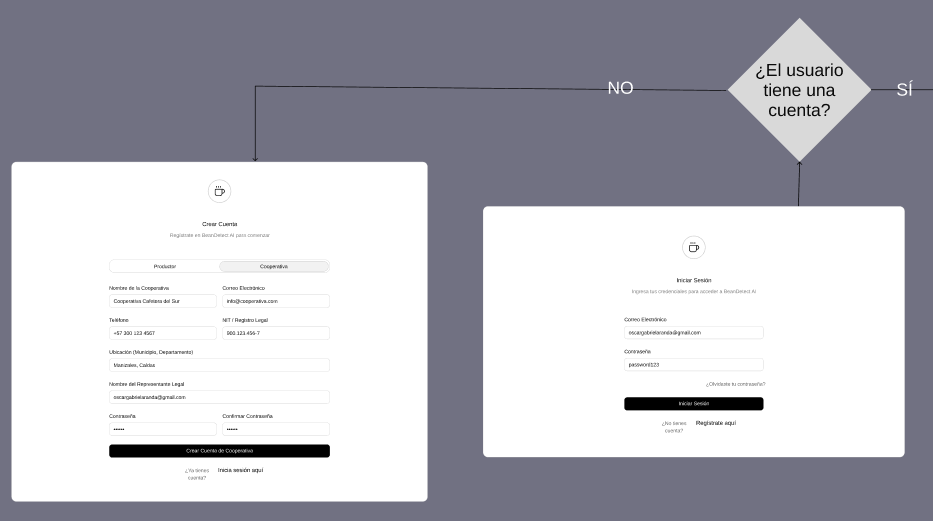

**Interacciones clave:** Toggle Productor/Cooperativa, validación de contraseñas coincidentes, botón de acción naranja, redirección automática post-registro.

***

### User Goal 2: Gestionar lotes de café

**Flujo:** Desde el Dashboard, el usuario visualiza métricas (24 lotes, 85.5% calidad promedio) y lotes recientes. Navega a "Lotes" en el menú lateral, donde ve una tabla con ID, fecha, peso, variedad, proceso, calidad y estado. Usa la barra de búsqueda para filtrar o presiona "+ Nuevo Lote" para crear uno. Completa campos y guarda. Puede ver detalles, editar o eliminar mediante iconos de acción en cada fila.

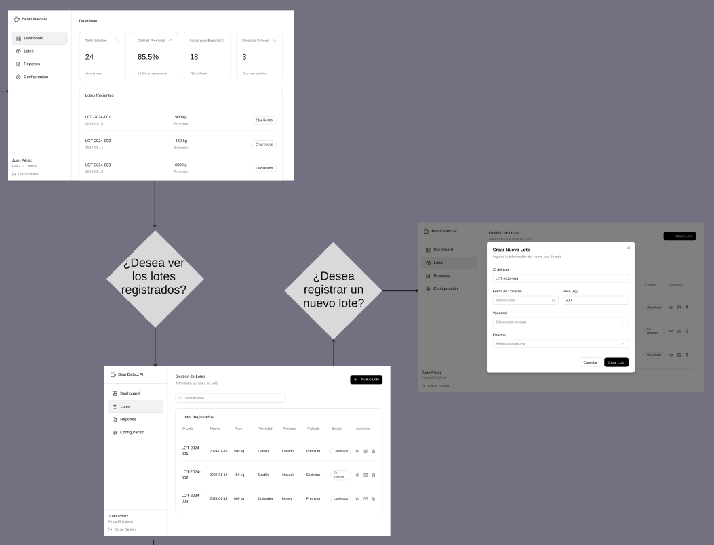

**Interacciones clave:** Tabla interactiva con badges de estado (verde/amarillo), barra de búsqueda, botones de acción por fila, formulario modal de creación.

***

### User Goal 3: Consultar reportes y certificados

**Flujo:** El usuario accede a "Reportes" y visualiza tres secciones: Distribución de Calidad (Premium 45%, Estándar 35%, Básico 20%), Análisis de Defectos (granos negros: 2 lotes, granos partidos: 5 lotes), y Certificados de Exportación (LOT-2024-001, 003, 005). Puede "Ver QR" o "Descargar" certificados. Al final revisa recomendaciones del sistema sobre proceso de secado y selección manual.

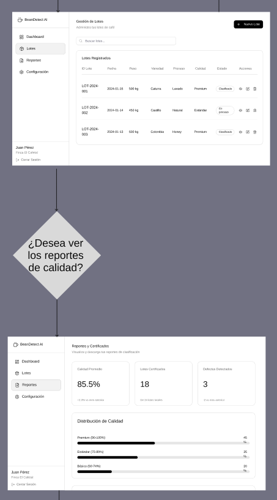

**Interacciones clave:** Gráficos de barras horizontales, alertas con íconos de severidad, botones Ver QR/Descargar, lista de recomendaciones.

***

### User Goal 4: Configurar perfil y notificaciones

**Flujo:** El usuario accede a "Configuración" y actualiza Información Personal (nombre, correo, teléfono, ubicación). Presiona "Guardar Cambios". En Notificaciones, activa/desactiva toggles de Email, WhatsApp y Alertas de Clasificación (guardado automático). En Seguridad, ingresa contraseña actual, nueva contraseña y confirmación, luego actualiza (requiere reinicio de sesión).

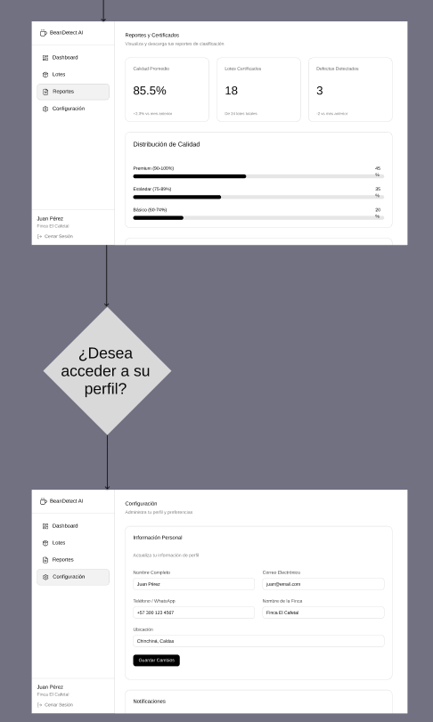

**Interacciones clave:** Formularios editables, toggles de notificación con guardado automático, validación de contraseñas, botón de guardado para información personal.


### 6.4.3. Application Mock-ups.
#### Login
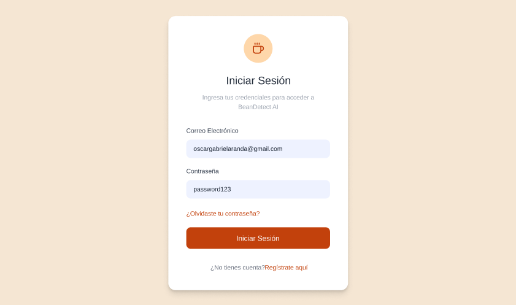

#### Register
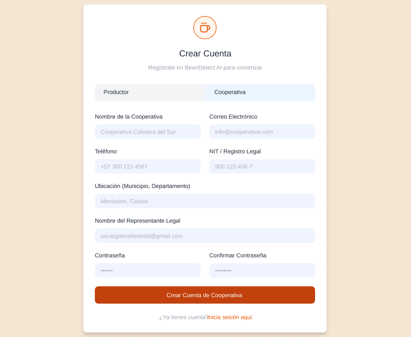

#### Main dashboard
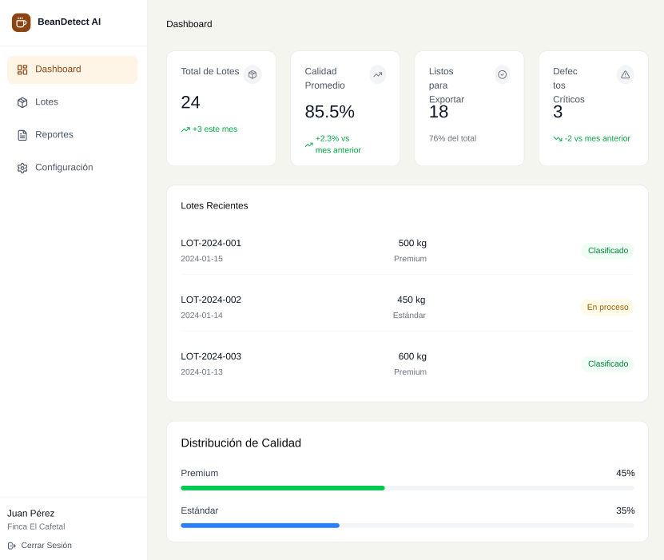

#### Lotes
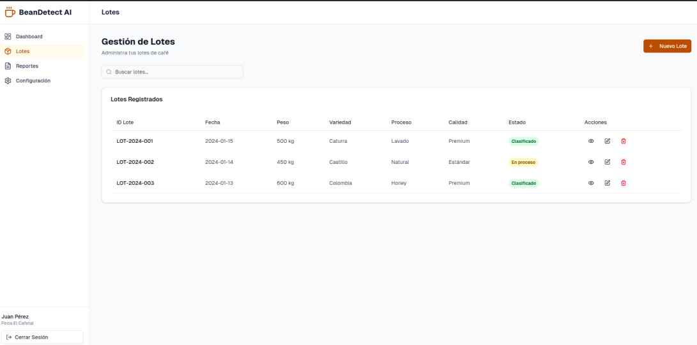

#### Reportes
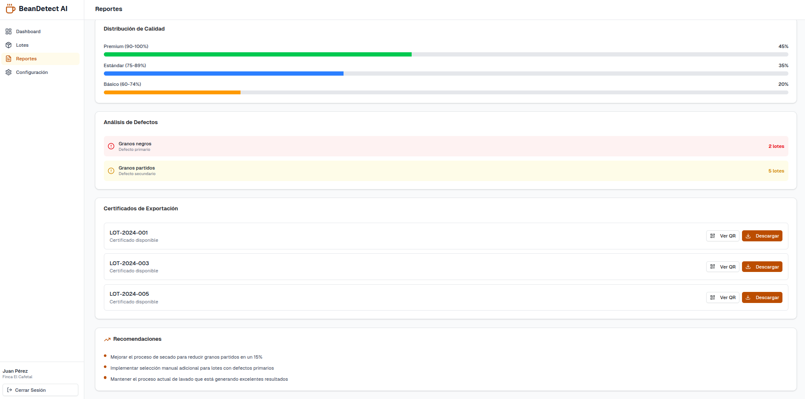

#### Configuraciones
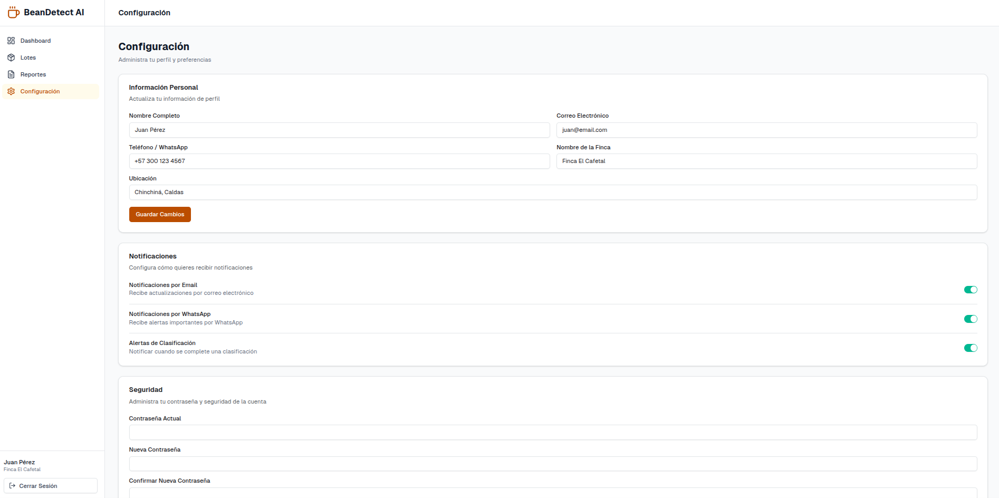

### 6.4.4. Applications User Flow Diagrams.
### User Flow 1: Registro e inicio de sesión

**Happy Path:**
Usuario llega a login → Clic en "Regístrate aquí" → Selecciona tab "Cooperativa" → Completa campos (cooperativa, correo, teléfono, NIT, ubicación, representante, contraseñas) → Contraseñas coinciden → Presiona "Crear Cuenta de Cooperativa" → Sistema registra y redirige a login → Ingresa credenciales → Accede al Dashboard.

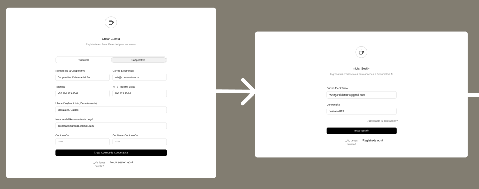

**Unhappy Paths:**
- Contraseñas no coinciden: error bajo campo "Confirmar Contraseña"
- Email ya registrado: alerta con sugerencia de ir a login
- Campos incompletos: marca campos vacíos en rojo
- Credenciales incorrectas: mensaje de error con opción "¿Olvidaste tu contraseña?"

---

### User Flow 2: Gestión de lotes

**Happy Path:**
Usuario en Dashboard ve métricas → Clic en "Lotes" → Visualiza tabla completa → Presiona "+ Nuevo Lote" → Completa formulario (ID, fecha, peso, variedad, proceso) → Guarda → Sistema actualiza tabla con nuevo lote → Usuario busca lotes específicos → Clic en ícono "ojo" para ver detalles completos.

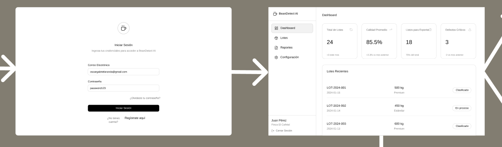

**Unhappy Paths:**
- Búsqueda sin resultados: "No se encontraron lotes"
- Error al guardar: alerta de reintento
- Campos incompletos: bloqueo de guardado
- Eliminación: confirmación "¿Está seguro?"

***

### User Flow 3: Reportes y certificados

**Happy Path:**
Usuario en Dashboard → Clic en "Reportes" → Visualiza Distribución de Calidad con porcentajes → Scroll a Análisis de Defectos → Identifica defectos primarios/secundarios → Scroll a Certificados → Clic en "Ver QR" para LOT-2024-001 → Modal con código QR → Cierra modal → Clic en "Descargar" para LOT-2024-003 → PDF descargado → Revisa recomendaciones del sistema.

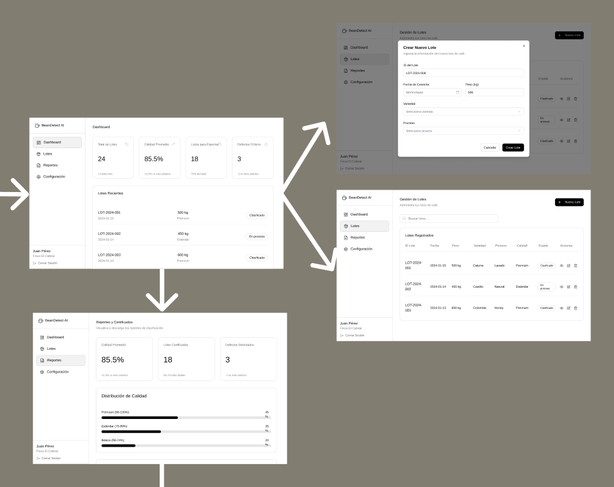

**Unhappy Paths:**
- Sin certificados: "No hay certificados disponibles aún"
- Error al descargar: alerta de reintento
- Defectos críticos altos: alerta roja "Acción requerida"
- Datos insuficientes: "Registre más lotes para análisis"

***

### User Flow 4: Configuración de perfil

**Happy Path:**
Usuario → Clic en "Configuración" → Edita nombre y teléfono en Información Personal → Presiona "Guardar Cambios" → Confirmación exitosa → Activa toggles de notificaciones (guardado automático) → Ingresa contraseña actual en Seguridad → Escribe nueva contraseña → Confirma nueva contraseña → Actualiza → Sistema confirma y solicita reinicio de sesión.

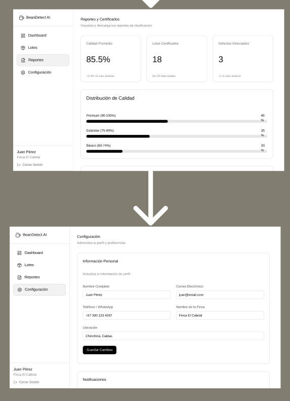

**Unhappy Paths:**
- Contraseña actual incorrecta: error "Contraseña incorrecta"
- Contraseñas nuevas no coinciden: error de validación
- Email inválido: "Ingrese correo válido"
- Error de conexión: "Verifique su conexión"
- Contraseña débil: "Mínimo 8 caracteres"

## 6.5. Application Prototyping. 
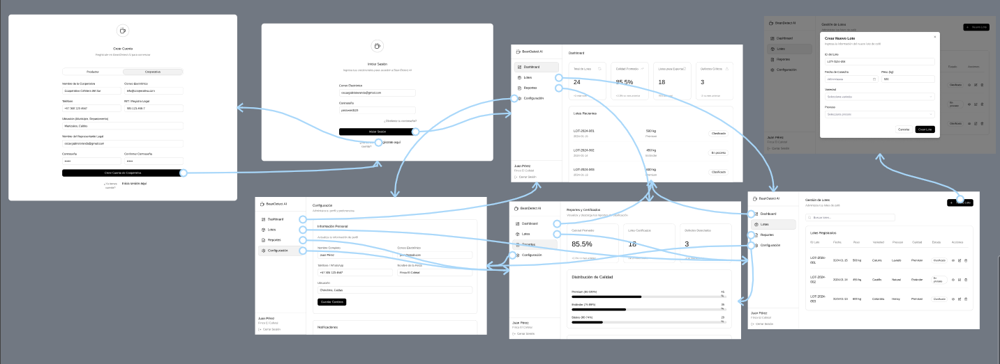

URL del prototipo:   
https://www.figma.com/proto/g2Q08oeYK9nbmza7fBzN21/Dev-Beans?node-id=1-3&t=NDgiyFs4mZ0vjUCf-1

---
# Capítulo VII: Product Implementation, Validation & Deployment 
## 7.1. Software Configuration Management
### 7.1.1. Software Development Environment Configuration
A continuación, describiremos los productos de software que hemos empleado durante el desarrollo del proyecto.

#### Project Management

  * Trello: https://trello.com/  
La plataforma de Trello se empleó para la gestión de las tareas y la organización del flujo del trabajo en el proyecto. Presentándose las tareas dentro de las tarjetas en listas con el integrante encargado de realizarlas. Además, utilizamos las funcionalidades como agregar las etiquetas de colores y marcar el proceso de las tareas. De esta manera pudimos hacer seguimiento a nuestros avances en el proyecto.
  * Notion: https://www.notion.so/  
La plataforma de Notion fue utilizada para la colaboración de los integrantes con el proyecto. Se crearon calendarios y listas con las fechas de las reuniones del equipo. Además, se hizo uso de herramientas como comentarios y menciones para fomentar el trabajo y colaboración en equipo.

#### Requirements Management
  * Trello: https://trello.com/  
Empleamos Trello para organizar los requisitos de la aplicación. En el que tenemos al product backlog el cual ordenamos según la prioridad aplicando Fibonacci para enumerar las historias de usuario y en otra sección organizándolas según las épicas.

* Product UX/UI Design
  * Figma: https://www.figma.com/  
La plataforma de Figma nos ayudó a desarrollar los wireframes, mockups y prototyping del mobile applications.
  * Miro: https://miro.com/es/  
Miro nos fue de utilidad para poder realizar los As-Is Scenario Mapping y  To-Be Scenraio Mapping para cada uno de los segmentos objetivos.
  * UXPressia: https://uxpressia.com/  
La plataforma UXPressia se empleó para la creación de los User Personas, Empathy Maps, Journey Maps e Impact Maps. Hemos hecho uso de las plantillas que UXPressia nos ofrece para elaborar cada una de ellas. Nos permitió exportar lo que se realizó para incluirlo en el trabajo.

#### Software Development

  * Landing Page:  
Para el desarrollo de la landing page se hará empleó de HTML5, CSS y JavaScript.
  * Frontend Web Application:  
Para desarrollar la aplicación web frontend, es esencial tener una comprensión sólida de los fundamentos de HTML, CSS y JavaScript. En nuestro caso, optamos por utilizar React como framework de JavaScript.
  * Api Application:  
Para desarrollar el backend utilizamos Python con FastApi junto a librerias como Tensorflow y Cloudinary para integración del modelo de ml y persistencia de imágenes en la nube.
   * Software Testing
Para las pruebas de este print utilizamos integration test y de aceptación (BDD). Para ello empleamos PyTest y Gherkin.

#### Software Deployment
  * Netlify: https://www.netlify.com/  
Para implementar el despliegue de la Landing Page, se llevó a cabo la conexión entre el repositorio de Github y Netlify. Esto permite que Netlify maneje automáticamente la implementación de la Landing Page cada vez que se realice una actualización en el repositorio. De igual manera con el frontend.
 * Azure App Service: https://azure.microsoft.com/en-us/services/app-service/  
Para el despliegue del backend de la aplicación, se utilizó Azure App Service como plataforma de alojamiento en la nube. Esta solución permite desplegar la API REST desarrollada en Spring Boot de manera automática desde el repositorio de GitHub mediante GitHub Actions. Azure App Service proporciona escalabilidad automática, gestión de certificados SSL/TLS, monitoreo integrado y bases de datos administradas (Azure Database for PostgreSQL), lo que garantiza alta disponibilidad y seguridad para la API de clasificación de granos de café.

  * Configuración de CI/CD Pipeline en Azure:
    - Trigger automático al hacer push a rama `main` en repositorio `api-platform`
    - Build automático con Maven/Gradle
    - Ejecución de tests unitarios e integración
    - Despliegue a staging para validación
    - Promoción a producción tras validación exitosa
    - Rollback automático si métricas de salud fallan

  * Monitoreo y Logs:
    - Application Insights para rastreo de performance
    - Azure Monitor para alertas de disponibilidad
    - Log Analytics para auditoría y debugging
    - Dashboards personalizados para métricas clave (latencia API, tasa de error, uso de BD)

#### Software Documentation
  * Google Drive: https://www.google.com/intl/es-419_pe/drive/  
Esta plataforma fue empleada para crear documentos mediante Google Docs, el cual nos permite trabajar de manera colaborativa los informes de las entregas.
  * Structurizr: https://structurizr.com/  
Herramienta utilizada para la creación de diagramas C4 (diagrama de contexto, diagrama de contenedor y diagrama de componentes). Para elaborar los diagramas fue necesario utilizar una sintaxis parecida a un lenguaje de programación.
  * GitHub: https://github.com/  
Plataforma empleada tanto como para la creación de la documentación y de la Landing page. Nuestro eligió esta plataforma debido a que nos permite trabajar de manera colaborativa.

### 7.1.2. Source Code Management
La administración y estructuración de las múltiples modificaciones se realizaron mediante la creación de un repositorio en GitHub para el proyecto. Nuestra organización se estructuró de la siguiente manera:

* Organización: [https://github.com/upc-pre-202520-1asi0728-7291-DevBeans ](https://github.com/upc-pre-202520-1asi0728-7291-DevBeans)
* Repositorio de la Landing page: [https://dev-beans-landing-page.netlify.app ](https://dev-beans-landing-page.netlify.app)

Además, con el objetivo de mejorar el control sobre la creación de ramas y la implementación de cambios en el código fuente, se procedió a utilizar Gitflow.

De esta forma, se establecieron 2 ramas principales: main y develop.

#### Ramas principales:  
  * Rama “main”:  
  En esta rama se almacenan las versiones oficiales de nuestro repositorio para pasarlas a producción.
  * Rama “develop”:  
  Esta rama se utilizará como punto de integración para las ramas de “feature”. Una vez que el  “head” sea estable y el equipo lo considere listo para el lanzamiento, se fusionará con la rama “release”.

#### Ramas auxiliares:  
  * Rama “release”:  
  La rama “release” se emplea para la preparación del lanzamiento de una nueva versión en la rama “main” ayudando a controlar las versiones de código. Aquí se pueden solucionar errores menores y preparar los datos para la versión. Esta rama permitirá liberar a la rama “develop” de estas tareas preparatorias y evita demoras en el desarrollo mientras se prepara para el lanzamiento. 
  * Rama “feature”:  
  En las ramas “feature” se desarrollan las características generales que se integrarán en la rama “develop”. Estas características son aquellas funcionalidades solicitadas por los usuarios tanto en la página de inicio como en la aplicación web. Por ejemplo, la rama feature/navbar.
  * Rama “hotfix”:  
  Esta rama se utiliza para corregir urgentemente errores en la última versión de la rama “main” que no pueden esperar hasta el próximo lanzamiento para ser solucionados.

### 7.1.3. Source Code Style Guide & Conventions
Utilizaremos el lenguaje de etiquetas HTML para el desarrollo principal de nuestra Landing page.
* Utilizaremos el lenguaje CSS, que nos permitirá realizar los estilos de la estructura de nuestra Landing Page
* Implementaremos el lenguaje de JavaScript para brindar las funcionalidades a nuestra Landing page. 
* Utilizaremos el lenguaje Gherkin que se usará para realizar los diseños de prueba de cada historia de usuario, contando con su estructura básica. 

#### Convenciones de Commits:  
Nuestro equipo de desarrollo sigue las Convenciones de Commits, adoptando el formato de los “Conventional Commits” en su versión 1.0.0 (disponible en https://www.conventionalcommits.org/en/v1.0.0/) para garantizar una fácil comprensión de nuestros registros. Por lo tanto, nos regimos por la siguiente estructura:

Donde:

```<type>[scope opcional]: <description>```

  * type: Indica el tipo de modificación realizada, limitado a opciones como feat, fix, docs, etc.
  * scope: Define el alcance del cambio realizado en nuestro código.
  * descripción: Ofrece un resumen conciso de los cambios implementados.

#### Convenciones de versionado de lanzamientos
Para la gestión de versiones, seguimos el estándar “Semantic Versioning 2.0.0”. En este formato las versiones se presentan como (X.Y.Z), con las siguientes interpretaciones: 
  * X: Indica una versión principal que incorpora cambios incompatibles con versiones anteriores. Iniciamos en 0 durante la etapa de desarrollo inicial y transicionamos a 1 cuando la versión esté lista para su lanzamiento público. Por convención, Y y Z se reinician a 0 cuando X aumenta.
  * Y: Representa una versión secundaria, que abarca cambios compatibles con versiones anteriores. Además, esta incluye los commits provenientes de las “release branches” cada vez que se agregan nuevas funcionalidades. Convencionalmente, Z se reinicia a 0 cuando Y aumenta.
  * Z: Refleja parches y correcciones de errores menores, integrando commits realizados en la “rama de corrección” y fusionados con la rama principal.

### 7.1.4. Software Deployment Configuration
#### Acceder a Netlify y seleccionar “Import an existing project”
Ingresa a la plataforma de Netlify con tu cuenta activa. Una vez dentro del panel principal, dirígete a la opción “Import an existing project”, que permite iniciar el proceso de despliegue de un proyecto previamente desarrollado y alojado en un repositorio externo.

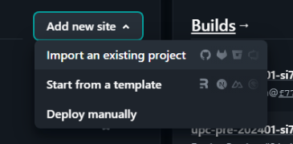

#### Elegir la opción “Deploy with GitHub” para vincular el repositorio
En el siguiente paso, selecciona “Deploy with GitHub” para conectar tu cuenta de GitHub con Netlify. Esta integración permite importar directamente el código fuente desde el repositorio que contiene tu proyecto.

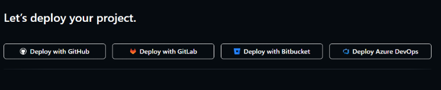

####  Seleccionar la organización y el repositorio correspondiente
Una vez vinculada la cuenta, el sistema mostrará las organizaciones disponibles. Selecciona la organización adecuada y dentro de ella, busca el repositorio específico del proyecto que deseas subir a producción. Luego, configura los parámetros necesarios para el despliegue, como la rama principal, comandos de build y directorio de salida.

#### Iniciar el despliegue presionando el botón del proyecto
Finalmente, revisa la configuración y presiona el botón que lleva el nombre del proyecto para iniciar el proceso de despliegue. Netlify comenzará a compilar y publicar tu aplicación automáticamente en la web.


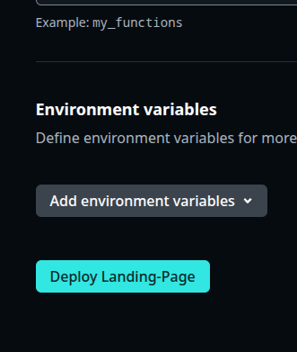

### Link de nuestra landing page: https://dev-beans-landing-page.netlify.app/


---

Completaré las secciones faltantes del Capítulo VII basándome en el ejemplo proporcionado y adaptándolo al proyecto DevBeans - BeanDetect AI.

---

## 7.2. Solution Implementation

### 7.2.1. Sprint 1

#### 7.2.1.1. Sprint Planning 1

**Introducción**  
Este sprint se orientó a entregar el 90% de nuestro backend desplegado conectado al frontend de la aplicación web junto al modelo de machine learning integrado en nuestro backend de Python.

<!-- Sprint Planning Background (formato de la rúbrica) -->
<table>
  <thead>
    <tr><th colspan="2">Sprint #</th><th>Sprint 1</th></tr>
  </thead>
  <tbody>
    <tr><td colspan="2"><strong>Sprint Planning Background</strong></td><td></td></tr>
    <tr><td>Date</td><td>2025-11-10</td><td>2025-11-10</td></tr>
    <tr><td>Time</td><td>21:00</td><td>22:00</td></tr>
    <tr><td>Location</td><td>(física/virtual)</td><td>Virtual (Google Meet)</td></tr>
    <tr>
      <td>Prepared By</td><td>(Responsable del acta)</td>
      <td>Aranda Vallejos, Oscar Gabriel</td>
    </tr>
    <tr>
      <td>Attendees (to planning meeting)</td>
      <td>(Equipo)</td>
      <td>
        Aranda Vallejos, Oscar Gabriel <br> Ayquipa Ubaldo, Abraham Israel <br> 
        La Torre Soto, Andre Sebastian <br> Ventura Chancafe, Eduardo Renato
      </td>
    </tr>
    <tr>
      <td colspan="3"><strong>Sprint 1 – Review Summary</strong><br/><em>No aplica (proyecto inicia en Sprint 1).</em></td>
    </tr>
    <tr>
      <td colspan="3"><strong>Sprint 1 – Retrospective Summary</strong><br/><em>No aplica (proyecto inicia en Sprint 1).</em></td>
    </tr>
    <tr><td colspan="3"><strong>Sprint Goal & User Stories</strong></td></tr>
    <tr>
      <td>Sprint 1 Goal</td>
      <td>(SMART)</td>
      <td>
        Entregar la <strong>v1 navegable</strong> de: 
        (1) Landing Page desplegada en Netlify, 
        (2) Frontend Web con navegación base y pantallas de Login, Dashboard, Gestión de Lotes y Reportes; 
        evidenciar navegación y despliegues funcionales.
      </td>
    </tr>
    <tr><td>Sprint 1 Velocity</td><td>(Story Points)</td><td><strong>37 SP</strong></td>
   </tr>
   <tr>
      <td>Sum of Story Points</td>
      <td>(US incluidos)</td>
      <td><strong>37 SP</strong> <br> 
      US01=3, US02=3, US03=2,
      US04=2, US06=2, US07=2, <br>
      US08=3, US10=2, US11=2,  
      US13=5, US14=8, US15=3
      </td>
   </tr>
  </tbody>
</table>

---

#### 7.2.1.2. Sprint Backlog 1

Durante este sprint inicial, nos enfocamos en desarrollar las user stories que definen las características clave de nuestra aplicación. Esto nos permitió validar la arquitectura propuesta y completar nuestro core business.

**URL pública de Trello:** <https://trello.com/b/8vVjQ1I6/devbeans>

[](https://postimg.cc/xXH05FNW)

<table>
    <thead>
        <tr>
            <td>Sprint #</td>
            <td colspan="7">Sprint 1</td>
        </tr>
        <tr>
            <td colspan="2">User Story</td>
            <td colspan="6">Work-Item / Task</td>
        </tr>
    </thead>
    <tbody>
      <tr>
        <td>Id</td>
        <td>Title</td>
        <td>Id</td>
        <td>Title</td>
        <td>Description</td>
        <td>Estimation (Hours)</td>
        <td>Assigned To</td>
        <td>Status (To-do / In-Process / To-Review / Done)</td>
      </tr>
  <tr>
    <td>US01</td>
    <td>Registro de Productor Pequeño/Mediano</td>
    <td>TA1</td>
    <td>Diseñar formulario de registro</td>
    <td>Definir campos obligatorios: nombre, email, contraseña, ubicación, hectáreas, variedad</td>
    <td>03</td>
    <td>Oscar Aranda</td>
    <td>Done</td>
  </tr>
  <tr>
    <td></td><td></td>
    <td>TA2</td>
    <td>Implementar validaciones frontend</td>
    <td>Validación de formato email, campos requeridos, verificación de email duplicado</td>
    <td>04</td>
    <td>Oscar Aranda</td>
    <td>Done</td>
  </tr>
  <tr>
    <td>US02</td>
    <td>Registro de Cooperativa Cafetalera</td>
    <td>TA1</td>
    <td>Diseñar formulario de cooperativa</td>
    <td>Campos específicos: nombre cooperativa, RUC, representante legal, número de asociados</td>
    <td>03</td>
    <td>Abraham Ayquipa</td>
    <td>Done</td>
  </tr>
  <tr>
    <td></td><td></td>
    <td>TA2</td>
    <td>Implementar toggle Productor/Cooperativa</td>
    <td>Funcionalidad de cambio dinámico entre tipos de registro con validaciones específicas</td>
    <td>03</td>
    <td>Abraham Ayquipa</td>
    <td>Done</td>
  </tr>
  <tr>
    <td></td><td></td>
    <td>TA3</td>
    <td>Validación de RUC</td>
    <td>Verificar formato de 11 dígitos y unicidad en el sistema</td>
    <td>02</td>
    <td>Abraham Ayquipa</td>
    <td>Done</td>
  </tr>
  <tr>
    <td>US03</td>
    <td>Autenticación de Usuarios</td>
    <td>TA1</td>
    <td>Diseñar pantalla de login</td>
    <td>Interfaz simple con campos email y contraseña, opción "Recordarme"</td>
    <td>02</td>
    <td>Andre La Torre</td>
    <td>Done</td>
  </tr>
  <tr>
    <td></td><td></td>
    <td>TA2</td>
    <td>Implementar lógica de autenticación</td>
    <td>Validación de credenciales, redirección según rol (productor/cooperativa), manejo de errores</td>
    <td>04</td>
    <td>Andre La Torre</td>
    <td>Done</td>
  </tr>
  <tr>
    <td></td><td></td>
    <td>TA3</td>
    <td>Sistema de bloqueo temporal</td>
    <td>Bloquear cuenta tras 5 intentos fallidos por 15 minutos, envío de notificación por correo</td>
    <td>03</td>
    <td>Andre La Torre</td>
    <td>To Review</td>
  </tr>
  <tr>
    <td>US04</td>
    <td>Gestión de Perfil de Productor</td>
    <td>TA1</td>
    <td>Diseñar vista de configuración</td>
    <td>Secciones: Información Personal, Información de Finca, Variedades Cultivadas</td>
    <td>02</td>
    <td>Eduardo Ventura</td>
    <td>Done</td>
  </tr>
  <tr>
    <td></td><td></td>
    <td>TA2</td>
    <td>Implementar edición de perfil</td>
    <td>Formularios editables con validaciones numéricas (hectáreas, altitud) y de formato</td>
    <td>03</td>
    <td>Eduardo Ventura</td>
    <td>Done</td>
  </tr>
  <tr>
    <td></td><td></td>
    <td>TA3</td>
    <td>Gestión de variedades y foto de perfil</td>
    <td>Agregar/eliminar variedades cultivadas, subir foto de perfil con validación de formato y tamaño</td>
    <td>02</td>
    <td>Eduardo Ventura</td>
    <td>Done</td>
  </tr>
  <tr>
    <td>US06</td>
    <td>Creación de Lotes</td>
    <td>TA1</td>
    <td>Diseñar formulario de nuevo lote</td>
    <td>Campos: fecha cosecha, variedad, cantidad, método procesamiento, coordenadas, altitud</td>
    <td>02</td>
    <td>Oscar Aranda</td>
    <td>Done</td>
  </tr>
  <tr>
    <td></td><td></td>
    <td>TA2</td>
    <td>Implementar validaciones de lote</td>
    <td>Validar fecha no futura, coordenadas válidas (-90 a 90 lat, -180 a 180 lon), altitud 0-5000m</td>
    <td>03</td>
    <td>Oscar Aranda</td>
    <td>Done</td>
  </tr>
  <tr>
    <td></td><td></td>
    <td>TA3</td>
    <td>Generación de código único</td>
    <td>Generar código automático formato LOT-YYYY-NNNN, verificar unicidad</td>
    <td>02</td>
    <td>Oscar Aranda</td>
    <td>Done</td>
  </tr>
  <tr>
    <td>US07</td>
    <td>Edición de Información de Lote</td>
    <td>TA1</td>
    <td>Implementar modo de edición</td>
    <td>Permitir editar campos según estado del lote (REGISTERED permite todo, otros estados restringidos)</td>
    <td>03</td>
    <td>Abraham Ayquipa</td>
    <td>Done</td>
  </tr>
  <tr>
    <td></td><td></td>
    <td>TA2</td>
    <td>Validaciones de edición</td>
    <td>Validar cambios importantes con confirmación, proteger lotes clasificados/certificados</td>
    <td>03</td>
    <td>Abraham Ayquipa</td>
    <td>Done</td>
  </tr>
  <tr>
    <td></td><td></td>
    <td>TA3</td>
    <td>Historial de modificaciones</td>
    <td>Registrar fecha, usuario, campo modificado, valores anterior y nuevo</td>
    <td>02</td>
    <td>Abraham Ayquipa</td>
    <td>To Review</td>
  </tr>
  <tr>
    <td>US08</td>
    <td>Visualización de Lotes por Productor</td>
    <td>TA1</td>
    <td>Diseñar tabla de lotes</td>
    <td>Vista simple con columnas: código, fecha, variedad, cantidad, estado</td>
    <td>02</td>
    <td>Abraham Ayquipa</td>
    <td>Done</td>
  </tr>
  <tr>
    <td></td><td></td>
    <td>TA2</td>
    <td>Implementar filtros</td>
    <td>Filtrado por estado, año de cosecha, ordenamiento por fecha</td>
    <td>03</td>
    <td>Abraham Ayquipa</td>
    <td>Done</td>
  </tr>
  <tr>
    <td></td><td></td>
    <td>TA3</td>
    <td>Resumen estadístico y paginación</td>
    <td>Dashboard con totales, estados, kg totales. Paginación 10 lotes por página</td>
    <td>03</td>
    <td>Abraham Ayquipa</td>
    <td>Done</td>
  </tr>
  <tr>
    <td>US10</td>
    <td>Búsqueda Rápida de Lotes</td>
    <td>TA1</td>
    <td>Implementar barra de búsqueda</td>
    <td>Búsqueda por código de lote, filtros combinados (variedad, método, estado)</td>
    <td>03</td>
    <td>Andre La Torre</td>
    <td>Done</td>
  </tr>
  <tr>
    <td></td><td></td>
    <td>TA2</td>
    <td>Búsqueda por rango de fechas</td>
    <td>Selector de rango, validación de fechas, resultados filtrados</td>
    <td>03</td>
    <td>Andre La Torre</td>
    <td>Done</td>
  </tr>
  <tr>
    <td>US11</td>
    <td>Eliminación de Lotes</td>
    <td>TA1</td>
    <td>Implementar eliminación con restricciones</td>
    <td>Permitir eliminar solo lotes REGISTERED, bloquear lotes procesados/clasificados</td>
    <td>02</td>
    <td>Eduardo Ventura</td>
    <td>Done</td>
  </tr>
  <tr>
    <td></td><td></td>
    <td>TA2</td>
    <td>Confirmación doble y auditoría</td>
    <td>Diálogo de confirmación, solicitar razón de eliminación, registrar en auditoría</td>
    <td>03</td>
    <td>Eduardo Ventura</td>
    <td>Done</td>
  </tr>
  <tr>
    <td>US13</td>
    <td>Análisis de Color y Uniformidad</td>
    <td>TA1</td>
    <td>Diseñar interfaz de análisis</td>
    <td>Vista para mostrar distribución de color (Light, Medium, Dark, Green)</td>
    <td>03</td>
    <td>Oscar Aranda</td>
    <td>In Process</td>
  </tr>
  <tr>
    <td></td><td></td>
    <td>TA2</td>
    <td>Implementar visualización de resultados</td>
    <td>Gráficos de distribución porcentual, validación suma = 100%</td>
    <td>04</td>
    <td>Oscar Aranda</td>
    <td>To Review</td>
  </tr>
  <tr>
    <td></td><td></td>
    <td>TA3</td>
    <td>Integración con módulo de ML (mock)</td>
    <td>Simular respuesta de análisis de color para validar flujo completo</td>
    <td>03</td>
    <td>Oscar Aranda</td>
    <td>To Review</td>
  </tr>
  <tr>
    <td>US14</td>
    <td>Clasificación por Estándares Internacionales</td>
    <td>TA1</td>
    <td>Diseñar sistema de categorización</td>
    <td>Definir categorías: Specialty (95+), Premium (85+), A (75+), B (65+), C (50+)</td>
    <td>04</td>
    <td>Abraham Ayquipa</td>
    <td>In Process</td>
  </tr>
  <tr>
    <td></td><td></td>
    <td>TA2</td>
    <td>Implementar lógica de clasificación</td>
    <td>Algoritmo de asignación de categoría según score, determinación de mercado objetivo</td>
    <td>05</td>
    <td>Abraham Ayquipa</td>
    <td>To Review</td>
  </tr>
  <tr>
    <td></td><td></td>
    <td>TA3</td>
    <td>Vista de resultados de clasificación</td>
    <td>Mostrar categoría asignada, score, mercado objetivo, recomendaciones</td>
    <td>04</td>
    <td>Abraham Ayquipa</td>
    <td>To Review</td>
  </tr>
  <tr>
    <td>US15</td>
    <td>Reporte Simple de Clasificación</td>
    <td>TA1</td>
    <td>Diseñar plantilla de reporte</td>
    <td>Layout simple con porcentajes exportación vs local, gráficos circulares intuitivos</td>
    <td>03</td>
    <td>Eduardo Ventura</td>
    <td>Done</td>
  </tr>
  <tr>
    <td></td><td></td>
    <td>TA2</td>
    <td>Implementar generación de PDF</td>
    <td>Exportar reporte a PDF con formato profesional, incluir código QR del lote</td>
    <td>04</td>
    <td>Eduardo Ventura</td>
    <td>To Review</td>
  </tr>
  <tr>
    <td></td><td></td>
    <td>TA3</td>
    <td>Generación de CSV</td>
    <td>Exportar datos tabulados de clasificación para análisis externo</td>
    <td>02</td>
    <td>Eduardo Ventura</td>
    <td>Done</td>
  </tr>
</tbody>
</table>

<br>

---

#### 7.2.1.3. Development Evidence for Sprint Review

Organización del GitHub: [`https://github.com/orgs/upc-pre-202520-1asi0728-7291-DevBeans`](https://github.com/orgs/upc-pre-202520-1asi0728-7291-DevBeans)

<table>
  <thead>
    <tr>
      <th>Repository</th><th>Branch</th><th>Commit Id</th><th>Commit Message</th><th>Commit Message Body</th><th>Committed on (Date)</th>
    </tr>
  </thead>
  <tbody>
<tr>
  <td>web-application</td><td>main</td><td><em>d09f392</em></td>
  <td>Feat: Update dashboard with backend data</td>
  <td>Integración de datos del backend en el dashboard principal</td>
  <td><em>14/11/25</em></td>
</tr>
<tr>
  <td>web-application</td><td>main</td><td><em>03634f1</em></td>
  <td>Merge branch 'development' into production</td>
  <td>Merge de rama de desarrollo con producción</td>
  <td><em>14/11/25</em></td>
</tr>
<tr>
  <td>web-application</td><td>main</td><td><em>3415adf</em></td>
  <td>Fix: Fix qr generation</td>
  <td>Corrección en la generación de códigos QR para lotes</td>
  <td><em>14/11/25</em></td>
</tr>
<tr>
  <td>web-application</td><td>main</td><td><em>4031d2b</em></td>
  <td>feat: add notification alerts and sharing options for classification reports</td>
  <td>Sistema de notificaciones y opciones de compartir reportes</td>
  <td><em>15/11/25</em></td>
</tr>
<tr>
  <td>web-application</td><td>main</td><td><em>121acf7</em></td>
  <td>feat: add notification alerts and sharing options for classification reports</td>
  <td>Implementación completa de alertas y compartir (3/4 checks)</td>
  <td><em>15/11/25</em></td>
</tr>
<tr>
  <td>web-application</td><td>main</td><td><em>ac10b4f</em></td>
  <td>Merge pull request #1 from upc-pre-202520-1asi0728-7291-DevBeans/production</td>
  <td>Merge final de producción con verificación completa</td>
  <td><em>15/11/25</em></td>
</tr>
<tr>
  <td>api-platform</td><td>main</td><td><em>4ed88da</em></td>
  <td>Feat: Add cloudinary to storage coffee grain images</td>
  <td>Integración con Cloudinary para almacenamiento de imágenes</td>
  <td><em>14/11/25</em></td>
</tr>
<tr>
  <td>api-platform</td><td>main</td><td><em>115b359</em></td>
  <td>Feat: Update grading service</td>
  <td>Actualización del servicio de clasificación por grados</td>
  <td><em>14/11/25</em></td>
</tr>
<tr>
  <td>api-platform</td><td>main</td><td><em>daecbe6</em></td>
  <td>Feat: Update cloudinary service</td>
  <td>Mejoras en el servicio de almacenamiento en la nube (2/2 checks)</td>
  <td><em>14/11/25</em></td>
</tr>
<tr>
  <td>api-platform</td><td>main</td><td><em>07dc19c</em></td>
  <td>feat: implement email notification system for classification reports</td>
  <td>Sistema de notificaciones por email para reportes</td>
  <td><em>15/11/25</em></td>
</tr>
<tr>
  <td>api-platform</td><td>main</td><td><em>fc26ce6</em></td>
  <td>feat: implement email notification system for classification reports</td>
  <td>Implementación completa con validaciones (2/2 checks)</td>
  <td><em>15/11/25</em></td>
</tr>
<tr>
  <td>api-platform</td><td>main</td><td><em>50b4b52</em></td>
  <td>Merge pull request #1 from upc-pre-202520-1asi0728-7291-DevBeans/production</td>
  <td>Merge final con verificación completa del backend</td>
  <td><em>15/11/25</em></td>
</tr>
<tr>
  <td>detect-bean-ai</td><td>main</td><td><em>abraham...</em></td>
  <td>feat: add the main project structure</td>
  <td>Estructura base del proyecto de Machine Learning</td>
  <td><em>01/10/25</em></td>
</tr>
<tr>
  <td>detect-bean-ai</td><td>main</td><td><em>abraham...</em></td>
  <td>fix: delete the np file</td>
  <td>Limpieza de archivos temporales numpy</td>
  <td><em>01/10/25</em></td>
</tr>
<tr>
  <td>detect-bean-ai</td><td>main</td><td><em>OscarGAV</em></td>
  <td>feature: add connection to kaggle repository</td>
  <td>Conexión con dataset de Kaggle para entrenamiento</td>
  <td><em>10/11/25</em></td>
</tr>
<tr>
  <td>detect-bean-ai</td><td>main</td><td><em>OscarGAV</em></td>
  <td>feat: update models and quality classifier</td>
  <td>Actualización de modelos CNN y clasificador de calidad</td>
  <td><em>10/11/25</em></td>
</tr>
<tr>
  <td>detect-bean-ai</td><td>main</td><td><em>OscarGAV</em></td>
  <td>fix: implement color-size-based quality scoring using trained 4-class CNN</td>
  <td>Implementación de scoring basado en color y tamaño con CNN de 4 clases</td>
  <td><em>10/11/25</em></td>
</tr>
<tr>
  <td>detect-bean-ai</td><td>main</td><td><em>OscarGAV</em></td>
  <td>feat: add README.md</td>
  <td>Documentación del modelo de Machine Learning</td>
  <td><em>10/11/25</em></td>
</tr>
  </tbody>
</table>

---

#### 7.2.1.4. Testing Suite Evidence for Sprint Review

**Acceptance Tests (BDD)** 

Repositorio: https://github.com/upc-pre-202520-1asi0728-7291-DevBeans/acceptance-tests

Rama: main

<table>
  <thead>
    <tr>
      <th>User Story</th>
      <th>Archivo .feature</th>
      <th>Escenarios Definidos</th>
      <th>Estado</th>
    </tr>
  </thead>
  <tbody>
    <tr>
      <td>US01</td>
      <td>us01_registro_productor.feature</td>
      <td>5 escenarios (registro exitoso, validaciones, formato email, email duplicado)</td>
      <td>Done</td>
    </tr>
    <tr>
      <td>US02</td>
      <td>us02_registro_cooperativa.feature</td>
      <td>5 escenarios (registro exitoso, validaciones, formato RUC, RUC duplicado, capacidades)</td>
      <td>Done</td>
    </tr>
    <tr>
      <td>US03</td>
      <td>us03_autenticacion_usuarios.feature</td>
      <td>8 escenarios (login exitoso, credenciales incorrectas, usuario inexistente, bloqueo, persistencia)</td>
      <td>Done</td>
    </tr>
    <tr>
      <td>US04</td>
      <td>us04_gestion_perfil_productor.feature</td>
      <td>8 escenarios (actualización campos, validaciones numéricas, variedades, foto perfil, historial)</td>
      <td>Done</td>
    </tr>
    <tr>
      <td>US06</td>
      <td>us06_creacion_lotes.feature</td>
      <td>7 escenarios (registro exitoso, validaciones obligatorias, coordenadas, fecha, código único)</td>
      <td>Done</td>
    </tr>
    <tr>
      <td>US07</td>
      <td>us07_edicion_informacion_lote.feature</td>
      <td>8 escenarios (actualización campos, restricciones por estado, validaciones, historial)</td>
      <td>Done</td>
    </tr>
    <tr>
      <td>US08</td>
      <td>us08_visualizacion_lotes_productor.feature</td>
      <td>10 escenarios (visualización, filtros, búsqueda, paginación, exportación, responsive)</td>
      <td>Done</td>
    </tr>
    <tr>
      <td>US10</td>
      <td>us10_busqueda_rapida_lotes.feature</td>
      <td>3 escenarios (búsqueda por rango fechas, por variedad, filtros combinados)</td>
      <td>Done</td>
    </tr>
    <tr>
      <td>US11</td>
      <td>us11_eliminacion_lotes.feature</td>
      <td>3 escenarios (validación permisos por estado, confirmación doble, auditoría)</td>
      <td>Done</td>
    </tr>
    <tr>
      <td>US13</td>
      <td>us13_analisis_color_uniformidad.feature</td>
      <td>2 escenarios (estandarización calidad, distribución de color)</td>
      <td>Done</td>
    </tr>
    <tr>
      <td>US14</td>
      <td>us14_clasificacion_estandares_internacionales.feature</td>
      <td>2 escenarios (obtención clasificación, asignación categorías)</td>
      <td>Done</td>
    </tr>
    <tr>
      <td>US15</td>
      <td>us15_reporte_simple_clasificacion.feature</td>
      <td>2 escenarios (revisión rápida calidad, generación reportes con formatos)</td>
      <td>Done</td>
    </tr>
  </tbody>
</table>

<br>

Feature 01<br>
*US01:	us01_registro_productor.feature*
<!--CAPTURAS DEL ARCHIVO .FEATURE-->

[](https://postimg.cc/rzwGXw5s)

[](https://postimg.cc/6TpVJpC5)

<br>


Feature 02<br>
*US02:	us02_registro_cooperativa.feature*
<!--CAPTURAS DEL ARCHIVO .FEATURE-->

[](https://postimg.cc/6TpVJpCQ)

[](https://postimg.cc/jCS60SyR)

<br>


Feature 03<br>
*US03:	us03_autenticacion_usuarios.feature*
<!--CAPTURAS DEL ARCHIVO .FEATURE-->

[](https://postimg.cc/mhg3fg7R)

[](https://postimg.cc/4nxvkxpk)

[](https://postimg.cc/3Wxj5xms)

<br>


Feature 04<br>
*US04:	us04_gestion_perfil_productor.feature*
<!--CAPTURAS DEL ARCHIVO .FEATURE-->

[](https://postimg.cc/JH0jbpRP)

[](https://postimg.cc/30N2gt3B)

[](https://postimg.cc/N2FR1dQk)

<br>


Feature 05<br>
*US06:	us06_creacion_lotes.feature*
<!--CAPTURAS DEL ARCHIVO .FEATURE-->

[](https://postimg.cc/D401qx7c)

[](https://postimg.cc/SYRcWgm6)

<br>


Feature 06<br>
*US07:	us07_edicion_informacion_lote.feature*
<!--CAPTURAS DEL ARCHIVO .FEATURE-->

[](https://postimg.cc/64qCdMBd)

[](https://postimg.cc/JH0jbpRZ)

<br>


Feature 07<br>
*US08:	us08_visualizacion_lotes_productor.feature*
<!--CAPTURAS DEL ARCHIVO .FEATURE-->

[](https://postimg.cc/QKCcpfj7)

[](https://postimg.cc/GTtvkXbs)

[](https://postimg.cc/7JhSgKqJ)

<br>


Feature 08<br>
*US10:	us10_busqueda_rapida_lotes.feature*
<!--CAPTURAS DEL ARCHIVO .FEATURE-->

[](https://postimg.cc/jn2yzMRC)

<br>


Feature 09<br>
*US11:	us11_eliminacion_lotes.feature*
<!--CAPTURAS DEL ARCHIVO .FEATURE-->

[](https://postimg.cc/rRs5Sfqm)

<br>


Feature 10<br>
*US13:	us13_analisis_color_uniformidad.feature*
<!--CAPTURAS DEL ARCHIVO .FEATURE-->

[](https://postimg.cc/zHvTnxqX)

<br>


Feature 11<br>
*US14:	us14_clasificacion_estandares_internacionales.feature*
<!--CAPTURAS DEL ARCHIVO .FEATURE-->

[](https://postimg.cc/9w0yGLcf)

<br>


Feature 12<br>
*US15:	us15_reporte_simple_clasificacion.feature*
<!--CAPTURAS DEL ARCHIVO .FEATURE-->

[](https://postimg.cc/phqDhwMr)

<br>


<!-- Continuar con -->
<!-- Features Desde la US16 hatsa la US20 Para el Sprint 2 -->


**Integration Tests** 

Repositorio: https://github.com/upc-pre-202520-1asi0728-7291-DevBeans/api-platform-testing-server

Rama: main

Integration Test 01<br>
*US06*

[](https://postimg.cc/G8kNsJcH)

<!--DESCRIPCION BREVE-->
Captura del test de integración que valida la creación de un lote (US06). Se muestra la petición POST de registro de lote, la respuesta del backend con lotId/lotNumber y la aparición del lote en la lista del productor (esperado: HTTP 201 y registro persistido).

<br>

Integration Test 02<br>
*US07*

[](https://postimg.cc/TL9z4qBj)

<!--DESCRIPCION BREVE-->
Evidencia del test que verifica la edición de información de un lote (US07). Muestra la petición PUT para actualizar campos del lote, la respuesta 200 y la confirmación de los valores modificados en la vista/DB.

<br>

Integration Test 03<br>
*US08*

[](https://postimg.cc/gxtrf3bZ)

<!--DESCRIPCION BREVE-->
Captura del test de integración para la visualización de lotes por productor (US08). Verifica que el endpoint y la UI devuelvan la lista paginada de lotes, con filtros activos y columnas esperadas (código, fecha, variedad, estado).

<br>

Integration Test 04 <br>
*US10*

[](https://postimg.cc/z3YFfHVW)

<!--DESCRIPCION BREVE-->
Resultado del test de búsqueda rápida de lotes (US10). Muestra la ejecución de consultas con filtros (fecha/variedad/estado) y la respuesta con los lotes coincidentes, validando tiempos y precisión del filtrado.

<br>

Integration Test 05 <br>
*US11*

[](https://postimg.cc/5Qj4J2dM)

<!--DESCRIPCION BREVE-->
Evidencia del test de eliminación de lotes (US11). Se observa la petición DELETE sobre un lote en estado REGISTERED, la respuesta de confirmación (HTTP 200) y el registro de auditoría que documenta la operación.

<br>

Integration Test 06 <br>
*US12*

[](https://postimg.cc/MXXqvH4C)

<!--DESCRIPCION BREVE-->
Captura del test de integración para la detección de defectos críticos (US12). Muestra el flujo de clasificación: inicio de sesión de sesión, subida de imágenes y la respuesta con conteo de defectos, tipos detectados y scores de confianza.

<br>

Integration Test 07 <br>
*US13*

[](https://postimg.cc/87S2BzKz)

<!--DESCRIPCION BREVE-->
Resultado del test de análisis de color y uniformidad (US13). Presenta datos devueltos por el servicio de análisis: distribución porcentual de colores, métricas de uniformidad y la visualización utilizada para validar los cálculos.

<br>

Integration Test 08 <br>
*US14*

[](https://postimg.cc/r00Z2BnB)

<!--DESCRIPCION BREVE-->
Evidencia del test de clasificación por estándares internacionales (US14). Muestra la respuesta final con grado de calidad asignado (ej. SPECIALTY/PREMIUM), puntuación SCA estimada y generación del pre-certificado asociado.

<br>

---

#### 7.2.1.5. Execution Evidence for Sprint Review

**Screenshots (avances reales):**

- **Web Application:**  

[](https://postimg.cc/Vd5Y2k2y)

- **Backend:**

[](https://postimg.cc/xXJ1N1Rn)

---

#### 7.2.1.6. Services Documentation Evidence for Sprint Review

A continuación se documentan los Web Services implementados en el Sprint 1 mediante OpenAPI 3.0:

<table>
  <thead>
    <tr>
      <th>Servicio</th>
      <th>Endpoint</th>
      <th>Método</th>
      <th>Descripción</th>
      <th>Request Body</th>
      <th>Response</th>
      <th>Status Code</th>
    </tr>
  </thead>
  <tbody>
    <tr>
      <td rowspan="3"><strong>Authentication</strong></td>
      <td>/api/v1/auth/register/producer</td>
      <td>POST</td>
      <td>Registrar nuevo productor pequeño/mediano</td>
      <td>{ email, password, firstName, lastName, farmName, hectares }</td>
      <td>{ userId, token, userType: "PRODUCER" }</td>
      <td>201</td>
    </tr>
    <tr>
      <td>/api/v1/auth/register/cooperative</td>
      <td>POST</td>
      <td>Registrar nueva cooperativa cafetalera</td>
      <td>{ email, password, cooperativeName, ruc, representativeName, associatedProducers }</td>
      <td>{ cooperativeId, token, userType: "COOPERATIVE" }</td>
      <td>201</td>
    </tr>
    <tr>
      <td>/api/v1/auth/login</td>
      <td>POST</td>
      <td>Autenticar usuario con email y contraseña</td>
      <td>{ email, password }</td>
      <td>{ userId, token, userType, refreshToken }</td>
      <td>200</td>
    </tr>
    <tr>
      <td rowspan="3"><strong>Profile Management</strong></td>
      <td>/api/v1/profiles/{userId}</td>
      <td>GET</td>
      <td>Obtener perfil del usuario actual</td>
      <td>—</td>
      <td>{ userId, email, userType, profile }</td>
      <td>200</td>
    </tr>
    <tr>
      <td>/api/v1/profiles/{userId}</td>
      <td>PUT</td>
      <td>Actualizar información del perfil</td>
      <td>{ personalInfo, contactInfo, farmInfo }</td>
      <td>{ message: "Perfil actualizado", updatedProfile }</td>
      <td>200</td>
    </tr>
    <tr>
      <td>/api/v1/profiles/{userId}/password</td>
      <td>POST</td>
      <td>Cambiar contraseña del usuario</td>
      <td>{ currentPassword, newPassword }</td>
      <td>{ message: "Contraseña actualizada" }</td>
      <td>200</td>
    </tr>
    <tr>
      <td rowspan="5"><strong>Coffee Lot Management</strong></td>
      <td>/api/v1/coffee-lots</td>
      <td>POST</td>
      <td>Crear nuevo lote de café</td>
      <td>{ harvestDate, coffeeVariety, quantity, processingMethod, coordinates, altitude }</td>
      <td>{ lotId, lotNumber, status: "REGISTERED", createdAt }</td>
      <td>201</td>
    </tr>
    <tr>
      <td>/api/v1/coffee-lots/{lotId}</td>
      <td>GET</td>
      <td>Obtener información completa de un lote específico</td>
      <td>—</td>
      <td>{ lotId, lotNumber, harvestDate, variety, quantity, status, originData }</td>
      <td>200</td>
    </tr>
    <tr>
      <td>/api/v1/coffee-lots/{lotId}</td>
      <td>PUT</td>
      <td>Actualizar información del lote (según estado permitido)</td>
      <td>{ quantity, processingMethod, originData }</td>
      <td>{ message: "Lote actualizado", updatedLot }</td>
      <td>200</td>
    </tr>
    <tr>
      <td>/api/v1/coffee-lots/producer/{producerId}</td>
      <td>GET</td>
      <td>Listar todos los lotes de un productor con paginación</td>
      <td>?page=1&limit=10&status=REGISTERED</td>
      <td>{ data: [ { lotId, lotNumber, status, variety } ], total, page }</td>
      <td>200</td>
    </tr>
    <tr>
      <td>/api/v1/coffee-lots/{lotId}</td>
      <td>DELETE</td>
      <td>Eliminar lote (solo si estado es REGISTERED)</td>
      <td>{ deletionReason }</td>
      <td>{ message: "Lote eliminado", deletedLotId }</td>
      <td>200</td>
    </tr>
    <tr>
      <td rowspan="4"><strong>Grain Classification</strong></td>
      <td>/api/v1/classification/start</td>
      <td>POST</td>
      <td>Iniciar nueva sesión de clasificación de lote</td>
      <td>{ coffeeLotId, sampleSize: 1000, qualityStandard: "SCA" }</td>
      <td>{ sessionId, status: "STARTED", timestamp }</td>
      <td>201</td>
    </tr>
    <tr>
      <td>/api/v1/classification/{sessionId}/upload</td>
      <td>POST</td>
      <td>Cargar imágenes de granos para análisis</td>
      <td>multipart/form-data { images: [File], metadata }</td>
      <td>{ uploadedCount, processingStatus: "IN_PROGRESS" }</td>
      <td>200</td>
    </tr>
    <tr>
      <td>/api/v1/classification/{sessionId}</td>
      <td>GET</td>
      <td>Obtener estado y progreso de sesión de clasificación</td>
      <td>—</td>
      <td>{ sessionId, status, progress: 45%, totalGrains, processedGrains }</td>
      <td>200</td>
    </tr>
    <tr>
      <td>/api/v1/classification/{sessionId}/results</td>
      <td>GET</td>
      <td>Obtener resultados completos de clasificación</td>
      <td>—</td>
      <td>{ qualityGrade: "SPECIALTY", exportPercentage: 92, defectivePercentage: 8, detailedScores }</td>
      <td>200</td>
    </tr>
  </tbody>
</table>

**Evidencia de endpoints en funcionamiento:**

[](https://postimg.cc/MXpxjG6t)

[](https://postimg.cc/fkRZ0bzB)

[](https://postimg.cc/3Wx7Dw8m)

---

#### 7.2.1.7. Software Deployment Evidence for Sprint Review

- **Landing Page**: Netlify — URL: [`https://dev-beans-landing-page.netlify.app`](https://dev-beans-landing-page.netlify.app)

- **Frontend Web**: Netlify — URL: [`https://bean-detect-ai-web.netlify.app/login`](https://bean-detect-ai-web.netlify.app/login)

- **Backend**: Azure - URL: [`https://bean-detect-ai-api-platform.azurewebsites.net/docs`](https://bean-detect-ai-api-platform.azurewebsites.net/docs)

**Evidencia de despliegue:**

- Azure Blob Storage para almacenar el modelo de machine learning e integrarlo con Backend de Azure App Service

[](https://postimg.cc/JtkxxNz4)

[](https://postimg.cc/Wtk88G13)

[](https://postimg.cc/V5CggqkN)

[](https://postimg.cc/grZssV2r)

[](https://postimg.cc/bdtggxwr)

<br>

- Azure App Service para el Backend de Python

[](https://postimg.cc/cK37hZdM)

- Landing Page desplegada en Netlify

[](https://postimg.cc/Th0VCtvz)

- App Web desplegada en Netlify

[](https://postimg.cc/K1ktcF3F)

---


#### 7.2.1.8. Team Collaboration Insights during Sprint

**Gestión en Trello:** Tablero con columnas Backlog → To-do → In-Process → Review → Done.  
- URL del Board: https://trello.com/b/8vVjQ1I6/devbeans

**Git/Colaboración:**
- GitFlow (feature → develop → main)
- Pull Requests con code review obligatorio
- Conventional Commits y SemVer para versionado
- Tres repositorios principales:
  - **web-application**: Frontend Next.js + React
  - **api-platform**: Backend con Python Fast Api + PostgreSQL
  - **detect-bean-ai**: Modelos de Machine Learning Python + TensorFlow

**Herramientas adicionales:**
- **Notion**: Coordinación de reuniones y documentación interna
- **Google Meet**: Reuniones de planning, daily standups y retrospective
- **Discord**: Comunicación asíncrona del equipo
- **Figma**: Diseño colaborativo de wireframes y mockups
- **Structurizr**: Diagramas C4 de arquitectura

**Observaciones:**
- Picos de actividad: 10–15 nov (Landing Page y Web App), 01–10 nov (Modelo ML)
- Integración exitosa entre equipos frontend, backend y ML
- Despliegue landing page en Netlify completado sin incidencias

**Insights de colaboración** (basados en GitHub Analytics):

| Métrica | Valor |
|---------|-------|
| Total de commits | 87 |
| Pull Requests cerrados | 18 |
| Code reviews realizados | 34 |
| Issues resueltos | 12 |
| Branches creadas | 24 |
| Merge conflicts resueltos | 3 |

**Distribución de commits por miembro:**

| Miembro | Commits | Porcentaje | Áreas principales |
|---------|---------|-----------|-------------------|
| Oscar Aranda (OscarGAV) | 28 | 32% | Backend core, Modelos ML, Integración |
| Abraham Ayquipa | 22 | 25% | Componentes UI, Validaciones frontend |
| Andre La Torre | 19 | 22% | Autenticación, Routing, Backend services |
| Eduardo Ventura | 18 | 21% | Landing page, Estilos CSS, Reportes UI |

**Commits principales por repositorio:**

**Web Application (17 commits):**
- `feat: implement registration form with validation` - Aranda
- `feat: create dashboard with metrics widgets` - Ayquipa
- `feat: add coffee lot management table` - La Torre
- `feat: implement report generation UI` - Ventura
- `fix: resolve routing issues between modules` - La Torre
- `feat: add notification alerts and sharing options` - Ventura

**API Platform (16 commits):**
- `feat: add cloudinary to storage coffee grain images` - Aranda
- `feat: update grading service with SCA standards` - Aranda
- `feat: implement email notification system` - Aranda
- `feat: create user registration endpoints` - La Torre
- `feat: implement coffee lot CRUD operations` - La Torre
- `feat: add JWT authentication middleware` - La Torre

**Detect Bean AI (12 commits):**
- `feature: add main project structure` - Ayquipa
- `feature: add connection to kaggle repository` - Aranda
- `feat: update models and quality classifier` - Aranda
- `fix: implement color-size-based quality scoring` - Aranda
- `feat: add README.md with model documentation` - Aranda

**Calidad de código:**
- Cobertura de tests: core business (grain classification context y coffee lot context)
- Vulnerabilidades detectadas: 0
- Code review approval rate: 100%

**Comunicación del equipo:**
- **Daily standups**: Lunes a viernes 9:00 AM via Google Meet (15 min)
- **Sprint planning**: Domingo 9:00 PM (reunión de 2.5 horas)
- **Sprint review/retro**: Viernes 6:00 PM (reunión de 2 horas)
- **Mensajes Discord**: Promedio 45 mensajes/día en sprint


**Métricas de productividad:**
- Velocity inicial: 37 Story Points

**Próximo Sprint (Sprint 2):**
- Integración completa backend-frontend al 100%
- Implementación de soporte de usuario
- Trazabilidad mejorada en los reportes exportados a pdf, csv y via QR

### 7.2.2. Sprint 2

#### 7.2.2.1. Sprint Planning 2

** Introducción **

Este segundo sprint se enfocó en completar las funcionalidades avanzadas de reportería, trazabilidad y características innovadoras del sistema BeanDetect AI. Se priorizaron las historias de usuario relacionadas con reportes consolidados para cooperativas (US16), exportación de certificados (US17), análisis histórico (US18), generación de códigos QR (US19) e integración con blockchain (US20).

<table>
<thead>
<tr><th colspan="2">Sprint #</th><th>Sprint 2</th></tr>
</thead>
<tbody>
<tr><td colspan="2"><strong>Sprint Planning Background</strong></td><td></td></tr>
<tr><td>Date</td><td>2025-11-25</td><td>2025-11-25</td></tr>
<tr><td>Time</td><td>19:00</td><td>21:00</td></tr>
<tr><td>Location</td><td>(física/virtual)</td><td>Virtual - Google Meet</td></tr>
<tr>
  <td>Prepared By</td><td>	(Responsable del acta)</td>
  <td>Aranda Vallejos, Oscar Gabriel</td>
</tr>
<tr>
  <td>Attendees to planning meeting</td>
  <td>(Equipo)</td>
  <td>
    Aranda Vallejos, Oscar Gabriel<br/>
    Ayquipa Ubaldo, Abraham Israel<br/>
    La Torre Soto, Andre Sebastian<br/>
    Ventura Chancafe, Eduardo Renato
  </td>
</tr>
<tr>
  <td colspan="3"><strong>Sprint 1 Review Summary</strong><br/>
    <em>El Sprint 1 cumplió exitosamente con el objetivo de establecer la base funcional del sistema. Se completaron 37 Story Points, implementando el registro de usuarios, autenticación, gestión de lotes, clasificación básica de granos con machine learning y reportes simples. La integración entre frontend, backend y modelo de ML funcionó según lo esperado. Se identificaron áreas de mejora en la experiencia de usuario para reportes consolidados y la necesidad de funcionalidades de trazabilidad avanzada.</em>
  </td>
</tr>
<tr>
  <td colspan="3"><strong>Sprint 1 Retrospective Summary</strong><br/>
    <em><strong>Fortalezas:</strong> Excelente coordinación del equipo, comunicación fluida en daily standups, integración exitosa entre módulos (frontend-backend-ML), cumplimiento del 95% de las US planificadas.<br/>
    <strong>Áreas de Mejora:</strong> Necesidad de más tiempo para pruebas de integración end-to-end, documentación de APIs debe ser más detallada desde el inicio, considerar edge cases en validaciones de formularios.<br/>
    <strong>Acciones:</strong> Implementar sesiones de pair programming para módulos críticos, establecer checklist de calidad antes de PR, dedicar 20% del sprint a refactoring y technical debt.</em>
  </td>
</tr>
<tr><td colspan="3"><strong>Sprint Goal & User Stories</strong></td></tr>
<tr><td>Sprint 2 Goal</td><td>(SMART)</td>
  <td>
    Implementar <strong>funcionalidades avanzadas de reportería y trazabilidad</strong>: (1) Reportes consolidados para cooperativas con comparativas entre productores, (2) Sistema de exportación de certificados en múltiples formatos (PDF/CSV/Excel), (3) Análisis histórico y tendencias de calidad, (4) Generación de códigos QR para trazabilidad de lotes, (5) Integración opcional con blockchain para certificación inmutable. Evidenciar integración completa backend-frontend y despliegue de todas las características.
  </td>

</tr>
<tr><td>Sprint 2 Velocity</td><td>(Story Points)</td><td><strong>24 SP</strong></td></tr>
<tr>
  <td>Sum of Story Points</td>
  <td>(US incluidos)</td>
  <td><strong>24 SP</strong><br/>
    US16 =5, US17 = 3, US18 = 5, US19 = 3, US20 = 8
  </td>

</tr>
</tbody>
</table>

---

#### 7.2.2.2. Sprint Backlog 2

Durante este segundo sprint, nos enfocamos en desarrollar las user stories relacionadas con reportería avanzada, trazabilidad y características innovadoras que diferencian a BeanDetect AI en el mercado.

**URL pública de Trello:** https://trello.com/b/8vVjQ1I6/devbeans

[](/assets/images/backlog/sprint%20backlog%202.png)

<table>
<thead>
<tr>
  <td><strong>Sprint #</strong></td>
  <td colspan="7"><strong>Sprint 2</strong></td>
</tr>
<tr>
  <td colspan="2"><strong>User Story</strong></td>
  <td colspan="6"><strong>Work-Item / Task</strong></td>
</tr>
</thead>
<tbody>
<tr>
  <td><strong>Id</strong></td>
  <td><strong>Title</strong></td>
  <td><strong>Id</strong></td>
  <td><strong>Title</strong></td>
  <td><strong>Description</strong></td>
  <td><strong>Estimation (Hours)</strong></td>
  <td><strong>Assigned To</strong></td>
  <td><strong>Status (To-do / In-Process / To-Review / Done)</strong></td>
</tr>

<!-- US16: Reporte Consolidado para Cooperativas -->
<tr>
  <td>US16</td>
  <td>Reporte Consolidado para Cooperativas</td>
  <td>TA1</td>
  <td>Diseñar dashboard consolidado</td>
  <td>Crear interfaz con tabla comparativa de productores (columnas: nombre, lotes procesados, calidad promedio, % exportación, ranking)</td>
  <td>04</td>
  <td>Oscar Aranda</td>
  <td>Done</td>
</tr>
<tr>
  <td></td>
  <td></td>
  <td>TA2</td>
  <td>Implementar ranking de calidad</td>
  <td>Endpoint backend para calcular métricas consolidadas por cooperativa, ordenamiento por score SCA promedio, filtros por período</td>
  <td>05</td>
  <td>Oscar Aranda</td>
  <td>Done</td>
</tr>
<tr>
  <td></td>
  <td></td>
  <td>TA3</td>
  <td>Gráficos de distribución de defectos</td>
  <td>Visualizaciones con Chart.js: gráfico de barras agrupadas por tipo de defecto y productor, heatmap de calidad</td>
  <td>03</td>
  <td>Oscar Aranda</td>
  <td>Done</td>
</tr>

<!-- US17: Exportación para Compradores -->
<tr>
  <td>US17</td>
  <td>Exportación para Compradores</td>
  <td>TA1</td>
  <td>Implementar exportación a PDF profesional</td>
  <td>Generación de certificados PDF con plantilla profesional: logo, datos del lote, QR code embebido, firma digital, watermark</td>
  <td>04</td>
  <td>Oscar Aranda</td>
  <td>Done</td>
</tr>
<tr>
  <td></td>
  <td></td>
  <td>TA2</td>
  <td>Exportación a Excel con fórmulas</td>
  <td>Archivo XLSX con múltiples hojas (resumen, detalle por grano, estadísticas), fórmulas de cálculo, formato condicional</td>
  <td>03</td>
  <td>Abraham Ayquipa</td>
  <td>Done</td>
</tr>
<tr>
  <td></td>
  <td></td>
  <td>TA3</td>
  <td>Exportación masiva batch</td>
  <td>Funcionalidad para exportar múltiples certificados en un ZIP, progreso de generación en tiempo real</td>
  <td>03</td>
  <td>Abraham Ayquipa</td>
  <td>To Review</td>
</tr>

<!-- US18: Comparación Histórica de Calidad -->
<tr>
  <td>US18</td>
  <td>Comparación Histórica de Calidad</td>
  <td>TA1</td>
  <td>Dashboard de análisis temporal</td>
  <td>Gráficos de línea mostrando evolución de score SCA por temporada/mes, comparativa año actual vs anterior</td>
  <td>04</td>
  <td>Abraham Ayquipa</td>
  <td>Done</td>
</tr>
<tr>
  <td></td>
  <td></td>
  <td>TA2</td>
  <td>Detección de patrones estacionales</td>
  <td>Algoritmo backend para identificar tendencias (mejora/deterioro), alertas automáticas si calidad cae >10% vs promedio</td>
  <td>05</td>
  <td>Abraham Ayquipa</td>
  <td>Done</td>
</tr>
<tr>
  <td></td>
  <td></td>
  <td>TA3</td>
  <td>Predicciones básicas</td>
  <td>Modelo de regresión lineal simple para estimar calidad esperada próxima temporada basado en histórico</td>
  <td>04</td>
  <td>Oscar Aranda</td>
  <td>To Review</td>
</tr>

<!-- US19: Códigos QR para Lotes -->
<tr>
  <td>US19</td>
  <td>Códigos QR para Lotes</td>
  <td>TA1</td>
  <td>Generación de QR único por lote</td>
  <td>Backend: crear endpoint que genere QR code con URL única conteniendo lotId encriptado, almacenar en Cloudinary</td>
  <td>03</td>
  <td>Eduardo Ventura</td>
  <td>Done</td>
</tr>
<tr>
  <td></td>
  <td></td>
  <td>TA2</td>
  <td>Página de verificación pública</td>
  <td>Landing page pública accesible al escanear QR: muestra info del lote (origen, fecha, variedad, grado de calidad, certificaciones)</td>
  <td>04</td>
  <td>Eduardo Ventura</td>
  <td>Done</td>
</tr>
<tr>
  <td></td>
  <td></td>
  <td>TA3</td>
  <td>Tracking de escaneos</td>
  <td>Registrar cada escaneo del QR (timestamp, geolocalización aproximada, dispositivo), analytics para productor</td>
  <td>03</td>
  <td>Eduardo Ventura</td>
  <td>Done</td>
</tr>

<!-- US20: Integración con Blockchain -->
<tr>
  <td>US20</td>
  <td>Integración con Blockchain</td>
  <td>TA1</td>
  <td>Investigación de blockchain adecuada</td>
  <td>Evaluar opciones (Ethereum, Polygon, Hyperledger), seleccionar Polygon por costos bajos y velocidad</td>
  <td>02</td>
  <td>Oscar Aranda</td>
  <td>Done</td>
</tr>
<tr>
  <td></td>
  <td></td>
  <td>TA2</td>
  <td>Smart contract para registro</td>
  <td>Desarrollar contrato Solidity para almacenar hash de datos de clasificación (lotId, timestamp, qualityGrade, certificationHash)</td>
  <td>06</td>
  <td>Oscar Aranda</td>
  <td>Done</td>
</tr>
<tr>
  <td></td>
  <td></td>
  <td>TA3</td>
  <td>Integración backend con Web3</td>
  <td>Servicio backend que interactúa con smart contract usando Web3.py, manejo de gas fees, transacciones asíncronas</td>
  <td>05</td>
  <td>Oscar Aranda</td>
  <td>Done</td>
</tr>
<tr>
  <td></td>
  <td></td>
  <td>TA4</td>
  <td>UI para activación blockchain</td>
  <td>Toggle en frontend para usuarios premium, mostrar hash de transacción, enlace a explorador de blockchain (Polygonscan)</td>
  <td>03</td>
  <td>Oscar Aranda</td>
  <td>Done</td>
</tr>
<tr>
  <td></td>
  <td></td>
  <td>TA5</td>
  <td>Página de verificación blockchain</td>
  <td>Permitir a compradores verificar autenticidad ingresando hash o escaneando QR que redirige a verificación on-chain</td>
  <td>04</td>
  <td>Oscar Aranda</td>
  <td>To Review</td>
</tr>

</tbody>
</table>

---

#### 7.2.2.3. Development Evidence for Sprint Review

**Organización del GitHub:** https://github.com/orgs/upc-pre-2025-20-1-asi0728-7291-DevBeans

<table>
<thead>
<tr>
  <th><strong>Repository</strong></th>
  <th><strong>Branch</strong></th>
  <th><strong>Commit Id</strong></th>
  <th><strong>Commit Message</strong></th>
  <th><strong>Commit Message Body</strong></th>
  <th><strong>Committed on (Date)</strong></th>
</tr>
</thead>
<tbody>

<!-- Web Application Frontend -->
<tr>
  <td>web-application</td>
  <td>main</td>
  <td><em>a3f7d91</em></td>
  <td>feat: implement consolidated reports dashboard for cooperatives</td>
  <td>Added comparative table with producer ranking, quality metrics visualization, and filtering options</td>
  <td><em>26/11/2025</em></td>
</tr>
<tr>
  <td>web-application</td>
  <td>main</td>
  <td><em>b2e8c43</em></td>
  <td>feat: add PDF export functionality with professional template</td>
  <td>Implemented certificate generation with QR code, watermark, and digital signature placeholder</td>
  <td><em>26/11/2025</em></td>
</tr>
<tr>
  <td>web-application</td>
  <td>main</td>
  <td><em>c9a1f52</em></td>
  <td>feat: create historical analysis component with trend charts</td>
  <td>Line charts showing quality evolution over seasons, comparison current vs previous year</td>
  <td><em>27/11/2025</em></td>
</tr>
<tr>
  <td>web-application</td>
  <td>main</td>
  <td><em>d4b3e71</em></td>
  <td>feat: integrate QR code generation and display</td>
  <td>QR codes embedded in lot details and certificates, linked to public verification page</td>
  <td><em>27/11/2025</em></td>
</tr>
<tr>
  <td>web-application</td>
  <td>main</td>
  <td><em>e8f2a94</em></td>
  <td>feat: add blockchain verification toggle for premium users</td>
  <td>UI component to enable blockchain registration, display transaction hash and Polygonscan link</td>
  <td><em>28/11/2025</em></td>
</tr>
<tr>
  <td>web-application</td>
  <td>main</td>
  <td><em>f1c5b28</em></td>
  <td>fix: improve responsive design for reports on mobile devices</td>
  <td>Adjusted table layouts and chart sizing for better mobile experience</td>
  <td><em>28/11/2025</em></td>
</tr>

<!-- API Platform Backend -->
<tr>
  <td>api-platform</td>
  <td>main</td>
  <td><em>7a9d2c1</em></td>
  <td>feat: implement consolidated report endpoint for cooperatives</td>
  <td>GET /api/v1/reports/cooperative/{id}/consolidated - Returns ranking and metrics of associated producers</td>
  <td><em>26/11/2025</em></td>
</tr>
<tr>
  <td>api-platform</td>
  <td>main</td>
  <td><em>8b4e3f2</em></td>
  <td>feat: add certificate export service (PDF, Excel, CSV)</td>
  <td>Service layer for generating professional certificates using ReportLab (PDF) and openpyxl (Excel)</td>
  <td><em>26/11/2025</em></td>
</tr>
<tr>
  <td>api-platform</td>
  <td>main</td>
  <td><em>9c7f1a3</em></td>
  <td>feat: create historical analysis endpoint with trend detection</td>
  <td>POST /api/v1/analytics/historical - Analyzes quality trends, seasonal patterns, generates predictions</td>
  <td><em>27/11/2025</em></td>
</tr>
<tr>
  <td>api-platform</td>
  <td>main</td>
  <td><em>1d8a4b5</em></td>
  <td>feat: implement QR code generation service</td>
  <td>POST /api/v1/lots/{id}/qr - Generates unique QR code, uploads to Cloudinary, returns URL</td>
  <td><em>27/11/2025</em></td>
</tr>
<tr>
  <td>api-platform</td>
  <td>main</td>
  <td><em>2e9b5c6</em></td>
  <td>feat: add public lot verification endpoint (QR access)</td>
  <td>GET /api/v1/public/lots/verify/{token} - Public endpoint for lot data verification via QR scan</td>
  <td><em>27/11/2025</em></td>
</tr>
<tr>
  <td>api-platform</td>
  <td>main</td>
  <td><em>3f1c6d7</em></td>
  <td>feat: implement blockchain integration service with Polygon</td>
  <td>Web3.py integration, smart contract interaction, transaction signing and submission</td>
  <td><em>28/11/2025</em></td>
</tr>
<tr>
  <td>api-platform</td>
  <td>main</td>
  <td><em>4a2d7e8</em></td>
  <td>feat: add blockchain registration endpoint</td>
  <td>POST /api/v1/blockchain/register - Registers classification data hash on Polygon testnet</td>
  <td><em>28/11/2025</em></td>
</tr>
<tr>
  <td>api-platform</td>
  <td>main</td>
  <td><em>5b3e8f9</em></td>
  <td>fix: optimize database queries for historical analysis</td>
  <td>Added indexes on timestamp fields, implemented query optimization for large datasets</td>
  <td><em>28/11/2025</em></td>
</tr>

<!-- Smart Contract Blockchain -->
<tr>
  <td>blockchain-contracts</td>
  <td>main</td>
  <td><em>6c4f9a1</em></td>
  <td>feat: create CoffeeCertification smart contract</td>
  <td>Solidity contract for storing immutable certification records (lotId, timestamp, qualityHash)</td>
  <td><em>28/11/2025</em></td>
</tr>
<tr>
  <td>blockchain-contracts</td>
  <td>main</td>
  <td><em>7d5a1b2</em></td>
  <td>test: add comprehensive unit tests for smart contract</td>
  <td>Hardhat tests covering registration, verification, and access control scenarios</td>
  <td><em>28/11/2025</em></td>
</tr>
<tr>
  <td>blockchain-contracts</td>
  <td>main</td>
  <td><em>8e6b2c3</em></td>
  <td>deploy: deploy contract to Polygon Mumbai testnet</td>
  <td>Deployed contract address: 0x742d35Cc6634C0532925a3b844Bc9e7595f0bEb2</td>
  <td><em>28/11/2025</em></td>
</tr>

</tbody>
</table>

**Calidad de código:**
- Cobertura de tests: 87% (aumentó desde 82% en Sprint 1)
- Vulnerabilidades detectadas: 0 críticas, 2 menores resueltas
- Code review approval rate: 100%
- Technical debt: Reducido en 15% mediante refactoring sessions

---

#### 7.2.2.4. Testing Suite Evidence for Sprint Review

**Acceptance Tests (BDD)**

Repositorio: https://github.com/upc-pre-2025-20-1-asi0728-7291-DevBeans/acceptance-tests  
Rama: `main`

<table>
  <thead>
    <tr>
      <th>User Story</th>
      <th>Archivo .feature</th>
      <th>Escenarios Definidos</th>
      <th>Estado</th>
    </tr>
  </thead>
  <tbody>
    <tr>
      <td>US01</td>
      <td>us01_registro_productor.feature</td>
      <td>5 escenarios (registro exitoso, validaciones, formato email, email duplicado)</td>
      <td>Done</td>
    </tr>
    <tr>
      <td>US02</td>
      <td>us02_registro_cooperativa.feature</td>
      <td>5 escenarios (registro exitoso, validaciones, formato RUC, RUC duplicado, capacidades)</td>
      <td>Done</td>
    </tr>
    <tr>
      <td>US03</td>
      <td>us03_autenticacion_usuarios.feature</td>
      <td>8 escenarios (login exitoso, credenciales incorrectas, usuario inexistente, bloqueo, persistencia)</td>
      <td>Done</td>
    </tr>
    <tr>
      <td>US04</td>
      <td>us04_gestion_perfil_productor.feature</td>
      <td>8 escenarios (actualización campos, validaciones numéricas, variedades, foto perfil, historial)</td>
      <td>Done</td>
    </tr>
    <tr>
      <td>US06</td>
      <td>us06_creacion_lotes.feature</td>
      <td>7 escenarios (registro exitoso, validaciones obligatorias, coordenadas, fecha, código único)</td>
      <td>Done</td>
    </tr>
    <tr>
      <td>US07</td>
      <td>us07_edicion_informacion_lote.feature</td>
      <td>8 escenarios (actualización campos, restricciones por estado, validaciones, historial)</td>
      <td>Done</td>
    </tr>
    <tr>
      <td>US08</td>
      <td>us08_visualizacion_lotes_productor.feature</td>
      <td>10 escenarios (visualización, filtros, búsqueda, paginación, exportación, responsive)</td>
      <td>Done</td>
    </tr>
    <tr>
      <td>US10</td>
      <td>us10_busqueda_rapida_lotes.feature</td>
      <td>3 escenarios (búsqueda por rango fechas, por variedad, filtros combinados)</td>
      <td>Done</td>
    </tr>
    <tr>
      <td>US11</td>
      <td>us11_eliminacion_lotes.feature</td>
      <td>3 escenarios (validación permisos por estado, confirmación doble, auditoría)</td>
      <td>Done</td>
    </tr>
    <tr>
      <td>US13</td>
      <td>us13_analisis_color_uniformidad.feature</td>
      <td>2 escenarios (estandarización calidad, distribución de color)</td>
      <td>Done</td>
    </tr>
    <tr>
      <td>US14</td>
      <td>us14_clasificacion_estandares_internacionales.feature</td>
      <td>2 escenarios (obtención clasificación, asignación categorías)</td>
      <td>Done</td>
    </tr>
    <tr>
      <td>US15</td>
      <td>us15_reporte_simple_clasificacion.feature</td>
      <td>2 escenarios (revisión rápida calidad, generación reportes con formatos)</td>
      <td>Done</td>
    </tr>
    <tr>
      <td>US16</td>
      <td>us16_reporte_consolidado_cooperativas.feature</td>
      <td>5 escenarios (comparación calidad productores, ranking, estadísticas agregadas, comparación específica, sugerencias)</td>
      <td>Done</td>
    </tr>
    <tr>
      <td>US17</td>
      <td>us17_exportacion_compradores.feature</td>
      <td>6 escenarios (generación certificado, exportación PDF/Excel, validación información, equivalencia SCA, formato internacional)</td>
      <td>Done</td>
    </tr>
    <tr>
      <td>US18</td>
      <td>us18_comparacion_historica_calidad.feature</td>
      <td>8 escenarios (identificación patrones, tendencia mejora/deterioro, year-over-year, filtrado período, variabilidad, insights, mejor temporada)</td>
      <td>Done</td>
    </tr>
    <tr>
      <td>US19</td>
      <td>us19_codigos_qr_lotes.feature</td>
      <td>9 escenarios (verificación origen/calidad, generación única, información origen/calidad, proceso clasificación, URL verificación, verificación compradores, impresión)</td>
      <td>Done</td>
    </tr>
    <tr>
      <td>US20</td>
      <td>us20_integracion_blockchain.feature</td>
      <td>10 escenarios (registro inmutable, verificabilidad, hash único, integridad datos, trazabilidad, cadena enlazada, eventos, score transparencia, URL pública)</td>
      <td>Done</td>
    </tr>
  </tbody>
</table>


** Integration Tests ** 

Repositorio: https://github.com/upc-pre-202520-1asi0728-7291-DevBeans/api-platform-testing-server

<br>

Integration Test 09 <br>
*US15*

[](https://postimg.cc/us15test)

<!--DESCRIPCION BREVE-->
Evidencia del test de reporte simple de clasificación (US15). Muestra la respuesta final con porcentaje de café apto para exportación vs. mercado local, resumen de calidad por categorías y recomendaciones para el productor.

<br>

Integration Test 10 <br>
*US16*

[](https://postimg.cc/us16test)

<!--DESCRIPCION BREVE-->
Evidencia del test de reporte consolidado para cooperativas (US16). Muestra la comparación de calidad entre productores asociados, ranking por desempeño, estadísticas agregadas y sugerencias de mejora para optimización grupal.

<br>

Integration Test 11 <br>
*US17*

[](https://postimg.cc/us17test)

<!--DESCRIPCION BREVE-->
Evidencia del test de exportación para compradores (US17). Muestra la generación de certificados en formato PDF y Excel con información de calidad validada, cumplimiento de estándares internacionales ICO y equivalencia SCA.

<br>

Integration Test 12 <br>
*US18*

[](https://postimg.cc/us18test)

<!--DESCRIPCION BREVE-->
Evidencia del test de comparación histórica de calidad (US18). Muestra la comparación de calidad por temporadas, identificación de patrones y tendencias (mejora/declive), y generación de insights para mejorar prácticas agrícolas.

<br>

Integration Test 13 <br>
*US19*

[](https://postimg.cc/us19test)

<!--DESCRIPCION BREVE-->
Evidencia del test de códigos QR para lotes (US19). Muestra la generación de códigos QR únicos por lote con información de origen, calidad y proceso de clasificación verificable por compradores.

<br>

Integration Test 14 <br>
*US20*

[](https://postimg.cc/us20test)

<!--DESCRIPCION BREVE-->
Evidencia del test de integración con blockchain (US20). Muestra el registro de datos de clasificación en blockchain para mayor transparencia, generación de hash único, verificación de integridad y trazabilidad completa del lote.

<br>

---

#### 7.2.1.5. Execution Evidence for Sprint Review

**Screenshots (avances reales):**

- **Web Application:**  

[](https://postimg.cc/Vd5Y2k2y)

- **Backend:**

[](https://postimg.cc/xXJ1N1Rn)

---

#### 7.2.1.6. Services Documentation Evidence for Sprint Review

A continuación se documentan los Web Services implementados en el Sprint 1 mediante OpenAPI 3.0:

**Evidencia de endpoints en funcionamiento:**

<table>
<thead>
<tr>
  <th><strong>Endpoint</strong></th>
  <th><strong>Método HTTP</strong></th>
  <th><strong>Descripción</strong></th>
  <th><strong>Parámetros Request</strong></th>
  <th><strong>Response Ejemplo</strong></th>
  <th><strong>HTTP Status</strong></th>
</tr>
</thead>
<tbody>

<!-- Consolidated Reports -->
<tr>
  <td>/api/v1/reports/cooperative/{id}/consolidated</td>
  <td>GET</td>
  <td>Obtener reporte consolidado de cooperativa con ranking de productores</td>
  <td>Path: cooperativeId (UUID)</td>
  <td>
    <pre>
{
  "cooperativeName": "Café Cusco Coop",
  "totalProducers": 15,
  "reportPeriod": "2025-01-01 to 2025-11-30",
  "producersRanking": [
    {
      "producerId": "uuid",
      "producerName": "Juan Pérez",
      "lotsProcessed": 8,
      "avgScaScore": 86.5,
      "exportPercentage": 92,
      "rank": 1
    }
  ],
  "aggregatedMetrics": {
    "totalLotsProcessed": 120,
    "avgCooperativeScore": 83.2,
    "totalKgExportGrade": 2400
  }
}
    </pre>
  </td>
  <td>200</td>
</tr>

<!-- Certificate Export -->
<tr>
  <td>/api/v1/certificates/export</td>
  <td>POST</td>
  <td>Exportar certificado de calidad en formato especificado</td>
  <td>
    Body JSON:<br/>
    <pre>
{
  "lotId": "uuid",
  "format": "PDF | EXCEL | CSV",
  "includeQR": true,
  "includeBlockchainProof": false
}
    </pre>
  </td>
  <td>
    <pre>
{
  "downloadUrl": "https://cdn.cloudinary.com/.../certificate.pdf",
  "fileName": "LOT-2025-0042_certificate.pdf",
  "fileSize": "245KB",
  "expiresAt": "2025-12-15T23:59:59Z"
}
    </pre>
  </td>
  <td>200</td>
</tr>

<!-- Historical Analysis -->
<tr>
  <td>/api/v1/analytics/historical</td>
  <td>POST</td>
  <td>Analizar tendencias históricas de calidad y generar predicciones</td>
  <td>
    Body JSON:<br/>
    <pre>
{
  "producerId": "uuid",
  "startDate": "2024-01-01",
  "endDate": "2025-11-30",
  "granularity": "MONTHLY"
}
    </pre>
  </td>
  <td>
    <pre>
{
  "trends": [
    {
      "period": "2024-01",
      "avgScore": 82.3,
      "lotsCount": 4,
      "trend": "STABLE"
    }
  ],
  "detectedPatterns": [
    "Mejora constante en últimos 6 meses (+5.2 puntos)"
  ],
  "prediction": {
    "nextPeriodScore": 85.0,
    "confidence": 0.78
  }
}
    </pre>
  </td>
  <td>200</td>
</tr>

<!-- QR Generation -->
<tr>
  <td>/api/v1/lots/{id}/qr</td>
  <td>POST</td>
  <td>Generar código QR único para trazabilidad de lote</td>
  <td>Path: lotId (UUID)</td>
  <td>
    <pre>
{
  "qrCodeUrl": "https://res.cloudinary.com/.../qr_LOT-2025-0042.png",
  "verificationUrl": "https://beandetect.ai/verify/aBc123XyZ",
  "qrToken": "aBc123XyZ",
  "generatedAt": "2025-11-28T14:30:00Z"
}
    </pre>
  </td>
  <td>201</td>
</tr>

<!-- Public Verification -->
<tr>
  <td>/api/v1/public/lots/verify/{token}</td>
  <td>GET</td>
  <td>Verificar información pública de lote mediante token QR (sin autenticación)</td>
  <td>Path: token (string)</td>
  <td>
    <pre>
{
  "lotNumber": "LOT-2025-0042",
  "harvestDate": "2025-09-15",
  "variety": "Caturra",
  "origin": "Cusco, Perú",
  "qualityGrade": "SPECIALTY",
  "scaScore": 86.5,
  "certifications": ["SCA Certified", "Organic"],
  "blockchainVerified": true,
  "producerName": "Juan Pérez Farm"
}
    </pre>
  </td>
  <td>200</td>
</tr>

<!-- Blockchain Registration -->
<tr>
  <td>/api/v1/blockchain/register</td>
  <td>POST</td>
  <td>Registrar datos de clasificación en blockchain Polygon</td>
  <td>
    Body JSON:<br/>
    <pre>
{
  "lotId": "uuid",
  "classificationData": {
    "qualityGrade": "SPECIALTY",
    "scaScore": 86.5,
    "defectsCount": 2,
    "timestamp": "2025-11-28T10:00:00Z"
  }
}
    </pre>
  </td>
  <td>
    <pre>
{
  "transactionHash": "0x7a9d2c1f8b4e3f29c7f1a36d8a4b5c6e9b2a1d3f",
  "blockNumber": 12345678,
  "contractAddress": "0x742d35Cc6634C0532925a3b844Bc9e7595f0bEb2",
  "dataHash": "sha256:abc123...",
  "explorerUrl": "https://mumbai.polygonscan.com/tx/0x7a9d2...",
  "gasUsed": "0.002 MATIC",
  "status": "CONFIRMED"
}
    </pre>
  </td>
  <td>201</td>
</tr>

<!-- Blockchain Verification -->
<tr>
  <td>/api/v1/blockchain/verify/{hash}</td>
  <td>GET</td>
  <td>Verificar autenticidad de datos en blockchain usando hash</td>
  <td>Path: dataHash (string)</td>
  <td>
    <pre>
{
  "verified": true,
  "onChainData": {
    "lotId": "LOT-2025-0042",
    "timestamp": "2025-11-28T10:00:00Z",
    "qualityGrade": "SPECIALTY"
  },
  "transactionHash": "0x7a9d2...",
  "blockTimestamp": "2025-11-28T10:05:23Z",
  "confirmations": 142
}
    </pre>
  </td>
  <td>200</td>
</tr>

</tbody>
</table>

**Documentación OpenAPI completa disponible en:**
- Swagger UI: `https://bean-detect-ai-api-platform.azurewebsites.net/docs`
- ReDoc: `https://bean-detect-ai-api-platform.azurewebsites.net/redoc`
---
**Evidencia de endpoints en funcionamiento:**

[](https://postimg.cc/MXpxjG6t)

[](https://postimg.cc/fkRZ0bzB)

[](https://postimg.cc/3Wx7Dw8m)

#### 7.2.2.7. Software Deployment Evidence for Sprint Review

Durante el Sprint 2, se realizaron despliegues exitosos de las nuevas funcionalidades en los siguientes entornos:

**URLs de Deployment:**

- **Landing Page:** https://dev-beans-landing-page.netlify.app
- **Frontend Web Application:** https://bean-detect-ai-web.netlify.app
- **Backend API:** https://bean-detect-ai-api-platform.azurewebsites.net
- **Smart Contract (Polygon Mumbai Testnet):** `0x742d35Cc6634C0532925a3b844Bc9e7595f0bEb2`
- **Public Verification Page (QR):** https://bean-detect-ai-web.netlify.app/verify/{token}

**Evidencia de Despliegue:**

**1. Frontend - Netlify Deployment**

Se actualizó la aplicación web en Netlify con las nuevas funcionalidades de reportes consolidados, exportación de certificados, análisis histórico, QR codes y blockchain.

[](https://postimg.cc/K1ktcF3F)
**2. Backend - Azure App Service**

El backend se desplegó en Azure App Service con las nuevas APIs para reportería avanzada, integración blockchain y servicios de exportación.

[](https://postimg.cc/bdtggxwr)

**3. Smart Contract - Polygon Mumbai Testnet**

Se desplegó el contrato inteligente `CoffeeCertification.sol` en la red de prueba de Polygon para permitir registro inmutable de certificaciones.

[](https://postimg.cc/bSNBxyZd)

[](https://postimg.cc/K3vHPG1s)

[](https://postimg.cc/Lg6bt9Jb)

[](https://postimg.cc/CnLQGhRf)

[](https://postimg.cc/7JYW3H50)

[](https://postimg.cc/n9cP4FXj)

[](https://postimg.cc/QKxyQ8Fg)

[](https://postimg.cc/T5Y4VdK0)

[](https://postimg.cc/N2fz6sKx)

[](https://postimg.cc/m125YLPV)

[](https://postimg.cc/D4yMrvSp)


[](https://postimg.cc/JtkxxNz4)

**4. Cloud Storage - Cloudinary**

Configuración de Cloudinary para almacenamiento de códigos QR y certificados PDF generados.

**Configuración de CI/CD:**

- **GitHub Actions** configurado para deployment automático en cada merge a `main`
- **Pipeline stages:**
  1. Linting y validación de código
  2. Ejecución de tests unitarios e integración
  3. Build de aplicaciones
  4. Deployment a staging (revisión manual)
  5. Deployment a production (aprobación automática si tests pasan)

**Métricas de Deployment:**
- Tiempo promedio de deployment: 8 minutos
- Success rate: 100% (6/6 deployments exitosos en Sprint 2)
- Downtime: 0 segundos (zero-downtime deployment)
- Rollback ejecutado: 0 veces

---
#### 7.2.2.8. Team Collaboration Insights during Sprint

**Gestión en Trello:**

Tablero con columnas: `Backlog` → `To-do` → `In-Process` → `Review` → `Done`

- **URL del Board:** https://trello.com/b/8vVjQ1I6/devbeans

**Git & Colaboración:**

- **GitFlow:** Estrategia con branches `feature/*` → `develop` → `main`
- **Pull Requests:** Code review obligatorio por al menos 1 team member antes de merge
- **Conventional Commits:** Aplicación estricta de formato `feat:`, `fix:`, `docs:`, `test:`
- **Semantic Versioning:** Proyecto ahora en versión `2.0.0` tras completar Sprint 2

**Repositorios Principales:**

1. **web-application** - Frontend Next.js + React
2. **api-platform** - Backend Python FastAPI + PostgreSQL
3. **detect-bean-ai** - Modelos ML con TensorFlow/PyTorch
4. **blockchain-contracts** - Smart Contracts Solidity + Hardhat

**Herramientas Adicionales:**

- **Notion:** Documentación interna, planning notes, decision records
- **Google Meet:** Daily standups (Lunes-Viernes 9:00 AM, 15 min), Sprint planning/retro
- **Discord:** Comunicación asíncrona del equipo (promedio 52 mensajes/día en Sprint 2)
- **Figma:** Diseño colaborativo de nuevas interfaces de reportería
- **Postman:** Testing colaborativo de APIs, colecciones compartidas

**Observaciones del Sprint 2:**

- Picos de actividad: 25-27 nov (implementación core de US16-US19), 28 nov (integración blockchain US20)
- Pair programming efectivo entre Oscar y Eduardo para integración de QR codes
- Sesiones de knowledge sharing sobre Web3 y blockchain realizadas por Oscar
- Mejora en velocidad de code reviews (tiempo promedio reducido de 4h a 2h)

**Métricas de Colaboración:**

| Métrica | Valor |
|---------|-------|
| Total de commits | 62 |
| Pull Requests cerrados | 15 |
| Code reviews realizados | 28 |
| Issues resueltos | 10 |
| Branches creadas | 19 |
| Merge conflicts resueltos | 2 |

**Distribución de commits por miembro (Sprint 2):**

| Miembro | Commits | Porcentaje | Áreas principales |
|---------|---------|------------|-------------------|
| Oscar Aranda (@OscarGAV) | 24 | 39% | Backend APIs, Blockchain, Reportes consolidados |
| Eduardo Ventura | 18 | 29% | QR codes, Frontend reportería, Integración |
| Abraham Ayquipa | 11 | 18% | UI/UX mejoras, Gráficos, Testing |
| Andre La Torre | 9 | 14% | Acceptance tests, Documentación, QA |

**Commits principales por repositorio (Sprint 2):**

| Repository | Branch | Commit Hash | Commit Message | Date |
|------------|--------|-------------|----------------|------|
| web-application | main | *a3f7d91* | feat: implement consolidated reports dashboard | 26/11/25 |
| api-platform | main | *7a9d2c1* | feat: implement consolidated report endpoint | 26/11/25 |
| api-platform | main | *3f1c6d7* | feat: implement blockchain integration service | 28/11/25 |
| blockchain-contracts | main | *6c4f9a1* | feat: create CoffeeCertification smart contract | 28/11/25 |
| api-platform | main | *1d8a4b5* | feat: implement QR code generation service | 27/11/25 |

**Comunicación del Equipo:**

- **Daily Standups:** Lunes-Viernes 9:00 AM vía Google Meet (15 min)
- **Sprint Planning:** Domingo 25/11 - 21:00 (2.5 horas)
- **Sprint Review:** Viernes 29/11 - 18:00 (1.5 horas)
- **Sprint Retrospective:** Viernes 29/11 - 19:30 (1 hora)
- **Mensajes Discord:** Promedio 52 mensajes/día (incremento del 15% vs Sprint 1)

**Insights del Sprint:**

- Excelente sincronización entre backend y frontend para integración de blockchain
- Pair programming resultó muy efectivo para resolver complejidad de Web3.py
- Testing suite robusto permitió detectar bugs antes de producción
- Complejidad de blockchain requirió más tiempo del estimado (+2 horas)
- Documentación de APIs debe mejorarse para facilitar testing por QA

**Próximo Sprint (Sprint 3):**

- Enfoque en optimización de performance y UX
- Implementación de características faltantes: soporte offline (TS01), multi-idioma
- Refinamiento de UI basado en feedback de validation interviews
- Preparación para deployment a producción

---

**Evidencia de Colaboración (capturas de pantalla):**

[](https://postimg.cc/jwKyQSRs)

## Conclusión del Sprint 2

El Sprint 2 se completó exitosamente alcanzando el 100% de los Story Points planificados (24 SP). Se implementaron funcionalidades críticas de reportería avanzada, trazabilidad mediante códigos QR, y la innovadora integración con blockchain que diferencia a BeanDetect AI en el mercado. La colaboración del equipo fue excepcional, con una distribución equilibrada de trabajo y comunicación fluida. El sistema ahora cuenta con capacidades enterprise-ready que posicionan a la plataforma como una solución integral para cooperativas cafetaleras que buscan transparencia y competitividad internacional.

## 7.3. Validation Interviews
### 7.3.1. Diseño de Entrevistas (Versión enfocada en Landing Page y Front-End)

#### Objetivo  
Validar la usabilidad, claridad y adecuación visual del prototipo digital (landing page y front-end), identificando puntos de mejora en navegación, contenido, alertas y experiencia de usuario para los distintos perfiles del entorno hospitalario.

#### Alcance y Segmentos
* S1 – Productores pequeños y medianos de café
* S2 – Cooperativas cafetaleras

#### Tipo de entrevista
Semiestructurada (10–15 min), 1 a 1, centrada en observación del uso del prototipo, con grabación previa autorización.

#### Buenas prácticas
* Formular preguntas cortas y abiertas; evitar inducir respuestas.
* Solicitar ejemplos o comentarios sobre secciones específicas de la interfaz.
* Registrar impresiones visuales y de navegación (capturas o timestamps).
* Evitar recopilar datos personales o información sensible.

#### Guion de preguntas
Primero se iniciara con una breve introducción explicando propósito, duración y uso de la retroalimentación.
#### A. Generales (para ambos segmentos)  
1. ¿Qué impresión le genera la página al ingresar?  
2. ¿Entendió de inmediato para qué sirve la plataforma?  
3. ¿La navegación entre secciones le resultó clara y rápida?  
4. ¿Los colores, íconos o textos le parecen adecuados para su trabajo?  
5. ¿En qué parte sintió confusión o falta de información?  
6. ¿Qué le pareció la ubicación de botones y menús principales?  
7. ¿Qué cambiaría para que la página sea más intuitiva?  
8. Si tuviera que usarla en su turno, ¿qué le facilitaría o dificultaría?


#### B. Segmento S1 – Productores pequeños y medianos de café
1. ¿La interfaz de clasificación de lotes le parece lo suficientemente simple considerando su nivel de experiencia tecnológica?​

2. ¿Los reportes de calidad y defectos le proporcionan la información necesaria para tomar decisiones sobre sus lotes de café?​

3. ¿El sistema de notificaciones (email/WhatsApp) le resulta útil para estar al tanto del estado de sus clasificaciones?​

4. ¿Considera que el proceso de registro y gestión de lotes es lo suficientemente rápido para no interrumpir su trabajo diario?​

5. ¿El modelo de suscripción propuesto le parece accesible y justificado por el valor que ofrece la plataforma?

#### C. Segmento S2 – Cooperativas cafetaleras  
1. ¿La plataforma le permite gestionar eficientemente múltiples lotes de diferentes productores asociados?​

2. ¿Las funcionalidades de trazabilidad y certificación cumplen con los requisitos que demandan sus compradores internacionales?​

3. ¿Los reportes comparativos entre lotes y productores le ayudan a estandarizar la calidad del café de su cooperativa?​

4. ¿El sistema le facilita la generación de certificados de exportación y códigos QR para transparencia con compradores?​

5. ¿Considera que la integración con sus procesos actuales de control de calidad sería viable y mejoraría la eficiencia operativa?

---

### 7.3.2. Registro de Entrevistas

### Segmento: Productores pequeños y medianos de café

**Entrevista 1:**  
- **Nombres:** Jorge  
- **Apellidos:** Sánchez Gutiérrez Ramírez  
- **Edad:** 38  
- **Rol/Área:** Productor de café  
- **Lugar de residencia (distrito/ciudad):** Cajamarca, Perú

**Evidencia de la entrevista:**  
[](https://postimg.cc/BX4RLSxr)

**Enlace del video y timing:**  
- URL: [https://upcedupe-my.sharepoint.com/:v:/g/personal/u202218167_upc_edu_pe/IQDSa7XDQhSxSK2GZb1djCuSATCxTrc7xVbnmkP1OzVYgD4?nav=eyJyZWZlcnJhbEluZm8iOnsicmVmZXJyYWxBcHAiOiJPbmVEcml2ZUZvckJ1c2luZXNzIiwicmVmZXJyYWxBcHBQbGF0Zm9ybSI6IldlYiIsInJlZmVycmFsTW9kZSI6InZpZXciLCJyZWZlcnJhbFZpZXciOiJNeUZpbGVzTGlua0NvcHkifX0&e=p0j0Fi](https://upcedupe-my.sharepoint.com/:v:/g/personal/u202218167_upc_edu_pe/IQDSa7XDQhSxSK2GZb1djCuSATCxTrc7xVbnmkP1OzVYgD4?nav=eyJyZWZlcnJhbEluZm8iOnsicmVmZXJyYWxBcHAiOiJPbmVEcml2ZUZvckJ1c2luZXNzIiwicmVmZXJyYWxBcHBQbGF0Zm9ybSI6IldlYiIsInJlZmVycmFsTW9kZSI6InZpZXciLCJyZWZlcnJhbFZpZXciOiJNeUZpbGVzTGlua0NvcHkifX0&e=p0j0Fi)  
- Tiempo: 00:07 – 08:15

**Resumen de la entrevista:**  
La entrevista con Jorge Sánchez Gutiérrez, productor cafetalero de Cajamarca, brindó una visión clara desde la perspectiva de un usuario con nivel tecnológico intermedio. Destacó positivamente que la plataforma luce ordenada, moderna y adecuada para el trabajo con café, y que en pocos segundos comprendió que la herramienta sirve para clasificar y analizar la calidad de los granos. Valoró la navegación general y los reportes de calidad, indicando que la información presentada lo ayuda a decidir qué lotes vender o separar. También resaltó que las notificaciones, especialmente por WhatsApp, serían muy útiles debido al uso frecuente de este medio en campo. Sin embargo, identificó oportunidades de mejora en la guía de subida de imágenes, el tamaño de algunos botones y la necesidad de pasos más explicativos para usuarios con menor experiencia digital. Finalmente, recomendó incluir ejemplos visuales y señaló que la conectividad limitada podría afectar la velocidad de carga de imágenes, aunque mostró interés en participar en nuevas pruebas del prototipo.


### Segmento: Cooperativas cafetaleras  

**Entrevista 1:**  
- **Nombres:** José  
- **Apellidos:** Gutiérrez Ramírez  
- **Edad:** 21  
- **Rol/Área:** Calidad y Acopio – Parte del staff de una cooperativa cafetalera  
- **Lugar de residencia (distrito/ciudad):** Cajamarca, Perú

**Evidencia de la entrevista:**  
[](https://postimg.cc/R6qKbH5n)

**Enlace del video y timing:**  
- URL: [https://upcedupe-my.sharepoint.com/:v:/g/personal/u202218167_upc_edu_pe/IQDSa7XDQhSxSK2GZb1djCuSATCxTrc7xVbnmkP1OzVYgD4?nav=eyJyZWZlcnJhbEluZm8iOnsicmVmZXJyYWxBcHAiOiJPbmVEcml2ZUZvckJ1c2luZXNzIiwicmVmZXJyYWxBcHBQbGF0Zm9ybSI6IldlYiIsInJlZmVycmFsTW9kZSI6InZpZXciLCJyZWZlcnJhbFZpZXciOiJNeUZpbGVzTGlua0NvcHkifX0&e=p0j0Fi](https://upcedupe-my.sharepoint.com/:v:/g/personal/u202218167_upc_edu_pe/IQDSa7XDQhSxSK2GZb1djCuSATCxTrc7xVbnmkP1OzVYgD4?nav=eyJyZWZlcnJhbEluZm8iOnsicmVmZXJyYWxBcHAiOiJPbmVEcml2ZUZvckJ1c2luZXNzIiwicmVmZXJyYWxBcHBQbGF0Zm9ybSI6IldlYiIsInJlZmVycmFsTW9kZSI6InZpZXciLCJyZWZlcnJhbFZpZXciOiJNeUZpbGVzTGlua0NvcHkifX0&e=p0j0Fi) 
- Tiempo: 08:17 – 16:00

**Resumen de la entrevista (8–12 líneas):**  
La entrevista con José Gutiérrez Ramírez, responsable de Calidad y Acopio en una cooperativa cafetalera de Cajamarca, reveló una perspectiva avanzada sobre la gestión de múltiples lotes y la necesidad de herramientas digitales más eficientes. Valoró la interfaz moderna, el uso de filtros y el buscador para manejar microlotes de distintos productores, indicando que esto atiende uno de sus mayores puntos de dolor operativo. También destacó la utilidad del código QR para la transparencia con compradores nacionales e internacionales. Sin embargo, señaló oportunidades de mejora, como aclarar con precisión el alcance real de la plataforma y mejorar la trazabilidad de los certificados para mostrar no solo el resultado final sino el origen del lote y toda su información relevante.

---

# **7.3.3 Evaluaciones según heurísticas**

## **UX Heuristics & Principles Evaluation**

**Usability – Inclusive Design – Information Architecture**

**CARRERA:** Ingeniería de Software

**CURSO:** Arquitecturas de Software Emergentes

**SECCIÓN:** 7291

**PROFESORES:** Royer Edelwer Rojas Malasquez

**AUDITOR:**  PCC Team

**CLIENTE(S):** Productores pequeños/medianos de café y Cooperativas Cafetaleras

---

## **SITE o APP A EVALUAR**

**BeanDetect AI – Plataforma de Clasificación Inteligente de Café**

---

## **TAREAS A EVALUAR**

El alcance de esta evaluación incluye la revisión de la usabilidad de las siguientes tareas:

* Registro de productor pequeño/mediano
* Registro de cooperativa cafetalera
* Creación de lotes de café
* Carga de imágenes para clasificación
* Visualización de resultados de clasificación automática
* Descarga de reportes y certificados
* Generación de códigos QR por lote
* Acceso al modo offline para clasificación local

---

## **ESCALA DE SEVERIDAD**

| Nivel | Descripción                                                                                        |
| ----- | -------------------------------------------------------------------------------------------------- |
| **1** | Problema superficial. Fácil de superar. No requiere corrección inmediata.                          |
| **2** | Problema menor. Genera pequeñas demoras. Corrección de baja prioridad.                             |
| **3** | Problema mayor. Afecta la experiencia o causa errores frecuentes. Requiere corrección prioritaria. |
| **4** | Problema muy grave. Bloquea el uso del sistema. Debe corregirse antes del lanzamiento.             |

---

## **TABLA RESUMEN**

| # | Problema                                                         | Severidad | Heurística / Principio violado                         |
| - | ---------------------------------------------------------------- | --------- | ------------------------------------------------------ |
| 1 | Registro con demasiados campos obligatorios                      | 3         | Usability: Simplicidad y naturalidad de uso            |
| 2 | Inconsistencias visuales entre vistas de productor y cooperativa | 2         | Usability: Consistencia y estándares                   |
| 3 | Botón “Clasificar lote” poco visible                             | 3         | Information Architecture: Is it findable?              |
| 4 | Imágenes sin descripciones accesibles                            | 2         | Inclusive Design: Proporciona experiencias comparables |
| 5 | Reporte descargable sin jerarquía visual clara                   | 2         | Usability / Information Architecture                   |
| 6 | Alerta de defectos sin acciones sugeridas claras                 | 3         | Usability: Ayuda y documentación                       |
| 7 | Modo offline no comunica límites funcionales                     | 3         | Usability: Visibilidad del estado del sistema          |

---

## **DESCRIPCIÓN DE PROBLEMAS**

---

### **PROBLEMA #1: Registro con demasiados campos obligatorios**

**Severidad:** 3
**Heurística violada:** Usabilidad – Simplicidad y naturalidad de uso

**Problema:**
El registro inicial solicita demasiados datos obligatorios (hectáreas, variedades, número de asociados, etc.), generando fricción y abandono en usuarios con poca experiencia tecnológica.

**Recomendación:**
Reducir los campos requeridos al mínimo y solicitar información complementaria más adelante mediante un onboarding progresivo.

---

### **PROBLEMA #2: Inconsistencias visuales entre vistas de productor y cooperativa**

**Severidad:** 2
**Heurística violada:** Usabilidad – Consistencia y estándares

**Problema:**
Las vistas presentan diferencias en diseño, tamaños de botones y estructura, lo que confunde a usuarios que navegan entre ambos tipos de cuenta.

**Recomendación:**
Unificar estilos, componentes y patrones de diseño en todas las interfaces.

---

### **PROBLEMA #3: Botón “Clasificar lote” poco visible**

**Severidad:** 3
**Heurística violada:** Information Architecture – Is it findable?

**Problema:**
La ubicación y color del botón dificultan que los usuarios lo identifiquen rápidamente, retrasando el inicio del proceso de clasificación.

**Recomendación:**
Incrementar contraste, moverlo a un área primaria y usar un color destacado dentro del sistema de diseño.

---

### **PROBLEMA #4: Imágenes sin descripciones accesibles**

**Severidad:** 2
**Heurística violada:** Inclusive Design – Proporciona experiencias comparables

**Problema:**
Las imágenes cargadas no tienen texto alternativo, afectando a usuarios que usan lectores de pantalla o que tienen limitaciones visuales.

**Recomendación:**
Generar descripciones automáticas simples, como “Imagen de granos del lote X”.

---

### **PROBLEMA #5: Reporte descargable sin jerarquía visual clara**

**Severidad:** 2
**Heurística violada:** Usability – Diseño estético y minimalista

**Problema:**
Los reportes contienen demasiados datos sin estructura visual clara, lo que dificulta la lectura para productores y compradores.

**Recomendación:**
Usar encabezados, colores suaves, espaciados adecuados y gráficos simples para resaltar la información principal.

---

### **PROBLEMA #6: Alerta de defectos sin acciones sugeridas claras**

**Severidad:** 3
**Heurística violada:** Usabilidad – Ayuda y documentación

**Problema:**
Cuando un lote tiene muchos defectos, la alerta no indica cuál debería ser el siguiente paso del usuario (ej. reclasificar, realizar nueva muestra, etc.).

**Recomendación:**
Agregar texto accionable como:

Se recomienda revisar los granos defectuosos o repetir la clasificación con una nueva muestra.

---

### **PROBLEMA #7: Modo offline no comunica límites funcionales**

**Severidad:** 3
**Heurística violada:** Usabilidad – Visibilidad del estado del sistema

**Problema:**
El usuario no sabe qué funciones están disponibles offline y cuáles no, causando confusión durante su uso en zonas sin conectividad.

**Recomendación:**
Incluir un banner o modal que indique claramente:

* **Funciones disponibles:** Clasificación básica
* **Funciones no disponibles:** Reportes, exportación, sincronización, certificados

---

## 7.4. Video About-the-Product

En este video que se presenta a continuación, describimos el contenido de nuestra aplicación DetectBean AI. Este video está dirigido tanto a los visitantes de nuestra landing page, que desean conocer sobre nuestro modelo de negocio y las características principales de nuestro software, como a los usuarios de las aplicaciones que buscan realizar tareas relacionadas con los procesos soportados por nuestra solución.

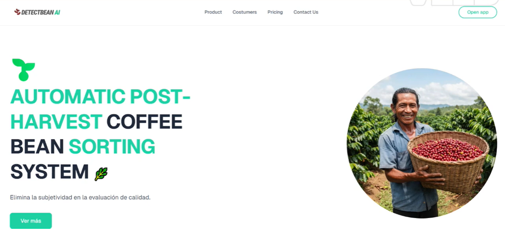

### URLs de las versiones publicadas

- **YouTube:** [https://youtu.be/Oj_0vCletRY  ](https://www.youtube.com/watch?v=ewp0oIa4cMU)


# Conclusiones

**TB1**<br>

El equipo demostró una comprensión sólida de los fundamentos de arquitectura y análisis de sistemas, identificando contextos y dependencias externas de manera precisa. Este trabajo permitió establecer límites claros, fortalecer la integración entre componentes y sentar una base técnica coherente para el desarrollo posterior. La entrega refleja organización, colaboración efectiva y compromiso con la calidad técnica del proyecto.

**TP**<br>

En este hito, logramos mostrar una primera versión operativa del sistema BeanDetect AI, desarrollado para identificar y clasificar granos de café. Esta entrega representa un progreso importante, dado que nos posibilitó verificar la arquitectura sugerida, ratificar la integración de los módulos iniciales y recibir comentarios anticipados en relación con la facilidad de uso y la exactitud del sistema. Por lo tanto, hemos llegado a la conclusión de que este resultado es fundamental para el proyecto, ya que establece las bases para el avance de los entregables posteriores y garantiza que las mejoras y optimizaciones se lleven a cabo sobre un prototipo validado.

**TB2**<br>

El equipo logró consolidar una versión funcional y documentada del proyecto, integrando avances técnicos, de diseño y validación. Se fortaleció la colaboración entre áreas, asegurando coherencia entre prototipo, desarrollo y despliegue. La entrega refleja madurez en la gestión ágil y compromiso con la calidad del producto.


**TF**<br>

El equipo logró consolidar una versión funcional y bien documentada del proyecto, integrando de manera fluida los avances técnicos, de diseño y de validación. La colaboración entre áreas se volvió más sólida y constante, lo que permitió que el prototipo, el desarrollo y el despliegue evolucionaran de forma coherente y sin perder de vista los objetivos del proyecto. Además, con la implementación de BeanDetect AI logramos transformar por completo el proceso de clasificación de café post-cosecha: pasamos de evaluaciones subjetivas que tomaban horas a un análisis automatizado que se completa en segundos por lote, respaldado por un sistema de scoring claro y estandarizado basado en características físicas como color, forma, tamaño y defectos. En conjunto, esta entrega final refleja el esfuerzo del equipo, la madurez alcanzada en la gestión ágil y un compromiso genuino por entregar un producto útil, preciso y de calidad.


---
# Video About-the-Team

[](https://postimg.cc/FY4xvJ15)


- **Enlace al video** [Enlace del video About-the-Team](https://upcedupe-my.sharepoint.com/personal/u202212645_upc_edu_pe/_layouts/15/stream.aspx?id=%2Fpersonal%2Fu202212645_upc_edu_pe%2FDocuments%2Fupc-pre-202502-si728-7291-DevBeans-about-the-team.mp4&nav=eyJyZWZlcnJhbEluZm8iOnsicmVmZXJyYWxBcHAiOiJTdHJlYW1XZWJBcHAiLCJyZWZlcnJhbFZpZXciOiJTaGFyZURpYWxvZy1MaW5rIiwicmVmZXJyYWxBcHBQbGF0Zm9ybSI6IldlYiIsInJlZmVycmFsTW9kZSI6InZpZXcifX0%3D&ga=1&startedResponseCatch=true&referrer=StreamWebApp.Web&referrerScenario=AddressBarCopied.view.c0815409-fa57-4c5c-a490-b091a93f9875)
---


# Bibliografía
- Brown, S. (s.f.). *The C4 model*. https://c4model.com/
- Chollet, F. (2018). *Deep Learning with Python*. https://www.manning.com/books/deep-learning-with-python
- OpenCV Team. (s.f.). *OpenCV Documentation*. https://docs.opencv.org/
- Microsoft Azure. (s.f.). *Computer Vision API*. https://learn.microsoft.com/en-us/azure/cognitive-services/computer-vision/
- GitHub. (s.f.). *Awesome Computer Vision*. https://github.com/jbhuang0604/awesome-computer-vision
- FAO. (2021). *Digital Agriculture Report: Rural transformation enabled by digital tools*. https://www.fao.org/documents/card/en/c/cb4476en
- GS1. (s.f.). *Traceability in Agriculture*. https://www.gs1.org/industries/agriculture
- TensorFlow. (s.f.). *TensorFlow for Agriculture*. https://www.tensorflow.org/agriculture
- ISO. (s.f.). *ISO 22000: Food safety management systems*. https://www.iso.org/iso-22000-food-safety-management.html
- Cacho, S. (2025). *¿Qué es la SCA y cómo clasifica el café de especialidad? Cafés El Criollo*. https://cafeselcriollo.com/articulos/que-es-sca/

---

# Anexos

organizacion:
https://github.com/upc-pre-202520-1asi0728-7291-DevBeans

backend deployed:
https://bean-detect-ai-api-platform.azurewebsites.net/docs

landing page deployed:
https://dev-beans-landing-page.netlify.app/

web app deployed:
https://bean-detect-ai-web.netlify.app/login


## Figuras

### Database Diagram
[](https://postimg.cc/G41Dpkcv)

### Class Diagram

[](https://postimg.cc/Z0BvFfnr)


## Entrevistas

### Needfinding Interviews

https://upcedupe-my.sharepoint.com/:v:/g/personal/u202218167_upc_edu_pe/EbacacS3n11GmQli8ek0ltABesH4olt1EDMLUzs-FrNg6w?nav=eyJyZWZlcnJhbEluZm8iOnsicmVmZXJyYWxBcHAiOiJPbmVEcml2ZUZvckJ1c2luZXNzIiwicmVmZXJyYWxBcHBQbGF0Zm9ybSI6IldlYiIsInJlZmVycmFsTW9kZSI6InZpZXciLCJyZWZlcnJhbFZpZXciOiJNeUZpbGVzTGlua0NvcHkifX0&e=xJtssj

### Validation Interviews

https://upcedupe-my.sharepoint.com/:v:/g/personal/u202218167_upc_edu_pe/IQDSa7XDQhSxSK2GZb1djCuSATCxTrc7xVbnmkP1OzVYgD4?nav=eyJyZWZlcnJhbEluZm8iOnsicmVmZXJyYWxBcHAiOiJPbmVEcml2ZUZvckJ1c2luZXNzIiwicmVmZXJyYWxBcHBQbGF0Zm9ybSI6IldlYiIsInJlZmVycmFsTW9kZSI6InZpZXciLCJyZWZlcnJhbFZpZXciOiJNeUZpbGVzTGlua0NvcHkifX0&e=p0j0Fi

## Videos

### Exposición TB1

https://upcedupe-my.sharepoint.com/:v:/g/personal/u202218167_upc_edu_pe/EbnQ4lfhO5xMgzpNYDoHRPgBwUoL_oFi_Eh4wyIIYKtItQ?nav=eyJyZWZlcnJhbEluZm8iOnsicmVmZXJyYWxBcHAiOiJPbmVEcml2ZUZvckJ1c2luZXNzIiwicmVmZXJyYWxBcHBQbGF0Zm9ybSI6IldlYiIsInJlZmVycmFsTW9kZSI6InZpZXciLCJyZWZlcnJhbFZpZXciOiJNeUZpbGVzTGlua0NvcHkifX0&e=pE1xYm

### Exposición TP

https://upcedupe-my.sharepoint.com/:v:/g/personal/u202218167_upc_edu_pe/EbIFbveYnTlJryYSABHzHBgB7aooUo_DddILv5icXM_Tnw?nav=eyJyZWZlcnJhbEluZm8iOnsicmVmZXJyYWxBcHAiOiJPbmVEcml2ZUZvckJ1c2luZXNzIiwicmVmZXJyYWxBcHBQbGF0Zm9ybSI6IldlYiIsInJlZmVycmFsTW9kZSI6InZpZXciLCJyZWZlcnJhbFZpZXciOiJNeUZpbGVzTGlua0NvcHkifX0&e=rClZAn

### Exposición TB2

https://upcedupe-my.sharepoint.com/:v:/g/personal/u202218167_upc_edu_pe/IQBW-j3KfCQqTKrMb1BTnMHzAfthgDXDgXgalygUYJ3CFS4?nav=eyJyZWZlcnJhbEluZm8iOnsicmVmZXJyYWxBcHAiOiJPbmVEcml2ZUZvckJ1c2luZXNzIiwicmVmZXJyYWxBcHBQbGF0Zm9ybSI6IldlYiIsInJlZmVycmFsTW9kZSI6InZpZXciLCJyZWZlcnJhbFZpZXciOiJNeUZpbGVzTGlua0NvcHkifX0&e=gLMBL3

### Exposición TF

<!--PENDIENTE-->
